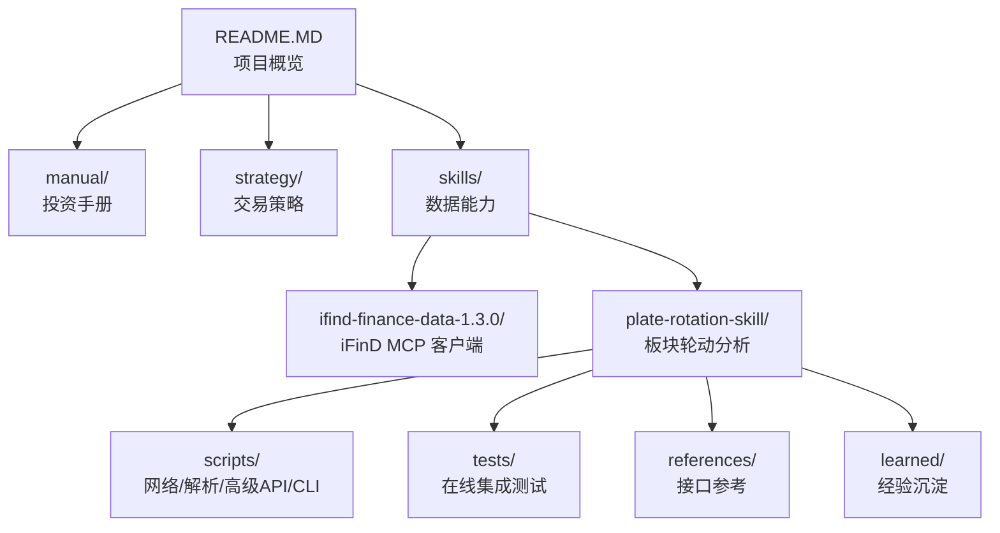
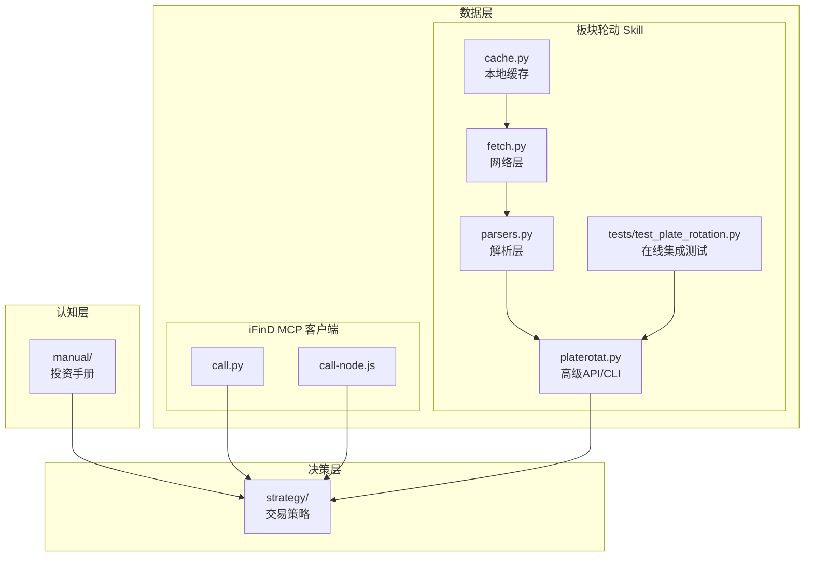
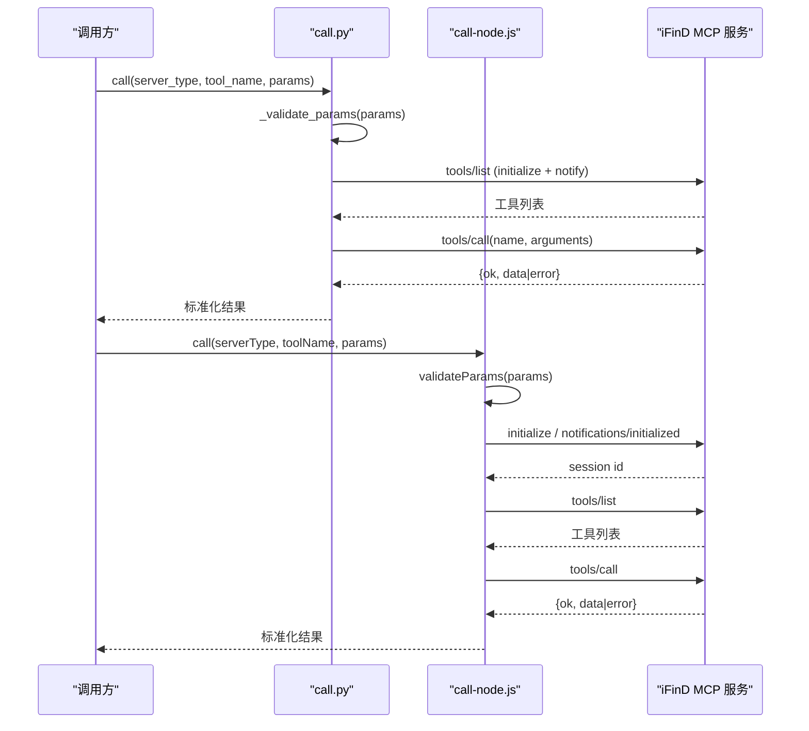
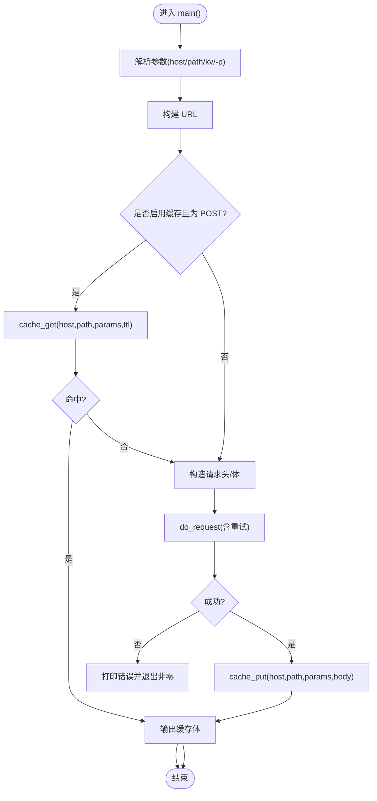
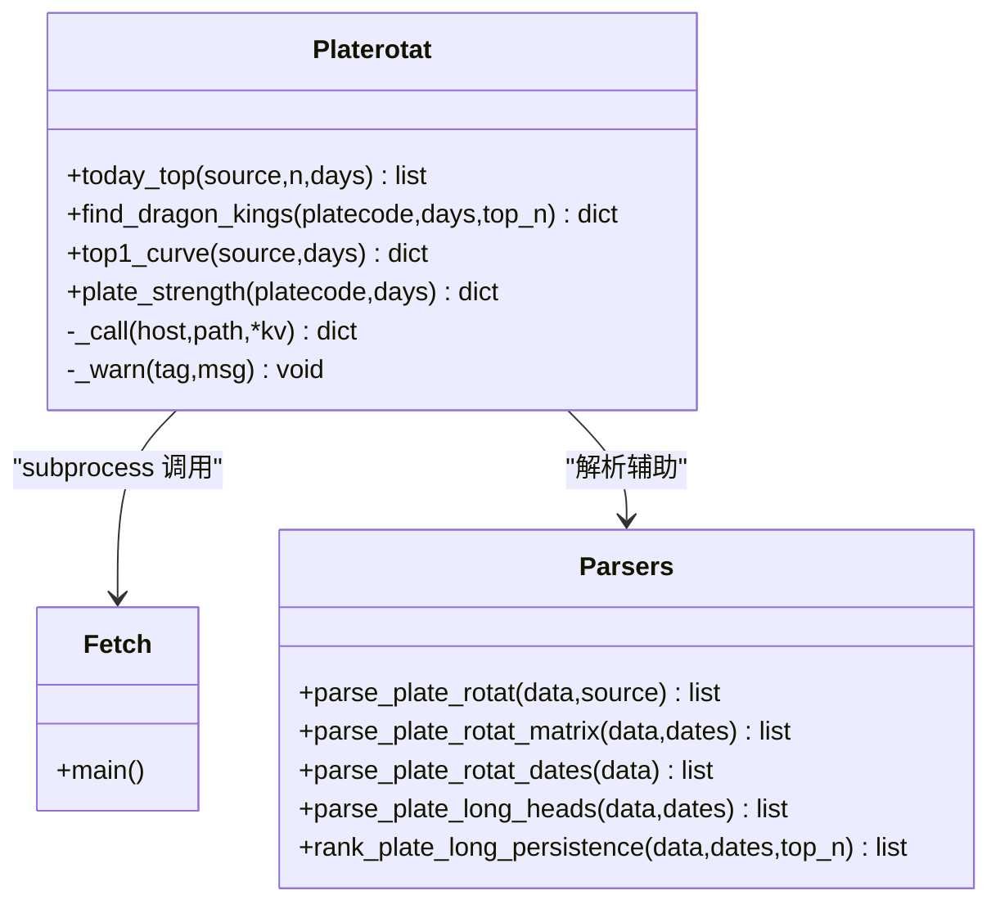
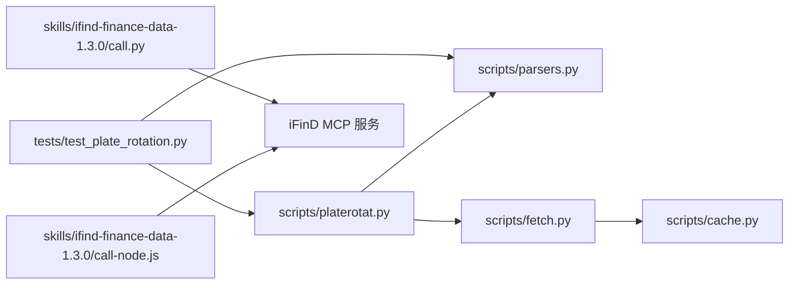

# 贡献指南

<cite>
**本文引用的文件**   
- [README.MD](file://README.MD)
- [call.py](file://skills/ifind-finance-data-1.3.0/call.py)
- [call-node.js](file://skills/ifind-finance-data-1.3.0/call-node.js)
- [cache.py](file://skills/plate-rotation-skill/scripts/cache.py)
- [fetch.py](file://skills/plate-rotation-skill/scripts/fetch.py)
- [parsers.py](file://skills/plate-rotation-skill/scripts/parsers.py)
- [platerotat.py](file://skills/plate-rotation-skill/scripts/platerotat.py)
- [test_plate_rotation.py](file://skills/plate-rotation-skill/tests/test_plate_rotation.py)
- [_meta.md](file://skills/plate-rotation-skill/learned/_meta.md)
- [README.md](file://skills/plate-rotation-skill/README.md)
- [.gitignore](file://skills/plate-rotation-skill/.gitignore)
</cite>

## 目录
1. [简介](#简介)
2. [项目结构](#项目结构)
3. [核心组件](#核心组件)
4. [架构总览](#架构总览)
5. [详细组件分析](#详细组件分析)
6. [依赖关系分析](#依赖关系分析)
7. [性能与稳定性](#性能与稳定性)
8. [故障排查](#故障排查)
9. [结论](#结论)
10. [附录：贡献流程与规范](#附录贡献流程与规范)

## 简介
本项目为“基于 AI Agent 驱动的个人股票分析与交易策略管理系统”，通过模块化的 Skills 提供数据能力，结合结构化的 Strategy 管理交易决策规则，配合 Manual 沉淀指标知识。仓库包含两个主要 Skill：
- ifind-finance-data：同花顺 iFinD 金融数据查询（Python/Node 双实现）
- plate-rotation：A 股板块轮动分析（Python 脚本 + 在线集成测试）

本贡献指南面向开发者，说明代码贡献流程、分支管理策略、提交信息规范、Pull Request 审核流程、编码规范、版本管理与发布流程、开发环境搭建、文档编写规范与更新流程，以及社区参与方式与沟通渠道。

## 项目结构
仓库采用按功能域组织的方式，Skill 之间职责清晰、解耦良好：
- manual：投资手册（指标科普 + 体系总纲）
- skills：数据能力 Skill
  - ifind-finance-data-1.3.0：iFinD MCP 客户端（Python/Node）
  - plate-rotation-skill：板块轮动分析（网络层、解析层、高级 API、CLI、测试）
- strategy：交易策略文档（方法论 + 量化执行版）
- README.MD：项目概览与使用说明

图表来源
- [README.MD:1-81](file://README.MD#L1-L81)

章节来源
- [README.MD:1-81](file://README.MD#L1-L81)

## 核心组件
- iFinD MCP 客户端（Python/Node）
  - 负责与 iFinD MCP 服务建立会话、列举工具、调用工具，统一参数校验与安全过滤。
- 板块轮动 Skill
  - 网络层：统一请求封装、重试、缓存、Cookie/Referer 注入
  - 解析层：从 JSON 包裹的 HTML 中抽取结构化数据
  - 高级 API：面向 Agent/用户的“一个意图一个函数”入口
  - CLI：多子命令文本/JSON 输出
  - 测试：在线集成测试覆盖端点健康度、解析正确性、高级 API 签名与返回结构、CLI 行为

章节来源
- [call.py:1-208](file://skills/ifind-finance-data-1.3.0/call.py#L1-L208)
- [call-node.js:1-267](file://skills/ifind-finance-data-1.3.0/call-node.js#L1-L267)
- [cache.py:1-145](file://skills/plate-rotation-skill/scripts/cache.py#L1-L145)
- [fetch.py:1-230](file://skills/plate-rotation-skill/scripts/fetch.py#L1-L230)
- [parsers.py:1-212](file://skills/plate-rotation-skill/scripts/parsers.py#L1-L212)
- [platerotat.py:1-315](file://skills/plate-rotation-skill/scripts/platerotat.py#L1-L315)
- [test_plate_rotation.py:1-444](file://skills/plate-rotation-skill/tests/test_plate_rotation.py#L1-L444)

## 架构总览
整体由“认知层（Manual）— 数据层（Skills）— 决策层（Strategy）”构成；其中数据层通过 MCP 或 HTTP 获取外部数据，经本地解析后供上层使用。

图表来源
- [README.MD:1-81](file://README.MD#L1-L81)
- [call.py:1-208](file://skills/ifind-finance-data-1.3.0/call.py#L1-L208)
- [call-node.js:1-267](file://skills/ifind-finance-data-1.3.0/call-node.js#L1-L267)
- [cache.py:1-145](file://skills/plate-rotation-skill/scripts/cache.py#L1-L145)
- [fetch.py:1-230](file://skills/plate-rotation-skill/scripts/fetch.py#L1-L230)
- [parsers.py:1-212](file://skills/plate-rotation-skill/scripts/parsers.py#L1-L212)
- [platerotat.py:1-315](file://skills/plate-rotation-skill/scripts/platerotat.py#L1-L315)
- [test_plate_rotation.py:1-444](file://skills/plate-rotation-skill/tests/test_plate_rotation.py#L1-L444)

## 详细组件分析

### iFinD MCP 客户端（Python/Node）
- 职责
  - 读取配置并维护会话 ID
  - 列举可用工具集合
  - 调用工具并返回标准化结果
  - 参数白名单与类型校验，防止非法输入
- 关键流程
  - 初始化会话 → 通知已就绪 → 列举工具 → 调用工具
- 错误处理
  - 对 HTTP 状态码与 JSON-RPC error 字段进行区分处理
  - 对未返回会话 ID 等异常给出明确错误信息

图表来源
- [call.py:85-171](file://skills/ifind-finance-data-1.3.0/call.py#L85-L171)
- [call-node.js:149-220](file://skills/ifind-finance-data-1.3.0/call-node.js#L149-L220)

章节来源
- [call.py:1-208](file://skills/ifind-finance-data-1.3.0/call.py#L1-L208)
- [call-node.js:1-267](file://skills/ifind-finance-data-1.3.0/call-node.js#L1-L267)

### 板块轮动 Skill（网络层 fetch.py）
- 职责
  - 统一构建 URL、注入 Cookie/Referer/UA
  - GET/POST 参数组装
  - 指数退避重试（429/5xx/网络异常）
  - 本地落盘缓存（TTL 可配），支持禁用
- 关键流程
  - 解析参数 → 构造请求 → 命中缓存则直接返回 → 否则发起请求 → 写入缓存 → 输出

图表来源
- [fetch.py:128-213](file://skills/plate-rotation-skill/scripts/fetch.py#L128-L213)
- [cache.py:59-94](file://skills/plate-rotation-skill/scripts/cache.py#L59-L94)

章节来源
- [fetch.py:1-230](file://skills/plate-rotation-skill/scripts/fetch.py#L1-L230)
- [cache.py:1-145](file://skills/plate-rotation-skill/scripts/cache.py#L1-L145)

### 板块轮动 Skill（解析层 parsers.py）
- 职责
  - 从 JSON 包裹的 HTML 片段中抽取板块排名、日期、龙头等信息
  - 将原始响应转换为稳定结构，便于上层消费
- 关键点
  - 兼容不同数据源数值语义差异（百分比 vs 强度分）
  - 针对服务端 HTML 错位做正则兜底

章节来源
- [parsers.py:1-212](file://skills/plate-rotation-skill/scripts/parsers.py#L1-L212)

### 板块轮动 Skill（高级 API 与 CLI platerotat.py）
- 职责
  - 组合底层接口，暴露 today_top/find_dragon_kings/top1_curve/plate_strength 四个高级函数
  - 提供 CLI 子命令 today/wangking/curve/strength，支持 text/json 输出
  - 运行时自检：空数据或缺关键字段时输出 PR-EMPTY/PR-WARN 提示
- 自动路由
  - find_dragon_kings 根据板块代码前缀自动选择数据源（88x→ths，80x/803x→kaipan）

图表来源
- [platerotat.py:100-218](file://skills/plate-rotation-skill/scripts/platerotat.py#L100-L218)
- [parsers.py:20-175](file://skills/plate-rotation-skill/scripts/parsers.py#L20-L175)

章节来源
- [platerotat.py:1-315](file://skills/plate-rotation-skill/scripts/platerotat.py#L1-L315)
- [parsers.py:1-212](file://skills/plate-rotation-skill/scripts/parsers.py#L1-L212)

### 在线集成测试（tests/test_plate_rotation.py）
- 目标
  - 验证 4 个底层端点健康
  - 验证 5 个解析函数的正确性
  - 验证 4 个高级 helper 的签名与返回结构
  - 验证 CLI 子命令 text/json 双模式
  - 验证 find_dragon_kings 的自动路由逻辑
- 特点
  - 共享 fixture 复用网络请求，避免重复打网
  - 覆盖正常路径与边界情况（空数据、跨日空、非法参数）

章节来源
- [test_plate_rotation.py:1-444](file://skills/plate-rotation-skill/tests/test_plate_rotation.py#L1-L444)

## 依赖关系分析
- 模块内依赖
  - platerotat.py 依赖 fetch.py（subprocess）与 parsers.py（import）
  - fetch.py 依赖 cache.py（同目录 import）
  - tests 同时依赖 scripts 下的多个模块并通过 subprocess 调用 CLI
- 外部依赖
  - iFinD MCP 客户端依赖 requests（Python）与 Node 原生 http(s)
  - 板块轮动 Skill 仅依赖 Python 标准库

图表来源
- [test_plate_rotation.py:1-444](file://skills/plate-rotation-skill/tests/test_plate_rotation.py#L1-L444)
- [platerotat.py:1-315](file://skills/plate-rotation-skill/scripts/platerotat.py#L1-L315)
- [parsers.py:1-212](file://skills/plate-rotation-skill/scripts/parsers.py#L1-L212)
- [fetch.py:1-230](file://skills/plate-rotation-skill/scripts/fetch.py#L1-L230)
- [cache.py:1-145](file://skills/plate-rotation-skill/scripts/cache.py#L1-L145)
- [call.py:1-208](file://skills/ifind-finance-data-1.3.0/call.py#L1-L208)
- [call-node.js:1-267](file://skills/ifind-finance-data-1.3.0/call-node.js#L1-L267)

章节来源
- [test_plate_rotation.py:1-444](file://skills/plate-rotation-skill/tests/test_plate_rotation.py#L1-L444)
- [platerotat.py:1-315](file://skills/plate-rotation-skill/scripts/platerotat.py#L1-L315)
- [parsers.py:1-212](file://skills/plate-rotation-skill/scripts/parsers.py#L1-L212)
- [fetch.py:1-230](file://skills/plate-rotation-skill/scripts/fetch.py#L1-L230)
- [cache.py:1-145](file://skills/plate-rotation-skill/scripts/cache.py#L1-L145)
- [call.py:1-208](file://skills/ifind-finance-data-1.3.0/call.py#L1-L208)
- [call-node.js:1-267](file://skills/ifind-finance-data-1.3.0/call-node.js#L1-L267)

## 性能与稳定性
- 网络层
  - 指数退避重试：对 429/5xx/网络异常进行 1s/2s/4s 重试，提升鲁棒性
  - 本地缓存：默认 TTL=3600s，减少重复请求；支持 --no-cache 与 PR_CACHE_DISABLE 关闭
- 解析层
  - 正则表达式针对服务端 HTML 结构做了兼容，降低因格式变化导致的失败率
- 高级 API
  - 运行时自检输出 PR-EMPTY/PR-WARN，帮助下游快速定位问题

章节来源
- [fetch.py:47-124](file://skills/plate-rotation-skill/scripts/fetch.py#L47-L124)
- [cache.py:35-94](file://skills/plate-rotation-skill/scripts/cache.py#L35-L94)
- [platerotat.py:75-98](file://skills/plate-rotation-skill/scripts/platerotat.py#L75-L98)

## 故障排查
- 常见问题
  - 无子命令或非法参数：argparse 会拒绝并返回非零退出码
  - 上游接口异常：返回非 JSON 或缺顶层字段时，CLI 会输出错误并退出
  - 周末/节假日/参数超前：高级 API 会输出 PR-EMPTY 提示
- 建议步骤
  - 使用 --verbose 查看 URL/body/cookie 自检信息
  - 使用 --raw 输出原始响应以便定位解析问题
  - 清理过期缓存：python3 scripts/cache.py clear --older SEC
  - 运行在线集成测试：python3 -m unittest tests.test_plate_rotation -v

章节来源
- [test_plate_rotation.py:424-440](file://skills/plate-rotation-skill/tests/test_plate_rotation.py#L424-L440)
- [platerotat.py:278-311](file://skills/plate-rotation-skill/scripts/platerotat.py#L278-L311)
- [cache.py:98-145](file://skills/plate-rotation-skill/scripts/cache.py#L98-L145)

## 结论
本项目以清晰的职责分离与完善的在线集成测试为基础，具备良好的可扩展性与可维护性。贡献者应遵循统一的编码规范、提交信息与 PR 流程，确保变更质量与可追溯性。

## 附录：贡献流程与规范

### 分支管理策略
- 推荐分支模型
  - main：稳定发布分支
  - develop：日常开发集成分支
  - feature/*：新功能分支
  - fix/*：缺陷修复分支
  - hotfix/*：紧急修复分支
- 命名约定
  - 分支名小写，使用短横线分隔，如 feature/add-iwind-tool、fix/plate-rotat-parse-bug
- 合并策略
  - 所有变更需通过 Pull Request 合并至 develop/main
  - 禁止直接推送至受保护分支

### 提交信息规范
- 格式
  - <type>(<scope>): <subject>
  - type：feat/fix/docs/style/refactor/perf/test/build/ci/chore/revert
  - scope：模块范围，如 ifind、plate-rotation、cli、tests
  - subject：简明扼要描述变更
- 示例
  - feat(plate-rotation): 增加板块妖王榜持久化统计
  - fix(ifind): 修正工具名白名单校验逻辑
  - test(plate-rotation): 补充 CLI 子命令 json 模式断言

### Pull Request 审核流程
- 前置检查
  - 通过在线集成测试：python3 -m unittest tests.test_plate_rotation -v
  - 新增/修改接口需同步更新 references/api_*.md
  - 新发现的领域陷阱沉淀到 learned/_meta.md
- 审核要点
  - 变更影响面评估（网络层/解析层/高级 API/CLI）
  - 错误路径与边界条件覆盖
  - 日志与警告信息可读性（PR-EMPTY/PR-WARN）
- 合并要求
  - 至少一名维护者批准
  - CI 全绿（若引入自动化）
  - 相关文档与测试均已更新

### 编码规范与代码风格
- Python
  - 使用 Python 3.9+ 标准库优先，第三方依赖最小化
  - 文件头部保留 [INPUT]/[OUTPUT]/[POS]/[PROTOCOL] 元信息注释
  - 函数/类使用类型注解与 docstring
  - 变量与函数名 snake_case，常量 UPPER_SNAKE_CASE
  - 错误处理显式抛出并附带上下文信息
- JavaScript（Node）
  - 使用 ES Module 或 CommonJS 保持一致
  - 异步函数使用 async/await，错误通过 Promise reject 或 throw
  - 变量与函数名 camelCase，常量 UPPER_SNAKE_CASE
  - 严格类型校验，避免 undefined/bigint/function/symbol 传入

### 版本管理与发布流程
- 版本号规则
  - 采用语义化版本：主版本.次版本.修订号
  - 主版本：不兼容的 API 变更
  - 次版本：向后兼容的功能新增
  - 修订号：向后兼容的问题修复
- 发布清单
  - 更新 CHANGELOG（若存在）
  - 更新 README 与 references
  - 确认测试通过
  - 打 tag 并发布

### 开发环境搭建
- 基础环境
  - Python 3.9+
  - Node.js（如需使用 iFinD Node 客户端）
- 依赖安装
  - Python：仅标准库（stdlib），无需额外 pip install
  - Node：按需安装（当前实现使用原生 http(s)，无需 npm 包）
- 配置设置
  - iFinD：在对应 skill 目录下准备 mcp_config.json（auth_token 等）
  - 板块轮动：可选环境变量
    - PR_CACHE_DIR：缓存根目录
    - PR_CACHE_TTL：缓存 TTL（秒）
    - PR_CACHE_DISABLE：全局关闭缓存
    - PR_COOKIE：Cookie 字符串
- 开发工具推荐
  - IDE：VS Code / PyCharm
  - Linter/Formatter：flake8/black（Python）、eslint/prettier（Node）
  - 测试：unittest（Python）

### 文档编写规范与更新流程
- 文档位置
  - manual：投资手册
  - references：接口参考（api_*.md）
  - learned：经验沉淀（_meta.md 及源专属文件）
- 编写规范
  - 标题层级清晰，内容聚焦单一主题
  - 接口参考需包含入参、出参、示例与注意事项
  - 经验沉淀按日期记录现象/根因/应对
- 更新流程
  - 变更涉及接口或用法时，同步更新 references 与 README
  - 发现新问题或陷阱，追加到 learned/_meta.md
  - 提交 PR 时附上文档变更说明

### 社区参与方式与沟通渠道
- 参与方式
  - Issue：报告问题、提出需求
  - PR：提交改进与修复
  - 讨论：在 Issue 或 Discussions 中交流思路
- 沟通渠道
  - GitHub Issues/Discussions
  - 邮件/群组（如有）
- 行为准则
  - 尊重他人、理性讨论
  - 关注事实与证据，避免主观臆断