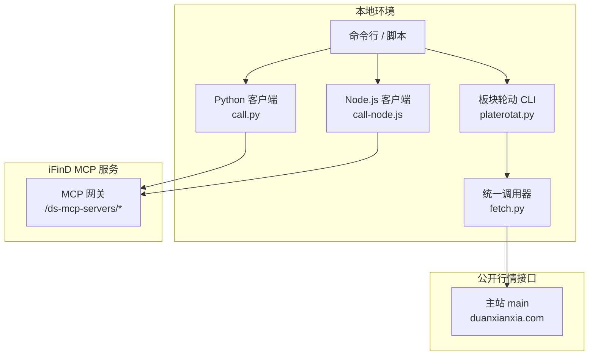
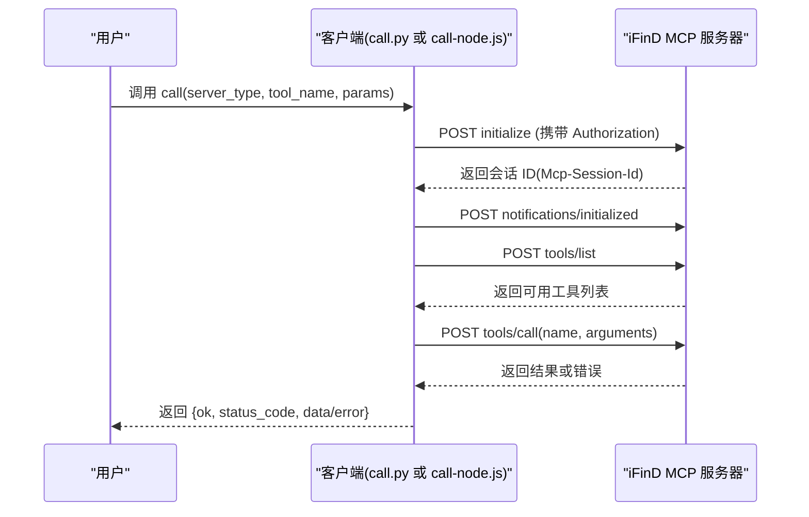
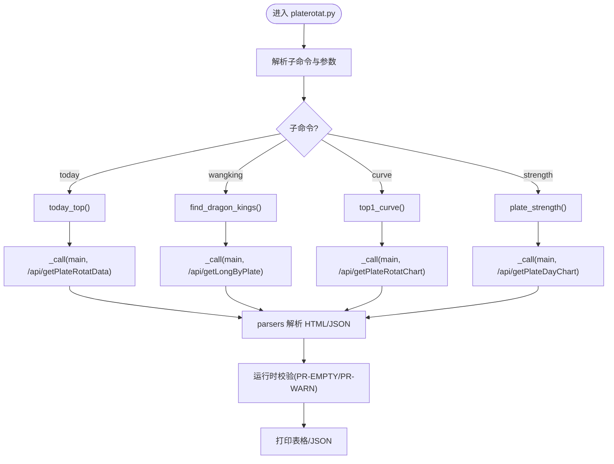
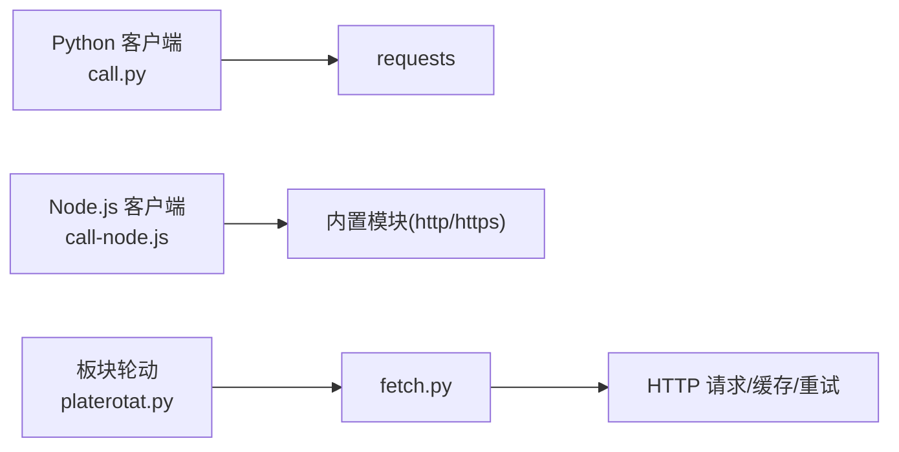

# 快速开始

<cite>
**本文引用的文件**   
- [README.MD](file://README.MD)
- [mcp_config.json](file://skills/ifind-finance-data-1.3.0/mcp_config.json)
- [SKILL.md](file://skills/ifind-finance-data-1.3.0/SKILL.md)
- [call.py](file://skills/ifind-finance-data-1.3.0/call.py)
- [call-node.js](file://skills/ifind-finance-data-1.3.0/call-node.js)
- [index.md](file://skills/ifind-finance-data-1.3.0/references/index.md)
- [platerotat.py](file://skills/plate-rotation-skill/scripts/platerotat.py)
- [fetch.py](file://skills/plate-rotation-skill/scripts/fetch.py)
- [api_getplaterotatdata.md](file://skills/plate-rotation-skill/references/api_getplaterotatdata.md)
</cite>

## 目录
1. [简介](#简介)
2. [环境要求](#环境要求)
3. [安装与配置](#安装与配置)
4. [iFinD MCP 服务认证配置](#ifind-mcp-服务认证配置)
5. [基础使用示例](#基础使用示例)
6. [架构概览](#架构概览)
7. [常见问题与故障排除](#常见问题与故障排除)
8. [结论](#结论)

## 简介
本指南面向首次接触“股票分析系统”的用户，帮助你在最短时间内完成环境准备、密钥配置并成功运行第一个分析任务。系统包含两大能力：
- iFinD MCP 金融数据查询（支持股票、基金、债券、指数板块、宏观数据、新闻公告等）
- A 股板块轮动分析 Skill（双数据源交叉验证，提供今日最强板块、龙头榜、排名曲线、强度时序等）

## 环境要求
- Python 3.9+（用于板块轮动 Skill 与 iFinD Python 客户端）
- Node.js 运行时（用于 iFinD Node.js 客户端；无需额外依赖）
- 网络访问到以下地址：
  - iFinD MCP 服务端：https://api-mcp.51ifind.com:8643/ds-mcp-servers/*
  - 板块轮动后端（自动注入 Referer，无需 Cookie）：main/data/x 别名映射的 duanxianxia.com 域名集合

说明：
- iFinD MCP 免费用户并发上限为每秒 2 个请求，个人版正式用户为 5 个，企业版正式用户为 10 个。若不确定权益，默认按免费版控制并发。
- 板块轮动 Skill 仅依赖标准库，无需 pip 安装第三方包。

章节来源
- [SKILL.md:17-28](file://skills/ifind-finance-data-1.3.0/SKILL.md#L17-L28)
- [README.MD:46-56](file://README.MD#L46-L56)

## 安装与配置
步骤总览
1) 准备环境
- 确保已安装 Python 3.9+ 或 Node.js 任一环境。推荐优先使用 Node.js 方案（零依赖）。
- 如选择 Python 方案，请确保已安装 requests 库。

2) 获取 iFinD MCP 密钥
- 前往 MCP 官网个人中心 -> 密钥，复制你的 auth_token。

3) 写入配置文件
- 将密钥写入 skills/ifind-finance-data-1.3.0/mcp_config.json 中的 auth_token 字段。

4) 验证连通性
- 使用 Node.js 或 Python 调用 listTools/list_tools 检查工具列表是否可正常返回。

5) 运行第一个分析任务
- 使用 iFinD MCP 查询指数/板块数据，或使用板块轮动 Skill 查看今日 Top 板块。

章节来源
- [SKILL.md:25-28](file://skills/ifind-finance-data-1.3.0/SKILL.md#L25-L28)
- [mcp_config.json:1-3](file://skills/ifind-finance-data-1.3.0/mcp_config.json#L1-L3)

## iFinD MCP 服务认证配置
- 配置文件位置：skills/ifind-finance-data-1.3.0/mcp_config.json
- 必填字段：auth_token（字符串）
- 两个客户端均从同一配置文件读取密钥：
  - Python 客户端：call.py
  - Node.js 客户端：call-node.js

注意事项
- 不要修改 BASE 与服务端路径，它们已内置在客户端脚本中。
- 若未配置有效密钥，所有工具调用都会失败。
- 建议先通过 listTools/list_tools 确认当前密钥可用的工具清单。

章节来源
- [mcp_config.json:1-3](file://skills/ifind-finance-data-1.3.0/mcp_config.json#L1-L3)
- [call.py:6-8](file://skills/ifind-finance-data-1.3.0/call.py#L6-L8)
- [call-node.js:6-8](file://skills/ifind-finance-data-1.3.0/call-node.js#L6-L8)
- [SKILL.md:90-95](file://skills/ifind-finance-data-1.3.0/SKILL.md#L90-L95)

## 基础使用示例
本节给出两类常用任务的快速上手方法：iFinD 金融数据查询与板块轮动分析。

### 一、iFinD MCP 金融数据查询（指数/板块）
- 目标：查询指数行情、板块成分股指标、实时快照等
- 服务端类型：index
- 可用工具（示例）：index_data、sector_data、index_highfreq_quotes

Node.js 示例流程
- 引入 call-node.js 的 call 与 listTools
- 调用 call("index", "index_data", { query: "..." })
- 如需排查权限或工具变更，再调用 listTools("index")

Python 示例流程
- 导入 call.py 的 call 与 list_tools
- 调用 call("index", "index_data", {"query": "..."})
- 如需排查权限或工具变更，再调用 list_tools("index")

参考文档与示例
- 参见 references/index.md 中的调用示例与参数说明

章节来源
- [index.md:1-37](file://skills/ifind-finance-data-1.3.0/references/index.md#L1-L37)
- [index.md:39-63](file://skills/ifind-finance-data-1.3.0/references/index.md#L39-L63)
- [call-node.js:258-266](file://skills/ifind-finance-data-1.3.0/call-node.js#L258-L266)
- [call.py:206-208](file://skills/ifind-finance-data-1.3.0/call.py#L206-L208)

### 二、板块轮动分析（今日最强板块）
- 目标：查看今日涨幅最强的前 N 个板块（同花顺或开盘啦）
- 入口脚本：skills/plate-rotation-skill/scripts/platerotat.py
- 底层调用：scripts/fetch.py（统一封装 HTTP、重试、缓存）

命令行用法
- 今日 Top N（默认开盘啦）：python3 scripts/platerotat.py today --n 10
- 切换同花顺源：python3 scripts/platerotat.py today --from ths --n 20
- 输出 JSON：添加 --json 参数

API 函数（供 import 使用）
- today_top(source="kaipan", n=10, days=20)
- find_dragon_kings(platecode, days=20, top_n=10)
- top1_curve(source="kaipan", days=20)
- plate_strength(platecode, days=20)

数据源与校验
- 同花顺（ths）：当日板块涨幅 %
- 开盘啦（kaipan）：板块强度分（整数）
- 跨源错传会触发 PR-EMPTY 警告，避免幻觉

章节来源
- [platerotat.py:100-121](file://skills/plate-rotation-skill/scripts/platerotat.py#L100-L121)
- [platerotat.py:278-315](file://skills/plate-rotation-skill/scripts/platerotat.py#L278-L315)
- [fetch.py:128-230](file://skills/plate-rotation-skill/scripts/fetch.py#L128-L230)
- [api_getplaterotatdata.md:22-54](file://skills/plate-rotation-skill/references/api_getplaterotatdata.md#L22-L54)

## 架构概览
下图展示了 iFinD MCP 与板块轮动 Skill 的整体交互关系。

图表来源
- [call.py:9-18](file://skills/ifind-finance-data-1.3.0/call.py#L9-L18)
- [call-node.js:9-18](file://skills/ifind-finance-data-1.3.0/call-node.js#L9-L18)
- [platerotat.py:34-48](file://skills/plate-rotation-skill/scripts/platerotat.py#L34-L48)
- [fetch.py:38-42](file://skills/plate-rotation-skill/scripts/fetch.py#L38-L42)

## 详细组件分析

### iFinD MCP 客户端（Python/Node.js）
- 职责：加载 mcp_config.json 中的 auth_token，维护会话与工具集，发起 tools/list 与 tools/call 请求
- 关键流程：
  - initialize 建立会话并保存 Mcp-Session-Id
  - tools/list 拉取当前可用工具名集合
  - tools/call 执行具体工具并返回结构化结果
- 安全与健壮性：
  - 参数白名单校验，拒绝危险键与非法数值
  - 错误响应包装为 ok=false 结构，便于上层处理

图表来源
- [call.py:85-116](file://skills/ifind-finance-data-1.3.0/call.py#L85-L116)
- [call.py:119-171](file://skills/ifind-finance-data-1.3.0/call.py#L119-L171)
- [call-node.js:149-176](file://skills/ifind-finance-data-1.3.0/call-node.js#L149-L176)
- [call-node.js:178-220](file://skills/ifind-finance-data-1.3.0/call-node.js#L178-L220)

章节来源
- [call.py:59-83](file://skills/ifind-finance-data-1.3.0/call.py#L59-L83)
- [call-node.js:81-115](file://skills/ifind-finance-data-1.3.0/call-node.js#L81-L115)

### 板块轮动 Skill（高级 API + CLI）
- 职责：组合底层接口，提供“一个意图一个函数”的高级 helper，并暴露 CLI
- 核心函数：
  - today_top：今日 Top N 板块
  - find_dragon_kings：板块妖王榜（跨天上榜次数）
  - top1_curve：Top5 板块 N 日排名变化曲线
  - plate_strength：单板块 N 日强度+量能时序
- 数据源：
  - 同花顺（ths）：涨幅 %
  - 开盘啦（kaipan）：强度分
- 校验机制：空数据或缺关键字段时输出 PR-EMPTY/PR-WARN 提示，辅助下游区分节假日、跨源错传与上游异常

图表来源
- [platerotat.py:100-219](file://skills/plate-rotation-skill/scripts/platerotat.py#L100-L219)
- [platerotat.py:278-315](file://skills/plate-rotation-skill/scripts/platerotat.py#L278-L315)
- [fetch.py:128-230](file://skills/plate-rotation-skill/scripts/fetch.py#L128-L230)

章节来源
- [platerotat.py:100-219](file://skills/plate-rotation-skill/scripts/platerotat.py#L100-L219)
- [api_getplaterotatdata.md:22-54](file://skills/plate-rotation-skill/references/api_getplaterotatdata.md#L22-L54)

## 依赖分析
- iFinD MCP 客户端
  - Python 方案：依赖 requests
  - Node.js 方案：无外部依赖（使用内置 http/https）
- 板块轮动 Skill
  - 纯标准库实现，依赖 fetch.py 进行网络请求与缓存
  - 通过 platerotat.py 以 subprocess 方式调用 fetch.py

图表来源
- [SKILL.md:17-21](file://skills/ifind-finance-data-1.3.0/SKILL.md#L17-L21)
- [platerotat.py:34-48](file://skills/plate-rotation-skill/scripts/platerotat.py#L34-L48)
- [fetch.py:31-36](file://skills/plate-rotation-skill/scripts/fetch.py#L31-L36)

章节来源
- [SKILL.md:17-21](file://skills/ifind-finance-data-1.3.0/SKILL.md#L17-L21)

## 性能考虑
- iFinD MCP 并发限制
  - 免费用户：2 QPS；个人版：5 QPS；企业版：10 QPS
  - 建议在应用层做限流与退避，避免触发限流
- 板块轮动 Skill
  - 内置指数退避重试（429/5xx/网络异常），最多 3 次，间隔 1s/2s/4s
  - 默认对 POST 请求启用本地缓存（TTL 可调），减少重复请求

章节来源
- [SKILL.md:28-28](file://skills/ifind-finance-data-1.3.0/SKILL.md#L28-L28)
- [fetch.py:47-51](file://skills/plate-rotation-skill/scripts/fetch.py#L47-L51)
- [fetch.py:159-170](file://skills/plate-rotation-skill/scripts/fetch.py#L159-L170)

## 常见问题与故障排除
- 无法连接 iFinD MCP 服务
  - 检查防火墙/代理设置，确认能访问 https://api-mcp.51ifind.com:8643
  - 确认 mcp_config.json 中 auth_token 正确且未过期
  - 使用 listTools/list_tools 验证工具列表是否正常返回
- 工具调用返回空或报错
  - 检查 server_type 与 tool_name 是否匹配
  - 使用 listTools/list_tools 获取当前可用工具清单
  - 关注返回结构中的 error 字段与状态码
- 板块轮动返回空数据
  - 周末/节假日可能无数据
  - 板块代码前缀与 source 不匹配（88x 对应 ths，80x/803x 对应 kaipan）
  - 观察 stderr 中的 PR-EMPTY/PR-WARN 提示定位原因
- Node.js 中文乱码
  - Windows PowerShell 管道执行含中文脚本时，确保控制台编码为 UTF-8

章节来源
- [SKILL.md:90-95](file://skills/ifind-finance-data-1.3.0/SKILL.md#L90-L95)
- [platerotat.py:75-98](file://skills/plate-rotation-skill/scripts/platerotat.py#L75-L98)
- [api_getplaterotatdata.md:51-54](file://skills/plate-rotation-skill/references/api_getplaterotatdata.md#L51-L54)

## 结论
通过以上步骤，你已完成环境准备、密钥配置，并成功运行了 iFinD MCP 金融数据查询与板块轮动分析的第一个任务。后续可根据 SKILL.md 与 references 下的子服务文档扩展更多查询与分析场景。