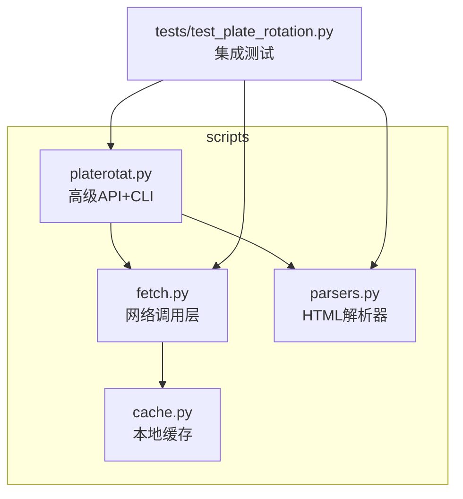
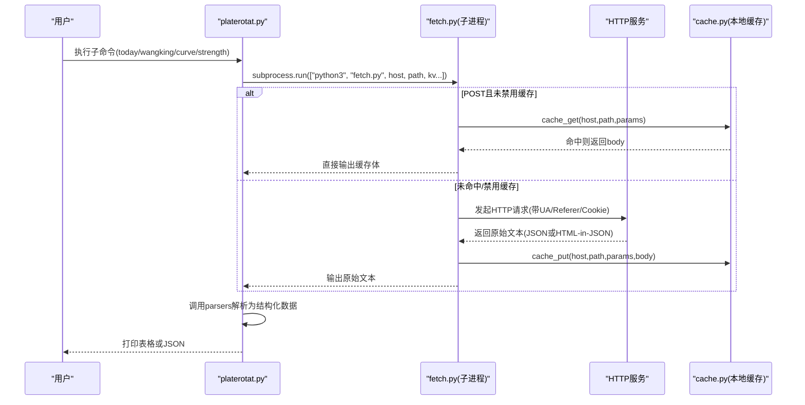
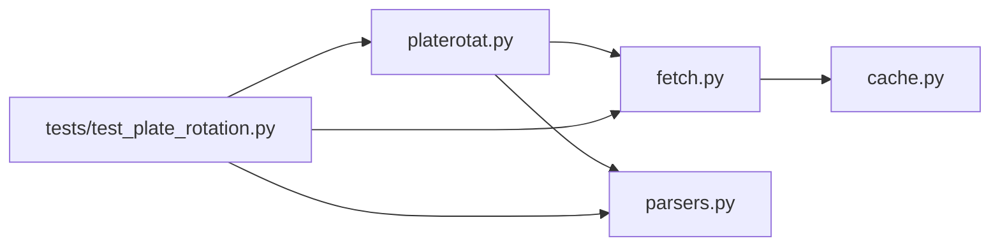

# CLI工具使用指南

<cite>
**本文引用的文件**   
- [platerotat.py](file://skills/plate-rotation-skill/scripts/platerotat.py)
- [cache.py](file://skills/plate-rotation-skill/scripts/cache.py)
- [fetch.py](file://skills/plate-rotation-skill/scripts/fetch.py)
- [parsers.py](file://skills/plate-rotation-skill/scripts/parsers.py)
- [README.md](file://skills/plate-rotation-skill/README.md)
- [test_plate_rotation.py](file://skills/plate-rotation-skill/tests/test_plate_rotation.py)
</cite>

## 目录
1. [简介](#简介)
2. [项目结构](#项目结构)
3. [核心组件](#核心组件)
4. [架构总览](#架构总览)
5. [详细组件分析](#详细组件分析)
6. [依赖关系分析](#依赖关系分析)
7. [性能与缓存](#性能与缓存)
8. [实战案例](#实战案例)
9. [调试与排错](#调试与排错)
10. [环境变量与配置](#环境变量与配置)
11. [结论](#结论)

## 简介
本指南面向板块轮动CLI工具的使用者，聚焦 platerotat.py 的四大子命令：today（今日Top板块）、wangking（板块妖王榜）、curve（排名变化曲线）、strength（板块强度时序）。文档将详细说明各子命令的参数、输出格式、典型用法与组合场景，并覆盖缓存管理（cache.py stats/clear）、调试模式、常见错误处理与环境变量配置。

## 项目结构
该Skill位于 skills/plate-rotation-skill 下，核心脚本集中在 scripts 目录：
- platerotat.py：高级API + CLI入口，封装四个意图型函数
- fetch.py：统一网络调用层，负责请求构造、重试、缓存读写
- parsers.py：HTML-in-JSON解析器，提供5个解析辅助函数
- cache.py：本地缓存原子层，提供stats/clear等自检命令

图表来源
- [platerotat.py:1-315](file://skills/plate-rotation-skill/scripts/platerotat.py#L1-L315)
- [fetch.py:1-230](file://skills/plate-rotation-skill/scripts/fetch.py#L1-L230)
- [parsers.py:1-212](file://skills/plate-rotation-skill/scripts/parsers.py#L1-L212)
- [cache.py:1-145](file://skills/plate-rotation-skill/scripts/cache.py#L1-L145)
- [test_plate_rotation.py:1-444](file://skills/plate-rotation-skill/tests/test_plate_rotation.py#L1-L444)

章节来源
- [README.md:1-188](file://skills/plate-rotation-skill/README.md#L1-L188)

## 核心组件
- platerotat.py
  - 暴露四个高级函数：today_top、find_dragon_kings、top1_curve、plate_strength
  - 提供CLI子命令：today、wangking、curve、strength
  - 内部通过 _call 调用 fetch.py，再经 parsers.py 解析响应
- fetch.py
  - 统一HTTP客户端：支持GET/POST、参数拼接、Cookie注入、Referer校验
  - 指数退避重试策略（429/5xx/网络异常）
  - 默认对POST请求启用本地缓存（TTL可配），支持--no-cache/--cache-ttl
- parsers.py
  - 从“HTML片段嵌入在JSON”的响应中抽取结构化数据
  - 提供日期提取、矩阵还原、龙头统计等工具
- cache.py
  - 基于文件系统（~/.cache/plate-rotation）的键值缓存
  - 提供stats/clear自检命令；支持PR_CACHE_DISABLE全局关闭

章节来源
- [platerotat.py:100-219](file://skills/plate-rotation-skill/scripts/platerotat.py#L100-L219)
- [fetch.py:128-213](file://skills/plate-rotation-skill/scripts/fetch.py#L128-L213)
- [parsers.py:20-175](file://skills/plate-rotation-skill/scripts/parsers.py#L20-L175)
- [cache.py:35-128](file://skills/plate-rotation-skill/scripts/cache.py#L35-L128)

## 架构总览
整体流程：CLI → 高级函数 → 子进程调用fetch.py → HTTP请求（含重试/缓存）→ 返回原始文本 → JSON解析 → HTML抽取 → 结构化结果 → CLI输出或JSON透传。

图表来源
- [platerotat.py:55-71](file://skills/plate-rotation-skill/scripts/platerotat.py#L55-L71)
- [fetch.py:159-213](file://skills/plate-rotation-skill/scripts/fetch.py#L159-L213)
- [cache.py:59-95](file://skills/plate-rotation-skill/scripts/cache.py#L59-L95)

## 详细组件分析

### 子命令一：today（今日Top板块）
- 功能：获取当日Top N板块，支持切换数据源（ths/kaipan）
- 参数
  - --source：数据源选择，ths（同花顺，数值=涨幅%）或 kaipan（开盘啦，数值=强度分）
  - --n：返回前N名（默认10）
  - --days：回溯天数（影响主表列宽，当日Top只看第一列）
  - --json：以JSON格式输出
- 输出
  - 文本：标题行 + 每行包含排名、代码、名称、涨跌箭头与数值
  - JSON：列表项包含 rank、code、name、value、value_type、color
- 行为要点
  - 空数据时会在stderr输出PR-EMPTY提示，便于下游识别节假日/跨源错传/上游异常
  - value_type=pct表示百分比，score表示强度分

章节来源
- [platerotat.py:102-121](file://skills/plate-rotation-skill/scripts/platerotat.py#L102-L121)
- [platerotat.py:227-237](file://skills/plate-rotation-skill/scripts/platerotat.py#L227-L237)
- [parsers.py:20-65](file://skills/plate-rotation-skill/scripts/parsers.py#L20-L65)

### 子命令二：wangking（板块妖王榜）
- 功能：某板块过去N天里，哪些股票最常当龙头（按上榜次数排序）
- 参数
  - platecode：板块代码（88x走ths，80x/803x走kaipan，自动路由）
  - --days：回溯天数（默认20）
  - --n：返回前N名（默认10）
  - --json：以JSON格式输出
- 输出
  - 文本：板块信息 + 每只股票的上榜次数与部分位置记录
  - JSON：包含 platecode、source、days、dates、kings、daily_heads
- 行为要点
  - 若近N天均无领涨或跨源错传，会输出PR-EMPTY警告
  - source字段透出实际使用的数据源，便于断言

章节来源
- [platerotat.py:125-172](file://skills/plate-rotation-skill/scripts/platerotat.py#L125-L172)
- [parsers.py:113-175](file://skills/plate-rotation-skill/scripts/parsers.py#L113-L175)

### 子命令三：curve（排名变化曲线）
- 功能：Top5板块N日排名变化曲线（ECharts数据结构）
- 参数
  - --source：ths/kaipan（默认kaipan）
  - --days：回溯天数（默认20）
  - --json：以JSON格式输出
- 输出
  - 文本：日期序列 + 每个板块的排名序列
  - JSON：原ECharts结构 + top5_names便利字段
- 行为要点
  - 缺name字段时会输出PR-EMPTY提示

章节来源
- [platerotat.py:177-196](file://skills/plate-rotation-skill/scripts/platerotat.py#L177-L196)
- [platerotat.py:251-263](file://skills/plate-rotation-skill/scripts/platerotat.py#L251-L263)

### 子命令四：strength（板块强度时序）
- 功能：单板块N日强度+量能时序（ECharts数据结构）
- 参数
  - platecode：板块代码
  - --days：回溯天数（默认20）
  - --json：以JSON格式输出
- 输出
  - 文本：legend/date及series键集合
  - JSON：原ECharts结构（legend可能为null表示未活跃）
- 行为要点
  - date为空：可能板块无效或上游异常
  - legend=null：近N天均未活跃

章节来源
- [platerotat.py:201-218](file://skills/plate-rotation-skill/scripts/platerotat.py#L201-L218)
- [platerotat.py:265-276](file://skills/plate-rotation-skill/scripts/platerotat.py#L265-L276)

### 缓存管理：cache.py
- 自检命令
  - python3 scripts/cache.py stats：输出缓存统计（count、total_bytes、root）
  - python3 scripts/cache.py clear [--older SEC]：清理缓存，可选仅清理超过SEC秒的文件
- 设计要点
  - 落盘路径：~/.cache/plate-rotation/{key[:2]}/{key}.json
  - Key构成：sha1(host + "\n" + path + "\n" + sorted_form_kv)
  - TTL策略：默认3600s，可通过环境变量调整
  - 全局开关：PR_CACHE_DISABLE=1 关闭缓存

章节来源
- [cache.py:132-145](file://skills/plate-rotation-skill/scripts/cache.py#L132-L145)
- [cache.py:35-37](file://skills/plate-rotation-skill/scripts/cache.py#L35-L37)
- [cache.py:47-56](file://skills/plate-rotation-skill/scripts/cache.py#L47-L56)
- [cache.py:59-95](file://skills/plate-rotation-skill/scripts/cache.py#L59-L95)

## 依赖关系分析
- platerotat.py 依赖 fetch.py（subprocess）和 parsers.py（解析）
- fetch.py 依赖 cache.py（缓存读写）
- tests/test_plate_rotation.py 同时验证底层接口、解析器、高级函数与CLI

图表来源
- [platerotat.py:34-48](file://skills/plate-rotation-skill/scripts/platerotat.py#L34-L48)
- [fetch.py:31-36](file://skills/plate-rotation-skill/scripts/fetch.py#L31-L36)
- [test_plate_rotation.py:26-45](file://skills/plate-rotation-skill/tests/test_plate_rotation.py#L26-L45)

章节来源
- [platerotat.py:34-48](file://skills/plate-rotation-skill/scripts/platerotat.py#L34-L48)
- [fetch.py:31-36](file://skills/plate-rotation-skill/scripts/fetch.py#L31-L36)
- [test_plate_rotation.py:26-45](file://skills/plate-rotation-skill/tests/test_plate_rotation.py#L26-L45)

## 性能与缓存
- 重试机制：对429/5xx/网络异常进行指数退避（最多3次，间隔1s/2s/4s）
- 缓存命中：POST请求默认启用缓存，TTL默认1小时；--no-cache可临时禁用；--cache-ttl可调整新鲜度阈值
- 磁盘IO：缓存写入采用原子替换（.tmp -> 正式文件），避免半写损坏
- 建议
  - 批量查询时开启缓存以减少重复请求
  - 需要强刷新时设置 PR_CACHE_DISABLE=1 或使用 --no-cache
  - 合理设置 PR_CACHE_TTL 平衡新鲜度与命中率

章节来源
- [fetch.py:47-50](file://skills/plate-rotation-skill/scripts/fetch.py#L47-L50)
- [fetch.py:159-213](file://skills/plate-rotation-skill/scripts/fetch.py#L159-L213)
- [cache.py:79-95](file://skills/plate-rotation-skill/scripts/cache.py#L79-L95)

## 实战案例
以下示例均以相对路径 scripts 下的脚本为准，请根据实际安装位置调整路径。

- 基础查询
  - 今日Top 10（默认kaipan）
    - python3 scripts/platerotat.py today
  - 今日Top 20（ths源）
    - python3 scripts/platerotat.py today --source ths --n 20
  - 以JSON输出
    - python3 scripts/platerotat.py today --source kaipan --n 5 --json

- 板块妖王榜
  - 查看886084（F5G概念）近20天妖王榜（文本）
    - python3 scripts/platerotat.py wangking 886084 --days 20
  - 查看801807（算力）近20天妖王榜（JSON）
    - python3 scripts/platerotat.py wangking 801807 --days 20 --n 5 --json

- 排名变化曲线
  - Top5板块20日排名变化（kaipan）
    - python3 scripts/platerotat.py curve --source kaipan --days 20
  - 以JSON输出供前端渲染
    - python3 scripts/platerotat.py curve --source ths --days 20 --json

- 板块强度时序
  - 886084近20日强度+量能（文本）
    - python3 scripts/platerotat.py strength 886084 --days 20
  - 以JSON输出
    - python3 scripts/platerotat.py strength 886084 --days 20 --json

- 缓存管理
  - 查看缓存统计
    - python3 scripts/cache.py stats
  - 清理全部缓存
    - python3 scripts/cache.py clear
  - 仅清理超过一天的缓存
    - python3 scripts/cache.py clear --older 86400

- 复杂分析场景（组合）
  - 步骤1：用today筛选当日最强板块
    - python3 scripts/platerotat.py today --source kaipan --n 5
  - 步骤2：对候选板块逐一查看妖王榜，确认持续性
    - python3 scripts/platerotat.py wangking <板块代码> --days 20 --n 5 --json
  - 步骤3：观察Top5排名变化曲线，判断是否接力
    - python3 scripts/platerotat.py curve --source kaipan --days 20 --json
  - 步骤4：对重点板块拉取强度时序，结合量能判断活跃度
    - python3 scripts/platerotat.py strength <板块代码> --days 20 --json

章节来源
- [platerotat.py:278-310](file://skills/plate-rotation-skill/scripts/platerotat.py#L278-L310)
- [cache.py:132-145](file://skills/plate-rotation-skill/scripts/cache.py#L132-L145)
- [test_plate_rotation.py:344-423](file://skills/plate-rotation-skill/tests/test_plate_rotation.py#L344-L423)

## 调试与排错
- 调试模式
  - 当前CLI未内置-v参数；如需查看请求URL/Body/重试详情，可直接调用fetch.py并加-v
    - python3 scripts/fetch.py main /api/getPlateRotatData from=kaipan days=20 -v
- 常见错误与定位
  - 无子命令报错：argparse要求必须指定子命令
  - 非法--source：choices限制拒绝未知值
  - 空数据PR-EMPTY：可能是周末/节假日、days超前、跨源错传或上游异常
  - 跨源错传提示：当platecode前缀与source不匹配时给出方向性提示
  - 非JSON响应：_call会捕获并退出，附带错误摘要
- 快速自检
  - 运行集成测试，覆盖端点健康、解析正确性、高级函数签名与CLI双模输出
    - python3 tests/test_plate_rotation.py

章节来源
- [platerotat.py:278-310](file://skills/plate-rotation-skill/scripts/platerotat.py#L278-L310)
- [platerotat.py:55-71](file://skills/plate-rotation-skill/scripts/platerotat.py#L55-L71)
- [platerotat.py:85-98](file://skills/plate-rotation-skill/scripts/platerotat.py#L85-L98)
- [test_plate_rotation.py:424-440](file://skills/plate-rotation-skill/tests/test_plate_rotation.py#L424-L440)

## 环境变量与配置
- 缓存相关
  - PR_CACHE_DIR：缓存根目录（默认 ~/.cache/plate-rotation）
  - PR_CACHE_TTL：缓存TTL秒数（默认3600）
  - PR_CACHE_DISABLE：全局关闭缓存（值为1/true/yes）
- Cookie相关
  - PR_COOKIE：优先读取的环境变量
  - 文件 ~/.plate_rotation_cookie：其次读取，格式为一行 domain=cookie_string
- 其他
  - fetch.py支持 --no-cookie 不发Cookie
  - fetch.py支持 --max-retries 与 --timeout 控制重试与超时

章节来源
- [cache.py:35-43](file://skills/plate-rotation-skill/scripts/cache.py#L35-L43)
- [fetch.py:54-64](file://skills/plate-rotation-skill/scripts/fetch.py#L54-L64)
- [fetch.py:136-141](file://skills/plate-rotation-skill/scripts/fetch.py#L136-L141)

## 结论
本工具以“一个意图一个函数”的方式封装了板块轮动的四大核心能力，并通过CLI提供便捷入口。配合本地缓存与健壮的重试策略，适合日常复盘与自动化分析。建议在日常使用中结合缓存统计与清理命令，保持系统稳定与高效；遇到空数据或异常时，优先检查周末/节假日、days参数与跨源匹配情况。