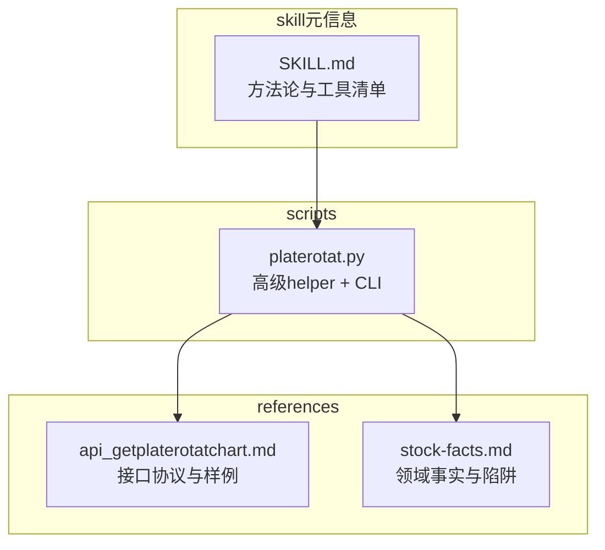
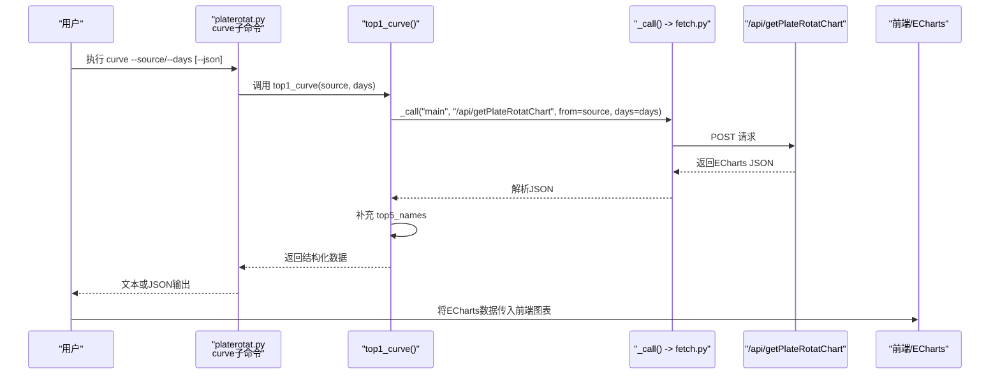
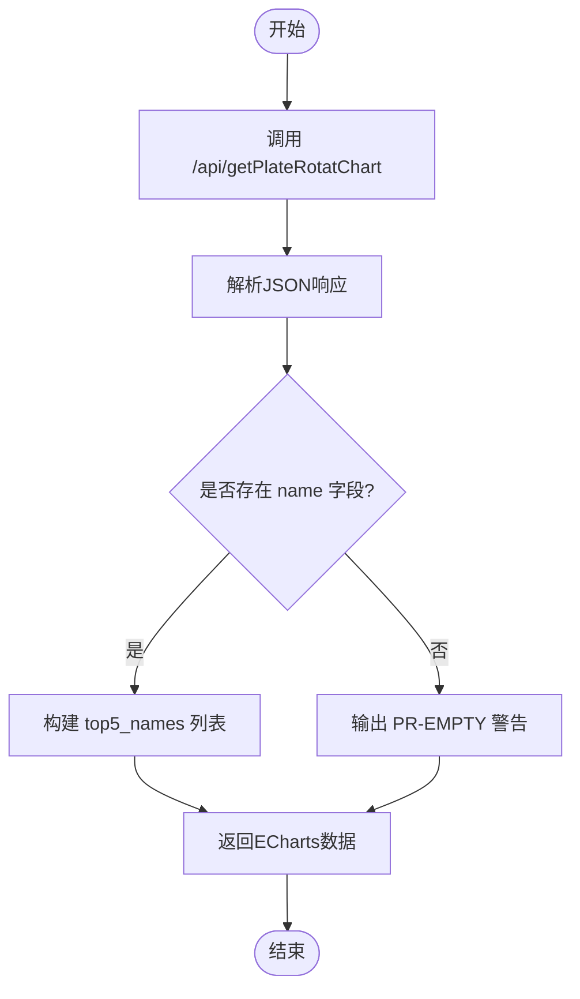
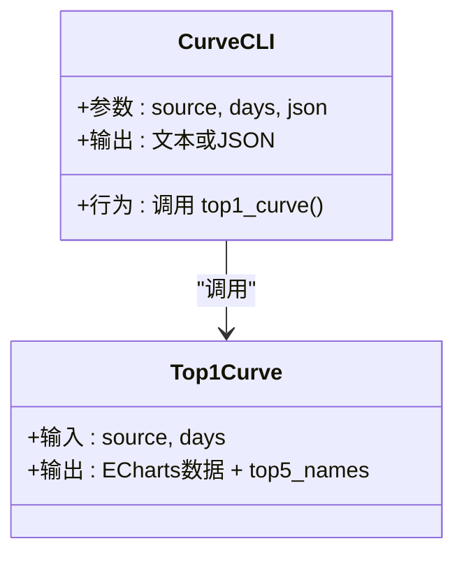
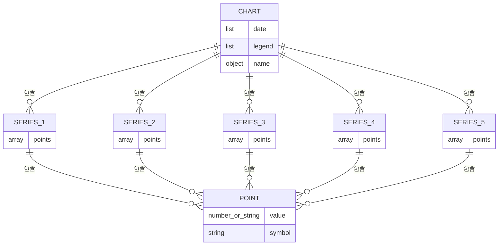
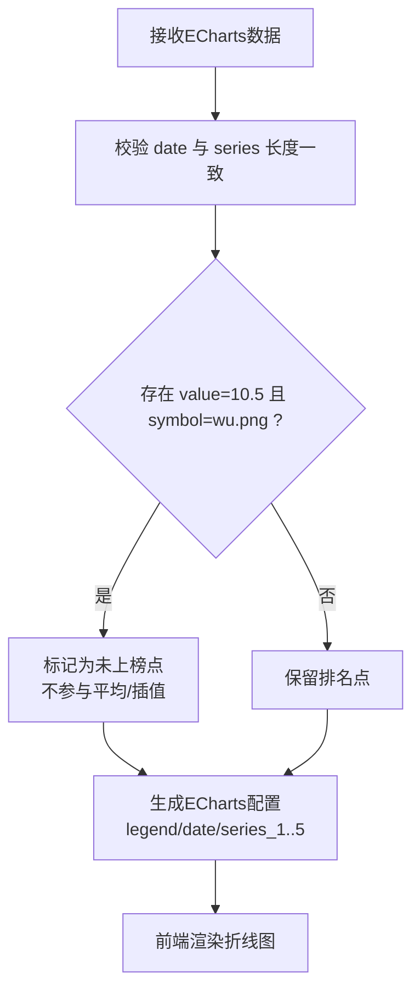
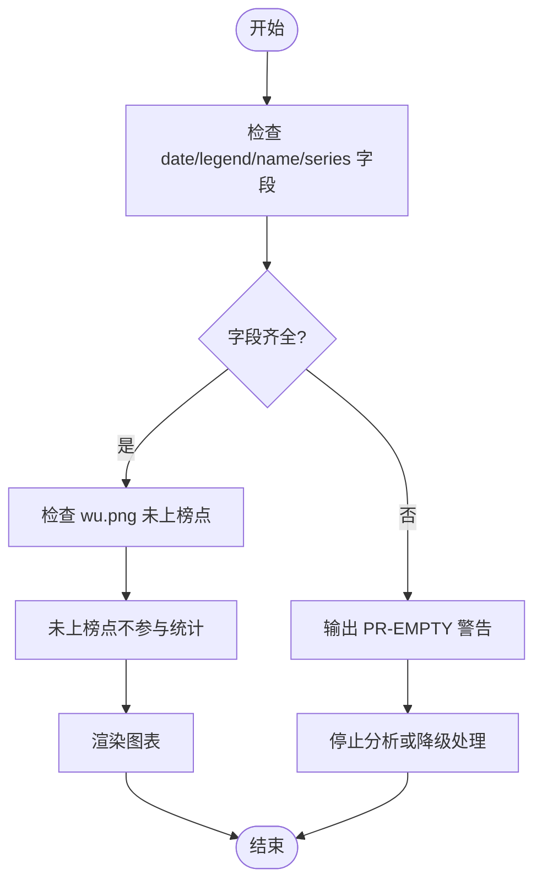
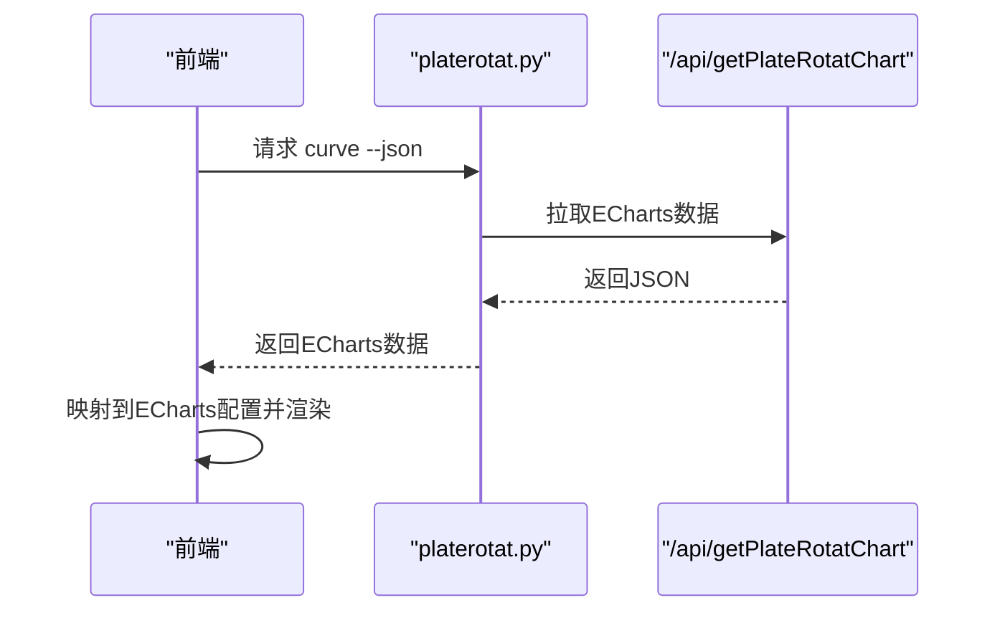
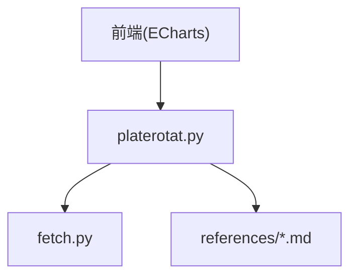

# curve命令 - 排名变化曲线分析

<cite>
**本文引用的文件**   
- [platerotat.py](file://skills/plate-rotation-skill/scripts/platerotat.py)
- [api_getplaterotatchart.md](file://skills/plate-rotation-skill/references/api_getplaterotatchart.md)
- [stock-facts.md](file://skills/plate-rotation-skill/references/stock-facts.md)
- [SKILL.md](file://skills/plate-rotation-skill/SKILL.md)
</cite>

## 目录
1. [简介](#简介)
2. [项目结构](#项目结构)
3. [核心组件](#核心组件)
4. [架构总览](#架构总览)
5. [详细组件分析](#详细组件分析)
6. [依赖关系分析](#依赖关系分析)
7. [性能与可用性考量](#性能与可用性考量)
8. [故障排查指南](#故障排查指南)
9. [结论](#结论)
10. [附录](#附录)

## 简介
本文件为“curve”子命令的API使用文档，聚焦Top5板块N日排名变化曲线的分析意义、数据来源与参数说明、返回数据结构（ECharts格式）、特殊标记含义、可视化渲染示例与数据处理方法、数据完整性检查与异常处理建议，以及前端图表集成方式。

- 分析意义与应用场景
  - 观察Top5板块在N日内的排名波动，识别资金切换、主线延续或退潮信号。
  - 通过断点与跃升判断“妖板”形态：长期未上榜后突然进入Top1，需二次确认后再重仓。
  - 结合双源（开盘啦强度分 vs 同花顺涨幅%）交叉验证，区分持续性热点与当日爆发热点。

- 关键参数
  - --source：选择数据源，支持 ths（同花顺）或 kaipan（开盘啦）。默认 kaipan。
  - --days：观察窗口天数，常用档位 10|20|30|50，默认 20。

- 返回数据结构（ECharts）
  - legend：图例数组，形如“F5G概念(6次上榜)”，括号内为该板块过去N日的总上榜次数。
  - date：日期序列，MM-DD格式，按最近到最远排列。
  - name：对象，键为字符串序号"1".."5"，值为对应板块名称。
  - series_1..5：各板块的N日排名序列，每个元素包含 value 与 symbol。
    - value 为整数排名；当 value=10.5 且 symbol=wu.png 时，表示当日未上榜（空白），不参与平均计算。

- 可视化渲染要点
  - 将 date 作为X轴，series_1..5 作为多条折线，symbol 用于显示排名图标；wu.png 表示缺失值。
  - 对 value=10.5 的点进行空值处理，避免误读为真实排名。

- 数据完整性与异常处理
  - 若返回缺少 name 字段或 top5_names 为空，应提示上游可能异常或跨源错传。
  - 遇到 PR-EMPTY 或 PR-WARN 警告，应按策略降级或中止分析。

- 前端集成
  - 直接消费 ECharts 数据，映射 legend/date/name/series_1..5 到 ECharts 配置项。
  - 对 wu.png 点进行空值或占位渲染，保证折线连续性但标注“未上榜”。

**章节来源**
- [platerotat.py:177-196](file://skills/plate-rotation-skill/scripts/platerotat.py#L177-L196)
- [api_getplaterotatchart.md:40-52](file://skills/plate-rotation-skill/references/api_getplaterotatchart.md#L40-L52)
- [stock-facts.md:45-49](file://skills/plate-rotation-skill/references/stock-facts.md#L45-L49)
- [SKILL.md:65-67](file://skills/plate-rotation-skill/SKILL.md#L65-L67)

## 项目结构
本功能位于 plate-rotation skill 中，核心脚本提供高级 helper 与 CLI 入口，references 提供接口协议与语义说明。

**图示来源**
- [platerotat.py:1-35](file://skills/plate-rotation-skill/scripts/platerotat.py#L1-35)
- [api_getplaterotatchart.md:1-15](file://skills/plate-rotation-skill/references/api_getplaterotatchart.md#L1-L15)
- [stock-facts.md:1-10](file://skills/plate-rotation-skill/references/stock-facts.md#L1-L10)
- [SKILL.md:1-10](file://skills/plate-rotation-skill/SKILL.md#L1-L10)

**章节来源**
- [platerotat.py:1-35](file://skills/plate-rotation-skill/scripts/platerotat.py#L1-L35)
- [api_getplaterotatchart.md:1-15](file://skills/plate-rotation-skill/references/api_getplaterotatchart.md#L1-L15)
- [stock-facts.md:1-10](file://skills/plate-rotation-skill/references/stock-facts.md#L1-L10)
- [SKILL.md:1-10](file://skills/plate-rotation-skill/SKILL.md#L1-L10)

## 核心组件
- 高级函数 top1_curve(source, days)
  - 调用底层 /api/getPlateRotatChart，返回原始 ECharts 数据并补充 top5_names 便利字段。
  - 输出包含 legend、date、name、1..5 系列等标准字段。
- CLI 子命令 curve
  - 解析 --source 与 --days，调用 top1_curve，支持 --json 输出原始结构。
  - 文本模式下打印日期序列与各板块排名序列。

**章节来源**
- [platerotat.py:177-196](file://skills/plate-rotation-skill/scripts/platerotat.py#L177-L196)
- [platerotat.py:251-262](file://skills/plate-rotation-skill/scripts/platerotat.py#L251-L262)
- [platerotat.py:297-301](file://skills/plate-rotation-skill/scripts/platerotat.py#L297-L301)

## 架构总览
curve 子命令的数据流从CLI到后端接口的完整路径如下：

**图示来源**
- [platerotat.py:251-262](file://skills/plate-rotation-skill/scripts/platerotat.py#L251-L262)
- [platerotat.py:177-196](file://skills/plate-rotation-skill/scripts/platerotat.py#L177-L196)
- [platerotat.py:55-70](file://skills/plate-rotation-skill/scripts/platerotat.py#L55-L70)
- [api_getplaterotatchart.md:16-28](file://skills/plate-rotation-skill/references/api_getplaterotatchart.md#L16-L28)

## 详细组件分析

### Top5 N日排名变化曲线（top1_curve）
- 功能
  - 获取Top5板块在过去N日的排名变化序列，返回ECharts数据。
  - 自动补充 top5_names 列表，便于上层直接使用。
- 输入参数
  - source：ths 或 kaipan，决定数据源。
  - days：回溯天数，常见 10|20|30|50。
- 输出字段
  - legend：Top5板块名及N日上榜次数。
  - date：日期序列（MM-DD，最新在前）。
  - name：{1..5: 板块名}。
  - 1..5：每条序列由若干点组成，每点含 value 与 symbol。
    - value 为排名；value=10.5 且 symbol=wu.png 表示当日未上榜。
- 错误与健壮性
  - 若 name 缺失导致 top5_names 为空，会输出 PR-EMPTY 警告。
  - 底层 _call 负责非JSON响应与空响应的终止处理。

**图示来源**
- [platerotat.py:177-196](file://skills/plate-rotation-skill/scripts/platerotat.py#L177-L196)
- [platerotat.py:75-77](file://skills/plate-rotation-skill/scripts/platerotat.py#L75-L77)

**章节来源**
- [platerotat.py:177-196](file://skills/plate-rotation-skill/scripts/platerotat.py#L177-L196)
- [platerotat.py:75-77](file://skills/plate-rotation-skill/scripts/platerotat.py#L75-L77)

### CLI 子命令 curve
- 参数定义
  - --source：choices=["ths","kaipan"]，默认 kaipan。
  - --days：int，默认 20。
  - --json：布尔开关，输出原始JSON。
- 行为
  - 调用 top1_curve 获取数据。
  - 文本模式打印日期序列与各板块排名序列。
  - JSON模式直接输出结构化数据，便于管道处理。

**图示来源**
- [platerotat.py:297-301](file://skills/plate-rotation-skill/scripts/platerotat.py#L297-L301)
- [platerotat.py:251-262](file://skills/plate-rotation-skill/scripts/platerotat.py#L251-L262)
- [platerotat.py:177-196](file://skills/plate-rotation-skill/scripts/platerotat.py#L177-L196)

**章节来源**
- [platerotat.py:297-301](file://skills/plate-rotation-skill/scripts/platerotat.py#L297-L301)
- [platerotat.py:251-262](file://skills/plate-rotation-skill/scripts/platerotat.py#L251-L262)

### 数据模型与字段语义
- 顶层字段
  - legend：Top5板块名及N日上榜次数。
  - date：日期序列（MM-DD，newest first）。
  - name：{1..5: 板块名}。
- 序列字段
  - 1..5：每条序列长度为N，元素为 {value, symbol}。
    - value 为排名；当 value=10.5 且 symbol=wu.png 时，表示当日未上榜。
- 特殊标记
  - symbol=wu.png 表示当日未上榜，不是排名10.5名，不应参与平均或趋势计算。

**图示来源**
- [api_getplaterotatchart.md:40-52](file://skills/plate-rotation-skill/references/api_getplaterotatchart.md#L40-L52)
- [stock-facts.md:45-49](file://skills/plate-rotation-skill/references/stock-facts.md#L45-L49)

**章节来源**
- [api_getplaterotatchart.md:40-52](file://skills/plate-rotation-skill/references/api_getplaterotatchart.md#L40-L52)
- [stock-facts.md:45-49](file://skills/plate-rotation-skill/references/stock-facts.md#L45-L49)

### 可视化渲染示例与数据处理方法
- 渲染步骤
  - X轴：date 序列。
  - 图例：legend 数组。
  - 系列：series_1..5 分别映射到 ECharts 的 series 数组。
  - 点样式：根据 symbol 选择图标；wu.png 表示未上榜，可渲染为占位点或断开连线。
- 数据处理
  - 过滤或替换 value=10.5 的点，避免参与统计。
  - 保持 date 与 series 长度一致，确保对齐。
  - 如需平滑或插值，仅对有效排名点进行处理，不填充未上榜点。

[此图为概念流程，无需图示来源]

**章节来源**
- [api_getplaterotatchart.md:40-52](file://skills/plate-rotation-skill/references/api_getplaterotatchart.md#L40-L52)
- [stock-facts.md:45-49](file://skills/plate-rotation-skill/references/stock-facts.md#L45-L49)

### 数据完整性检查与异常处理建议
- 完整性检查
  - 检查返回是否包含 date、legend、name 与至少一个 series 键（1..5）。
  - 若 name 缺失导致 top5_names 为空，视为异常，输出 PR-EMPTY 警告。
- 异常处理
  - 非JSON响应或空响应：底层 _call 会终止并输出错误信息。
  - 周末或节假日：接口可能返回上一交易日数据，需提示用户。
  - 跨源错传：板块代码前缀与 source 不匹配会导致空数据，应提示修正。

**图示来源**
- [platerotat.py:177-196](file://skills/plate-rotation-skill/scripts/platerotat.py#L177-L196)
- [platerotat.py:55-70](file://skills/plate-rotation-skill/scripts/platerotat.py#L55-L70)
- [stock-facts.md:45-49](file://skills/plate-rotation-skill/references/stock-facts.md#L45-L49)

**章节来源**
- [platerotat.py:177-196](file://skills/plate-rotation-skill/scripts/platerotat.py#L177-L196)
- [platerotat.py:55-70](file://skills/plate-rotation-skill/scripts/platerotat.py#L55-L70)
- [stock-facts.md:45-49](file://skills/plate-rotation-skill/references/stock-facts.md#L45-L49)

### 前端图表集成示例
- 集成步骤
  - 通过 CLI 的 --json 或直接调用 top1_curve 获取ECharts数据。
  - 将 legend/date/name/series_1..5 映射到 ECharts 配置。
  - 对 wu.png 点进行空值或占位渲染，确保折线可读。
- 注意事项
  - 不要将 value=10.5 当作真实排名参与计算。
  - 注意双源数值不可直接比较（ths 为涨幅%，kaipan 为强度分）。

**图示来源**
- [platerotat.py:251-262](file://skills/plate-rotation-skill/scripts/platerotat.py#L251-L262)
- [api_getplaterotatchart.md:16-28](file://skills/plate-rotation-skill/references/api_getplaterotatchart.md#L16-L28)

**章节来源**
- [platerotat.py:251-262](file://skills/plate-rotation-skill/scripts/platerotat.py#L251-L262)
- [api_getplaterotatchart.md:16-28](file://skills/plate-rotation-skill/references/api_getplaterotatchart.md#L16-L28)

## 依赖关系分析
- 模块耦合
  - platerotat.py 依赖 fetch.py 进行HTTP请求，依赖 parsers.py 进行HTML解析（其他helper使用）。
  - references 文档提供接口协议与语义说明，供开发与调试参考。
- 外部依赖
  - 后端接口 /api/getPlateRotatChart 返回ECharts数据。
  - 前端使用 ECharts 库渲染。

**图示来源**
- [platerotat.py:1-35](file://skills/plate-rotation-skill/scripts/platerotat.py#L1-L35)
- [api_getplaterotatchart.md:1-15](file://skills/plate-rotation-skill/references/api_getplaterotatchart.md#L1-L15)

**章节来源**
- [platerotat.py:1-35](file://skills/plate-rotation-skill/scripts/platerotat.py#L1-L35)
- [api_getplaterotatchart.md:1-15](file://skills/plate-rotation-skill/references/api_getplaterotatchart.md#L1-L15)

## 性能与可用性考量
- 缓存与刷新
  - 默认缓存TTL约1小时，盘中需要分钟级实时可使用 --no-cache 或环境变量关闭缓存。
- 延迟与粒度
  - 接口属于日级/多日级聚合，盘中刷新粒度约5分钟。
- 资源优化
  - 合理设置 days 窗口，避免过长窗口导致数据量过大。
  - 前端按需渲染，减少不必要的重绘。

**章节来源**
- [SKILL.md:169-177](file://skills/plate-rotation-skill/SKILL.md#L169-L177)
- [stock-facts.md:87-93](file://skills/plate-rotation-skill/references/stock-facts.md#L87-L93)

## 故障排查指南
- 常见问题
  - 返回空数据：可能是周末/节假日、参数 days 超前、上游接口异常。
  - 跨源错传：板块代码前缀与 source 不匹配，导致空数据。
  - 非JSON响应：底层 _call 会终止并输出错误信息。
- 诊断步骤
  - 检查 stderr 中的 PR-EMPTY 或 PR-WARN 标签。
  - 确认 source 与板块代码前缀匹配（88x→ths，80x/803x→kaipan）。
  - 使用 --json 输出原始结构，定位字段缺失或异常。

**章节来源**
- [platerotat.py:75-77](file://skills/plate-rotation-skill/scripts/platerotat.py#L75-L77)
- [platerotat.py:55-70](file://skills/plate-rotation-skill/scripts/platerotat.py#L55-L70)
- [stock-facts.md:21-33](file://skills/plate-rotation-skill/references/stock-facts.md#L21-L33)

## 结论
curve 子命令提供了Top5板块N日排名变化曲线的标准化ECharts数据，便于前端直观展示与分析。通过合理的参数选择、数据完整性检查与异常处理，可有效识别资金切换与“妖板”形态，辅助短线交易决策。建议在集成时严格处理 wu.png 未上榜点，并结合双源数据进行交叉验证，提升分析的稳健性与准确性。

## 附录
- 使用示例
  - CLI：python3 scripts/platerotat.py curve --source kaipan --days 20 --json
  - Python：from platerotat import top1_curve; chart = top1_curve(source='kaipan', days=20)
- 参考文档
  - 接口协议与样例见 api_getplaterotatchart.md
  - 领域事实与陷阱见 stock-facts.md
  - 方法论与工具清单见 SKILL.md

**章节来源**
- [platerotat.py:297-301](file://skills/plate-rotation-skill/scripts/platerotat.py#L297-L301)
- [api_getplaterotatchart.md:40-52](file://skills/plate-rotation-skill/references/api_getplaterotatchart.md#L40-L52)
- [stock-facts.md:45-49](file://skills/plate-rotation-skill/references/stock-facts.md#L45-L49)
- [SKILL.md:161-167](file://skills/plate-rotation-skill/SKILL.md#L161-L167)