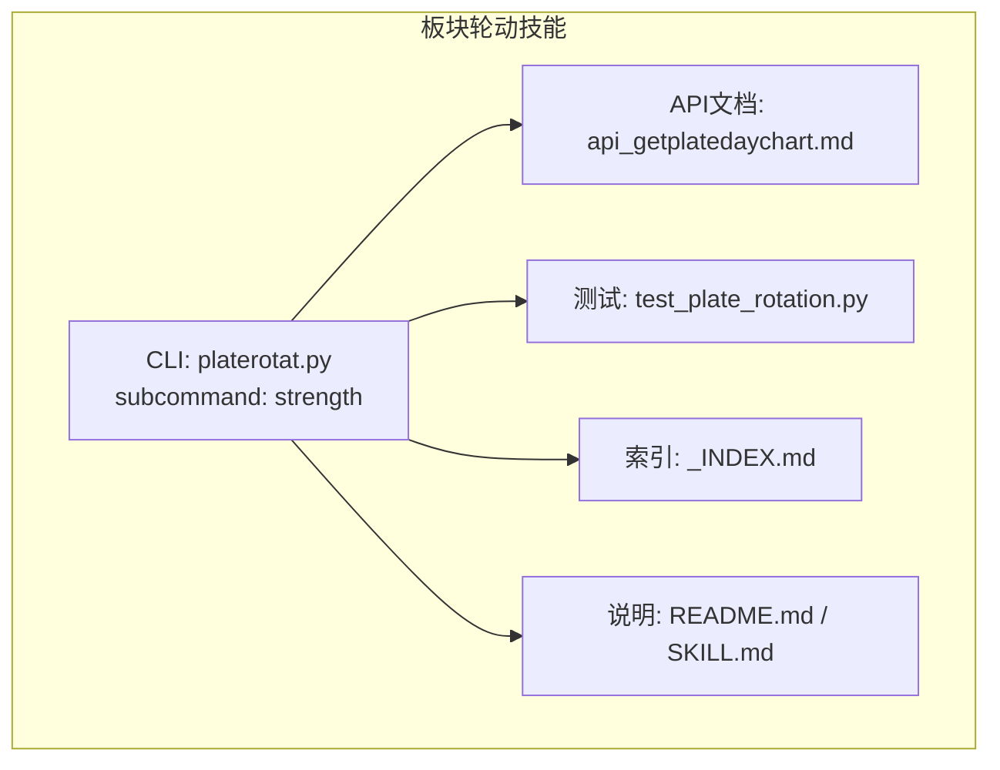
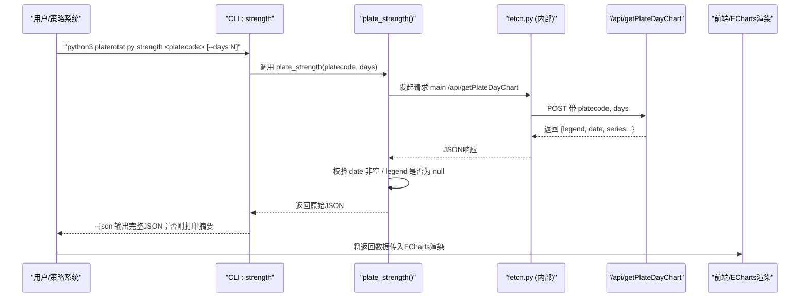
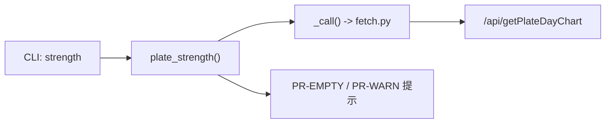

# strength命令 - 板块强度时序分析

<cite>
**本文引用的文件列表**
- [platerotat.py](file://skills/plate-rotation-skill/scripts/platerotat.py)
- [api_getplatedaychart.md](file://skills/plate-rotation-skill/references/api_getplatedaychart.md)
- [api_getplaterotatchart.md](file://skills/plate-rotation-skill/references/api_getplaterotatchart.md)
- [_INDEX.md](file://skills/plate-rotation-skill/references/_INDEX.md)
- [README.md](file://skills/plate-rotation-skill/README.md)
- [SKILL.md](file://skills/plate-rotation-skill/SKILL.md)
- [test_plate_rotation.py](file://skills/plate-rotation-skill/tests/test_plate_rotation.py)
</cite>

## 目录
1. [简介](#简介)
2. [项目结构](#项目结构)
3. [核心组件](#核心组件)
4. [架构总览](#架构总览)
5. [详细组件分析](#详细组件分析)
6. [依赖关系分析](#依赖关系分析)
7. [性能与可用性考虑](#性能与可用性考虑)
8. [故障排查指南](#故障排查指南)
9. [结论](#结论)
10. [附录](#附录)

## 简介
strength子命令用于“单板块N日强度+量能时序分析”，通过调用底层接口返回ECharts数据，帮助快速判断某板块在指定时间窗口内的活跃度、强度变化与资金参与情况。该能力是“板块轮动四件套”之一，适合与量化交易系统结合，作为信号源或辅助看板。

## 项目结构
本功能位于“板块轮动”技能中，CLI入口与高级封装函数集中在脚本层，API文档与测试用例分别位于references与tests目录。

图表来源
- [platerotat.py:278-315](file://skills/plate-rotation-skill/scripts/platerotat.py#L278-L315)
- [api_getplatedaychart.md:1-48](file://skills/plate-rotation-skill/references/api_getplatedaychart.md#L1-L48)
- [test_plate_rotation.py:110-118](file://skills/plate-rotation-skill/tests/test_plate_rotation.py#L110-L118)
- [_INDEX.md:1-32](file://skills/plate-rotation-skill/references/_INDEX.md#L1-L32)
- [README.md:70-98](file://skills/plate-rotation-skill/README.md#L70-L98)
- [SKILL.md:158-209](file://skills/plate-rotation-skill/SKILL.md#L158-L209)

章节来源
- [platerotat.py:278-315](file://skills/plate-rotation-skill/scripts/platerotat.py#L278-L315)
- [api_getplatedaychart.md:1-48](file://skills/plate-rotation-skill/references/api_getplatedaychart.md#L1-L48)
- [test_plate_rotation.py:110-118](file://skills/plate-rotation-skill/tests/test_plate_rotation.py#L110-L118)
- [_INDEX.md:1-32](file://skills/plate-rotation-skill/references/_INDEX.md#L1-L32)
- [README.md:70-98](file://skills/plate-rotation-skill/README.md#L70-L98)
- [SKILL.md:158-209](file://skills/plate-rotation-skill/SKILL.md#L158-L209)

## 核心组件
- CLI子命令strength：接收platecode与days参数，调用底层接口并输出JSON或简要文本。
- 高级函数plate_strength：对底层响应做轻量校验（date是否为空、legend是否为null），并通过stderr输出PR-EMPTY/PR-WARN提示。
- 底层接口getPlateDayChart：返回ECharts数据结构，包含legend、date以及若干series键（如强度、量能等）。

章节来源
- [platerotat.py:201-218](file://skills/plate-rotation-skill/scripts/platerotat.py#L201-L218)
- [platerotat.py:265-276](file://skills/plate-rotation-skill/scripts/platerotat.py#L265-L276)
- [api_getplatedaychart.md:22-46](file://skills/plate-rotation-skill/references/api_getplatedaychart.md#L22-L46)

## 架构总览
strength命令的端到端流程如下：

图表来源
- [platerotat.py:201-218](file://skills/plate-rotation-skill/scripts/platerotat.py#L201-L218)
- [platerotat.py:265-276](file://skills/plate-rotation-skill/scripts/platerotat.py#L265-L276)
- [api_getplatedaychart.md:16-46](file://skills/plate-rotation-skill/references/api_getplatedaychart.md#L16-L46)

## 详细组件分析

### 1) 输入参数与验证规则
- platecode（必填）
  - 格式要求：数字字符串，前缀决定数据来源
    - 88x：同花顺概念板块（例如 886084）
    - 80x / 803x：开盘啦板块（例如 801807、803023）
  - 跨源不可混用：88x 板块不能在开盘啦源查询，反之亦然
  - 建议校验：
    - 仅数字
    - 以 88/80/803 开头
    - 长度符合常见板块代码规范（通常为6位）
- days（可选，默认20）
  - 取值范围：10 | 20 | 30 | 50
  - 影响回溯时间窗口与日期序列长度

章节来源
- [_INDEX.md:25-32](file://skills/plate-rotation-skill/references/_INDEX.md#L25-L32)
- [api_getplatedaychart.md:22-28](file://skills/plate-rotation-skill/references/api_getplatedaychart.md#L22-L28)
- [README.md:92-98](file://skills/plate-rotation-skill/README.md#L92-L98)
- [platerotat.py:201-218](file://skills/plate-rotation-skill/scripts/platerotat.py#L201-L218)

### 2) 返回值结构与ECharts字段语义
- 顶层字段
  - legend：当板块当日未活跃时为 null；存在但为 null 表示“近N天均未活跃”，前端不渲染图表
  - date：MM-DD格式的日期数组，按最近到最旧排列
- series系列
  - 除 legend/date 外的其余键即为各条序列（如强度、量能等），每条序列长度为N，对应date中的每一天
  - 具体数值含义由后端定义，前端按ECharts标准渲染

注意：
- 若date为空，视为上游异常或无效板块代码
- 若legend为null，属于正常业务状态（板块未活跃），并非错误

章节来源
- [api_getplatedaychart.md:30-46](file://skills/plate-rotation-skill/references/api_getplatedaychart.md#L30-L46)
- [platerotat.py:210-218](file://skills/plate-rotation-skill/scripts/platerotat.py#L210-L218)
- [test_plate_rotation.py:110-118](file://skills/plate-rotation-skill/tests/test_plate_rotation.py#L110-L118)

### 3) 与Top5排名曲线的差异对比
为避免混淆，补充说明Top5排名曲线接口的ECharts结构（与本命令不同）：
- date：MM-DD日期数组
- legend：Top5板块名列表（含“N次上榜”标注）
- name：{1..5: 名称}
- 1..5：每个板块的N日排名序列，元素为{value, symbol}，其中value=10.5且symbol=wu.png表示当日未上榜

章节来源
- [api_getplaterotatchart.md:30-52](file://skills/plate-rotation-skill/references/api_getplaterotatchart.md#L30-L52)

### 4) 板块活跃度判断逻辑与阈值建议
- 直接判定
  - legend=null：板块在近N天未活跃（无强度/量能数据）
  - date为空：上游异常或板块代码无效
- 间接判定（需结合其他指标）
  - 若返回的series中存在大量缺失值或接近零的数值，可视为低活跃度
  - 结合“妖王榜/龙头矩阵”结果进行交叉验证（同一platecode+days下，若无领涨则进一步确认未活跃）

阈值建议（经验性，供参考）：
- 强度序列均值/分位数高于历史分位（如70%分位）可视为“活跃增强”
- 量能序列连续上升且突破近期高点，可作为“放量启动”信号
- 同时满足“强度提升 + 量能放大”时，信号更可靠

章节来源
- [platerotat.py:210-218](file://skills/plate-rotation-skill/scripts/platerotat.py#L210-L218)
- [api_getplatedaychart.md:43-46](file://skills/plate-rotation-skill/references/api_getplatedaychart.md#L43-L46)

### 5) 数据质量检查方法与异常处理策略
- 基础校验
  - 返回体必须为字典
  - 必须包含legend与date键
  - date非空才具备有效时序
- 业务校验
  - legend=null：板块未活跃（正常业务态）
  - date为空：上游异常或无效platecode（需要告警与重试）
- 运行时提示
  - PR-EMPTY：空数据（节假日/参数超前/跨源错传/上游异常）
  - PR-WARN：数据正常但板块未活跃（可继续分析，但需标注）

章节来源
- [platerotat.py:75-98](file://skills/plate-rotation-skill/scripts/platerotat.py#L75-L98)
- [platerotat.py:210-218](file://skills/plate-rotation-skill/scripts/platerotat.py#L210-L218)
- [test_plate_rotation.py:110-118](file://skills/plate-rotation-skill/tests/test_plate_rotation.py#L110-L118)
- [SKILL.md:250-256](file://skills/plate-rotation-skill/SKILL.md#L250-L256)

### 6) 与量化交易系统的集成示例
- 信号采集
  - 定时任务每日收盘后调用strength，获取最新N日强度+量能时序
  - 解析series，计算强度与量能的滚动统计（均值、方差、趋势斜率）
- 触发条件（示例）
  - 强度序列连续M日大于阈值T1，且量能序列突破N日新高
  - 与“妖王榜/龙头矩阵”联动：若同一板块出现频繁龙头，则提高权重
- 执行与风控
  - 生成买入/加仓信号，结合仓位管理与止损规则
  - 若检测到legend=null或date为空，跳过该板块并记录日志

章节来源
- [README.md:70-98](file://skills/plate-rotation-skill/README.md#L70-L98)
- [SKILL.md:158-209](file://skills/plate-rotation-skill/SKILL.md#L158-L209)

## 依赖关系分析
- CLI层：platerotat.py暴露strength子命令，内部调用plate_strength()
- 工具层：_call()通过fetch.py发起HTTP请求，返回JSON
- 校验层：对返回体的关键字段进行健壮性检查，输出PR-EMPTY/PR-WARN
- 数据层：/api/getPlateDayChart提供ECharts数据

图表来源
- [platerotat.py:55-71](file://skills/plate-rotation-skill/scripts/platerotat.py#L55-L71)
- [platerotat.py:201-218](file://skills/plate-rotation-skill/scripts/platerotat.py#L201-L218)
- [api_getplatedaychart.md:16-28](file://skills/plate-rotation-skill/references/api_getplatedaychart.md#L16-L28)

章节来源
- [platerotat.py:55-71](file://skills/plate-rotation-skill/scripts/platerotat.py#L55-L71)
- [platerotat.py:201-218](file://skills/plate-rotation-skill/scripts/platerotat.py#L201-L218)
- [api_getplatedaychart.md:16-28](file://skills/plate-rotation-skill/references/api_getplatedaychart.md#L16-L28)

## 性能与可用性考虑
- 网络与并发
  - 批量查询多个板块时，建议串行或限流，避免对上游造成压力
- 缓存策略
  - 对相同platecode+days的结果可做短时缓存，减少重复请求
- 容错与重试
  - 遇到PR-EMPTY或网络异常，建议指数退避重试
- 前端渲染
  - legend=null时直接隐藏图表，避免空白占位影响体验

[本节为通用指导，无需特定文件引用]

## 故障排查指南
- 症状：返回结果为空或报错
  - 检查是否周末/节假日导致无数据
  - 检查platecode前缀是否与数据源匹配（88x→ths，80x/803x→kaipan）
  - 检查days是否在允许范围内
- 症状：legend=null
  - 表示板块未活跃，属正常业务态；可结合其他指标判断
- 症状：date为空
  - 上游异常或无效板块代码；应记录日志并告警

章节来源
- [platerotat.py:85-98](file://skills/plate-rotation-skill/scripts/platerotat.py#L85-L98)
- [platerotat.py:210-218](file://skills/plate-rotation-skill/scripts/platerotat.py#L210-L218)
- [SKILL.md:250-256](file://skills/plate-rotation-skill/SKILL.md#L250-L256)

## 结论
strength子命令聚焦于“单板块N日强度+量能时序”，通过标准化的ECharts数据结构，为前端可视化与量化策略提供一致的数据契约。配合严格的参数校验与运行时提示，可在复杂市场环境下稳定输出高质量信号。

[本节为总结性内容，无需特定文件引用]

## 附录

### A. CLI用法速查
- 基本用法
  - python3 platerotat.py strength <platecode> [--days N] [--json]
- 示例
  - python3 platerotat.py strength 886084 --days 20 --json

章节来源
- [platerotat.py:303-307](file://skills/plate-rotation-skill/scripts/platerotat.py#L303-L307)
- [SKILL.md:164-166](file://skills/plate-rotation-skill/SKILL.md#L164-L166)

### B. 关键API对照
- 单板块强度+量能时序：/api/getPlateDayChart
- Top5排名变化曲线：/api/getPlateRotatChart（结构不同，勿混淆）

章节来源
- [_INDEX.md:1-10](file://skills/plate-rotation-skill/references/_INDEX.md#L1-L10)
- [api_getplatedaychart.md:16-28](file://skills/plate-rotation-skill/references/api_getplatedaychart.md#L16-L28)
- [api_getplaterotatchart.md:16-28](file://skills/plate-rotation-skill/references/api_getplaterotatchart.md#L16-L28)