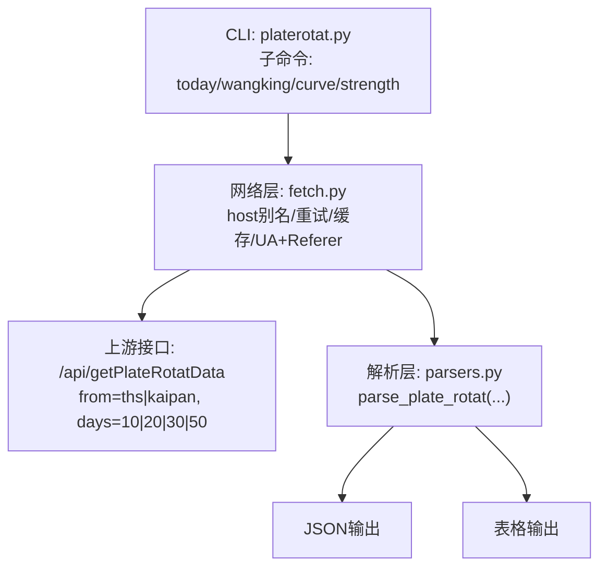
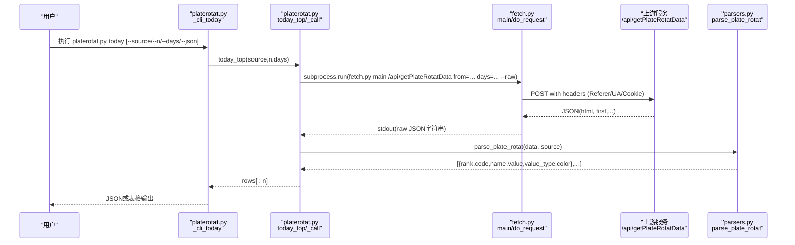
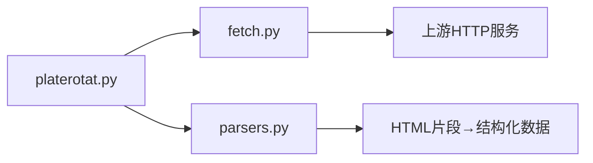

# today命令 - 今日Top板块查询

<cite>
**本文引用的文件**
- [platerotat.py](file://skills/plate-rotation-skill/scripts/platerotat.py)
- [fetch.py](file://skills/plate-rotation-skill/scripts/fetch.py)
- [parsers.py](file://skills/plate-rotation-skill/scripts/parsers.py)
- [api_getplaterotatdata.md](file://skills/plate-rotation-skill/references/api_getplaterotatdata.md)
- [README.md](file://skills/plate-rotation-skill/README.md)
- [test_plate_rotation.py](file://skills/plate-rotation-skill/tests/test_plate_rotation.py)
</cite>

## 目录
1. [简介](#简介)
2. [项目结构](#项目结构)
3. [核心组件](#核心组件)
4. [架构总览](#架构总览)
5. [详细组件分析](#详细组件分析)
6. [依赖关系分析](#依赖关系分析)
7. [性能与可用性](#性能与可用性)
8. [故障排查指南](#故障排查指南)
9. [结论](#结论)
10. [附录：常用命令速查](#附录常用命令速查)

## 简介
today子命令用于快速查询“今日表现最好的板块”，支持切换数据源、指定返回前N名以及回溯天数。它通过统一封装底层接口，提供简洁的命令行体验，并支持JSON与表格两种输出格式，便于人类阅读与机器解析。

## 项目结构
本功能位于 plate-rotation skill 的 scripts 目录中，采用“上层CLI + 网络调用 + HTML解析”的分层设计：
- CLI层：定义子命令与参数（platerotat.py）
- 网络层：统一发起HTTP请求、重试与缓存（fetch.py）
- 解析层：从HTML片段中提取结构化数据（parsers.py）
- 参考文档：接口说明与字段语义（references/*.md）

图表来源
- [platerotat.py:278-310](file://skills/plate-rotation-skill/scripts/platerotat.py#L278-L310)
- [fetch.py:128-212](file://skills/plate-rotation-skill/scripts/fetch.py#L128-L212)
- [parsers.py:20-65](file://skills/plate-rotation-skill/scripts/parsers.py#L20-L65)
- [api_getplaterotatdata.md:22-49](file://skills/plate-rotation-skill/references/api_getplaterotatdata.md#L22-L49)

章节来源
- [platerotat.py:278-310](file://skills/plate-rotation-skill/scripts/platerotat.py#L278-L310)
- [fetch.py:128-212](file://skills/plate-rotation-skill/scripts/fetch.py#L128-L212)
- [parsers.py:20-65](file://skills/plate-rotation-skill/scripts/parsers.py#L20-L65)
- [api_getplaterotatdata.md:22-49](file://skills/plate-rotation-skill/references/api_getplaterotatdata.md#L22-L49)

## 核心组件
- today_top(source, n, days)：基于 /api/getPlateRotatData 获取当日Top N板块，按source不同，数值含义不同（ths为涨幅%，kaipan为强度分）。
- CLI_today(args)：将today_top结果以JSON或表格形式输出。
- _call(host, path, *kv)：对fetch.py的薄封装，负责raw输出、错误码处理与JSON解析。
- fetch.py：统一HTTP客户端，含重试、缓存、UA/Referer注入等。
- parsers.parse_plate_rotat(data, source)：从HTML片段解析出今日板块清单。

章节来源
- [platerotat.py:102-120](file://skills/plate-rotation-skill/scripts/platerotat.py#L102-L120)
- [platerotat.py:227-236](file://skills/plate-rotation-skill/scripts/platerotat.py#L227-L236)
- [platerotat.py:55-70](file://skills/plate-rotation-skill/scripts/platerotat.py#L55-L70)
- [fetch.py:128-212](file://skills/plate-rotation-skill/scripts/fetch.py#L128-L212)
- [parsers.py:20-65](file://skills/plate-rotation-skill/scripts/parsers.py#L20-L65)

## 架构总览
today子命令的执行流程如下：

图表来源
- [platerotat.py:227-236](file://skills/plate-rotation-skill/scripts/platerotat.py#L227-L236)
- [platerotat.py:102-120](file://skills/plate-rotation-skill/scripts/platerotat.py#L102-L120)
- [platerotat.py:55-70](file://skills/plate-rotation-skill/scripts/platerotat.py#L55-L70)
- [fetch.py:128-212](file://skills/plate-rotation-skill/scripts/fetch.py#L128-L212)
- [parsers.py:20-65](file://skills/plate-rotation-skill/scripts/parsers.py#L20-L65)

## 详细组件分析

### today子命令与参数
- 基本用法
  - 查询默认数据源的前10名：platerotat.py today
  - 指定数据源为同花顺，返回前20名：platerotat.py today --source ths --n 20
  - 指定回溯天数为30天：platerotat.py today --days 30
  - 输出JSON：platerotat.py today --json
- 参数说明
  - --source：数据源选择
    - ths：同花顺，数值为“板块涨幅%”，带%符号
    - kaipan：开盘啦，数值为“板块强度分”，纯整数
  - --n：返回前N名，默认10
  - --days：回溯天数，影响主表列宽与日期范围，但今日Top只看第一列；可选值通常为10/20/30/50
  - --json：是否输出JSON格式，否则输出易读的表格
- 使用场景
  - 快速查看当日最强板块（默认kaipan）
  - 对比双源：分别用ths和kaipan看“爆发”与“持续性”
  - 扩大样本：增大--n观察更多候选
  - 拉长周期：增大--days观察近期热度背景

章节来源
- [platerotat.py:283-288](file://skills/plate-rotation-skill/scripts/platerotat.py#L283-L288)
- [platerotat.py:102-120](file://skills/plate-rotation-skill/scripts/platerotat.py#L102-L120)
- [api_getplaterotatdata.md:22-49](file://skills/plate-rotation-skill/references/api_getplaterotatdata.md#L22-L49)

### 输出格式对比
- 表格输出（默认）
  - 包含标题行与排名、代码、名称、涨跌箭头与数值
  - 适合人类快速浏览
- JSON输出（--json）
  - 列表项包含 rank、code、name、value、value_type、color 等字段
  - value_type在ths时为pct（如“4.94%”），在kaipan时为score（如“15199”）
  - 适合程序化消费与二次加工

示例路径（不展示具体内容）
- 表格输出示例见安装验证段落中的文本样例
- JSON输出结构参见解析函数返回类型与测试断言

章节来源
- [platerotat.py:227-236](file://skills/plate-rotation-skill/scripts/platerotat.py#L227-L236)
- [parsers.py:20-65](file://skills/plate-rotation-skill/scripts/parsers.py#L20-L65)
- [README.md:54-64](file://skills/plate-rotation-skill/README.md#L54-L64)

### 数据源差异与板块代码前缀
- 同花顺（ths）
  - 数值：板块涨幅%，带%符号
  - 适用板块前缀：88x（例如 886084）
- 开盘啦（kaipan）
  - 数值：板块强度分，纯整数
  - 适用板块前缀：80x / 803x（例如 801807、801660）
- 跨源误传会导致空数据或无意义结果，运行时校验会给出PR-EMPTY提示

章节来源
- [api_getplaterotatdata.md:45-53](file://skills/plate-rotation-skill/references/api_getplaterotatdata.md#L45-L53)
- [platerotat.py:85-97](file://skills/plate-rotation-skill/scripts/platerotat.py#L85-L97)

### 高级用法与组合场景
- 基础查询
  - 默认前10名（kaipan）：platerotat.py today
  - 同花顺前10名：platerotat.py today --source ths
- 扩展分析
  - 前20名：platerotat.py today --n 20
  - 回溯30天：platerotat.py today --days 30
  - JSON输出供下游处理：platerotat.py today --json
- 双源交叉验证
  - 分别运行ths与kaipan，对比“爆发”与“持续性”
- 结合其他子命令
  - 配合wangking查看某板块的龙头股历史
  - 配合curve观察Top5板块近N日排名变化
  - 配合strength查看单板块强度时序

章节来源
- [platerotat.py:278-310](file://skills/plate-rotation-skill/scripts/platerotat.py#L278-L310)
- [README.md:70-96](file://skills/plate-rotation-skill/README.md#L70-L96)

## 依赖关系分析
- platerotat.py
  - 依赖 fetch.py 进行网络请求（subprocess调用）
  - 依赖 parsers.py 进行HTML到结构化数据的解析
- fetch.py
  - 统一构造请求头（Referer/UA等）、重试策略、缓存读写
  - 支持环境变量与本地cookie文件
- parsers.py
  - 正则抽取HTML片段中的板块信息，区分ths与kaipan的数值语义

图表来源
- [platerotat.py:55-70](file://skills/plate-rotation-skill/scripts/platerotat.py#L55-L70)
- [fetch.py:128-212](file://skills/plate-rotation-skill/scripts/fetch.py#L128-L212)
- [parsers.py:20-65](file://skills/plate-rotation-skill/scripts/parsers.py#L20-L65)

章节来源
- [platerotat.py:55-70](file://skills/plate-rotation-skill/scripts/platerotat.py#L55-L70)
- [fetch.py:128-212](file://skills/plate-rotation-skill/scripts/fetch.py#L128-L212)
- [parsers.py:20-65](file://skills/plate-rotation-skill/scripts/parsers.py#L20-L65)

## 性能与可用性
- 网络层优化
  - 指数退避重试：针对429/5xx及网络异常自动重试，最多3次，间隔1s/2s/4s
  - 缓存机制：POST请求默认落盘缓存，TTL可配置，减少重复请求
  - 超时控制：默认15秒，可通过参数调整
- 解析效率
  - 仅解析必要字段，避免过度计算
- 建议
  - 批量查询时复用--cache-ttl以减少网络开销
  - 在弱网环境下适当增大--timeout与--max-retries

章节来源
- [fetch.py:47-50](file://skills/plate-rotation-skill/scripts/fetch.py#L47-L50)
- [fetch.py:137-142](file://skills/plate-rotation-skill/scripts/fetch.py#L137-L142)
- [fetch.py:200-212](file://skills/plate-rotation-skill/scripts/fetch.py#L200-L212)

## 故障排查指南
- 常见错误与定位
  - 非法参数：如--source取值不在choices内，argparse会直接拒绝并退出非零码
  - 空数据：当节假日、参数超前或跨源错传时，可能返回空；stderr会输出PR-EMPTY警告
  - 非JSON响应：若上游返回非JSON，会明确报错并打印部分原始内容
  - 网络异常：429/5xx触发重试；最终失败会在stderr输出原因并退出码2
- 调试技巧
  - 使用--json输出结构化结果，便于grep/管道处理
  - 使用fetch.py的--verbose模式查看URL、body与重试过程
  - 检查板块代码前缀是否与source匹配（88x→ths；80x/803x→kaipan）
  - 确认当前是否为周末或节假日，可能导致无数据
- 参考用例
  - 测试覆盖：非法source被拒绝、各子命令text/json双模输出、字段存在性断言

章节来源
- [platerotat.py:283-288](file://skills/plate-rotation-skill/scripts/platerotat.py#L283-L288)
- [platerotat.py:75-97](file://skills/plate-rotation-skill/scripts/platerotat.py#L75-L97)
- [platerotat.py:55-70](file://skills/plate-rotation-skill/scripts/platerotat.py#L55-L70)
- [fetch.py:106-124](file://skills/plate-rotation-skill/scripts/fetch.py#L106-L124)
- [test_plate_rotation.py:425-439](file://skills/plate-rotation-skill/tests/test_plate_rotation.py#L425-L439)

## 结论
today子命令提供了便捷、稳定的“今日Top板块”查询能力。通过--source、--n、--days与--json的组合，既能满足日常快速浏览，也能支撑更复杂的分析与自动化流水线。建议在关键场景中结合双源交叉验证与下游工具链，以获得更稳健的洞察。

## 附录：常用命令速查
- 基础查询
  - platerotat.py today
  - platerotat.py today --source ths
  - platerotat.py today --n 20
  - platerotat.py today --days 30
  - platerotat.py today --json
- 进阶组合
  - platerotat.py today --source ths --n 20 --days 30 --json
  - 先today筛选候选，再用wangking/curve/strength深入分析

章节来源
- [platerotat.py:278-310](file://skills/plate-rotation-skill/scripts/platerotat.py#L278-L310)
- [README.md:54-64](file://skills/plate-rotation-skill/README.md#L54-L64)