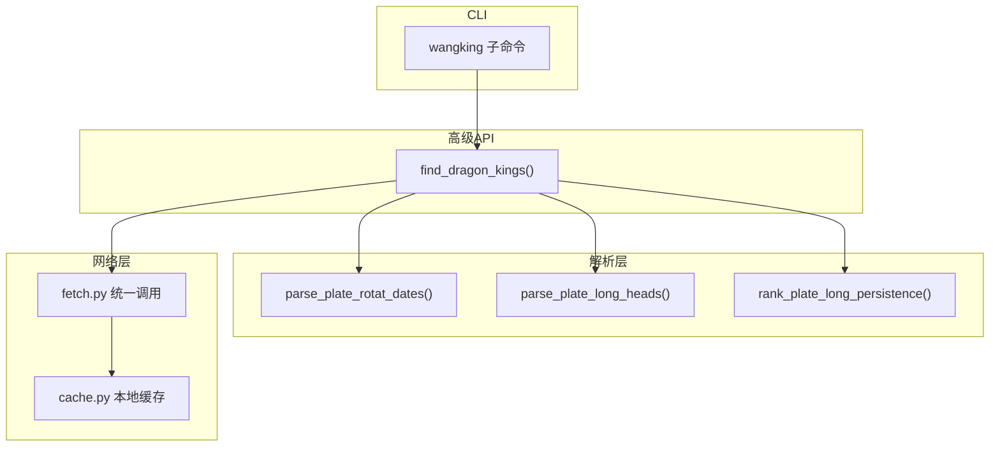
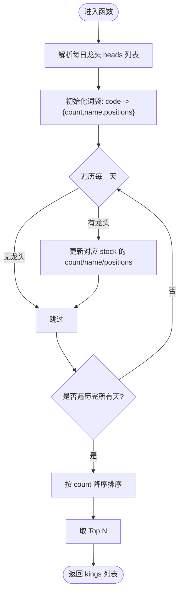
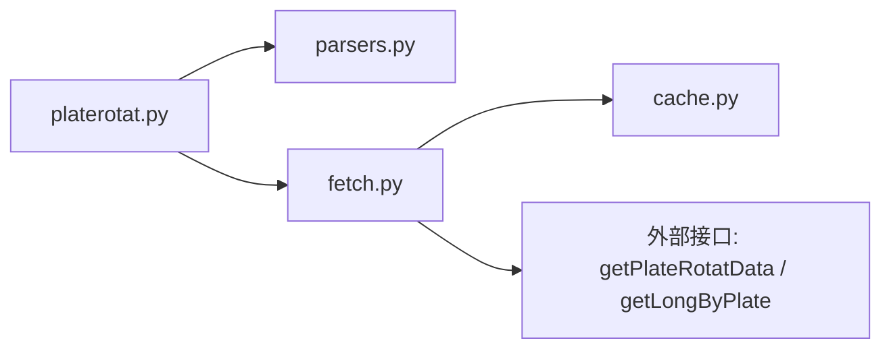

# wangking命令 - 板块妖王榜分析

<cite>
**本文引用的文件**
- [platerotat.py](file://skills/plate-rotation-skill/scripts/platerotat.py)
- [parsers.py](file://skills/plate-rotation-skill/scripts/parsers.py)
- [fetch.py](file://skills/plate-rotation-skill/scripts/fetch.py)
- [cache.py](file://skills/plate-rotation-skill/scripts/cache.py)
- [test_plate_rotation.py](file://skills/plate-rotation-skill/tests/test_plate_rotation.py)
</cite>

## 目录
1. [简介](#简介)
2. [项目结构](#项目结构)
3. [核心组件](#核心组件)
4. [架构总览](#架构总览)
5. [详细组件分析](#详细组件分析)
6. [依赖关系分析](#依赖关系分析)
7. [性能与缓存特性](#性能与缓存特性)
8. [使用指南](#使用指南)
9. [常见问题与排障](#常见问题与排障)
10. [结论](#结论)

## 简介
本指南面向“wangking”子命令，用于生成“板块妖王榜”。其目标是：在指定板块内，统计过去若干交易日中，哪些个股最频繁地担任过该板块的龙头（即“上榜次数”最高），从而识别该板块的核心标的。该能力对短线资金主线追踪、板块强度验证与龙头持续性评估具有较高实战价值。

## 项目结构
与 wangking 相关的实现位于 plate-rotation skill 的 scripts 目录下，采用“高级封装 + 解析器 + 网络调用 + 本地缓存”的分层设计：
- platerotat.py：对外暴露高级 API 与 CLI（含 wangking 子命令）
- parsers.py：HTML-in-JSON 响应解析与“妖王榜”统计逻辑
- fetch.py：统一 HTTP 调用封装（重试、缓存、参数拼装）
- cache.py：本地磁盘缓存原子层（TTL、开关、清理）
- tests/test_plate_rotation.py：在线集成测试，覆盖 CLI 与自动路由等关键路径



图表来源
- [platerotat.py:125-172](file://skills/plate-rotation-skill/scripts/platerotat.py#L125-L172)
- [parsers.py:105-174](file://skills/plate-rotation-skill/scripts/parsers.py#L105-L174)
- [fetch.py:128-212](file://skills/plate-rotation-skill/scripts/fetch.py#L128-L212)
- [cache.py:59-94](file://skills/plate-rotation-skill/scripts/cache.py#L59-L94)

章节来源
- [platerotat.py:1-315](file://skills/plate-rotation-skill/scripts/platerotat.py#L1-L315)
- [parsers.py:1-212](file://skills/plate-rotation-skill/scripts/parsers.py#L1-L212)
- [fetch.py:1-230](file://skills/plate-rotation-skill/scripts/fetch.py#L1-L230)
- [cache.py:1-145](file://skills/plate-rotation-skill/scripts/cache.py#L1-L145)
- [test_plate_rotation.py:373-410](file://skills/plate-rotation-skill/tests/test_plate_rotation.py#L373-L410)

## 核心组件
- 高级函数 find_dragon_kings：组合日期序列与龙头矩阵，输出“妖王榜”结果字典
- 解析器 rank_plate_long_persistence：按天聚合龙头出现次数，返回 count 与 positions 列表
- CLI _cli_wangking：将结果以文本或 JSON 形式输出
- 网络调用 fetch.py：负责请求构造、重试、缓存命中/落盘
- 本地缓存 cache.py：基于 TTL 的磁盘缓存，支持全局关闭与清理

章节来源
- [platerotat.py:125-172](file://skills/plate-rotation-skill/scripts/platerotat.py#L125-L172)
- [parsers.py:156-174](file://skills/plate-rotation-skill/scripts/parsers.py#L156-L174)
- [platerotat.py:239-248](file://skills/plate-rotation-skill/scripts/platerotat.py#L239-L248)
- [fetch.py:128-212](file://skills/plate-rotation-skill/scripts/fetch.py#L128-L212)
- [cache.py:59-94](file://skills/plate-rotation-skill/scripts/cache.py#L59-L94)

## 架构总览
下图展示了 wangking 从命令行到数据返回的完整流程，包括跨数据源自动路由与解析过程。

```mermaid
sequenceDiagram
participant U as "用户"
participant CLI as "wangking 子命令"
participant API as "find_dragon_kings()"
participant PAR as "解析器(parsers)"
participant NET as "fetch.py"
participant CACHE as "cache.py"
U->>CLI : 执行 wangking <platecode> [--days] [--n] [--json]
CLI->>API : 传入 platecode, days, top_n
API->>API : 根据 platecode 前缀推断 source(ths/kaipan)
API->>NET : 调用 /api/getPlateRotatData(from=source,days)
NET->>CACHE : 尝试读取缓存
CACHE-->>NET : 命中/未命中
NET-->>API : 返回主表 HTML-in-JSON
API->>PAR : parse_plate_rotat_dates() 提取 dates
API->>NET : 调用 /api/getLongByPlate(platecode,days)
NET->>CACHE : 尝试读取缓存
CACHE-->>NET : 命中/未命中
NET-->>API : 返回龙头矩阵 HTML-in-JSON
API->>PAR : parse_plate_long_heads(dates)
API->>PAR : rank_plate_long_persistence(top_n)
PAR-->>API : kings 列表 (含 count, positions)
API-->>CLI : 返回 {platecode,days,dates,kings,daily_heads}
CLI-->>U : 文本或 JSON 输出
```

图表来源
- [platerotat.py:125-172](file://skills/plate-rotation-skill/scripts/platerotat.py#L125-L172)
- [parsers.py:105-174](file://skills/plate-rotation-skill/scripts/parsers.py#L105-L174)
- [fetch.py:128-212](file://skills/plate-rotation-skill/scripts/fetch.py#L128-L212)
- [cache.py:59-94](file://skills/plate-rotation-skill/scripts/cache.py#L59-L94)

## 详细组件分析

### 板块妖王榜概念与分析价值
- 概念：在特定板块内，统计过去 N 个交易日中，哪些股票多次成为该板块的“龙头”（如龙一至龙五）。
- 价值：
  - 识别板块核心标的：count 越高，说明该票在该板块中的“持续性”越强
  - 辅助判断资金主线：结合 daily_heads 观察每日领涨结构变化
  - 为策略提供筛选维度：例如优先关注 count 靠前且 positions 时间分布连续的标的

章节来源
- [parsers.py:156-174](file://skills/plate-rotation-skill/scripts/parsers.py#L156-L174)
- [platerotat.py:125-172](file://skills/plate-rotation-skill/scripts/platerotat.py#L125-L172)

### 必需参数 platecode 格式要求
- 同花顺板块：以 88 开头（示例：886084）
- 开盘啦板块：以 80 或 803 开头（示例：801807）
- 内部会自动根据前缀选择数据源：
  - 88x → ths（同花顺）
  - 80x/803x → kaipan（开盘啦）

章节来源
- [platerotat.py:148-149](file://skills/plate-rotation-skill/scripts/platerotat.py#L148-L149)
- [test_plate_rotation.py:305-316](file://skills/plate-rotation-skill/tests/test_plate_rotation.py#L305-L316)

### 可选参数 --days 与 --n
- --days：回溯天数，影响日期列数与龙头矩阵范围
- --n：限制返回的“妖王榜”数量（Top N）

章节来源
- [platerotat.py:290-295](file://skills/plate-rotation-skill/scripts/platerotat.py#L290-L295)
- [platerotat.py:125-134](file://skills/plate-rotation-skill/scripts/platerotat.py#L125-L134)

### 实际案例
- 查询 F5G 概念板块（同花顺 886084）：
  - 命令示例：wangking 886084 --days 20 --n 5
- 查询算力板块（开盘啦 801807）：
  - 命令示例：wangking 801807 --days 20 --n 5

章节来源
- [test_plate_rotation.py:373-396](file://skills/plate-rotation-skill/tests/test_plate_rotation.py#L373-L396)

### 输出数据结构
- 顶层字段：
  - platecode：输入的板块代码
  - days：使用的回溯天数
  - dates：日期序列（newest first）
  - kings：妖王榜列表（Top N）
  - daily_heads：每日龙头清单（与 dates 对齐）
- kings 元素字段：
  - code：股票代码
  - name：股票名称
  - count：该股票在回溯期内作为龙头的总次数
  - positions：每次上榜的具体位置记录，形如 “YYYY-MM-DD/龙X”，其中 X 为一至五
- 校验要点（来自测试断言）：
  - len(kings) <= n
  - len(positions) == count
  - positions 格式符合正则 “YYYY-MM-DD/龙[一二三四五]”

章节来源
- [platerotat.py:125-172](file://skills/plate-rotation-skill/scripts/platerotat.py#L125-L172)
- [parsers.py:156-174](file://skills/plate-rotation-skill/scripts/parsers.py#L156-L174)
- [test_plate_rotation.py:232-243](file://skills/plate-rotation-skill/tests/test_plate_rotation.py#L232-L243)
- [test_plate_rotation.py:272-281](file://skills/plate-rotation-skill/tests/test_plate_rotation.py#L272-L281)

### CLI 文本与 JSON 输出
- 文本模式：打印标题行与每条股票的简要信息（包含 code、name、count、positions 前几条）
- JSON 模式：直接输出结构化字典，便于下游程序处理

章节来源
- [platerotat.py:239-248](file://skills/plate-rotation-skill/scripts/platerotat.py#L239-L248)
- [test_plate_rotation.py:373-396](file://skills/plate-rotation-skill/tests/test_plate_rotation.py#L373-L396)

### 算法流程（rank_plate_long_persistence）


图表来源
- [parsers.py:156-174](file://skills/plate-rotation-skill/scripts/parsers.py#L156-L174)

## 依赖关系分析
- 模块耦合
  - platerotat.py 依赖 parsers.py 与 fetch.py
  - fetch.py 依赖 cache.py
- 外部接口
  - /api/getPlateRotatData：获取板块轮动主表与日期序列
  - /api/getLongByPlate：获取指定板块的龙头矩阵
- 自动路由
  - 依据 platecode 前缀选择 from=ths 或 from=kaipan



图表来源
- [platerotat.py:125-172](file://skills/plate-rotation-skill/scripts/platerotat.py#L125-L172)
- [parsers.py:105-174](file://skills/plate-rotation-skill/scripts/parsers.py#L105-L174)
- [fetch.py:128-212](file://skills/plate-rotation-skill/scripts/fetch.py#L128-L212)
- [cache.py:59-94](file://skills/plate-rotation-skill/scripts/cache.py#L59-L94)

章节来源
- [platerotat.py:125-172](file://skills/plate-rotation-skill/scripts/platerotat.py#L125-L172)
- [parsers.py:105-174](file://skills/plate-rotation-skill/scripts/parsers.py#L105-L174)
- [fetch.py:128-212](file://skills/plate-rotation-skill/scripts/fetch.py#L128-L212)
- [cache.py:59-94](file://skills/plate-rotation-skill/scripts/cache.py#L59-L94)

## 性能与缓存特性
- 指数退避重试：针对 429/5xx 及网络异常进行最多 3 次重试，间隔 1s/2s/4s
- 本地缓存：
  - 仅 POST 请求默认启用缓存，TTL 默认 3600 秒
  - 可通过环境变量 PR_CACHE_DISABLE=1 全局禁用
  - 可通过 --no-cache 或 --cache-ttl 控制单次行为
- 建议：
  - 批量查询时开启缓存以减少重复请求
  - 需要强刷新时可设置 ttl=0 或禁用缓存

章节来源
- [fetch.py:47-50](file://skills/plate-rotation-skill/scripts/fetch.py#L47-L50)
- [fetch.py:159-170](file://skills/plate-rotation-skill/scripts/fetch.py#L159-L170)
- [cache.py:35-44](file://skills/plate-rotation-skill/scripts/cache.py#L35-L44)
- [cache.py:59-94](file://skills/plate-rotation-skill/scripts/cache.py#L59-L94)

## 使用指南

### 基本用法
- 语法
  - wangking <platecode> [--days N] [--n M] [--json]
- 参数说明
  - platecode：必填，板块代码
    - 88x：同花顺板块
    - 80x/803x：开盘啦板块
  - --days：回溯天数（整数）
  - --n：返回结果数量（整数）
  - --json：以 JSON 格式输出

### 常见用例
- 查询 F5G 概念（同花顺 886084）
  - wangking 886084 --days 20 --n 5
- 查询算力板块（开盘啦 801807）
  - wangking 801807 --days 20 --n 5
- 输出 JSON 供下游处理
  - wangking 886084 --days 20 --n 5 --json

章节来源
- [platerotat.py:290-295](file://skills/plate-rotation-skill/scripts/platerotat.py#L290-L295)
- [test_plate_rotation.py:373-396](file://skills/plate-rotation-skill/tests/test_plate_rotation.py#L373-L396)

### 输出解读
- 文本模式
  - 首行显示板块代码、回溯天数与 dates 列数
  - 每行展示：code、name、count、positions 前 5 条（超出会提示“更多”）
- JSON 模式
  - 顶层字段：platecode、days、dates、kings、daily_heads
  - kings 每项：code、name、count、positions（形如 “YYYY-MM-DD/龙X”）

章节来源
- [platerotat.py:239-248](file://skills/plate-rotation-skill/scripts/platerotat.py#L239-L248)
- [platerotat.py:125-172](file://skills/plate-rotation-skill/scripts/platerotat.py#L125-L172)
- [parsers.py:156-174](file://skills/plate-rotation-skill/scripts/parsers.py#L156-L174)

## 常见问题与排障

- 问题：返回空数据或 warnings
  - 可能原因：
    - 周末/节假日导致当日无数据
    - platecode 与数据源不匹配（如把 88x 传给 kaipan）
    - 上游接口异常或临时不可用
  - 定位方法：
    - 检查 stderr 中的 PR-EMPTY/PR-WARN 提示
    - 确认 platecode 前缀与自动路由一致（88x→ths；80x/803x→kaipan）
- 问题：positions 数量与 count 不一致
  - 应确保解析正确，若不一致需排查上游 HTML 结构变更
- 问题：网络超时或限流
  - 调整 --max-retries 与 --timeout，或等待后重试
  - 使用缓存减少重复请求
- 问题：缓存导致数据不新鲜
  - 使用 --no-cache 或设置 PR_CACHE_DISABLE=1 强制刷新
  - 通过 --cache-ttl 调整 TTL

章节来源
- [platerotat.py:85-97](file://skills/plate-rotation-skill/scripts/platerotat.py#L85-L97)
- [platerotat.py:155-163](file://skills/plate-rotation-skill/scripts/platerotat.py#L155-L163)
- [fetch.py:47-50](file://skills/plate-rotation-skill/scripts/fetch.py#L47-L50)
- [cache.py:35-44](file://skills/plate-rotation-skill/scripts/cache.py#L35-L44)

## 结论
wangking 子命令通过“日期序列 + 龙头矩阵”的组合，量化了板块内个股的“龙头持续性”，并以 count 与 positions 直观呈现。配合自动数据源路由与稳健的网络/缓存机制，可在不同数据源间无缝切换，满足多场景下的板块核心标的识别需求。建议在实战中结合 daily_heads 与排名曲线，综合判断资金主线与板块活跃度。