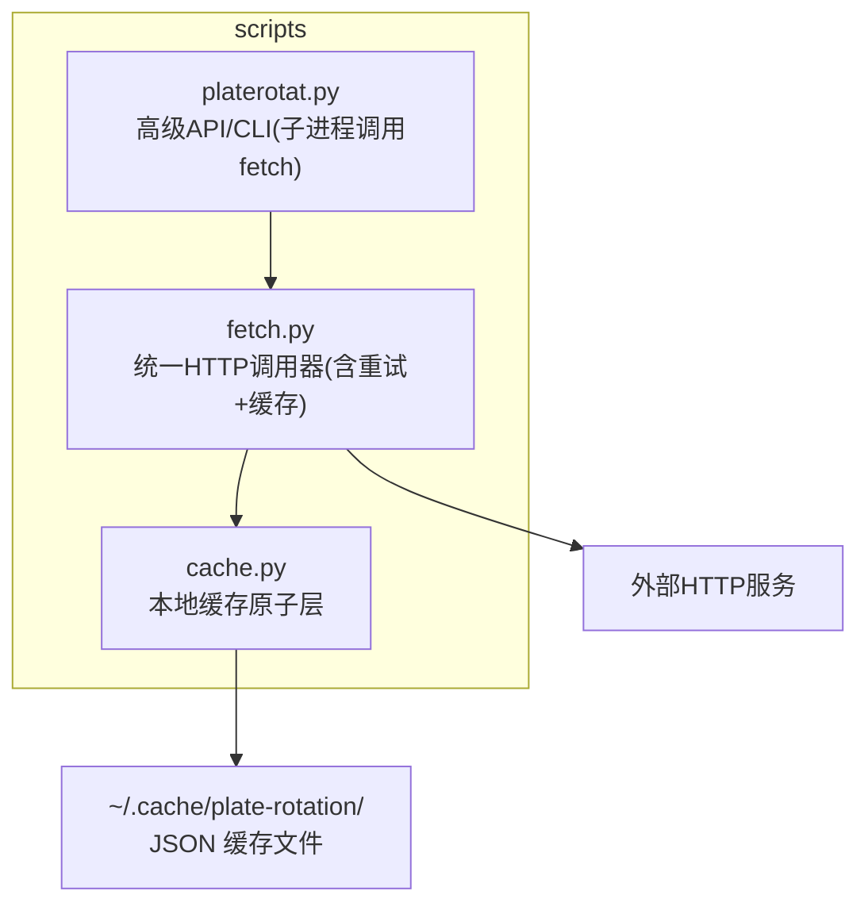
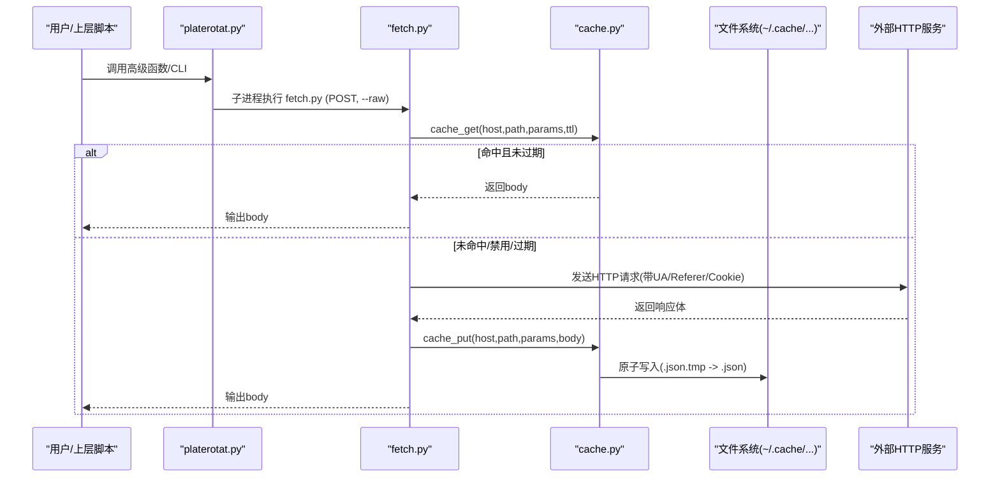
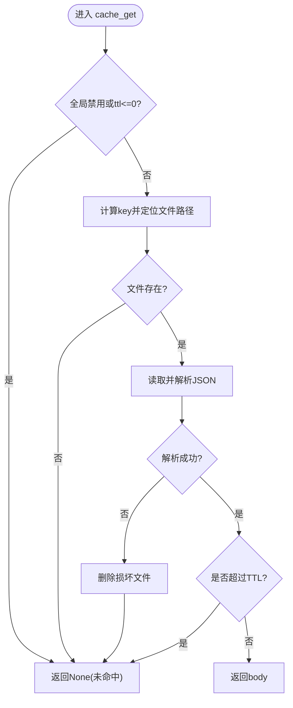
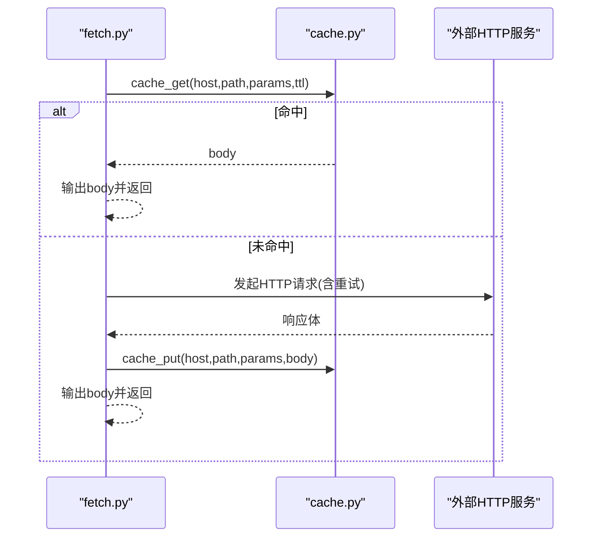
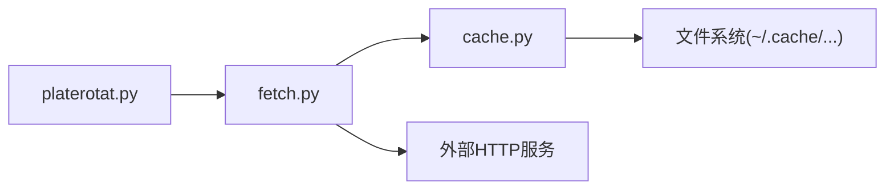

# 缓存管理工具

<cite>
**本文引用的文件**   
- [cache.py](file://skills/plate-rotation-skill/scripts/cache.py)
- [fetch.py](file://skills/plate-rotation-skill/scripts/fetch.py)
- [platerotat.py](file://skills/plate-rotation-skill/scripts/platerotat.py)
- [README.md](file://skills/plate-rotation-skill/README.md)
</cite>

## 目录
1. [简介](#简介)
2. [项目结构](#项目结构)
3. [核心组件](#核心组件)
4. [架构总览](#架构总览)
5. [详细组件分析](#详细组件分析)
6. [依赖关系分析](#依赖关系分析)
7. [性能与优化](#性能与优化)
8. [故障排查指南](#故障排查指南)
9. [结论](#结论)
10. [附录：命令与最佳实践](#附录命令与最佳实践)

## 简介
本文件面向“板块轮动”脚本中的本地缓存子系统，聚焦 cache.py 提供的缓存能力、stats/clear 命令用法、目录结构与数据一致性保证，并给出监控与调优建议以及在自动化脚本中的集成方式。该缓存层用于对 POST 请求进行节流与落盘，默认 TTL 为 1 小时，支持全局关闭与按次覆盖 TTL，确保在高频调用场景下显著降低网络开销并提升稳定性。

## 项目结构
缓存相关代码位于 scripts 目录下，采用“原子层 + 调用层 + 高层封装”的分层组织：
- cache.py：纯标准库实现的本地 JSON 缓存原子层（读写、统计、清理）
- fetch.py：统一 HTTP 调用器，内置重试与缓存命中/回写逻辑
- platerotat.py：高级 API 与 CLI，通过 subprocess 调用 fetch.py，间接使用缓存

图表来源
- [cache.py:1-145](file://skills/plate-rotation-skill/scripts/cache.py#L1-L145)
- [fetch.py:1-230](file://skills/plate-rotation-skill/scripts/fetch.py#L1-L230)
- [platerotat.py:1-200](file://skills/plate-rotation-skill/scripts/platerotat.py#L1-L200)

章节来源
- [README.md:1-188](file://skills/plate-rotation-skill/README.md#L1-L188)

## 核心组件
- 缓存原子层（cache.py）
  - 提供对外接口：cache_get / cache_put / cache_clear / cache_stats / cache_disabled
  - Key 生成：基于 host + path + 排序后的参数拼接，SHA1 哈希
  - 存储格式：JSON，包含时间戳、host、path、params、body
  - 原子写入：先写 .json.tmp，再 os.replace 原子替换，避免半写文件
  - 过期策略：读取时比较当前时间与 ts，超过 TTL 视为未命中
  - 全局开关：PR_CACHE_DISABLE=1 或 true/yes 时禁用
  - 可配置项：PR_CACHE_DIR（根目录）、PR_CACHE_TTL（默认秒数）

- 调用层（fetch.py）
  - 仅对 POST 请求启用缓存；GET 不缓存
  - 支持 --no-cache 与 --cache-ttl 覆盖本次行为
  - 命中则直接输出 body；未命中则发起网络请求，成功后写入缓存
  - 内置指数退避重试（429/5xx/网络异常），失败打印错误并退出码非零

- 高层封装（platerotat.py）
  - 通过 subprocess 调用 fetch.py，并以 --raw 获取原始 JSON 字符串后解析
  - 上层业务无需感知缓存细节，由 fetch.py 透明处理

章节来源
- [cache.py:1-145](file://skills/plate-rotation-skill/scripts/cache.py#L1-L145)
- [fetch.py:1-230](file://skills/plate-rotation-skill/scripts/fetch.py#L1-L230)
- [platerotat.py:1-200](file://skills/plate-rotation-skill/scripts/platerotat.py#L1-L200)

## 架构总览
下图展示了从高层 CLI 到缓存落盘的完整流程，包括缓存命中分支与网络请求分支。

图表来源
- [fetch.py:128-213](file://skills/plate-rotation-skill/scripts/fetch.py#L128-L213)
- [cache.py:59-94](file://skills/plate-rotation-skill/scripts/cache.py#L59-L94)

## 详细组件分析

### 缓存原子层（cache.py）
- 关键设计点
  - 稳定 Key：参数键排序后拼接，避免顺序差异导致 key 不同
  - 目录分片：key[:2] 作为二级目录，避免单目录文件过多
  - 原子性：临时文件 + os.replace 保证并发安全
  - 健壮性：损坏 JSON 自动删除并 miss；TTL 过期保留文件以便下次覆盖
  - 诊断：cache_stats 返回 count、total_bytes、root

- 环境变量
  - PR_CACHE_DIR：缓存根目录，默认 ~/.cache/plate-rotation
  - PR_CACHE_TTL：默认 TTL（秒），默认 3600
  - PR_CACHE_DISABLE：全局禁用开关（1/true/yes）

- 命令行自检
  - python3 cache.py stats：输出 JSON 格式的统计信息
  - python3 cache.py clear [--older SEC]：清理缓存，可选只清理超过 N 秒的条目

图表来源
- [cache.py:59-76](file://skills/plate-rotation-skill/scripts/cache.py#L59-L76)

章节来源
- [cache.py:1-145](file://skills/plate-rotation-skill/scripts/cache.py#L1-L145)

### 调用层（fetch.py）
- 缓存策略
  - 仅 POST 请求启用缓存；GET 不走缓存
  - 可通过 --no-cache 禁用本次缓存；--cache-ttl 调整本次 TTL
  - 命中时直接输出 body，跳过网络请求

- 网络与重试
  - 指数退避重试：针对 429/5xx 及网络异常，最多 3 次，间隔 1s/2s/4s
  - 非重试状态码直接抛出错误并退出

- 输出
  - 默认尝试美化 JSON；失败则原样输出

图表来源
- [fetch.py:159-213](file://skills/plate-rotation-skill/scripts/fetch.py#L159-L213)
- [cache.py:79-94](file://skills/plate-rotation-skill/scripts/cache.py#L79-L94)

章节来源
- [fetch.py:1-230](file://skills/plate-rotation-skill/scripts/fetch.py#L1-L230)

### 高层封装（platerotat.py）
- 通过 subprocess 调用 fetch.py，并使用 --raw 获取原始 JSON 文本后再解析
- 上层业务无需关心缓存实现细节，由 fetch.py 透明处理

章节来源
- [platerotat.py:1-200](file://skills/plate-rotation-skill/scripts/platerotat.py#L1-L200)

## 依赖关系分析
- 模块耦合
  - fetch.py 依赖 cache.py 的缓存接口
  - platerotat.py 依赖 fetch.py 的 CLI 入口（子进程）
- 外部依赖
  - 无第三方依赖，仅使用 Python 标准库
- 潜在循环依赖
  - 无循环依赖，分层清晰

图表来源
- [platerotat.py:55-71](file://skills/plate-rotation-skill/scripts/platerotat.py#L55-L71)
- [fetch.py:31-36](file://skills/plate-rotation-skill/scripts/fetch.py#L31-L36)
- [cache.py:28-37](file://skills/plate-rotation-skill/scripts/cache.py#L28-L37)

章节来源
- [platerotat.py:1-200](file://skills/plate-rotation-skill/scripts/platerotat.py#L1-L200)
- [fetch.py:1-230](file://skills/plate-rotation-skill/scripts/fetch.py#L1-L230)
- [cache.py:1-145](file://skills/plate-rotation-skill/scripts/cache.py#L1-L145)

## 性能与优化
- 命中率与 TTL
  - 默认 TTL 1 小时适合盘中“今日”与历史 N 日数据的复用，减少重复请求
  - 需要强刷新时可传 ttl=0 或设置 PR_CACHE_DISABLE=1
- 磁盘 I/O 与原子写
  - 原子写入避免并发竞争导致的半写文件
  - 二级目录分片降低单目录文件数量，提高遍历效率
- 网络重试
  - 指数退避有效缓解瞬时拥塞与限流
- 监控指标
  - 使用 cache.py stats 查看条目数量与总大小，结合系统 IO 监控评估缓存收益
- 调优建议
  - 根据业务频率调整 PR_CACHE_TTL（如高频接口可适当延长）
  - 定期清理旧缓存（cron 或定时任务），避免磁盘膨胀
  - 在 CI/测试环境设置 PR_CACHE_DISABLE=1 以强制走真实网络

[本节为通用指导，不直接分析具体文件]

## 故障排查指南
- 常见问题
  - 缓存未生效：检查是否 GET 请求（不会缓存）、是否 --no-cache、是否 PR_CACHE_DISABLE=1
  - 缓存过期：确认 TTL 设置与业务新鲜度要求是否匹配
  - 文件损坏：cache_get 会自动删除损坏文件并 miss，可再次触发 put 重建
  - 权限问题：确保缓存目录可写（默认 ~/.cache/plate-rotation）
- 诊断步骤
  - 运行 cache.py stats 查看 count 与 total_bytes
  - 使用 --verbose 观察 fetch.py 的 URL、body 与重试日志
  - 检查 PR_CACHE_DIR 指向的目录是否存在与内容是否符合预期

章节来源
- [cache.py:59-94](file://skills/plate-rotation-skill/scripts/cache.py#L59-L94)
- [fetch.py:128-213](file://skills/plate-rotation-skill/scripts/fetch.py#L128-L213)

## 结论
该缓存子系统以极简设计与纯标准库实现，提供了高内聚、低耦合的本地缓存能力。配合 fetch.py 的重试与输出格式化，以及 platerotat.py 的高级封装，整体形成一套稳定、易用的数据访问链路。通过合理的 TTL 与清理策略，可在保障数据新鲜度的同时显著提升性能与鲁棒性。

[本节为总结性内容，不直接分析具体文件]

## 附录：命令与最佳实践

### stats 命令：查看缓存统计信息
- 用途：快速了解缓存规模与占用空间
- 用法：python3 scripts/cache.py stats
- 输出字段说明
  - count：缓存条目数量
  - total_bytes：所有缓存文件总字节数
  - root：缓存根目录路径
- 典型场景
  - 日常巡检：确认缓存增长趋势
  - 容量规划：结合 total_bytes 评估磁盘占用

章节来源
- [cache.py:119-128](file://skills/plate-rotation-skill/scripts/cache.py#L119-L128)
- [cache.py:132-136](file://skills/plate-rotation-skill/scripts/cache.py#L132-L136)

### clear 命令：清理缓存
- 用途：释放磁盘空间或强制刷新热点数据
- 用法
  - 清理全部：python3 scripts/cache.py clear
  - 仅清理超过 N 秒的条目：python3 scripts/cache.py clear --older 86400
- 返回值：删除的文件数量
- 安全考虑
  - 建议在业务低峰期执行
  - 若需立即生效，可配合 --no-cache 或 PR_CACHE_DISABLE=1 进行强刷
  - 清理前可先用 stats 确认影响范围

章节来源
- [cache.py:98-116](file://skills/plate-rotation-skill/scripts/cache.py#L98-L116)
- [cache.py:137-142](file://skills/plate-rotation-skill/scripts/cache.py#L137-L142)

### 缓存目录结构与文件组织
- 根目录：PR_CACHE_DIR（默认 ~/.cache/plate-rotation）
- 二级目录：key[:2]，用于分散文件
- 文件名：{key}.json
- 文件内容：包含 ts、host、path、params、body 等元数据与原始响应体
- 优点
  - 二级分片降低单目录文件数量
  - 元数据便于审计与调试

章节来源
- [cache.py:35-37](file://skills/plate-rotation-skill/scripts/cache.py#L35-L37)
- [cache.py:47-55](file://skills/plate-rotation-skill/scripts/cache.py#L47-L55)
- [cache.py:85-94](file://skills/plate-rotation-skill/scripts/cache.py#L85-L94)

### 缓存失效策略与数据一致性
- 失效策略
  - TTL 控制：读取时比较 ts 与当前时间，超过 TTL 即视为未命中
  - 全局禁用：PR_CACHE_DISABLE=1 时完全绕过缓存
  - 按次覆盖：--cache-ttl 可针对单次请求调整 TTL
- 一致性保证
  - 原子写入：.json.tmp + os.replace 避免并发写导致的不一致
  - 损坏自愈：解析失败自动删除损坏文件，下次 put 重建
  - 幂等 Key：参数排序后拼接，避免顺序差异导致 key 不一致

章节来源
- [cache.py:59-76](file://skills/plate-rotation-skill/scripts/cache.py#L59-L76)
- [cache.py:79-94](file://skills/plate-rotation-skill/scripts/cache.py#L79-L94)
- [cache.py:47-51](file://skills/plate-rotation-skill/scripts/cache.py#L47-L51)

### 在自动化脚本中集成缓存管理
- 推荐做法
  - 使用 cache.py stats 定期采集指标并上报监控系统
  - 使用 cron 定时执行 cache.py clear --older 86400 清理旧缓存
  - 在 CI/测试环境中设置 PR_CACHE_DISABLE=1 以强制真实网络调用
  - 在生产环境按需调整 PR_CACHE_TTL 与 PR_CACHE_DIR
- 示例思路
  - 每日凌晨执行一次全量清理
  - 每小时采集一次 stats 并记录到日志或时序数据库
  - 当 total_bytes 超过阈值时告警并触发清理

[本节为通用指导，不直接分析具体文件]