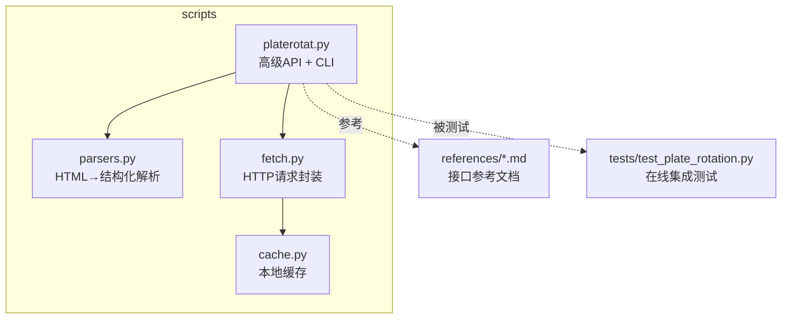
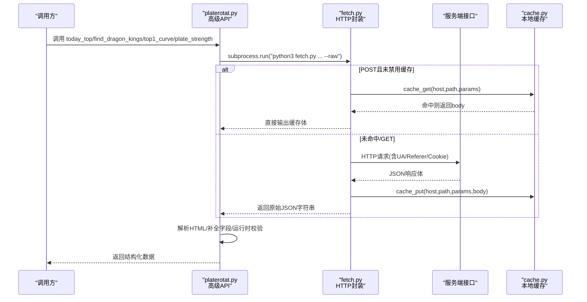
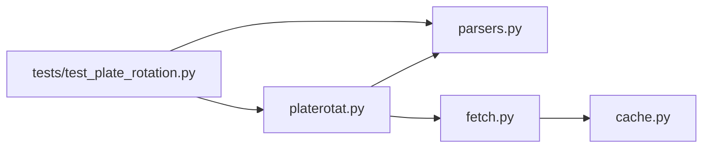

# Python API参考手册

<cite>
**本文引用的文件**   
- [fetch.py](file://skills/plate-rotation-skill/scripts/fetch.py)
- [parsers.py](file://skills/plate-rotation-skill/scripts/parsers.py)
- [platerotat.py](file://skills/plate-rotation-skill/scripts/platerotat.py)
- [cache.py](file://skills/plate-rotation-skill/scripts/cache.py)
- [api_getplaterotatdata.md](file://skills/plate-rotation-skill/references/api_getplaterotatdata.md)
- [api_getlongbyplate.md](file://skills/plate-rotation-skill/references/api_getlongbyplate.md)
- [api_getplaterotatchart.md](file://skills/plate-rotation-skill/references/api_getplaterotatchart.md)
- [api_getplatedaychart.md](file://skills/plate-rotation-skill/references/api_getplatedaychart.md)
- [test_plate_rotation.py](file://skills/plate-rotation-skill/tests/test_plate_rotation.py)
</cite>

## 目录
1. [简介](#简介)
2. [项目结构](#项目结构)
3. [核心组件](#核心组件)
4. [架构总览](#架构总览)
5. [详细组件分析](#详细组件分析)
6. [依赖关系分析](#依赖关系分析)
7. [性能与并发建议](#性能与并发建议)
8. [错误处理与异常指南](#错误处理与异常指南)
9. [结论](#结论)
10. [附录：API规范与数据模型](#附录api规范与数据模型)

## 简介
本手册面向使用“板块轮动”Python API的开发者，提供四个高级helper函数的完整调用规范、参数定义、返回值结构与数据类型说明；并详解底层网络接口 fetch.py 的使用方法（getPlateRotatData、getLongByPlate、getPlateRotatChart、getPlateDayChart），以及数据模型字段定义、错误处理策略、性能优化与并发注意事项。文档内容严格基于仓库源码与测试用例整理，确保可追溯与可验证。

## 项目结构
该技能包位于 skills/plate-rotation-skill 下，核心脚本集中在 scripts/ 目录：
- platerotat.py：对外暴露 today_top、find_dragon_kings、top1_curve、plate_strength 四个高级函数，并提供CLI入口
- parsers.py：解析后端返回的HTML片段（嵌在JSON中）为结构化数据
- fetch.py：统一HTTP请求封装，支持重试、缓存、Cookie注入、多host别名
- cache.py：本地磁盘缓存层，按参数组合生成稳定key，TTL控制新鲜度

图表来源
- [platerotat.py:1-315](file://skills/plate-rotation-skill/scripts/platerotat.py#L1-L315)
- [parsers.py:1-212](file://skills/plate-rotation-skill/scripts/parsers.py#L1-L212)
- [fetch.py:1-230](file://skills/plate-rotation-skill/scripts/fetch.py#L1-L230)
- [cache.py:1-145](file://skills/plate-rotation-skill/scripts/cache.py#L1-L145)

章节来源
- [platerotat.py:1-315](file://skills/plate-rotation-skill/scripts/platerotat.py#L1-L315)
- [README.md](file://skills/plate-rotation-skill/README.md)

## 核心组件
- 高级API（platerotat.py）
  - today_top(source, n, days) → list[dict]
  - find_dragon_kings(platecode, days, top_n) → dict
  - top1_curve(source, days) → dict
  - plate_strength(platecode, days) → dict
- 解析器（parsers.py）
  - parse_plate_rotat(data, source) → list[dict]
  - parse_plate_rotat_matrix(data, dates) → list[dict]
  - parse_plate_rotat_dates(data) → list[str]
  - parse_plate_long_heads(data, dates) → list[dict]
  - rank_plate_long_persistence(data, dates, top_n) → list[dict]
- 网络层（fetch.py）
  - 统一POST/GET请求、指数退避重试、Cookie注入、缓存命中/落盘
- 缓存层（cache.py）
  - 基于参数哈希的稳定key、TTL过期、原子写入、统计与清理

章节来源
- [platerotat.py:100-218](file://skills/plate-rotation-skill/scripts/platerotat.py#L100-L218)
- [parsers.py:18-175](file://skills/plate-rotation-skill/scripts/parsers.py#L18-L175)
- [fetch.py:91-213](file://skills/plate-rotation-skill/scripts/fetch.py#L91-L213)
- [cache.py:40-128](file://skills/plate-rotation-skill/scripts/cache.py#L40-L128)

## 架构总览
整体流程：上层调用高级API → 内部通过 _call 子进程调用 fetch.py → fetch.py 执行带重试与缓存的HTTP请求 → 返回原始JSON文本 → platerotat.py 解析或透传 → 返回结构化结果。

图表来源
- [platerotat.py:55-71](file://skills/plate-rotation-skill/scripts/platerotat.py#L55-L71)
- [fetch.py:128-213](file://skills/plate-rotation-skill/scripts/fetch.py#L128-L213)
- [cache.py:59-94](file://skills/plate-rotation-skill/scripts/cache.py#L59-L94)

## 详细组件分析

### 高级API：today_top()
- 功能：获取今日Top N板块（同花顺涨幅%或开盘啦强度分）
- 参数
  - source: Literal["ths","kaipan"]，默认"kaipan"
  - n: int，返回前几名，默认10
  - days: int，回溯天数，默认20
- 返回值
  - list[dict]，每项包含：rank(int), code(str), name(str), value(str), value_type("pct"|"score"), color("red"|"green")
- 行为与校验
  - 当source="ths"时value形如"4.94%"，value_type="pct"
  - 当source="kaipan"时value为纯数字，value_type="score"
  - 空结果时在stderr输出PR-EMPTY提示，便于下游识别节假日/跨源错传等场景
- 调用示例路径
  - import形式：参见 [platerotat.py:102-120](file://skills/plate-rotation-skill/scripts/platerotat.py#L102-L120)
  - CLI形式：参见 [platerotat.py:227-237](file://skills/plate-rotation-skill/scripts/platerotat.py#L227-L237)
- 最佳实践
  - 优先用kaipan看持续性，ths看当日爆发；双源对比需分别排序，不可混比数值大小
  - 若n较大但实际上榜不足，返回列表长度可能小于n

章节来源
- [platerotat.py:102-120](file://skills/plate-rotation-skill/scripts/platerotat.py#L102-L120)
- [parsers.py:20-65](file://skills/plate-rotation-skill/scripts/parsers.py#L20-L65)
- [test_plate_rotation.py:250-271](file://skills/plate-rotation-skill/tests/test_plate_rotation.py#L250-L271)

### 高级API：find_dragon_kings()
- 功能：某板块过去N天里，哪些股票最常当龙头（妖王榜）
- 参数
  - platecode: str，板块代码（88x=同花顺，80x/803x=开盘啦）
  - days: int，回溯天数，默认20
  - top_n: int，返回前几名，默认10
- 返回值
  - dict，包含：
    - platecode: str
    - source: str（自动推断ths/kaipan）
    - days: int
    - dates: list[str]（YYYY-MM-DD，newest first）
    - kings: list[dict]，每项包含code,str; name,str; count,int; positions:list[str]（格式"YYYY-MM-DD/龙X"）
    - daily_heads: list[dict]，每项包含date,str; heads:list[dict]（rank∈{"龙一".."龙五"}, code,str; name,str）
- 行为与校验
  - 根据platecode前缀自动选择source：88x→ths，其余→kaipan
  - 若dates为空或全部daily_heads无领涨，输出PR-EMPTY提示
- 调用示例路径
  - import形式：参见 [platerotat.py:125-172](file://skills/plate-rotation-skill/scripts/platerotat.py#L125-L172)
  - CLI形式：参见 [platerotat.py:239-249](file://skills/plate-rotation-skill/scripts/platerotat.py#L239-L249)
- 最佳实践
  - 使用parse_plate_rotat_dates对齐日期序列
  - 关注count与positions，用于识别“真核心/妖王”

章节来源
- [platerotat.py:125-172](file://skills/plate-rotation-skill/scripts/platerotat.py#L125-L172)
- [parsers.py:113-175](file://skills/plate-rotation-skill/scripts/parsers.py#L113-L175)
- [test_plate_rotation.py:272-327](file://skills/plate-rotation-skill/tests/test_plate_rotation.py#L272-L327)

### 高级API：top1_curve()
- 功能：Top5板块N日排名变化曲线（ECharts数据）
- 参数
  - source: Literal["ths","kaipan"]，默认"kaipan"
  - days: int，回溯天数，默认20
- 返回值
  - dict，原JSON透传，并新增top5_names: list[str]（按序号1..5提取name字典）
  - 典型字段：date(list), legend(list), name(dict), 1..5(series列表)
  - series点结构：{value: 排名或10.5(未上榜), symbol: 图片路径}
- 行为与校验
  - 若缺name字段，输出PR-EMPTY提示
- 调用示例路径
  - import形式：参见 [platerotat.py:177-196](file://skills/plate-rotation-skill/scripts/platerotat.py#L177-L196)
  - CLI形式：参见 [platerotat.py:251-262](file://skills/plate-rotation-skill/scripts/platerotat.py#L251-L262)
- 最佳实践
  - 使用top5_names简化渲染图例
  - value=10.5表示当日未上榜，symbol指向wu.png

章节来源
- [platerotat.py:177-196](file://skills/plate-rotation-skill/scripts/platerotat.py#L177-L196)
- [api_getplaterotatchart.md:1-53](file://skills/plate-rotation-skill/references/api_getplaterotatchart.md#L1-L53)
- [test_plate_rotation.py:283-294](file://skills/plate-rotation-skill/tests/test_plate_rotation.py#L283-L294)

### 高级API：plate_strength()
- 功能：单板块N日强度+量能时序（ECharts数据）
- 参数
  - platecode: str，板块代码
  - days: int，回溯天数，默认20
- 返回值
  - dict，原JSON透传，包含legend(可为null)、date(list)及若干series键
- 行为与校验
  - 若date为空，输出PR-EMPTY提示（板块无效或上游异常）
  - 若legend=null，输出PR-WARN提示（近days天均未活跃）
- 调用示例路径
  - import形式：参见 [platerotat.py:201-218](file://skills/plate-rotation-skill/scripts/platerotat.py#L201-L218)
  - CLI形式：参见 [platerotat.py:265-276](file://skills/plate-rotation-skill/scripts/platerotat.py#L265-L276)
- 最佳实践
  - 前端对legend=null不渲染，避免展示空白图

章节来源
- [platerotat.py:201-218](file://skills/plate-rotation-skill/scripts/platerotat.py#L201-L218)
- [api_getplatedaychart.md:1-48](file://skills/plate-rotation-skill/references/api_getplatedaychart.md#L1-L48)
- [test_plate_rotation.py:295-302](file://skills/plate-rotation-skill/tests/test_plate_rotation.py#L295-L302)

### 底层接口：fetch.py使用方法
- 统一调用姿势
  - 简单kv参数：fetch.py main /api/getPlateRotatData from=ths days=20
  - 复杂参数走JSON：fetch.py main /api/getLongByPlate -p '{"platecode":"886084","days":20}'
  - 探测/自检URL：fetch.py main /api/getPlateRotatData from=ths days=20 -v
- 关键特性
  - host别名：main/data/x/ext；ext可直接传完整URL
  - Cookie读取：环境变量PR_COOKIE优先，其次~/.plate_rotation_cookie
  - 重试策略：429/5xx/网络异常指数退避，最多3次，间隔1s/2s/4s
  - 缓存：POST默认启用，TTL默认1小时，可通过--no-cache或PR_CACHE_DISABLE=1关闭
- 核心方法
  - do_request(req, timeout, max_retries, verbose) → 返回解码后的response body
  - build_url(host_alias, path) → 拼接最终URL
  - load_cookie(host) → 读取cookie
- 调用示例路径
  - 命令行用法与参数：参见 [fetch.py:128-143](file://skills/plate-rotation-skill/scripts/fetch.py#L128-L143)
  - 请求执行与重试：参见 [fetch.py:91-124](file://skills/plate-rotation-skill/scripts/fetch.py#L91-L124)
  - 缓存读写：参见 [fetch.py:159-212](file://skills/plate-rotation-skill/scripts/fetch.py#L159-L212)

章节来源
- [fetch.py:1-230](file://skills/plate-rotation-skill/scripts/fetch.py#L1-230)
- [cache.py:1-145](file://skills/plate-rotation-skill/scripts/cache.py#L1-L145)

### 数据模型与字段定义
- 板块数据（来自getPlateRotatData）
  - 顶层字段：first(str, Top1板块代码), html(str, HTML片段)
  - 解析后行项：rank(int), code(str), name(str), value(str), value_type("pct"|"score"), color("red"|"green")
  - 日期列：parse_plate_rotat_dates返回YYYY-MM-DD列表，newest first
- 龙头股数据（来自getLongByPlate）
  - 顶层字段：html(str, HTML片段)
  - 每日头部：date(str), heads(list[{rank, code, name}])
  - 跨天频次：kings(list[{code, name, count, positions}])
- 图表数据（来自getPlateRotatChart / getPlateDayChart）
  - getPlateRotatChart：date(list), legend(list), name(dict), 1..5(series)，series点{value,symbol}
  - getPlateDayChart：legend(null|list), date(list)，其他series键按需读取

章节来源
- [api_getplaterotatdata.md:1-74](file://skills/plate-rotation-skill/references/api_getplaterotatdata.md#L1-L74)
- [api_getlongbyplate.md:1-65](file://skills/plate-rotation-skill/references/api_getlongbyplate.md#L1-L65)
- [api_getplaterotatchart.md:1-53](file://skills/plate-rotation-skill/references/api_getplaterotatchart.md#L1-L53)
- [api_getplatedaychart.md:1-48](file://skills/plate-rotation-skill/references/api_getplatedaychart.md#L1-L48)
- [parsers.py:20-175](file://skills/plate-rotation-skill/scripts/parsers.py#L20-L175)

## 依赖关系分析
- 模块耦合
  - platerotat.py 依赖 parsers.py 与 fetch.py
  - fetch.py 依赖 cache.py
  - tests/test_plate_rotation.py 同时导入 parsers 与 platerotat，覆盖端到端路径
- 外部依赖
  - 仅标准库；网络目标由HOSTS映射到具体域名
- 潜在循环
  - 无循环依赖；分层清晰

图表来源
- [platerotat.py:1-315](file://skills/plate-rotation-skill/scripts/platerotat.py#L1-L315)
- [parsers.py:1-212](file://skills/plate-rotation-skill/scripts/parsers.py#L1-L212)
- [fetch.py:1-230](file://skills/plate-rotation-skill/scripts/fetch.py#L1-L230)
- [cache.py:1-145](file://skills/plate-rotation-skill/scripts/cache.py#L1-L145)
- [test_plate_rotation.py:1-444](file://skills/plate-rotation-skill/tests/test_plate_rotation.py#L1-L444)

章节来源
- [test_plate_rotation.py:1-444](file://skills/plate-rotation-skill/tests/test_plate_rotation.py#L1-L444)

## 性能与并发建议
- 缓存利用
  - POST请求默认启用缓存，TTL默认1小时；可通过--no-cache或PR_CACHE_DISABLE=1关闭
  - 调整TTL：--cache-ttl SEC或PR_CACHE_TTL环境变量
- 重试与超时
  - 指数退避最大3次，基础间隔1s；可通过--max-retries与--timeout调整
- 并发调用注意
  - 当前实现以subprocess方式串行调用fetch.py；如需并发，请在应用层并行发起多个子进程，但需注意：
    - 共享缓存目录的原子写已保证一致性
    - 高并发可能触发服务端限流（429），建议加背压与退避
- 减少重复请求
  - 相同host/path/params组合会命中缓存；建议复用days与from参数，避免频繁刷新
- 日志与诊断
  - 使用-v开启verbose，观察URL/body/cookie与重试信息
  - 使用cache.py stats/clear进行缓存统计与清理

章节来源
- [fetch.py:128-213](file://skills/plate-rotation-skill/scripts/fetch.py#L128-L213)
- [cache.py:35-94](file://skills/plate-rotation-skill/scripts/cache.py#L35-L94)

## 错误处理与异常指南
- 网络层异常
  - 非重试状态码（多数4xx）直接抛出RuntimeError并退出
  - 429/5xx/网络异常触发指数退避，超过次数后抛出RuntimeError
- 高级API警告
  - PR-EMPTY：空数据或关键字段缺失（如周末、节假日、跨源错传、上游异常）
  - PR-WARN：业务层面异常（如legend=null表示板块未活跃）
- 常见排查
  - 检查source与platecode前缀是否匹配（88x→ths，80x/803x→kaipan）
  - 确认days合理（不要超前于交易日）
  - 查看stderr中的PR-EMPTY/PR-WARN提示定位原因

章节来源
- [platerotat.py:75-98](file://skills/plate-rotation-skill/scripts/platerotat.py#L75-L98)
- [fetch.py:91-124](file://skills/plate-rotation-skill/scripts/fetch.py#L91-L124)

## 结论
本API将复杂的HTML-in-JSON响应抽象为简洁的结构化数据，并通过四个高级函数覆盖“今日最强、龙头持续性、Top5排名曲线、单板块强度时序”四大核心需求。配合内置缓存与重试机制，既保证了稳定性，也提升了调用效率。建议在应用中结合双源交叉验证与运行时校验提示，构建稳健的板块轮动分析流程。

## 附录：API规范与数据模型

### 高级函数API规范速查
- today_top(source="kaipan", n=10, days=20) → list[dict]
  - 字段：rank, code, name, value, value_type, color
- find_dragon_kings(platecode, days=20, top_n=10) → dict
  - 字段：platecode, source, days, dates, kings, daily_heads
- top1_curve(source="kaipan", days=20) → dict
  - 字段：date, legend, name, 1..5(series), top5_names
- plate_strength(platecode, days=20) → dict
  - 字段：legend, date, 若干series键

章节来源
- [platerotat.py:102-218](file://skills/plate-rotation-skill/scripts/platerotat.py#L102-L218)

### 底层接口调用要点
- getPlateRotatData
  - 入参：from(ths|kaipan), days(10|20|30|50), dates(可选)
  - 出参：first, html
- getLongByPlate
  - 入参：platecode, days, dates(可选)
  - 出参：html
- getPlateRotatChart
  - 入参：from, days, dates(可选)
  - 出参：date, legend, name, 1..5(series)
- getPlateDayChart
  - 入参：platecode, days, dates(可选)
  - 出参：legend(null|list), date, 若干series键

章节来源
- [api_getplaterotatdata.md:1-74](file://skills/plate-rotation-skill/references/api_getplaterotatdata.md#L1-L74)
- [api_getlongbyplate.md:1-65](file://skills/plate-rotation-skill/references/api_getlongbyplate.md#L1-L65)
- [api_getplaterotatchart.md:1-53](file://skills/plate-rotation-skill/references/api_getplaterotatchart.md#L1-L53)
- [api_getplatedaychart.md:1-48](file://skills/plate-rotation-skill/references/api_getplatedaychart.md#L1-L48)