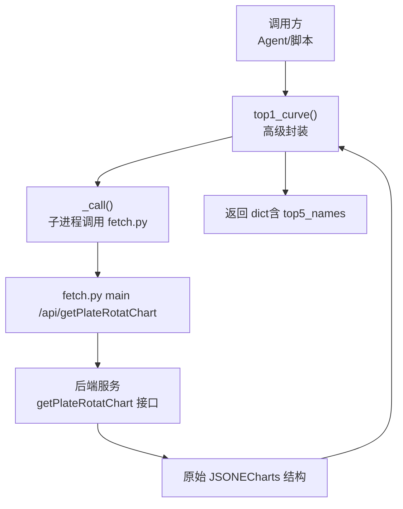
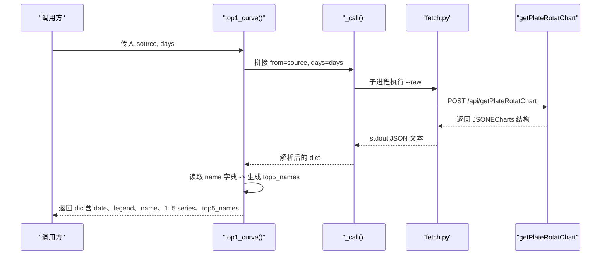
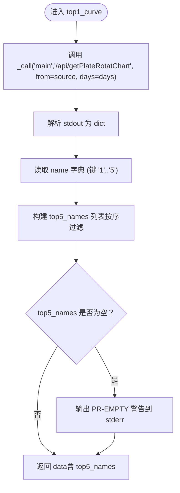
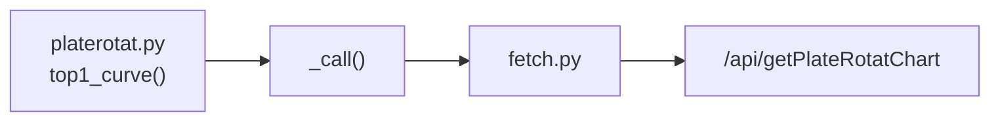

# Top5板块曲线API

<cite>
**本文引用的文件**
- [platerotat.py](file://skills/plate-rotation-skill/scripts/platerotat.py)
- [api_getplaterotatchart.md](file://skills/plate-rotation-skill/references/api_getplaterotatchart.md)
- [test_plate_rotation.py](file://skills/plate-rotation-skill/tests/test_plate_rotation.py)
- [stock-facts.md](file://skills/plate-rotation-skill/references/stock-facts.md)
</cite>

## 目录
1. [简介](#简介)
2. [项目结构](#项目结构)
3. [核心组件](#核心组件)
4. [架构总览](#架构总览)
5. [详细组件分析](#详细组件分析)
6. [依赖关系分析](#依赖关系分析)
7. [性能与可用性](#性能与可用性)
8. [故障排查指南](#故障排查指南)
9. [结论](#结论)
10. [附录：ECharts集成示例](#附录echarts集成示例)

## 简介
top1_curve() 函数用于获取“Top5 板块 N 日排名变化曲线”的 ECharts 数据。该函数底层调用 /api/getPlateRotatChart 接口，返回标准 ECharts 数据结构，并在上层补入 top5_names 便利字段，便于前端或下游系统直接使用。

## 项目结构
本 API 位于 plate-rotation skill 的高级封装层，负责组合底层接口并输出可直接渲染的图表数据。

图示来源
- [platerotat.py:174-196](file://skills/plate-rotation-skill/scripts/platerotat.py#L174-L196)
- [api_getplaterotatchart.md:1-53](file://skills/plate-rotation-skill/references/api_getplaterotatchart.md#L1-L53)

章节来源
- [platerotat.py:174-196](file://skills/plate-rotation-skill/scripts/platerotat.py#L174-L196)
- [api_getplaterotatchart.md:1-53](file://skills/plate-rotation-skill/references/api_getplaterotatchart.md#L1-L53)

## 核心组件
- 函数签名与职责
  - 名称：top1_curve
  - 作用：获取 Top5 板块 N 日排名变化曲线（ECharts 数据），并补充 top5_names 字段
  - 参数：
    - source: 数据来源，取值为 "ths"（同花顺）或 "kaipan"（开盘啦）
    - days: 回溯天数，支持 10 | 20 | 30 | 50
  - 返回值：dict，包含 ECharts 所需字段以及新增的 top5_names 列表

- 关键行为
  - 通过 _call("main", "/api/getPlateRotatChart", f"from={source}", f"days={days}") 拉取原始 JSON
  - 从 name 字典（键为 "1".."5"）提取有序板块名列表，写入 data["top5_names"]
  - 若缺失 name 字段，输出 PR-EMPTY 警告到 stderr，提示可能的空数据原因

章节来源
- [platerotat.py:174-196](file://skills/plate-rotation-skill/scripts/platerotat.py#L174-L196)
- [api_getplaterotatchart.md:22-38](file://skills/plate-rotation-skill/references/api_getplaterotatchart.md#L22-L38)

## 架构总览
下图展示 top1_curve() 的端到端调用流程与数据流向。

图示来源
- [platerotat.py:55-71](file://skills/plate-rotation-skill/scripts/platerotat.py#L55-L71)
- [platerotat.py:174-196](file://skills/plate-rotation-skill/scripts/platerotat.py#L174-L196)
- [api_getplaterotatchart.md:1-20](file://skills/plate-rotation-skill/references/api_getplaterotatchart.md#L1-L20)

## 详细组件分析

### 函数定义与参数说明
- 参数
  - source: 字符串，取值 "ths" 或 "kaipan"，决定板块数据来源
  - days: 整数，取值 10 | 20 | 30 | 50，影响回溯长度
- 返回值
  - dict，包含以下关键字段：
    - date: 日期序列（MM-DD，按最近到最早排列）
    - legend: 板块名称列表（Top5 名称，括号内为过去 N 日上榜次数）
    - name: 对象，键为 "1".."5"，值为对应板块名称
    - "1".."5": 各为 Top5 中第 i 名的 N 日排名序列，元素为 {value, symbol}
    - top5_names: 新增便利字段，按顺序列出 Top5 板块名称（仅包含存在的项）

章节来源
- [platerotat.py:174-196](file://skills/plate-rotation-skill/scripts/platerotat.py#L174-L196)
- [api_getplaterotatchart.md:30-52](file://skills/plate-rotation-skill/references/api_getplaterotatchart.md#L30-L52)

### 返回值 ECharts 数据结构详解
- date
  - 类型：list
  - 含义：N 个交易日的日期序列，格式 MM-DD，最新在前
- legend
  - 类型：list
  - 含义：Top5 板块名称列表，形如 "F5G概念(6次上榜)"，括号内为该板块过去 N 日总上榜次数
- name
  - 类型：object
  - 含义：{"1":"板块A","2":"板块B",...,"5":"板块E"}，键为字符串序号
- 序列 "1".."5"
  - 类型：list
  - 每个元素：{value, symbol}
    - value: 当日为实际排名时，值为排名（字符串或数字）；当日未上榜时，值为 10.5
    - symbol: 图标路径，形如 "image:///static/img/rankN.png"；未上榜时为 "image:///static/img/wu.png"
- top5_names（新增便利字段）
  - 类型：list
  - 含义：按 1..5 顺序提取的板块名称列表，过滤掉不存在的键，避免 None

符号语义
- symbol='wu.png' 且 value=10.5 表示“当日未上榜”，不是排名 10.5 名，不应参与平均或排序计算

章节来源
- [api_getplaterotatchart.md:46-52](file://skills/plate-rotation-skill/references/api_getplaterotatchart.md#L46-L52)
- [stock-facts.md:45-49](file://skills/plate-rotation-skill/references/stock-facts.md#L45-L49)
- [platerotat.py:174-196](file://skills/plate-rotation-skill/scripts/platerotat.py#L174-L196)

### 数据处理与校验逻辑
- 数据获取
  - 使用 _call 子进程方式调用 fetch.py，以 --raw 模式获取原始 JSON 文本并解析为 dict
- 字段增强
  - 从 data["name"] 中提取 "1".."5" 对应的名称，构造 data["top5_names"]
- 空数据与异常处理
  - 若 data["top5_names"] 为空，输出 PR-EMPTY 警告到 stderr，提示可能原因（周末、跨源错传、节假日等）
  - 上游非 JSON 或空响应会在 _call 中直接退出并打印错误信息

章节来源
- [platerotat.py:55-71](file://skills/plate-rotation-skill/scripts/platerotat.py#L55-L71)
- [platerotat.py:174-196](file://skills/plate-rotation-skill/scripts/platerotat.py#L174-L196)

### 时序流程图（算法实现）

图示来源
- [platerotat.py:174-196](file://skills/plate-rotation-skill/scripts/platerotat.py#L174-L196)

## 依赖关系分析
- 内部依赖
  - _call(): 统一子进程调用 fetch.py，负责网络请求与 JSON 解析
  - parsers: 本函数不直接依赖 parsers，但同模块其他 helper 使用 parsers 进行 HTML 解析
- 外部依赖
  - fetch.py: 负责向 main host 发起 HTTP 请求，注入 Referer，支持缓存与调试
  - getPlateRotatChart 接口：返回 ECharts 结构数据

图示来源
- [platerotat.py:55-71](file://skills/plate-rotation-skill/scripts/platerotat.py#L55-L71)
- [api_getplaterotatchart.md:1-20](file://skills/plate-rotation-skill/references/api_getplaterotatchart.md#L1-L20)

章节来源
- [platerotat.py:55-71](file://skills/plate-rotation-skill/scripts/platerotat.py#L55-L71)
- [api_getplaterotatchart.md:1-20](file://skills/plate-rotation-skill/references/api_getplaterotatchart.md#L1-L20)

## 性能与可用性
- 网络延迟
  - 接口属于日级/多日级聚合，盘中刷新粒度约 5 分钟，通常有秒级到分钟级延迟
- 缓存策略
  - fetch.py 默认带缓存（TTL 可配置），可通过 --no-cache 强制刷新
- 并发建议
  - 批量查询时建议使用并行调用，注意共享缓存目录以避免重复请求

[本节为通用指导，无需具体文件引用]

## 故障排查指南
- 常见空数据原因
  - 周末或节假日：接口返回上一交易日快照，可能无新数据
  - 跨源错传：板块代码前缀与 source 不匹配（88x 应配 ths，80x/803x 应配 kaipan）
  - 上游接口异常：返回非 JSON 或空响应
- 诊断方法
  - 观察 stderr 中的 PR-EMPTY 或 PR-WARN 标签
  - 使用 fetch.py -v 查看 URL、body、cookie 等调试信息
  - 检查 days 是否超前于当前交易日
- 断点识别
  - 在序列中遇到 value=10.5 且 symbol=wu.png 的点，视为“空白”，不参与统计

章节来源
- [platerotat.py:75-98](file://skills/plate-rotation-skill/scripts/platerotat.py#L75-L98)
- [stock-facts.md:45-56](file://skills/plate-rotation-skill/references/stock-facts.md#L45-L56)
- [SKILL.md:244-253](file://skills/plate-rotation-skill/SKILL.md#L244-L253)

## 结论
top1_curve() 将底层 getPlateRotatChart 的 ECharts 数据标准化输出，并通过 top5_names 提升易用性。使用时需特别注意“未上榜”标记（value=10.5 + wu.png）的语义，避免误算。结合 PR-EMPTY/PR-WARN 信号与 fetch.py 调试能力，可有效定位空数据与异常问题。

[本节为总结，无需具体文件引用]

## 附录：ECharts集成示例
以下为基于返回数据的 ECharts 配置要点与示例片段路径（不直接粘贴代码内容）：

- 基本配置要点
  - xAxis.data 使用 data["date"]
  - legend.data 使用 data["legend"]
  - series 数组由 data["1"]..data["5"] 映射生成，每项使用 itemStyle.symbol 指向 symbol 字段
  - 对 symbol 为 wu.png 的数据点，可在 tooltip 中标注“未上榜”

- 示例片段路径
  - 参考测试用例中对 ECharts 结构的断言与 CLI 输出，验证字段存在性与类型
    - [test_plate_rotation.py:93-101](file://skills/plate-rotation-skill/tests/test_plate_rotation.py#L93-L101)
    - [test_plate_rotation.py:283-294](file://skills/plate-rotation-skill/tests/test_plate_rotation.py#L283-L294)
    - [test_plate_rotation.py:398-411](file://skills/plate-rotation-skill/tests/test_plate_rotation.py#L398-L411)

- 注意事项
  - 不要将 value=10.5 当作真实排名参与计算
  - 若 legend 为 null（在其他接口中可能出现），前端应跳过渲染

章节来源
- [test_plate_rotation.py:93-101](file://skills/plate-rotation-skill/tests/test_plate_rotation.py#L93-L101)
- [test_plate_rotation.py:283-294](file://skills/plate-rotation-skill/tests/test_plate_rotation.py#L283-L294)
- [test_plate_rotation.py:398-411](file://skills/plate-rotation-skill/tests/test_plate_rotation.py#L398-L411)
- [api_getplaterotatchart.md:46-52](file://skills/plate-rotation-skill/references/api_getplaterotatchart.md#L46-L52)