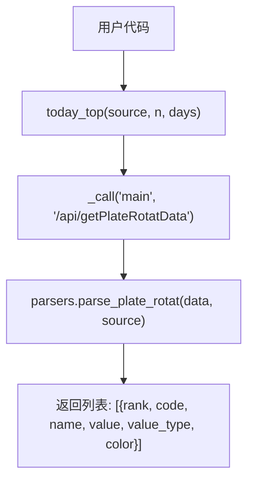
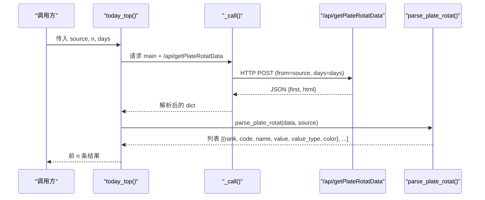
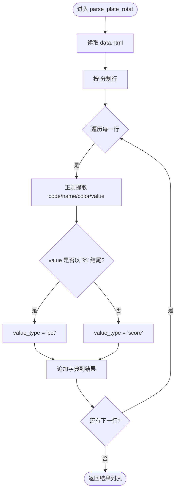
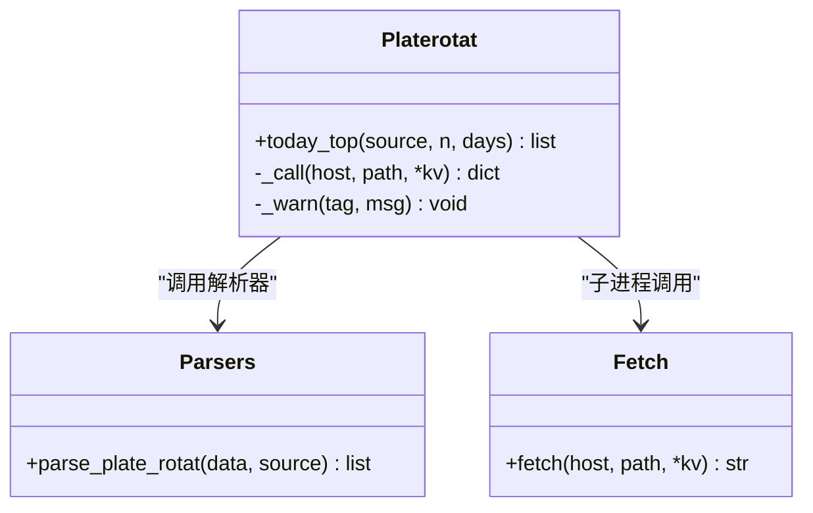

# 今日Top板块API

<cite>
**本文引用的文件**
- [platerotat.py](file://skills/plate-rotation-skill/scripts/platerotat.py)
- [parsers.py](file://skills/plate-rotation-skill/scripts/parsers.py)
- [api_getplaterotatdata.md](file://skills/plate-rotation-skill/references/api_getplaterotatdata.md)
- [test_plate_rotation.py](file://skills/plate-rotation-skill/tests/test_plate_rotation.py)
</cite>

## 目录
1. [简介](#简介)
2. [项目结构](#项目结构)
3. [核心组件](#核心组件)
4. [架构总览](#架构总览)
5. [详细组件分析](#详细组件分析)
6. [依赖关系分析](#依赖关系分析)
7. [性能与可用性考虑](#性能与可用性考虑)
8. [故障排查指南](#故障排查指南)
9. [结论](#结论)
10. [附录：调用示例](#附录调用示例)

## 简介
today_top() 函数用于获取“今日排名前N的板块数据”，其底层基于 /api/getPlateRotatData 接口，并按 source 参数区分数据来源与数值语义：
- source='ths'（同花顺）：value 为当日板块涨幅百分比，形如 "4.94%"，value_type='pct'
- source='kaipan'（开盘啦）：value 为当日板块强度分数，纯数字，形如 "15199"，value_type='score'

该函数对外返回统一的结构化列表，便于上层应用直接消费。

## 项目结构
本 API 位于“板块轮动”技能模块中，关键文件如下：
- scripts/platerotat.py：高级封装层，暴露 today_top() 等函数
- scripts/parsers.py：HTML-in-JSON 解析器，负责从 getPlateRotatData 响应中提取结构化字段
- references/api_getplaterotatdata.md：getPlateRotatData 接口的输入输出说明
- tests/test_plate_rotation.py：在线集成测试，覆盖返回值结构与边界行为

图表来源
- [platerotat.py:102-120](file://skills/plate-rotation-skill/scripts/platerotat.py#L102-L120)
- [parsers.py:20-65](file://skills/plate-rotation-skill/scripts/parsers.py#L20-L65)

章节来源
- [platerotat.py:102-120](file://skills/plate-rotation-skill/scripts/platerotat.py#L102-L120)
- [parsers.py:20-65](file://skills/plate-rotation-skill/scripts/parsers.py#L20-L65)
- [api_getplaterotatdata.md:22-41](file://skills/plate-rotation-skill/references/api_getplaterotatdata.md#L22-L41)

## 核心组件
- today_top(source, n, days)
  - 作用：获取今日 Top N 板块
  - 参数：
    - source: 'ths' 或 'kaipan'
    - n: 返回数量（正整数）
    - days: 回溯天数（10|20|30|50）
  - 返回：列表，每项包含 rank、code、name、value、value_type、color
- parsers.parse_plate_rotat(data, source)
  - 作用：将 getPlateRotatData 的 HTML-in-JSON 响应解析为结构化列表
  - 依据 value 是否以 "%" 结尾自动推断 value_type：'pct' 或 'score'

章节来源
- [platerotat.py:102-120](file://skills/plate-rotation-skill/scripts/platerotat.py#L102-L120)
- [parsers.py:20-65](file://skills/plate-rotation-skill/scripts/parsers.py#L20-L65)

## 架构总览
today_top() 的调用链与数据处理流程如下：

图表来源
- [platerotat.py:102-120](file://skills/plate-rotation-skill/scripts/platerotat.py#L102-L120)
- [parsers.py:20-65](file://skills/plate-rotation-skill/scripts/parsers.py#L20-L65)

## 详细组件分析

### today_top() 函数定义与行为
- 功能概述
  - 通过 _call 发起对 /api/getPlateRotatData 的请求，并交由 parse_plate_rotat 解析
  - 按 n 截断返回前 N 条记录
  - 若结果为空，向 stderr 输出 PR-EMPTY 警告，并给出可能原因提示
- 参数说明
  - source: 取值 'ths' 或 'kaipan'
    - 'ths'：数值为涨幅百分比，value_type='pct'
    - 'kaipan'：数值为强度分数，value_type='score'
  - n: 返回数量，建议为正整数；实际返回长度不超过 n
  - days: 回溯天数，支持 10|20|30|50；影响主表列宽与历史序列，但“今日Top”只看第一列
- 返回值结构
  - 类型：list[dict]
  - 每个元素字段：
    - rank: int，排名（从1开始升序）
    - code: string，板块代码（如 886084、801807）
    - name: string，板块名称
    - value: string
      - 当 value_type='pct' 时，形如 "4.94%"
      - 当 value_type='score' 时，形如 "15199"
    - value_type: 'pct' | 'score'
    - color: 'red' | 'green'
- 错误处理与空数据
  - 当 rows 为空时，输出 "[platerotat] PR-EMPTY: ..." 到 stderr，并附带可能的原因提示（周末、节假日、跨源错传、上游异常等）
  - 注意：函数不会抛出异常，而是返回空列表并附带警告信息

章节来源
- [platerotat.py:102-120](file://skills/plate-rotation-skill/scripts/platerotat.py#L102-L120)
- [parsers.py:20-65](file://skills/plate-rotation-skill/scripts/parsers.py#L20-L65)
- [api_getplaterotatdata.md:45-54](file://skills/plate-rotation-skill/references/api_getplaterotatdata.md#L45-L54)

### 解析器 parse_plate_rotat() 的关键逻辑
- 输入：getPlateRotatData 的 JSON 响应（含 html 字段）
- 处理要点：
  - 使用正则提取排名、板块 code/name、颜色以及当日值
  - 根据 value 是否以 "%" 结尾自动设置 value_type：'pct' 或 'score'
- 输出：结构化列表，字段与 today_top() 一致

图表来源
- [parsers.py:20-65](file://skills/plate-rotation-skill/scripts/parsers.py#L20-L65)

章节来源
- [parsers.py:20-65](file://skills/plate-rotation-skill/scripts/parsers.py#L20-L65)

### 接口 getPlateRotatData 的参数与语义
- 输入参数
  - from: 'ths' 或 'kaipan'
  - days: 10|20|30|50
  - dates: 可选，自定义日期串（YYYY-MM-DD,逗号分隔），不传则按 days 回溯
- 输出字段
  - first: 当日 Top1 板块代码
  - html: 嵌入表格的 HTML 片段，供解析器抽取
- 数值语义差异
  - ths：value 为涨幅百分比（带 %）
  - kaipan：value 为强度分数（纯数字）

章节来源
- [api_getplaterotatdata.md:22-41](file://skills/plate-rotation-skill/references/api_getplaterotatdata.md#L22-L41)
- [api_getplaterotatdata.md:45-54](file://skills/plate-rotation-skill/references/api_getplaterotatdata.md#L45-L54)

## 依赖关系分析
- today_top() 依赖：
  - _call(): 通过 fetch.py 子进程调用后端接口，并对非 JSON 或空响应进行快速失败
  - parse_plate_rotat(): 解析 HTML-in-JSON 响应
- 运行时校验：
  - 空数据时输出 PR-EMPTY 警告，并给出可能原因（周末、节假日、跨源错传、上游异常）

图表来源
- [platerotat.py:55-71](file://skills/plate-rotation-skill/scripts/platerotat.py#L55-L71)
- [platerotat.py:102-120](file://skills/plate-rotation-skill/scripts/platerotat.py#L102-L120)
- [parsers.py:20-65](file://skills/plate-rotation-skill/scripts/parsers.py#L20-L65)

章节来源
- [platerotat.py:55-71](file://skills/plate-rotation-skill/scripts/platerotat.py#L55-L71)
- [platerotat.py:102-120](file://skills/plate-rotation-skill/scripts/platerotat.py#L102-L120)

## 性能与可用性考虑
- 网络与子进程开销
  - today_top() 通过子进程调用 fetch.py，存在进程创建与网络往返成本
  - 建议在批量场景下复用连接或缓存结果（由上层实现）
- 解析复杂度
  - parse_plate_rotat() 基于正则扫描 HTML，时间复杂度近似 O(N×M)，其中 N 为行数，M 为每行匹配次数
  - 对于常规 Top N（如 10~50），性能可接受
- 空数据与节假日
  - 周末/节假日可能导致接口正常但无数据，此时会输出 PR-EMPTY 警告
  - 建议上层在收到空列表时结合日期判断与重试策略

## 故障排查指南
- 常见现象与定位
  - 返回空列表：检查是否周末/节假日；确认 source 与板块代码前缀匹配（88x→ths，80x/803x→kaipan）
  - 非 JSON 响应：_call() 会打印错误并退出，需检查 fetch.py 与后端服务状态
  - 字段缺失：确保 getPlateRotatData 返回的 html 字段存在且包含 plate 标签
- 诊断手段
  - 查看 stderr 中的 "[platerotat] PR-EMPTY: ..." 或 "[platerotat] non-JSON from ..." 提示
  - 使用 CLI 模式验证：python3 platerotat.py today --source ths --n 10 --days 20 --json

章节来源
- [platerotat.py:75-98](file://skills/plate-rotation-skill/scripts/platerotat.py#L75-L98)
- [platerotat.py:55-71](file://skills/plate-rotation-skill/scripts/platerotat.py#L55-L71)
- [test_plate_rotation.py:78-91](file://skills/plate-rotation-skill/tests/test_plate_rotation.py#L78-L91)

## 结论
today_top() 提供了统一的“今日Top板块”查询入口，屏蔽了不同数据源的数值语义差异，并通过标准化的返回结构简化上层集成。配合 parse_plate_rotat() 的健壮解析与运行时警告机制，可在复杂环境下稳定工作。

## 附录：调用示例
以下为典型调用方式与预期行为（不展示具体代码内容，仅描述用法与结果）：

- 默认使用开盘啦（kaipan），返回前10名
  - 调用：today_top(source='kaipan', n=10, days=20)
  - 结果：value_type='score'，value 为纯数字字符串
- 切换至同花顺（ths），返回前5名
  - 调用：today_top(source='ths', n=5, days=20)
  - 结果：value_type='pct'，value 形如 "4.94%"
- 限制返回数量
  - 调用：today_top(source='kaipan', n=3, days=20)
  - 结果：返回长度不超过3
- 空数据场景
  - 调用：today_top(source='ths', n=10, days=20)
  - 结果：可能返回空列表，并在 stderr 输出 PR-EMPTY 警告

章节来源
- [platerotat.py:102-120](file://skills/plate-rotation-skill/scripts/platerotat.py#L102-L120)
- [test_plate_rotation.py:250-271](file://skills/plate-rotation-skill/tests/test_plate_rotation.py#L250-L271)