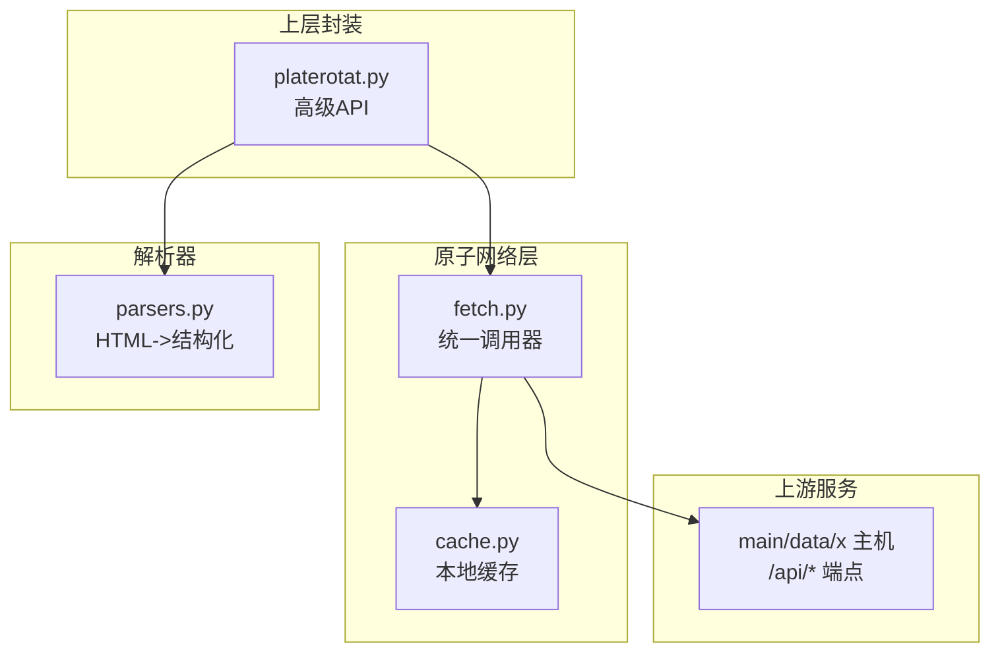
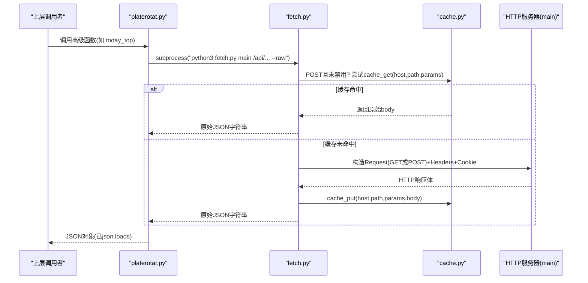
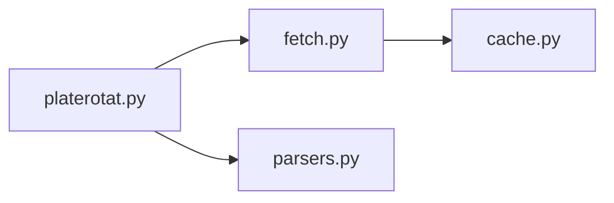

# 底层Fetch接口参考

<cite>
**本文引用的文件**   
- [fetch.py](file://skills/plate-rotation-skill/scripts/fetch.py)
- [cache.py](file://skills/plate-rotation-skill/scripts/cache.py)
- [platerotat.py](file://skills/plate-rotation-skill/scripts/platerotat.py)
- [parsers.py](file://skills/plate-rotation-skill/scripts/parsers.py)
- [api_getplaterotatdata.md](file://skills/plate-rotation-skill/references/api_getplaterotatdata.md)
- [api_getlongbyplate.md](file://skills/plate-rotation-skill/references/api_getlongbyplate.md)
- [api_getplaterotatchart.md](file://skills/plate-rotation-skill/references/api_getplaterotatchart.md)
- [api_getplatedaychart.md](file://skills/plate-rotation-skill/references/api_getplatedaychart.md)
</cite>

## 目录
1. [简介](#简介)
2. [项目结构](#项目结构)
3. [核心组件](#核心组件)
4. [架构总览](#架构总览)
5. [详细接口说明](#详细接口说明)
6. [依赖关系分析](#依赖关系分析)
7. [性能与可靠性](#性能与可靠性)
8. [故障排查指南](#故障排查指南)
9. [结论](#结论)
10. [附录：高级API映射与调用示例](#附录：高级api映射与调用示例)

## 简介
本文件为底层 fetch.py 模块的完整接口参考，聚焦四个核心HTTP接口的使用方法与实现细节：
- getPlateRotatData（板块轮动数据）
- getLongByPlate（板块龙头数据）
- getPlateRotatChart（板块轮动图表）
- getPlateDayChart（板块日线图表）

文档涵盖：
- URL路径、请求参数、响应格式与错误码
- host参数的作用与path路由规则
- --raw参数用于获取原始JSON字符串的行为
- Python subprocess调用的示例方式
- 网络超时、重试机制与错误处理
- 与高级API函数的对应关系

## 项目结构
该Skill采用“上层封装 + 原子网络层 + 解析器”的分层设计：
- 上层封装：platerotat.py，提供面向业务的高级函数
- 原子网络层：fetch.py，统一构造请求、重试、缓存、输出
- 解析器：parsers.py，将HTML片段从JSON中抽取为结构化数据
- 缓存层：cache.py，POST请求落盘缓存，TTL可配

图示来源
- [platerotat.py:55-71](file://skills/plate-rotation-skill/scripts/platerotat.py#L55-L71)
- [fetch.py:128-213](file://skills/plate-rotation-skill/scripts/fetch.py#L128-L213)
- [cache.py:59-94](file://skills/plate-rotation-skill/scripts/cache.py#L59-L94)
- [parsers.py:20-65](file://skills/plate-rotation-skill/scripts/parsers.py#L20-L65)

章节来源
- [platerotat.py:1-35](file://skills/plate-rotation-skill/scripts/platerotat.py#L1-L35)
- [fetch.py:1-31](file://skills/plate-rotation-skill/scripts/fetch.py#L1-L31)
- [cache.py:1-27](file://skills/plate-rotation-skill/scripts/cache.py#L1-L27)
- [parsers.py:1-17](file://skills/plate-rotation-skill/scripts/parsers.py#L1-L17)

## 核心组件
- fetch.py：CLI入口与main()函数；负责host别名解析、URL构建、请求头注入、GET/POST参数组装、指数退避重试、缓存命中/写入、--raw输出控制。
- cache.py：基于SHA1键的本地磁盘缓存，支持PR_CACHE_DISABLE开关、PR_CACHE_TTL默认值、按key前缀分目录存储、原子写。
- platerotat.py：通过subprocess调用fetch.py，组合四个底层接口，暴露today_top/find_dragon_kings/top1_curve/plate_strength等高级函数，并做运行时校验提示。
- parsers.py：将getPlateRotatData/getLongByPlate返回的HTML片段解析为结构化列表/矩阵/日期序列等。

章节来源
- [fetch.py:38-51](file://skills/plate-rotation-skill/scripts/fetch.py#L38-L51)
- [fetch.py:68-87](file://skills/plate-rotation-skill/scripts/fetch.py#L68-L87)
- [fetch.py:91-124](file://skills/plate-rotation-skill/scripts/fetch.py#L91-L124)
- [fetch.py:128-213](file://skills/plate-rotation-skill/scripts/fetch.py#L128-L213)
- [cache.py:35-51](file://skills/plate-rotation-skill/scripts/cache.py#L35-L51)
- [cache.py:59-94](file://skills/plate-rotation-skill/scripts/cache.py#L59-L94)
- [platerotat.py:55-71](file://skills/plate-rotation-skill/scripts/platerotat.py#L55-L71)
- [parsers.py:20-65](file://skills/plate-rotation-skill/scripts/parsers.py#L20-L65)

## 架构总览
下图展示从上层到网络的调用链与关键分支（缓存命中、重试、输出格式化）。

图示来源
- [platerotat.py:55-71](file://skills/plate-rotation-skill/scripts/platerotat.py#L55-L71)
- [fetch.py:156-213](file://skills/plate-rotation-skill/scripts/fetch.py#L156-L213)
- [cache.py:59-94](file://skills/plate-rotation-skill/scripts/cache.py#L59-L94)

## 详细接口说明

### 通用约定
- Host别名与路由
  - host参数支持别名：main | data | x | ext
  - main → https://duanxianxia.com
  - data → https://ds.duanxianxia.com
  - x → https://x.duanxianxia.cn
  - ext → 直接使用path作为完整URL
  - path必须以“/”开头，否则自动补全
- 请求方法
  - 默认POST；可通过-X/--method指定GET或POST
- 参数传递
  - key=value形式：以表单编码发送（POST时Content-Type为application/x-www-form-urlencoded）
  - -p/--params-json：传入JSON对象，优先级高于kv
- Cookie
  - 优先读取环境变量PR_COOKIE
  - 其次读取~/.plate_rotation_cookie文件中第一行形如“domain=cookie_string”的值
  - 可通过--no-cookie禁用发送
- 请求头
  - UA/Accept/Accept-Language/Referer/Origin/X-Requested-With自动注入
- 超时与重试
  - --timeout默认15秒
  - 对429/500/502/503/504及网络异常进行指数退避重试，最多3次（1s/2s/4s），可通过--max-retries调整
  - 其他4xx直接抛出错误退出
- 缓存
  - 仅POST请求启用缓存；--no-cache或PR_CACHE_DISABLE=1关闭
  - TTL默认3600秒，可通过--cache-ttl调整
  - 命中后直接输出原始body，不再发请求
- 输出
  - 默认尝试美化JSON；--raw则原样输出原始字符串

章节来源
- [fetch.py:38-46](file://skills/plate-rotation-skill/scripts/fetch.py#L38-L46)
- [fetch.py:68-76](file://skills/plate-rotation-skill/scripts/fetch.py#L68-L76)
- [fetch.py:128-143](file://skills/plate-rotation-skill/scripts/fetch.py#L128-L143)
- [fetch.py:156-191](file://skills/plate-rotation-skill/scripts/fetch.py#L156-L191)
- [fetch.py:193-213](file://skills/plate-rotation-skill/scripts/fetch.py#L193-L213)
- [cache.py:35-51](file://skills/plate-rotation-skill/scripts/cache.py#L35-L51)
- [cache.py:59-94](file://skills/plate-rotation-skill/scripts/cache.py#L59-L94)

---

### 接口一：getPlateRotatData（板块轮动数据）
- 分类：板块轮动
- Host：main
- Method：POST
- Path：/api/getPlateRotatData

输入参数
- from：string，必选。取值ths（同花顺）或kaipan（开盘啦）
- days：int，必选。回溯天数：10|20|30|50
- dates：string，可选。自定义日期（YYYY-MM-DD,逗号分隔），为空则按days回溯

响应字段
- first：string，当日Top1板块代码
- html：string，包含表格的HTML片段

语义与解析
- from=ths时，数值字段为“当日板块涨幅%”，带%符号
- from=kaipan时，数值字段为“板块强度分”，纯整数
- 板块代码前缀：88x为同花顺，80x/803x为开盘啦
- HTML模板见references文档，可使用parsers.parse_plate_rotat解析

章节来源
- [api_getplaterotatdata.md:1-74](file://skills/plate-rotation-skill/references/api_getplaterotatdata.md#L1-L74)
- [parsers.py:20-65](file://skills/plate-rotation-skill/scripts/parsers.py#L20-L65)

---

### 接口二：getLongByPlate（板块龙头数据）
- 分类：板块轮动
- Host：main
- Method：POST
- Path：/api/getLongByPlate

输入参数
- platecode：string，必选。板块代码，如886084（可从getPlateRotatData.first获取）
- days：int，必选。回溯天数：10|20|30|50
- dates：string，可选。自定义日期，为空则按days回溯

响应字段
- html：string，包含每日龙头信息的HTML片段

语义与解析
- 每个<td>代表一天，含1~5个
表示龙一到龙五
- 无领涨日td文本为“当日无领涨”
- 使用parsers.parse_plate_long_heads与rank_plate_long_persistence进行解析与统计

章节来源
- [api_getlongbyplate.md:1-65](file://skills/plate-rotation-skill/references/api_getlongbyplate.md#L1-L65)
- [parsers.py:113-174](file://skills/plate-rotation-skill/scripts/parsers.py#L113-L174)

---

### 接口三：getPlateRotatChart（板块轮动图表）
- 分类：板块轮动
- Host：main
- Method：POST
- Path：/api/getPlateRotatChart

输入参数
- from：string，必选。ths或kaipan
- days：int，必选。回溯天数：10|20|30|50
- dates：string，可选。自定义日期

响应字段
- date：list，最近N日的MM-DD序列
- legend：list，Top5板块名（含上榜次数）
- name：object，序号到名称映射
- value/symbol：每条数据点的排名与图标标识
- 1..5：各Top5板块的N日排名序列

语义与解析
- ECharts数据结构，value=10.5且symbol=wu.png表示当日未上榜
- 上层封装会补充top5_names便于消费

章节来源
- [api_getplaterotatchart.md:1-53](file://skills/plate-rotation-skill/references/api_getplaterotatchart.md#L1-L53)
- [platerotat.py:177-196](file://skills/plate-rotation-skill/scripts/platerotat.py#L177-L196)

---

### 接口四：getPlateDayChart（板块日线图表）
- 分类：板块轮动
- Host：main
- Method：POST
- Path：/api/getPlateDayChart

输入参数
- platecode：string，必选。板块代码
- days：int，必选。回溯天数：10|20|30|50
- dates：string，可选。自定义日期

响应字段
- legend：null或数组，legend=null表示板块当日未活跃
- date：list，最近N日的MM-DD序列

语义与解析
- 与getLongByPlate配套，同一platecode+days入参返回强度+量能时序
- 上层封装会对legend=null与date为空做警告提示

章节来源
- [api_getplatedaychart.md:1-48](file://skills/plate-rotation-skill/references/api_getplatedaychart.md#L1-L48)
- [platerotat.py:201-218](file://skills/plate-rotation-skill/scripts/platerotat.py#L201-L218)

## 依赖关系分析
- fetch.py依赖：
  - cache.py：缓存读写
  - 标准库：argparse/json/os/sys/urllib
- platerotat.py依赖：
  - fetch.py：通过subprocess调用
  - parsers.py：解析HTML片段
- parsers.py依赖：
  - 标准库：re/collections/typing

图示来源
- [platerotat.py:34-48](file://skills/plate-rotation-skill/scripts/platerotat.py#L34-L48)
- [fetch.py:31-36](file://skills/plate-rotation-skill/scripts/fetch.py#L31-L36)
- [parsers.py:14-16](file://skills/plate-rotation-skill/scripts/parsers.py#L14-L16)

章节来源
- [platerotat.py:34-48](file://skills/plate-rotation-skill/scripts/platerotat.py#L34-L48)
- [fetch.py:31-36](file://skills/plate-rotation-skill/scripts/fetch.py#L31-L36)
- [parsers.py:14-16](file://skills/plate-rotation-skill/scripts/parsers.py#L14-L16)

## 性能与可靠性
- 重试策略
  - 触发条件：429/500/502/503/504以及网络层异常
  - 退避间隔：1s/2s/4s（指数退避）
  - 最大重试次数：默认3次，可通过--max-retries调整
- 超时控制
  - 默认15秒，可通过--timeout调整
- 缓存命中率
  - POST请求默认开启缓存，TTL默认1小时，适合盘中“今日”与历史N日数据
  - 可通过--no-cache或PR_CACHE_DISABLE=1关闭
- 输出优化
  - --raw避免二次JSON解析与格式化开销，适合管道或脚本消费

章节来源
- [fetch.py:47-50](file://skills/plate-rotation-skill/scripts/fetch.py#L47-L50)
- [fetch.py:91-124](file://skills/plate-rotation-skill/scripts/fetch.py#L91-L124)
- [fetch.py:138-142](file://skills/plate-rotation-skill/scripts/fetch.py#L138-L142)
- [cache.py:35-51](file://skills/plate-rotation-skill/scripts/cache.py#L35-L51)

## 故障排查指南
- 常见错误码与行为
  - 4xx非重试码：直接抛出RuntimeError并退出（exit code非0）
  - 429/5xx：进入重试流程，超过最大次数后抛出最终失败信息
  - 网络异常/超时：记录last_err并在耗尽重试后抛出
- 诊断建议
  - 使用-v/--verbose打印URL、body与重试日志
  - 检查host别名是否正确，path是否以“/”开头
  - 确认Cookie配置（PR_COOKIE或~/.plate_rotation_cookie）
  - 若返回空或非JSON，查看上层封装的PR-EMPTY/PR-WARN提示
- 缓存问题
  - 设置PR_CACHE_DISABLE=1或--no-cache强制刷新
  - 使用cache.py stats/clear进行清理与统计

章节来源
- [fetch.py:91-124](file://skills/plate-rotation-skill/scripts/fetch.py#L91-L124)
- [fetch.py:193-213](file://skills/plate-rotation-skill/scripts/fetch.py#L193-L213)
- [platerotat.py:75-97](file://skills/plate-rotation-skill/scripts/platerotat.py#L75-L97)
- [cache.py:119-128](file://skills/plate-rotation-skill/scripts/cache.py#L119-L128)

## 结论
fetch.py作为统一的网络调用原子层，提供了稳定的host别名解析、参数拼装、重试与缓存能力，配合上层platerotat.py的高级API与parsers.py的HTML解析，形成完整的板块轮动数据获取与分析链路。四个核心接口覆盖“主表排行、龙头追踪、Top5曲线、单板强度时序”四大场景，满足复盘与策略研究需求。

## 附录：高级API映射与调用示例

### 高级API与底层接口映射
- today_top → /api/getPlateRotatData
- find_dragon_kings → /api/getPlateRotatData + /api/getLongByPlate
- top1_curve → /api/getPlateRotatChart
- plate_strength → /api/getPlateDayChart

章节来源
- [platerotat.py:102-120](file://skills/plate-rotation-skill/scripts/platerotat.py#L102-L120)
- [platerotat.py:125-172](file://skills/plate-rotation-skill/scripts/platerotat.py#L125-L172)
- [platerotat.py:177-196](file://skills/plate-rotation-skill/scripts/platerotat.py#L177-L196)
- [platerotat.py:201-218](file://skills/plate-rotation-skill/scripts/platerotat.py#L201-L218)

### Python subprocess调用示例
以下为通过Python子进程调用fetch.py的标准姿势（不直接粘贴源码，仅提供调用路径与要点）：
- 基本调用（POST，KV参数）
  - 命令：python3 scripts/fetch.py main /api/getPlateRotatData from=ths days=20
  - 用途：获取同花顺源近20日板块轮动数据
- 复杂参数（JSON）
  - 命令：python3 scripts/fetch.py main /api/getLongByPlate -p '{"platecode":"886084","days":20}'
  - 用途：获取指定板块龙头数据
- 探测/自检
  - 命令：python3 scripts/fetch.py main /api/getPlateRotatData from=ths days=20 -v
  - 用途：打印URL、body与重试日志
- 获取原始JSON字符串
  - 在任意调用末尾追加--raw
  - 用途：避免二次格式化，适合管道或脚本消费
- 超时与重试
  - 通过--timeout与--max-retries调整
- 禁用缓存
  - 通过--no-cache或设置PR_CACHE_DISABLE=1

章节来源
- [fetch.py:128-143](file://skills/plate-rotation-skill/scripts/fetch.py#L128-L143)
- [fetch.py:156-213](file://skills/plate-rotation-skill/scripts/fetch.py#L156-L213)
- [platerotat.py:55-71](file://skills/plate-rotation-skill/scripts/platerotat.py#L55-L71)