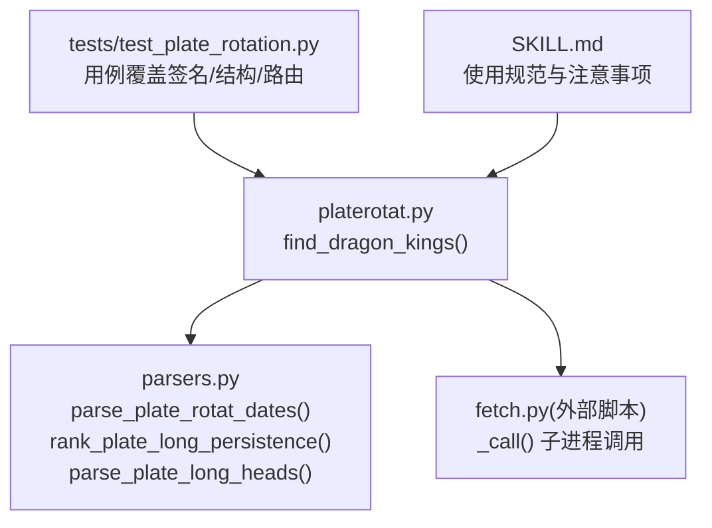
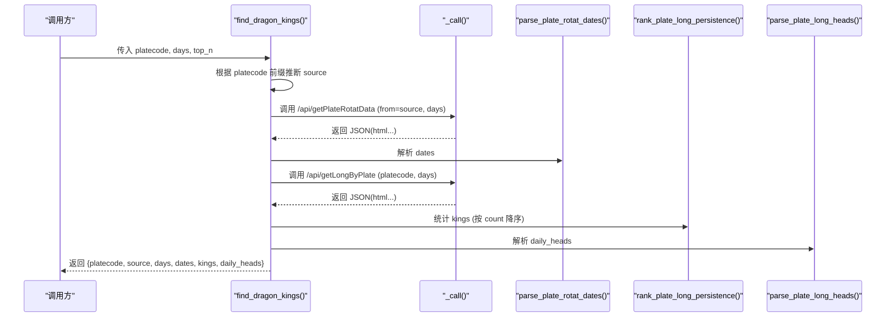
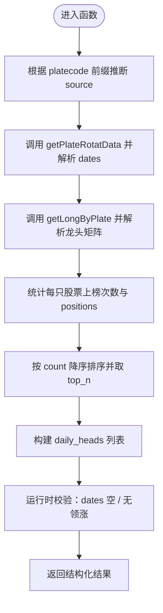
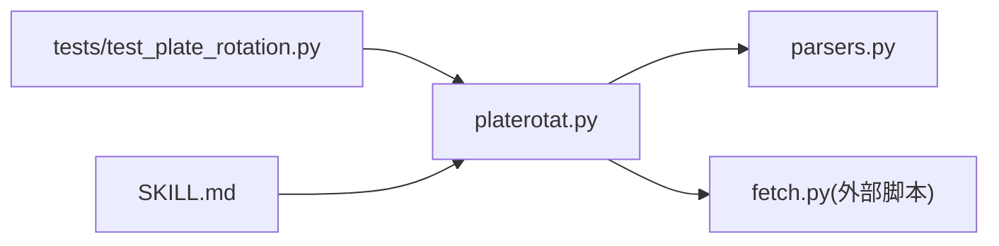

# 板块妖王榜API

<cite>
**本文引用的文件**
- [platerotat.py](file://skills/plate-rotation-skill/scripts/platerotat.py)
- [parsers.py](file://skills/plate-rotation-skill/scripts/parsers.py)
- [test_plate_rotation.py](file://skills/plate-rotation-skill/tests/test_plate_rotation.py)
- [SKILL.md](file://skills/plate-rotation-skill/SKILL.md)
</cite>

## 目录
1. [简介](#简介)
2. [项目结构](#项目结构)
3. [核心组件](#核心组件)
4. [架构总览](#架构总览)
5. [详细组件分析](#详细组件分析)
6. [依赖关系分析](#依赖关系分析)
7. [性能与可用性考虑](#性能与可用性考虑)
8. [故障排查指南](#故障排查指南)
9. [结论](#结论)
10. [附录：调用示例与异常处理](#附录调用示例与异常处理)

## 简介
本文件为 find_dragon_kings() 函数的完整 API 文档。该函数用于分析特定板块在过去 N 个交易日中，哪些股票最频繁担任龙头股（即“妖王”），并返回按上榜次数排序的 Top N 结果以及每日龙头明细。函数支持跨源数据自动路由：根据板块代码前缀自动选择同花顺或开盘啦数据源，用户无需关心底层差异。

## 项目结构
围绕 find_dragon_kings() 的相关实现位于 plate-rotation skill 的 scripts 目录下，核心由 platerotat.py 提供高级封装，parsers.py 负责解析上游接口返回的 HTML-in-JSON 数据，tests 目录包含在线集成测试以验证行为与边界条件。

图表来源
- [platerotat.py:124-172](file://skills/plate-rotation-skill/scripts/platerotat.py#L124-L172)
- [parsers.py:105-174](file://skills/plate-rotation-skill/scripts/parsers.py#L105-L174)
- [test_plate_rotation.py:272-327](file://skills/plate-rotation-skill/tests/test_plate_rotation.py#L272-L327)
- [SKILL.md:59-68](file://skills/plate-rotation-skill/SKILL.md#L59-L68)

章节来源
- [platerotat.py:1-315](file://skills/plate-rotation-skill/scripts/platerotat.py#L1-L315)
- [parsers.py:1-212](file://skills/plate-rotation-skill/scripts/parsers.py#L1-L212)
- [test_plate_rotation.py:1-444](file://skills/plate-rotation-skill/tests/test_plate_rotation.py#L1-L444)
- [SKILL.md:1-282](file://skills/plate-rotation-skill/SKILL.md#L1-L282)

## 核心组件
- find_dragon_kings(platecode, days=20, top_n=10)
  - 功能：统计指定板块过去 N 天里各股票担任龙头的次数，返回 Top N 及每日龙头明细。
  - 参数：
    - platecode：板块代码。88x 为同花顺；80x/803x 为开盘啦。
    - days：回溯天数，影响日期列宽度与查询窗口。
    - top_n：返回前几名。
  - 返回值：字典，包含 platecode、source、days、dates、kings、daily_heads 等字段。
  - 自动路由：根据 platecode 前缀自动选择 source（ths 或 kaipan）。

- parsers.py 关键辅助
  - parse_plate_rotat_dates(data)：从主表响应中提取日期序列（newest first）。
  - rank_plate_long_persistence(lng, dates, top_n)：统计每只股票在 N 天内担任龙头的次数与具体位置。
  - parse_plate_long_heads(lng, dates)：将龙头矩阵解析为每日龙头清单。

章节来源
- [platerotat.py:124-172](file://skills/plate-rotation-skill/scripts/platerotat.py#L124-L172)
- [parsers.py:105-174](file://skills/plate-rotation-skill/scripts/parsers.py#L105-L174)

## 架构总览
find_dragon_kings() 的工作流程如下：
- 根据 platecode 前缀推断 source（ths 或 kaipan）。
- 通过 _call() 调用两个底层接口：
  - getPlateRotatData：获取日期序列与主表数据。
  - getLongByPlate：获取指定板块的龙头矩阵。
- 使用 parsers 解析数据：
  - parse_plate_rotat_dates() 提取 dates。
  - rank_plate_long_persistence() 计算 kings。
  - parse_plate_long_heads() 生成 daily_heads。
- 运行时校验：若 dates 为空或近 N 天均无领涨，输出 PR-EMPTY 警告。
- 返回结构化结果。

图表来源
- [platerotat.py:124-172](file://skills/plate-rotation-skill/scripts/platerotat.py#L124-L172)
- [parsers.py:105-174](file://skills/plate-rotation-skill/scripts/parsers.py#L105-L174)

## 详细组件分析

### 函数签名与参数说明
- 函数名：find_dragon_kings
- 参数：
  - platecode：字符串类型，板块代码。88x 为同花顺；80x/803x 为开盘啦。
  - days：整数类型，回溯天数。默认 20。
  - top_n：整数类型，返回前几名。默认 10。
- 行为约束：
  - 内部自动选择 source：当 platecode 以 "88" 开头时，source="ths"；否则 source="kaipan"。
  - 对空数据场景进行运行时校验，并通过 stderr 输出 PR-EMPTY 提示。

章节来源
- [platerotat.py:124-172](file://skills/plate-rotation-skill/scripts/platerotat.py#L124-L172)
- [SKILL.md:59-68](file://skills/plate-rotation-skill/SKILL.md#L59-L68)

### 返回值结构
返回值为字典，包含以下关键字段：
- platecode：输入的板块代码。
- source：实际使用的数据源（"ths" 或 "kaipan"）。
- days：传入的回溯天数。
- dates：日期列表，格式为 "YYYY-MM-DD"，按 newest→oldest 排列。
- kings：Top N 股票数组，每个元素包含：
  - code：股票代码（字符串）。
  - name：股票名称（字符串）。
  - count：上榜次数（整数）。
  - positions：具体上榜日期与位置的列表，形如 "YYYY-MM-DD/龙X"（X 为一至五）。
- daily_heads：每日龙头明细数组，每个元素包含：
  - date：日期（"YYYY-MM-DD"）。
  - heads：当日龙头列表，每项含 rank（"龙一"~"龙五"）、code、name。

注意：
- kings 按 count 降序排列，且长度不超过 top_n。
- positions 数量等于 count。
- daily_heads 与 dates 大致对齐，极端日可能缺失 td（允许为空 heads）。

章节来源
- [platerotat.py:124-172](file://skills/plate-rotation-skill/scripts/platerotat.py#L124-L172)
- [parsers.py:156-174](file://skills/plate-rotation-skill/scripts/parsers.py#L156-L174)
- [parsers.py:113-153](file://skills/plate-rotation-skill/scripts/parsers.py#L113-L153)
- [test_plate_rotation.py:272-327](file://skills/plate-rotation-skill/tests/test_plate_rotation.py#L272-L327)

### 跨源数据处理与自动路由
- 自动路由规则：
  - 88x → ths（同花顺）
  - 80x/803x → kaipan（开盘啦）
- 设计原因：
  - 80x/803x 板块在同花顺源中不可查，需走开盘啦源。
  - 88x 在两源均可查，但统一按前缀分流可避免误用。
- 用户无需手动传 source，直接传 platecode 即可。

章节来源
- [platerotat.py:145-148](file://skills/plate-rotation-skill/scripts/platerotat.py#L145-L148)
- [test_plate_rotation.py:304-327](file://skills/plate-rotation-skill/tests/test_plate_rotation.py#L304-L327)
- [SKILL.md:59-68](file://skills/plate-rotation-skill/SKILL.md#L59-L68)

### 算法与数据结构
- 数据流：
  - 从 getPlateRotatData 提取 dates。
  - 从 getLongByPlate 解析每日龙头矩阵。
  - 累计每只股票的龙头出现次数与具体位置。
- 复杂度：
  - 时间复杂度：O(D + S)，其中 D 为交易日数，S 为龙头条目总数（每天最多 5 个）。
  - 空间复杂度：O(S)，用于存储每只股票的 positions 列表。
- 排序策略：
  - 按 count 降序，top_n 截断。

图表来源
- [platerotat.py:124-172](file://skills/plate-rotation-skill/scripts/platerotat.py#L124-L172)
- [parsers.py:105-174](file://skills/plate-rotation-skill/scripts/parsers.py#L105-L174)

章节来源
- [parsers.py:156-174](file://skills/plate-rotation-skill/scripts/parsers.py#L156-L174)
- [parsers.py:113-153](file://skills/plate-rotation-skill/scripts/parsers.py#L113-L153)

## 依赖关系分析
- 模块耦合：
  - platerotat.py 依赖 parsers.py 的解析函数。
  - platerotat.py 通过 _call() 子进程调用 fetch.py 访问后端接口。
- 外部依赖：
  - 网络接口：getPlateRotatData、getLongByPlate。
  - 标准库：subprocess、json、re、datetime、argparse。
- 潜在循环依赖：
  - 当前结构清晰，无循环导入。

图表来源
- [platerotat.py:1-315](file://skills/plate-rotation-skill/scripts/platerotat.py#L1-L315)
- [parsers.py:1-212](file://skills/plate-rotation-skill/scripts/parsers.py#L1-L212)
- [test_plate_rotation.py:1-444](file://skills/plate-rotation-skill/tests/test_plate_rotation.py#L1-L444)
- [SKILL.md:1-282](file://skills/plate-rotation-skill/SKILL.md#L1-L282)

章节来源
- [platerotat.py:1-315](file://skills/plate-rotation-skill/scripts/platerotat.py#L1-L315)
- [parsers.py:1-212](file://skills/plate-rotation-skill/scripts/parsers.py#L1-L212)
- [test_plate_rotation.py:1-444](file://skills/plate-rotation-skill/tests/test_plate_rotation.py#L1-L444)
- [SKILL.md:1-282](file://skills/plate-rotation-skill/SKILL.md#L1-L282)

## 性能与可用性考虑
- 网络请求：
  - 每次调用会发起两次 HTTP 请求（主表与龙头矩阵），建议合理设置 days 与缓存策略。
- 解析开销：
  - 基于正则的 HTML 解析，数据量不大时开销可控。
- 排序与截断：
  - 仅对统计结果做一次排序并按 top_n 截断，复杂度低。
- 可用性：
  - 对节假日、周末、接口异常等场景有 PR-EMPTY 提示，便于下游处理。

[本节为通用指导，不直接分析具体文件]

## 故障排查指南
- 常见错误与提示：
  - PR-EMPTY：接口返回空数据、跨源错传、节假日或 days 超前。
  - PR-WARN：数据正常但板块当日未活跃。
- 定位步骤：
  - 检查 platecode 前缀是否与 source 匹配（88x→ths，80x/803x→kaipan）。
  - 确认 days 是否合理（非未来日期）。
  - 查看 stderr 输出的 PR-EMPTY/PR-WARN 消息。
- 参考用例：
  - 测试覆盖了 88x→ths 与 80x→kaipan 的路由正确性。

章节来源
- [platerotat.py:155-163](file://skills/plate-rotation-skill/scripts/platerotat.py#L155-L163)
- [test_plate_rotation.py:304-327](file://skills/plate-rotation-skill/tests/test_plate_rotation.py#L304-L327)
- [SKILL.md:244-253](file://skills/plate-rotation-skill/SKILL.md#L244-L253)

## 结论
find_dragon_kings() 提供了简洁易用的板块妖王榜能力，自动处理跨源数据路由，返回结构清晰，适合用于复盘与策略研究。结合 parsers 的稳健解析与测试覆盖，整体可用性与健壮性良好。

[本节为总结，不直接分析具体文件]

## 附录：调用示例与异常处理

### Python 调用示例
- 基本用法：
  - 传入 platecode、days、top_n，获取妖王榜与每日龙头明细。
- CLI 方式：
  - 通过 wangking 子命令输出文本或 JSON。

章节来源
- [SKILL.md:180-201](file://skills/plate-rotation-skill/SKILL.md#L180-L201)
- [platerotat.py:239-248](file://skills/plate-rotation-skill/scripts/platerotat.py#L239-L248)

### 异常情况处理
- 空数据：
  - 若 dates 为空或近 N 天均无领涨，函数会输出 PR-EMPTY 警告。
- 跨源错传：
  - 88x 传到 kaipan 或 80x 传到 ths 会导致空数据，函数会给出提示。
- 节假日/周末：
  - 接口可能无数据，应如实告知用户。

章节来源
- [platerotat.py:155-163](file://skills/plate-rotation-skill/scripts/platerotat.py#L155-L163)
- [SKILL.md:244-253](file://skills/plate-rotation-skill/SKILL.md#L244-L253)