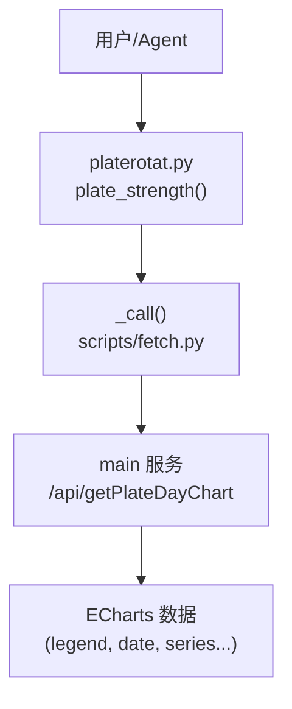
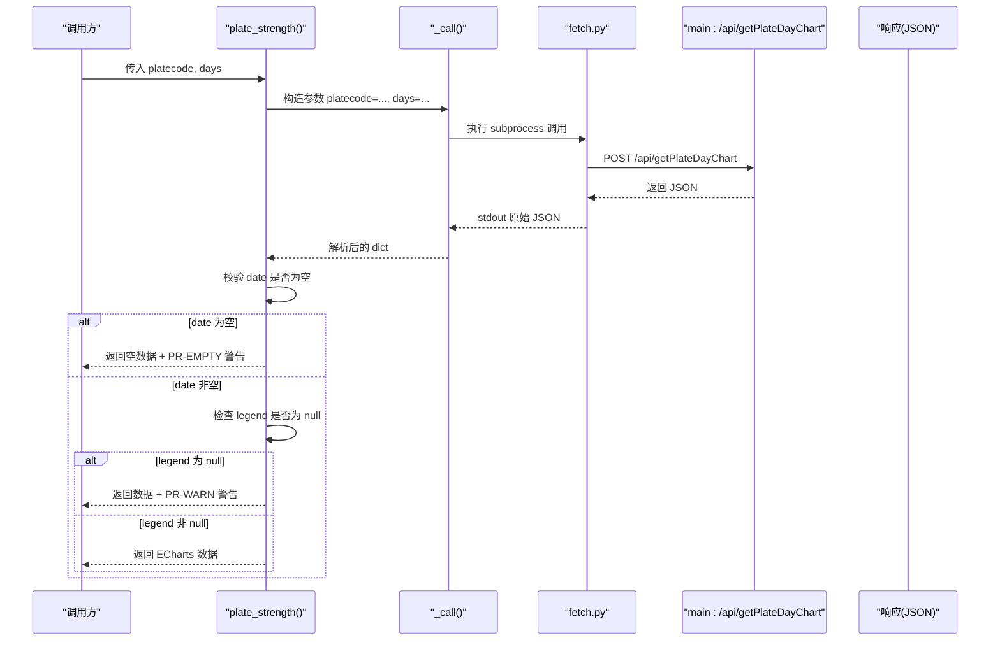
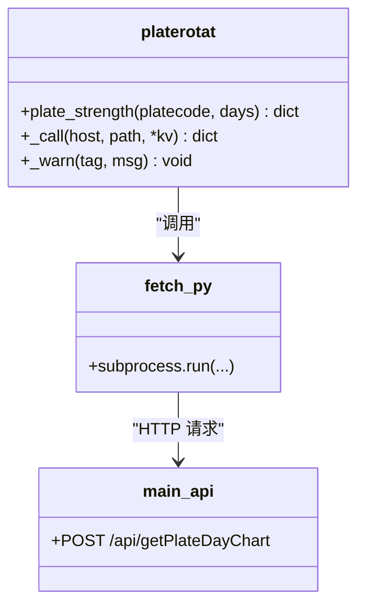

# 板块强度时序API

<cite>
**本文引用的文件**   
- [platerotat.py](file://skills/plate-rotation-skill/scripts/platerotat.py)
- [api_getplatedaychart.md](file://skills/plate-rotation-skill/references/api_getplatedaychart.md)
- [SKILL.md](file://skills/plate-rotation-skill/SKILL.md)
- [api_getlongbyplate.md](file://skills/plate-rotation-skill/references/api_getlongbyplate.md)
</cite>

## 目录
1. [简介](#简介)
2. [项目结构](#项目结构)
3. [核心组件](#核心组件)
4. [架构总览](#架构总览)
5. [详细组件分析](#详细组件分析)
6. [依赖关系分析](#依赖关系分析)
7. [性能与可用性考虑](#性能与可用性考虑)
8. [故障排查指南](#故障排查指南)
9. [结论](#结论)
10. [附录：调用示例与最佳实践](#附录调用示例与最佳实践)

## 简介
本文件为 plate_strength() 函数的完整 API 文档。该函数用于获取单个板块 N 日的“强度+量能”时序数据，底层调用 /api/getPlateDayChart 接口，返回 ECharts 数据结构。文档涵盖参数规范、返回值字段说明（含 legend=null 的特殊含义）、活跃度判断逻辑、与妖王榜 API 的区别与适用场景，以及完整的调用示例与异常处理建议。

## 项目结构
与 plate_strength() 相关的代码与参考文档位于 skills/plate-rotation-skill 子模块中：
- scripts/platerotat.py：高级 helper 实现，包含 plate_strength() 的封装与运行时校验提示。
- references/api_getplatedaychart.md：/api/getPlateDayChart 接口的输入输出定义与样例。
- SKILL.md：工具使用手册与 CLI 速查，包含 strength 子命令用法。
- references/api_getlongbyplate.md：妖王榜相关接口定义，用于对比说明。

图表来源
- [platerotat.py:201-218](file://skills/plate-rotation-skill/scripts/platerotat.py#L201-L218)
- [api_getplatedaychart.md:1-48](file://skills/plate-rotation-skill/references/api_getplatedaychart.md#L1-L48)

章节来源
- [platerotat.py:1-315](file://skills/plate-rotation-skill/scripts/platerotat.py#L1-L315)
- [api_getplatedaychart.md:1-48](file://skills/plate-rotation-skill/references/api_getplatedaychart.md#L1-L48)
- [SKILL.md:1-282](file://skills/plate-rotation-skill/SKILL.md#L1-L282)

## 核心组件
- plate_strength(platecode, days=20)
  - 作用：返回指定板块近 N 日的强度+量能 ECharts 数据。
  - 底层接口：/api/getPlateDayChart。
  - 返回：原始 JSON 透传（包含 legend、date 及若干 series 键），上层应用按需读取。
  - 运行时校验：
    - 若 date 列为空：输出 PR-EMPTY 警告，提示板块代码可能无效或上游异常。
    - 若 legend 为 null：输出 PR-WARN 警告，表示该板块近 days 天均未活跃。

章节来源
- [platerotat.py:201-218](file://skills/plate-rotation-skill/scripts/platerotat.py#L201-L218)

## 架构总览
plate_strength() 作为高级 helper，将业务语义与底层接口解耦，统一通过 _call() 调用 fetch.py 发起请求并解析 JSON。对异常与边界情况提供标准化提示，便于下游 Agent 识别与处理。

图表来源
- [platerotat.py:55-71](file://skills/plate-rotation-skill/scripts/platerotat.py#L55-L71)
- [platerotat.py:201-218](file://skills/plate-rotation-skill/scripts/platerotat.py#L201-L218)
- [api_getplatedaychart.md:1-48](file://skills/plate-rotation-skill/references/api_getplatedaychart.md#L1-L48)

## 详细组件分析

### 函数签名与参数
- 函数名：plate_strength
- 参数
  - platecode: string，必填。板块代码，如 886084（F5G概念）。可从 getPlateRotatData 响应的 first 字段获取。
  - days: int，默认 20。回溯天数，支持 10 | 20 | 30 | 50。
- 行为
  - 内部调用 /api/getPlateDayChart，透传原始 JSON。
  - 对 date 列进行空值检测；对 legend 是否为 null 进行标注。

章节来源
- [api_getplatedaychart.md:22-28](file://skills/plate-rotation-skill/references/api_getplatedaychart.md#L22-L28)
- [platerotat.py:201-218](file://skills/plate-rotation-skill/scripts/platerotat.py#L201-L218)

### 返回值：ECharts 数据结构
- legend: null 或字符串数组
  - 当 legend 为 null 时，表示该板块当日“未活跃”，前端不渲染图表。
  - 当 legend 非 null 时，通常为图例名称列表，配合 series 渲染强度与量能曲线。
- date: list[string]
  - 日期序列，格式为 MM-DD，按从新到旧排列。
- series: 多个键（例如 1..N）
  - 每个键对应一个时序系列（强度/量能等），具体键名由后端决定，上层按需读取。
- 其他字段
  - 除 legend、date 外，其余键均为 series 数据，上层应用可遍历 data.items() 过滤出 series。

注意
- 当 legend=null 且 date 存在时，属于“板块未活跃”的合法状态，并非错误。
- 当 date 为空时，属于异常或无数据状态，应触发 PR-EMPTY 提示。

章节来源
- [api_getplatedaychart.md:30-46](file://skills/plate-rotation-skill/references/api_getplatedaychart.md#L30-L46)
- [platerotat.py:211-218](file://skills/plate-rotation-skill/scripts/platerotat.py#L211-L218)

### 活跃度判断逻辑
- 判定依据：legend 字段是否为 null。
- 规则
  - legend == null：板块当日未活跃，前端不渲染图表。
  - legend != null：板块活跃，正常渲染。
- 补充
  - date 为空：上游异常或参数不当，需提示 PR-EMPTY。
  - 该逻辑与 find_dragon_kings 中的“连续多日无领涨”语义一致，均体现板块活跃度不足。

章节来源
- [api_getplatedaychart.md:43-46](file://skills/plate-rotation-skill/references/api_getplatedaychart.md#L43-L46)
- [platerotat.py:215-218](file://skills/plate-rotation-skill/scripts/platerotat.py#L215-L218)

### 与妖王榜 API 的区别与适用场景
- plate_strength()
  - 目标：单板块 N 日强度+量能的时序可视化数据（ECharts）。
  - 适用：查看某板块在一段时间内的强度与量能变化趋势，辅助判断活跃度与资金参与程度。
- 妖王榜 API（find_dragon_kings / getLongByPlate）
  - 目标：统计某板块过去 N 日里哪些个股最常担任龙头，给出上榜次数与每日龙头清单。
  - 适用：评估板块的“持续性”和“核心标的稳定性”，识别真主线与伪主线。
- 关键差异
  - plate_strength 关注“板块整体强度+量能”的时间序列；妖王榜关注“个股龙头频次与位置”。
  - 两者入参相同（platecode + days），但语义不同：前者看走势，后者看龙头持续性。
  - 活跃度信号：plate_strength 用 legend=null 表达未活跃；妖王榜用 daily_heads 全空表达无领涨。

章节来源
- [platerotat.py:125-172](file://skills/plate-rotation-skill/scripts/platerotat.py#L125-L172)
- [api_getlongbyplate.md:44-63](file://skills/plate-rotation-skill/references/api_getlongbyplate.md#L44-L63)

## 依赖关系分析
- 直接依赖
  - _call(): 通过 subprocess 调用 scripts/fetch.py，以 --raw 模式获取原始 JSON 并解析。
  - 运行时校验：_warn() 输出 PR-EMPTY / PR-WARN 标签，供下游识别。
- 间接依赖
  - fetch.py：负责网络请求与缓存策略。
  - main 服务：提供 /api/getPlateDayChart 接口。

图表来源
- [platerotat.py:55-71](file://skills/plate-rotation-skill/scripts/platerotat.py#L55-L71)
- [platerotat.py:201-218](file://skills/plate-rotation-skill/scripts/platerotat.py#L201-L218)

章节来源
- [platerotat.py:55-71](file://skills/plate-rotation-skill/scripts/platerotat.py#L55-L71)
- [platerotat.py:201-218](file://skills/plate-rotation-skill/scripts/platerotat.py#L201-L218)

## 性能与可用性考虑
- 调用开销
  - 每次调用会触发一次 HTTP 请求，建议在批量查询时复用缓存（遵循 SKILL.md 的缓存约定）。
- 数据有效性
  - 节假日或非交易日可能导致 date 为空或 legend=null，需结合 PR-EMPTY/PR-WARN 提示做分支处理。
- 前端渲染
  - 当 legend=null 时，前端不应渲染图表，避免误导用户。

[本节为通用指导，无需特定文件引用]

## 故障排查指南
- 现象：返回空数据或 date 为空
  - 可能原因：板块代码无效、跨源错传、节假日、days 超前、上游接口异常。
  - 处理：捕获 PR-EMPTY 警告，停止分析并回显提示信息。
- 现象：legend=null
  - 可能原因：板块近 days 天均未活跃。
  - 处理：记录 PR-WARN 警告，前端不渲染图表，可在 UI 上显示“板块未活跃”提示。
- 现象：series 缺失或键名不符合预期
  - 可能原因：后端版本变更或上游异常。
  - 处理：打印 data.keys() 调试，必要时降级展示或告警。

章节来源
- [platerotat.py:211-218](file://skills/plate-rotation-skill/scripts/platerotat.py#L211-L218)
- [SKILL.md:244-253](file://skills/plate-rotation-skill/SKILL.md#L244-L253)

## 结论
plate_strength() 提供了简洁的“单板块强度+量能时序”能力，适合快速定位板块活跃度与资金参与节奏。其返回值遵循 ECharts 标准结构，legend=null 明确表达“未活跃”状态。与妖王榜 API 相比，前者侧重走势与时序，后者侧重龙头持续性与核心标的稳定性。二者互补，共同构成板块轮动分析的重要维度。

[本节为总结性内容，无需特定文件引用]

## 附录：调用示例与最佳实践

- Python 调用示例
  - 基本调用：
    - 调用 plate_strength('886084', days=20)，返回 ECharts 数据。
  - 处理未活跃板块：
    - 若返回的 legend 为 null，则前端不渲染图表，并在日志中记录 PR-WARN。
    - 若 date 为空，则记录 PR-EMPTY 并提示用户检查参数或上游状态。
  - 提取 series：
    - 遍历 data.items()，排除 legend 与 date，得到所有 series 键及其时序数据。

- CLI 调用示例
  - 输出 JSON：
    - python3 $PR strength 886084 --json
  - 仅查看 legend 与 date：
    - python3 $PR strength 886084
  - 切换 days：
    - python3 $PR strength 886084 --days 30

- 最佳实践
  - 先通过 today_top 或 getPlateRotatData 获取板块代码，再喂给 plate_strength。
  - 严格区分 source 前缀：88x 配 ths，80x/803x 配 kaipan，避免跨源导致空数据。
  - 对 legend=null 的情况，在 UI 层给出“板块未活跃”的友好提示。
  - 对 PR-EMPTY 警告，立即中止后续分析，避免基于空数据进行推断。

章节来源
- [SKILL.md:203-210](file://skills/plate-rotation-skill/SKILL.md#L203-L210)
- [SKILL.md:229-234](file://skills/plate-rotation-skill/SKILL.md#L229-L234)
- [platerotat.py:265-276](file://skills/plate-rotation-skill/scripts/platerotat.py#L265-L276)