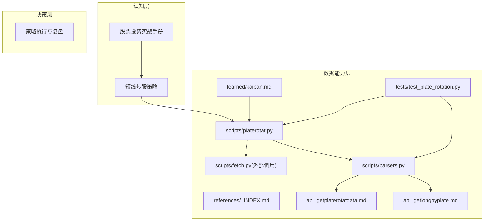
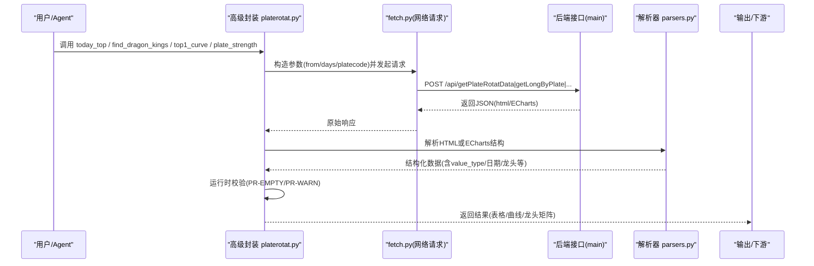
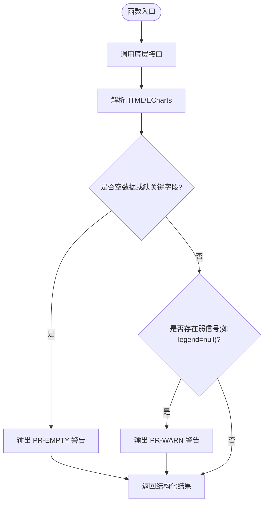
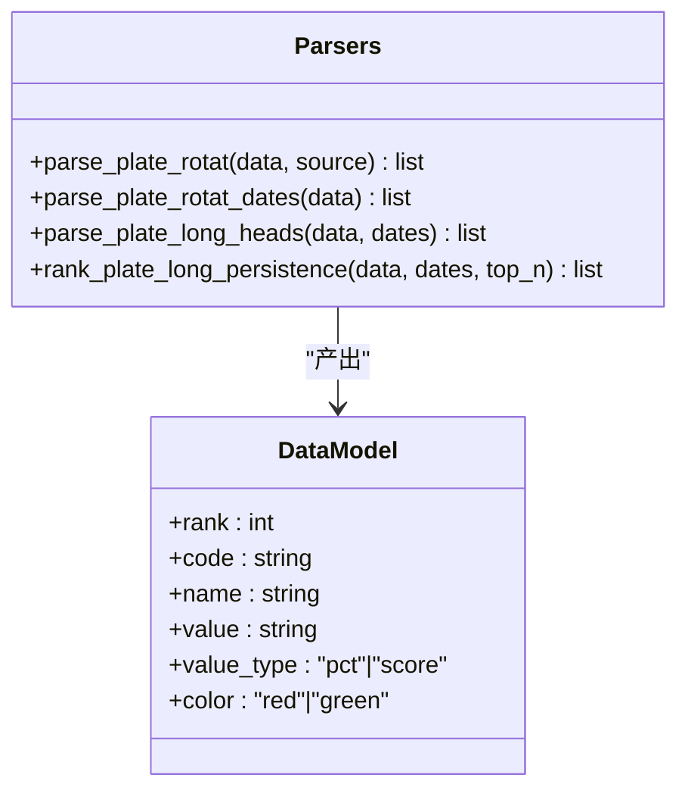
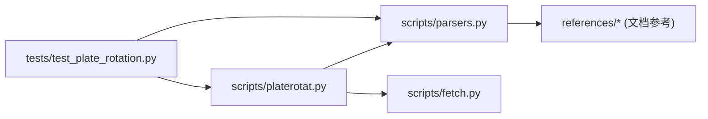

# 分析方法论与核心概念

<cite>
**本文引用的文件**   
- [README.MD](file://README.MD)
- [skills/plate-rotation-skill/README.md](file://skills/plate-rotation-skill/README.md)
- [skills/plate-rotation-skill/references/_INDEX.md](file://skills/plate-rotation-skill/references/_INDEX.md)
- [skills/plate-rotation-skill/references/stock-facts.md](file://skills/plate-rotation-skill/references/stock-facts.md)
- [skills/plate-rotation-skill/references/api_getplaterotatdata.md](file://skills/plate-rotation-skill/references/api_getplaterotatdata.md)
- [skills/plate-rotation-skill/references/api_getlongbyplate.md](file://skills/plate-rotation-skill/references/api_getlongbyplate.md)
- [skills/plate-rotation-skill/learned/kaipan.md](file://skills/plate-rotation-skill/learned/kaipan.md)
- [skills/plate-rotation-skill/scripts/platerotat.py](file://skills/plate-rotation-skill/scripts/platerotat.py)
- [skills/plate-rotation-skill/scripts/parsers.py](file://skills/plate-rotation-skill/scripts/parsers.py)
- [skills/plate-rotation-skill/tests/test_plate_rotation.py](file://skills/plate-rotation-skill/tests/test_plate_rotation.py)
- [strategy/短线炒股策略.md](file://strategy/短线炒股策略.md)
</cite>

## 目录
1. [引言](#引言)
2. [项目结构](#项目结构)
3. [核心组件](#核心组件)
4. [架构总览](#架构总览)
5. [详细组件分析](#详细组件分析)
6. [依赖关系分析](#依赖关系分析)
7. [性能与稳定性考量](#性能与稳定性考量)
8. [故障排查指南](#故障排查指南)
9. [结论](#结论)
10. [附录](#附录)

## 引言
本文件系统化梳理 A 股市场板块轮动分析方法论，围绕“双源对照原则（开盘啦 vs 同花顺）”“转折信号识别”“持续性 vs 当日爆发的二分法”“产业链传导验证”等核心框架展开，并给出“真主线/伪主线/妖板/卫星”四象限分类体系及应对策略。同时说明板块代码前缀规则（88x/80x/803x）与数据源自动判别机制，提供领域陷阱清单与运行时校验信号（PR-EMPTY、PR-WARN）的处理方式，融合游资盘感与学院派分析视角，形成可执行的方法论闭环。

## 项目结构
本项目采用“认知—取数—决策”的职责分离设计：Manual 沉淀方法论与指标知识，Skills 提供数据能力，Strategy 负责交易决策。板块轮动分析位于 Skills 下的 plate-rotation-skill，包含接口参考、解析器、高级封装、经验沉淀与在线测试。

图表来源
- [README.MD:1-79](file://README.MD#L1-L79)
- [skills/plate-rotation-skill/references/_INDEX.md:1-43](file://skills/plate-rotation-skill/references/_INDEX.md#L1-L43)
- [skills/plate-rotation-skill/scripts/platerotat.py:1-315](file://skills/plate-rotation-skill/scripts/platerotat.py#L1-L315)
- [skills/plate-rotation-skill/scripts/parsers.py:1-212](file://skills/plate-rotation-skill/scripts/parsers.py#L1-L212)
- [skills/plate-rotation-skill/learned/kaipan.md:1-46](file://skills/plate-rotation-skill/learned/kaipan.md#L1-L46)
- [skills/plate-rotation-skill/tests/test_plate_rotation.py:1-444](file://skills/plate-rotation-skill/tests/test_plate_rotation.py#L1-L444)

章节来源
- [README.MD:1-79](file://README.MD#L1-L79)

## 核心组件
- 双源对照原则
  - 同花顺（THS）：当日板块涨幅%，用于捕捉“爆发力”，适用 88x 板块。
  - 开盘啦（KAIPAN）：板块强度分（整数），用于衡量“持续性”，适用 80x/803x 板块。
  - 两源均上榜 = 真主线；仅 THS 上榜 = 偶发热点（妖板候选）；仅 KAIPAN 上榜 = 老热点退潮中。
- 四象限分类体系
  - 真主线：双源共振、持续性强、龙头稳定。
  - 伪主线：单源强或短期脉冲，缺乏持续性支撑。
  - 妖板：突然爆发、历史少上榜、资金集中但持续性待验证。
  - 卫星：跟随主线的细分方向，具备联动性但非核心。
- 转折信号识别
  - 老主线退潮：强度排名长期靠前但涨幅榜消失。
  - 新主线接力：多关联板块同时进入双源榜单，体现产业链共振。
  - 让位/切换：旧主线强度回落，新方向强度抬升。
- 产业链传导验证
  - 通过 Top5 曲线与龙头矩阵，观察上下游/相邻概念的联动与接力顺序。
- 板块代码前缀与自动判别
  - 88x → 同花顺；80x/803x → 开盘啦。find_dragon_kings 内置按前缀自动选择 from=ths 或 kaipan。
- 运行时校验信号
  - PR-EMPTY：空数据或字段缺失，提示周末/节假日/跨源错传/上游异常等。
  - PR-WARN：如 legend=null 表示板块近 N 天未活跃。

章节来源
- [skills/plate-rotation-skill/README.md:1-188](file://skills/plate-rotation-skill/README.md#L1-L188)
- [skills/plate-rotation-skill/references/_INDEX.md:16-32](file://skills/plate-rotation-skill/references/_INDEX.md#L16-L32)
- [skills/plate-rotation-skill/references/stock-facts.md:11-32](file://skills/plate-rotation-skill/references/stock-facts.md#L11-L32)
- [skills/plate-rotation-skill/learned/kaipan.md:26-32](file://skills/plate-rotation-skill/learned/kaipan.md#L26-L32)
- [skills/plate-rotation-skill/scripts/platerotat.py:75-97](file://skills/plate-rotation-skill/scripts/platerotat.py#L75-L97)
- [skills/plate-rotation-skill/scripts/platerotat.py:148-172](file://skills/plate-rotation-skill/scripts/platerotat.py#L148-L172)

## 架构总览
板块轮动分析的数据流从“用户意图”到“高级 helper”，再到“底层接口 + HTML in JSON 解析”，最终输出结构化结果与可视化数据，并在关键节点进行运行时校验。

图表来源
- [skills/plate-rotation-skill/scripts/platerotat.py:55-71](file://skills/plate-rotation-skill/scripts/platerotat.py#L55-L71)
- [skills/plate-rotation-skill/scripts/parsers.py:20-65](file://skills/plate-rotation-skill/scripts/parsers.py#L20-L65)
- [skills/plate-rotation-skill/references/api_getplaterotatdata.md:43-74](file://skills/plate-rotation-skill/references/api_getplaterotatdata.md#L43-L74)
- [skills/plate-rotation-skill/references/api_getlongbyplate.md:44-65](file://skills/plate-rotation-skill/references/api_getlongbyplate.md#L44-L65)

## 详细组件分析

### 高级封装与运行时校验（platerotat.py）
- 今日 Top N（today_top）
  - 基于 getPlateRotatData，source 决定数值语义（pct/score）。
  - 若返回空，输出 PR-EMPTY 并给出可能原因提示（周末/跨源错传/上游异常）。
- 板块妖王榜（find_dragon_kings）
  - 组合 getPlateRotatData（取 dates）+ getLongByPlate（龙头矩阵）。
  - 根据 platecode 前缀自动选择 source：88x→ths，其他→kaipan。
  - 若 dates 为空或连续无领涨，输出 PR-EMPTY 提示。
- Top5 排名曲线（top1_curve）
  - 返回 ECharts 数据，补充 top5_names 便利字段。
  - 缺 name 字段时输出 PR-EMPTY。
- 单板块强度时序（plate_strength）
  - 返回 ECharts 数据，legend=null 表示板块近 N 天未活跃，输出 PR-WARN。
  - date 列为空则输出 PR-EMPTY。

图表来源
- [skills/plate-rotation-skill/scripts/platerotat.py:102-120](file://skills/plate-rotation-skill/scripts/platerotat.py#L102-L120)
- [skills/plate-rotation-skill/scripts/platerotat.py:125-172](file://skills/plate-rotation-skill/scripts/platerotat.py#L125-L172)
- [skills/plate-rotation-skill/scripts/platerotat.py:177-218](file://skills/plate-rotation-skill/scripts/platerotat.py#L177-L218)
- [skills/plate-rotation-skill/scripts/platerotat.py:75-97](file://skills/plate-rotation-skill/scripts/platerotat.py#L75-L97)

章节来源
- [skills/plate-rotation-skill/scripts/platerotat.py:102-218](file://skills/plate-rotation-skill/scripts/platerotat.py#L102-L218)

### 解析器（parsers.py）
- parse_plate_rotat
  - 从 getPlateRotatData 的 html 中提取今日 Top 板块，标注 value_type（pct/score）。
  - 兼容 ths 带 % 与 kaipan 纯整数的差异。
- parse_plate_rotat_dates
  - 抽取表头日期序列（newest first）。
- parse_plate_long_heads
  - 解析 getLongByPlate 的每日龙头矩阵，兼容“当日无领涨”场景。
- rank_plate_long_persistence
  - 统计跨天龙头出现频次，生成“妖王榜”。

图表来源
- [skills/plate-rotation-skill/scripts/parsers.py:20-65](file://skills/plate-rotation-skill/scripts/parsers.py#L20-L65)
- [skills/plate-rotation-skill/scripts/parsers.py:105-109](file://skills/plate-rotation-skill/scripts/parsers.py#L105-L109)
- [skills/plate-rotation-skill/scripts/parsers.py:113-153](file://skills/plate-rotation-skill/scripts/parsers.py#L113-L153)
- [skills/plate-rotation-skill/scripts/parsers.py:156-174](file://skills/plate-rotation-skill/scripts/parsers.py#L156-L174)

章节来源
- [skills/plate-rotation-skill/scripts/parsers.py:20-174](file://skills/plate-rotation-skill/scripts/parsers.py#L20-L174)

### 接口参考与路由表（references）
- _INDEX.md
  - 汇总 4 个接口路径、入参与用途，强调双源差异与 days 档位建议。
- api_getplaterotatdata.md
  - 明确 from 与 days 语义，html 模板结构与解析提示。
- api_getlongbyplate.md
  - 龙头矩阵 HTML 结构、无领涨处理、与日期对齐约定。

章节来源
- [skills/plate-rotation-skill/references/_INDEX.md:1-43](file://skills/plate-rotation-skill/references/_INDEX.md#L1-L43)
- [skills/plate-rotation-skill/references/api_getplaterotatdata.md:22-74](file://skills/plate-rotation-skill/references/api_getplaterotatdata.md#L22-L74)
- [skills/plate-rotation-skill/references/api_getlongbyplate.md:24-65](file://skills/plate-rotation-skill/references/api_getlongbyplate.md#L24-L65)

### 经验沉淀（learned/kaipan.md）
- 强度分单位与排序意义
  - 纯整数，内部多因子综合，仅用于排序。
- 解读哲学
  - 涨幅%看“爆发”，强度分看“持续性”；两边都上榜=真主线。
- 路由速记
  - 持续性强度榜走 kaipan，龙头矩阵可按前缀自动识别。

章节来源
- [skills/plate-rotation-skill/learned/kaipan.md:10-32](file://skills/plate-rotation-skill/learned/kaipan.md#L10-L32)

### 在线集成测试（tests/test_plate_rotation.py）
- 覆盖 4 个底层 endpoint 健康度、5 个 parsers 正确性、4 个高级 helper 签名与返回结构、自动路由与 CLI 双模输出。
- 对双源 value_type 差异、日期格式与顺序、龙头 rank 枚举等进行断言。

章节来源
- [skills/plate-rotation-skill/tests/test_plate_rotation.py:75-118](file://skills/plate-rotation-skill/tests/test_plate_rotation.py#L75-L118)
- [skills/plate-rotation-skill/tests/test_plate_rotation.py:121-244](file://skills/plate-rotation-skill/tests/test_plate_rotation.py#L121-L244)
- [skills/plate-rotation-skill/tests/test_plate_rotation.py:247-328](file://skills/plate-rotation-skill/tests/test_plate_rotation.py#L247-L328)
- [skills/plate-rotation-skill/tests/test_plate_rotation.py:331-444](file://skills/plate-rotation-skill/tests/test_plate_rotation.py#L331-L444)

## 依赖关系分析
- 模块耦合
  - platerotat.py 依赖 fetch.py（网络）、parsers.py（解析）。
  - tests 直接 import platerotat 与 parsers，复用同一套逻辑。
- 外部依赖
  - 后端接口 host=main，POST 方法，Referer 校验由 fetch.py 注入。
- 潜在循环依赖
  - 当前为单向依赖（上层调用下层），未见循环。

图表来源
- [skills/plate-rotation-skill/scripts/platerotat.py:1-315](file://skills/plate-rotation-skill/scripts/platerotat.py#L1-L315)
- [skills/plate-rotation-skill/scripts/parsers.py:1-212](file://skills/plate-rotation-skill/scripts/parsers.py#L1-L212)
- [skills/plate-rotation-skill/tests/test_plate_rotation.py:1-444](file://skills/plate-rotation-skill/tests/test_plate_rotation.py#L1-L444)

章节来源
- [skills/plate-rotation-skill/scripts/platerotat.py:1-315](file://skills/plate-rotation-skill/scripts/platerotat.py#L1-L315)
- [skills/plate-rotation-skill/scripts/parsers.py:1-212](file://skills/plate-rotation-skill/scripts/parsers.py#L1-L212)
- [skills/plate-rotation-skill/tests/test_plate_rotation.py:1-444](file://skills/plate-rotation-skill/tests/test_plate_rotation.py#L1-L444)

## 性能与稳定性考量
- 缓存与刷新
  - 默认缓存 TTL 约 1 小时，盘中需要分钟级实时可用 --no-cache 或调整 cache-ttl。
- 延迟特性
  - 日级/多日级聚合接口，盘中刷新粒度约 5 分钟；非 tick 级。
- 健壮性
  - 周末/节假日返回上一交易日快照，不抛错；需结合 PR-EMPTY 提示判断。
- 正则与解析
  - parsers 已兼容双源数值差异与“当日无领涨”场景，避免重复逆向。

章节来源
- [skills/plate-rotation-skill/references/stock-facts.md:87-99](file://skills/plate-rotation-skill/references/stock-facts.md#L87-L99)
- [skills/plate-rotation-skill/references/stock-facts.md:61-66](file://skills/plate-rotation-skill/references/stock-facts.md#L61-L66)
- [skills/plate-rotation-skill/scripts/parsers.py:113-153](file://skills/plate-rotation-skill/scripts/parsers.py#L113-L153)

## 故障排查指南
- PR-EMPTY 常见原因与处理
  - 周末/节假日：接口返回上一交易日快照，需提示用户。
  - 跨源错传：88x 传入 kaipan 或反之，导致空数据。
  - 上游异常：response 非 dict 或缺顶层字段。
  - 处理：检查 source 与 platecode 前缀匹配；必要时重试或降级。
- PR-WARN 常见情形
  - legend=null：板块近 N 天均未活跃，属于弱信号而非错误。
  - 处理：在展示层弱化渲染，提示用户关注其他维度。
- 快速定位步骤
  - 确认 from 与 days 参数合理；核对日期窗口是否为交易日。
  - 查看 stderr 中的 PR-EMPTY/PR-WARN 提示，定位问题根因。
  - 使用 CLI 的 --json 模式获取原始结构，便于二次诊断。

章节来源
- [skills/plate-rotation-skill/scripts/platerotat.py:75-97](file://skills/plate-rotation-skill/scripts/platerotat.py#L75-L97)
- [skills/plate-rotation-skill/scripts/platerotat.py:117-120](file://skills/plate-rotation-skill/scripts/platerotat.py#L117-L120)
- [skills/plate-rotation-skill/scripts/platerotat.py:155-163](file://skills/plate-rotation-skill/scripts/platerotat.py#L155-L163)
- [skills/plate-rotation-skill/scripts/platerotat.py:212-218](file://skills/plate-rotation-skill/scripts/platerotat.py#L212-L218)

## 结论
本方法论以“双源对照”为核心，将“爆发力”与“持续性”解耦评估，辅以“四象限分类”和“产业链传导验证”，形成从事实到判断、从判断到执行的完整闭环。通过板块代码前缀与自动路由、严格的运行时校验与领域陷阱清单，显著降低误判风险。结合游资盘感（形态与情绪）与学院派分析（数据与纪律），可在复杂市场中提高胜率与赔率的可控性。

## 附录

### 四象限分类与应对策略
- 真主线
  - 特征：双源共振、强度稳定、龙头清晰。
  - 策略：跟随主线，优先龙头与次龙头，严格止损止盈。
- 伪主线
  - 特征：单源强或短期脉冲，持续性不足。
  - 策略：谨慎参与，快进快出，控制仓位。
- 妖板
  - 特征：突发爆发、历史少上榜、资金集中。
  - 策略：小仓试错，快进快出，严格止损。
- 卫星
  - 特征：跟随主线、联动性强但非核心。
  - 策略：作为补涨或过渡配置，注意切换节奏。

章节来源
- [skills/plate-rotation-skill/README.md:14-31](file://skills/plate-rotation-skill/README.md#L14-L31)
- [skills/plate-rotation-skill/learned/kaipan.md:26-32](file://skills/plate-rotation-skill/learned/kaipan.md#L26-L32)

### 板块代码前缀与数据源自动判别
- 88x → 同花顺（ths）
- 80x/803x → 开盘啦（kaipan）
- find_dragon_kings 自动按前缀选择 from，无需手动指定。

章节来源
- [skills/plate-rotation-skill/references/_INDEX.md:25-32](file://skills/plate-rotation-skill/references/_INDEX.md#L25-L32)
- [skills/plate-rotation-skill/references/stock-facts.md:21-32](file://skills/plate-rotation-skill/references/stock-facts.md#L21-L32)
- [skills/plate-rotation-skill/scripts/platerotat.py:148-149](file://skills/plate-rotation-skill/scripts/platerotat.py#L148-L149)

### 领域陷阱清单（节选）
- 双源数值不可直接比较（pct vs score）
- 正则遗漏 kaipan 数据（必须兼容 %?）
- HTML in JSON 需用 parsers 解析
- 当日无领涨为合法返回值
- Top5 曲线 value=10.5 + symbol=wu.png 表示空白
- Referer 鉴权与 cookie 环境变量优先级
- 交易日 ≠ 自然日（周末返回上周五快照）
- 涨跌停板规则差异（主板/创业板/科创板/北交所/ST/新股）
- T+1 结算影响龙头进出计算窗口
- 数据延迟与缓存 TTL 设置
- 复权语义（个股层面需注意）

章节来源
- [skills/plate-rotation-skill/references/stock-facts.md:11-99](file://skills/plate-rotation-skill/references/stock-facts.md#L11-L99)

### 游资盘感 × 学院派分析的结合点
- 盘感：识别“妖板形态”“突然爆发”“老主线退潮”等直观信号。
- 学院派：用双源对照、强度分与涨幅对比、Top5 曲线与龙头矩阵做交叉验证。
- 落地：先列事实表格，再讲逻辑解读；坚持机械纪律与盈亏比约束。

章节来源
- [skills/plate-rotation-skill/README.md:101-136](file://skills/plate-rotation-skill/README.md#L101-L136)
- [strategy/短线炒股策略.md:10-26](file://strategy/短线炒股策略.md#L10-L26)