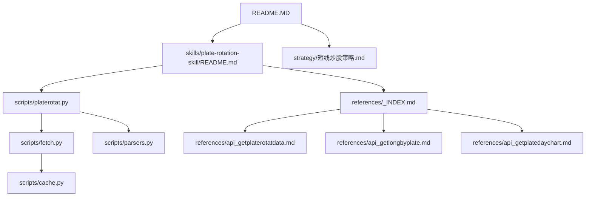
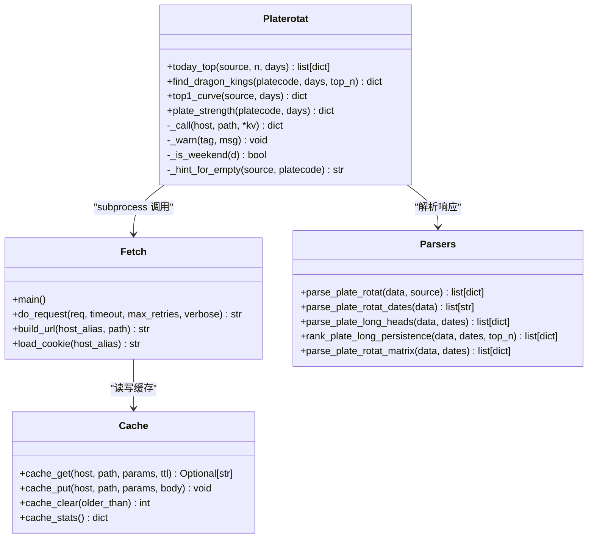
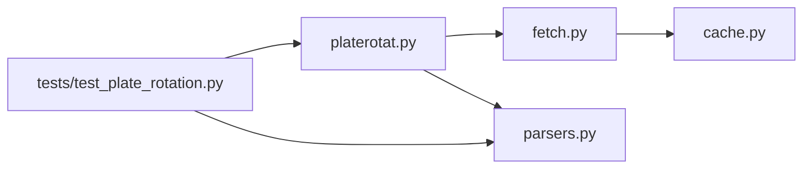
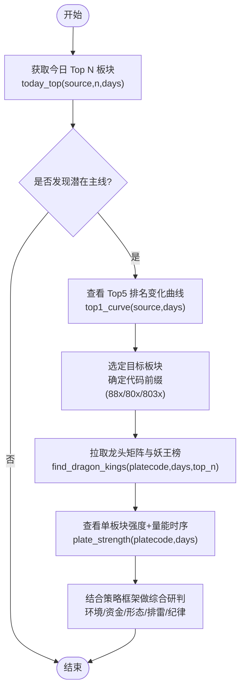

# 实战案例分析

<cite>
**本文引用的文件**   
- [README.MD](file://README.MD)
- [skills/plate-rotation-skill/README.md](file://skills/plate-rotation-skill/README.md)
- [skills/plate-rotation-skill/scripts/platerotat.py](file://skills/plate-rotation-skill/scripts/platerotat.py)
- [skills/plate-rotation-skill/scripts/fetch.py](file://skills/plate-rotation-skill/scripts/fetch.py)
- [skills/plate-rotation-skill/scripts/parsers.py](file://skills/plate-rotation-skill/scripts/parsers.py)
- [skills/plate-rotation-skill/scripts/cache.py](file://skills/plate-rotation-skill/scripts/cache.py)
- [skills/plate-rotation-skill/tests/test_plate_rotation.py](file://skills/plate-rotation-skill/tests/test_plate_rotation.py)
- [skills/plate-rotation-skill/references/_INDEX.md](file://skills/plate-rotation-skill/references/_INDEX.md)
- [skills/plate-rotation-skill/references/api_getplaterotatdata.md](file://skills/plate-rotation-skill/references/api_getplaterotatdata.md)
- [skills/plate-rotation-skill/references/api_getlongbyplate.md](file://skills/plate-rotation-skill/references/api_getlongbyplate.md)
- [skills/plate-rotation-skill/references/api_getplatedaychart.md](file://skills/plate-rotation-skill/references/api_getplatedaychart.md)
- [strategy/短线炒股策略.md](file://strategy/短线炒股策略.md)
</cite>

## 目录
1. [引言](#引言)
2. [项目结构](#项目结构)
3. [核心组件](#核心组件)
4. [架构总览](#架构总览)
5. [详细组件分析](#详细组件分析)
6. [依赖关系分析](#依赖关系分析)
7. [性能与批量处理](#性能与批量处理)
8. [实战工作流与案例](#实战工作流与案例)
9. [常见错误与排错指南](#常见错误与排错指南)
10. [结论](#结论)
11. [附录：API 参考与命令速查](#附录api-参考与命令速查)

## 引言
本文件面向“板块轮动分析”的实战需求，提供从数据获取、解析、到结论输出的完整工作流示例。围绕热点板块识别、龙头股追踪、板块轮动节奏判断等典型场景，演示如何使用 CLI 工具与 Python API 进行多维度数据分析；并给出历史回测思路、自动化脚本集成方案、性能调优与批量处理经验，以及结合基本面与技术面综合研判的方法论指引。

## 项目结构
仓库采用模块化设计：manual（方法论）、skills（数据能力）、strategy（交易策略）。其中板块轮动 Skill 位于 skills/plate-rotation-skill，包含网络调用、缓存、解析、高级封装与测试用例，形成端到端可运行的分析链路。



图表来源
- [README.MD:1-81](file://README.MD#L1-L81)
- [skills/plate-rotation-skill/README.md:1-188](file://skills/plate-rotation-skill/README.md#L1-L188)
- [skills/plate-rotation-skill/scripts/platerotat.py:1-315](file://skills/plate-rotation-skill/scripts/platerotat.py#L1-L315)
- [skills/plate-rotation-skill/scripts/fetch.py:1-230](file://skills/plate-rotation-skill/scripts/fetch.py#L1-L230)
- [skills/plate-rotation-skill/scripts/parsers.py:1-212](file://skills/plate-rotation-skill/scripts/parsers.py#L1-L212)
- [skills/plate-rotation-skill/scripts/cache.py:1-145](file://skills/plate-rotation-skill/scripts/cache.py#L1-L145)
- [skills/plate-rotation-skill/references/_INDEX.md:1-43](file://skills/plate-rotation-skill/references/_INDEX.md#L1-L43)
- [skills/plate-rotation-skill/references/api_getplaterotatdata.md:1-74](file://skills/plate-rotation-skill/references/api_getplaterotatdata.md#L1-L74)
- [skills/plate-rotation-skill/references/api_getlongbyplate.md:1-65](file://skills/plate-rotation-skill/references/api_getlongbyplate.md#L1-L65)
- [skills/plate-rotation-skill/references/api_getplatedaychart.md:1-48](file://skills/plate-rotation-skill/references/api_getplatedaychart.md#L1-L48)
- [strategy/短线炒股策略.md:1-152](file://strategy/短线炒股策略.md#L1-L152)

章节来源
- [README.MD:1-81](file://README.MD#L1-L81)
- [skills/plate-rotation-skill/README.md:1-188](file://skills/plate-rotation-skill/README.md#L1-L188)

## 核心组件
- 统一调用器 fetch.py：负责 HTTP 请求、重试、缓存、参数拼装与输出格式化。
- 解析器 parsers.py：将接口返回的 HTML-in-JSON 抽取为结构化数据（Top 板块、日期序列、龙头矩阵、强度时序等）。
- 高级封装 platerotat.py：组合底层接口，暴露 today_top/find_dragon_kings/top1_curve/plate_strength 四个高阶函数，并提供 CLI 子命令。
- 本地缓存 cache.py：基于 TTL 的文件级缓存，支持开关与统计。
- 在线测试 tests/test_plate_rotation.py：覆盖接口健康度、解析正确性、高级函数签名与 CLI 双模输出。

章节来源
- [skills/plate-rotation-skill/scripts/fetch.py:1-230](file://skills/plate-rotation-skill/scripts/fetch.py#L1-L230)
- [skills/plate-rotation-skill/scripts/parsers.py:1-212](file://skills/plate-rotation-skill/scripts/parsers.py#L1-L212)
- [skills/plate-rotation-skill/scripts/platerotat.py:1-315](file://skills/plate-rotation-skill/scripts/platerotat.py#L1-L315)
- [skills/plate-rotation-skill/scripts/cache.py:1-145](file://skills/plate-rotation-skill/scripts/cache.py#L1-L145)
- [skills/plate-rotation-skill/tests/test_plate_rotation.py:1-444](file://skills/plate-rotation-skill/tests/test_plate_rotation.py#L1-L444)

## 架构总览
整体流程：CLI/Python API → 高级封装 → 统一调用器 → 远程接口 → 响应缓存 → 解析器 → 结构化结果。

```mermaid
sequenceDiagram
participant U as "用户/Agent"
participant CLI as "CLI(platerotat.py)"
participant API as "高级封装(platerotat.py)"
participant NET as "统一调用器(fetch.py)"
participant REM as "远程接口(main)"
participant CACHE as "本地缓存(cache.py)"
participant PAR as "解析器(parsers.py)"
U->>CLI : 执行子命令(如 today/wangking/curve/strength)
CLI->>API : 调用高阶函数(today_top/find_dragon_kings/...)
API->>NET : _call(host,path,参数)
NET->>CACHE : 命中? (POST默认开启)
alt 命中
CACHE-->>NET : 返回原始body
else 未命中
NET->>REM : POST /api/* (带Referer/Cookie/UA)
REM-->>NET : JSON(html/ECharts)
NET->>CACHE : 写入缓存(TTL)
end
NET-->>API : 原始文本
API->>PAR : 解析HTML→结构化对象
PAR-->>API : 列表/字典
API-->>CLI : 打印表格或JSON
```

图表来源
- [skills/plate-rotation-skill/scripts/platerotat.py:55-71](file://skills/plate-rotation-skill/scripts/platerotat.py#L55-L71)
- [skills/plate-rotation-skill/scripts/fetch.py:128-213](file://skills/plate-rotation-skill/scripts/fetch.py#L128-L213)
- [skills/plate-rotation-skill/scripts/cache.py:59-94](file://skills/plate-rotation-skill/scripts/cache.py#L59-L94)
- [skills/plate-rotation-skill/scripts/parsers.py:20-65](file://skills/plate-rotation-skill/scripts/parsers.py#L20-L65)

## 详细组件分析

### 统一调用器 fetch.py
- 职责：构建 URL、注入 Referer/Origin/UA/Cookie、GET/POST 参数拼装、指数退避重试、TTL 缓存读写、输出美化。
- 关键点：
  - 自动注入 Referer/Origin/X-Requested-With，后端仅校验 Referer。
  - 重试策略覆盖 429/5xx 及网络异常，最大 3 次，间隔 1s/2s/4s。
  - POST 请求默认启用本地缓存，可通过 --no-cache 或环境变量关闭。
  - 支持 host alias（main/data/x/ext），ext 可直接传完整 URL。

章节来源
- [skills/plate-rotation-skill/scripts/fetch.py:38-51](file://skills/plate-rotation-skill/scripts/fetch.py#L38-L51)
- [skills/plate-rotation-skill/scripts/fetch.py:91-124](file://skills/plate-rotation-skill/scripts/fetch.py#L91-L124)
- [skills/plate-rotation-skill/scripts/fetch.py:128-213](file://skills/plate-rotation-skill/scripts/fetch.py#L128-L213)

### 本地缓存 cache.py
- 职责：按 host+path+params 生成稳定 key，落盘 JSON，TTL 控制新鲜度，支持清理与统计。
- 关键点：
  - 默认 TTL=3600s，可通过 PR_CACHE_TTL 调整；PR_CACHE_DISABLE=1 全局禁用。
  - 原子写（.tmp + os.replace）避免半写文件。
  - 提供 stats/clear 自检 CLI。

章节来源
- [skills/plate-rotation-skill/scripts/cache.py:35-55](file://skills/plate-rotation-skill/scripts/cache.py#L35-L55)
- [skills/plate-rotation-skill/scripts/cache.py:59-94](file://skills/plate-rotation-skill/scripts/cache.py#L59-L94)
- [skills/plate-rotation-skill/scripts/cache.py:98-128](file://skills/plate-rotation-skill/scripts/cache.py#L98-L128)

### 解析器 parsers.py
- 职责：将接口返回的 HTML-in-JSON 抽取为结构化数据。
- 关键函数：
  - parse_plate_rotat：解析 Top N 板块（ths 值带%，kaipan 值为纯数字强度分）。
  - parse_plate_rotat_dates：抽取日期列（newest first）。
  - parse_plate_long_heads：解析单板块每日龙头矩阵（含“当日无领涨”分支）。
  - rank_plate_long_persistence：跨天统计龙头出现频次，用于“妖王榜”。
  - parse_plate_rotat_matrix：还原 N×天矩阵，便于回溯分析。

章节来源
- [skills/plate-rotation-skill/scripts/parsers.py:20-65](file://skills/plate-rotation-skill/scripts/parsers.py#L20-L65)
- [skills/plate-rotation-skill/scripts/parsers.py:105-109](file://skills/plate-rotation-skill/scripts/parsers.py#L105-L109)
- [skills/plate-rotation-skill/scripts/parsers.py:113-153](file://skills/plate-rotation-skill/scripts/parsers.py#L113-L153)
- [skills/plate-rotation-skill/scripts/parsers.py:156-174](file://skills/plate-rotation-skill/scripts/parsers.py#L156-L174)
- [skills/plate-rotation-skill/scripts/parsers.py:68-102](file://skills/plate-rotation-skill/scripts/parsers.py#L68-L102)

### 高级封装 platerotat.py
- 职责：组合底层接口，对外暴露 4 个高阶函数与 CLI 子命令。
- 高阶函数：
  - today_top(source,n,days)：今日 Top N 板块（ths 涨幅%/kaipan 强度分）。
  - find_dragon_kings(platecode,days,top_n)：板块妖王榜（跨天龙头频次）。
  - top1_curve(source,days)：Top5 板块 N 日排名变化曲线（ECharts 数据）。
  - plate_strength(platecode,days)：单板块 N 日强度+量能时序（ECharts 数据）。
- 运行时校验：对空数据/缺字段/跨源误用给出明确 PR-EMPTY/PR-WARN 提示。
- CLI 子命令：today/wangking/curve/strength，支持 text/json 双模输出。



图表来源
- [skills/plate-rotation-skill/scripts/platerotat.py:100-219](file://skills/plate-rotation-skill/scripts/platerotat.py#L100-L219)
- [skills/plate-rotation-skill/scripts/fetch.py:128-213](file://skills/plate-rotation-skill/scripts/fetch.py#L128-L213)
- [skills/plate-rotation-skill/scripts/parsers.py:20-174](file://skills/plate-rotation-skill/scripts/parsers.py#L20-L174)
- [skills/plate-rotation-skill/scripts/cache.py:59-128](file://skills/plate-rotation-skill/scripts/cache.py#L59-L128)

章节来源
- [skills/plate-rotation-skill/scripts/platerotat.py:1-315](file://skills/plate-rotation-skill/scripts/platerotat.py#L1-L315)

### 在线测试 test_plate_rotation.py
- 覆盖范围：
  - 4 个底层 endpoint 健康度检查。
  - 5 个 parsers 函数在真实 HTML-in-JSON 上的解析正确性。
  - 4 个高级 helper 的返回结构与约束。
  - find_dragon_kings 的 88x→ths / 80x→kaipan 自动路由验证。
  - CLI 4 个子命令 text/json 双模输出。

章节来源
- [skills/plate-rotation-skill/tests/test_plate_rotation.py:1-444](file://skills/plate-rotation-skill/tests/test_plate_rotation.py#L1-L444)

## 依赖关系分析
- 模块耦合：
  - platerotat.py 依赖 fetch.py（subprocess 调用）与 parsers.py（解析）。
  - fetch.py 依赖 cache.py（本地缓存）。
  - 测试用例同时 import 上层与下层模块，确保端到端一致性。
- 外部依赖：
  - 仅使用 Python stdlib，零第三方依赖。
  - 远程接口 host 通过 HOSTS 映射，统一由 fetch.py 管理。



图表来源
- [skills/plate-rotation-skill/scripts/platerotat.py:34-48](file://skills/plate-rotation-skill/scripts/platerotat.py#L34-L48)
- [skills/plate-rotation-skill/scripts/fetch.py:31-36](file://skills/plate-rotation-skill/scripts/fetch.py#L31-L36)
- [skills/plate-rotation-skill/tests/test_plate_rotation.py:32-45](file://skills/plate-rotation-skill/tests/test_plate_rotation.py#L32-L45)

章节来源
- [skills/plate-rotation-skill/scripts/platerotat.py:34-48](file://skills/plate-rotation-skill/scripts/platerotat.py#L34-L48)
- [skills/plate-rotation-skill/scripts/fetch.py:31-36](file://skills/plate-rotation-skill/scripts/fetch.py#L31-L36)
- [skills/plate-rotation-skill/tests/test_plate_rotation.py:32-45](file://skills/plate-rotation-skill/tests/test_plate_rotation.py#L32-L45)

## 性能与批量处理
- 缓存策略：
  - POST 请求默认启用本地缓存，TTL 默认 1 小时，适合盘中高频查询。
  - 可通过 --no-cache 或 PR_CACHE_DISABLE=1 关闭缓存；--cache-ttl 调整新鲜度阈值。
- 重试机制：
  - 指数退避应对 429/5xx 与网络异常，提升稳定性。
- 批量处理建议：
  - 使用 --json 输出便于管道化与批处理。
  - 利用缓存减少重复请求，提高吞吐。
  - 合理设置 days（默认 20）平衡趋势可见性与噪声。

章节来源
- [skills/plate-rotation-skill/scripts/fetch.py:128-213](file://skills/plate-rotation-skill/scripts/fetch.py#L128-L213)
- [skills/plate-rotation-skill/scripts/cache.py:35-55](file://skills/plate-rotation-skill/scripts/cache.py#L35-L55)
- [skills/plate-rotation-skill/scripts/platerotat.py:278-310](file://skills/plate-rotation-skill/scripts/platerotat.py#L278-L310)

## 实战工作流与案例

### 工作流总览
- 目标：从数据获取到结论输出，完成热点板块识别、龙头股追踪、轮动节奏判断。
- 步骤：
  1) 今日最强板块 Top N（双源可选）
  2) 龙头股持续性（妖王榜）
  3) Top5 板块 N 日排名变化曲线
  4) 单板块强度+量能时序
  5) 结合策略框架进行综合研判



图表来源
- [skills/plate-rotation-skill/scripts/platerotat.py:100-219](file://skills/plate-rotation-skill/scripts/platerotat.py#L100-L219)
- [strategy/短线炒股策略.md:18-33](file://strategy/短线炒股策略.md#L18-L33)

### 案例一：热点板块识别（双源对照）
- 目的：快速定位当日最强板块，区分“真主线”与“偶发热点”。
- 方法：
  - 使用 today_top(source='kaipan', n=10, days=20) 获取开盘啦强度分 Top10。
  - 使用 today_top(source='ths', n=10, days=20) 获取同花顺涨幅% Top10。
  - 对比两源共同上榜的板块，作为“真主线”候选。
- 输出：
  - CLI text 表格或 JSON 结构化数据，便于后续处理。
- 参考路径：
  - [platerotat.py:100-121](file://skills/plate-rotation-skill/scripts/platerotat.py#L100-L121)
  - [parsers.py:20-65](file://skills/plate-rotation-skill/scripts/parsers.py#L20-L65)
  - [references/api_getplaterotatdata.md:44-54](file://skills/plate-rotation-skill/references/api_getplaterotatdata.md#L44-L54)

章节来源
- [skills/plate-rotation-skill/scripts/platerotat.py:100-121](file://skills/plate-rotation-skill/scripts/platerotat.py#L100-L121)
- [skills/plate-rotation-skill/scripts/parsers.py:20-65](file://skills/plate-rotation-skill/scripts/parsers.py#L20-L65)
- [skills/plate-rotation-skill/references/api_getplaterotatdata.md:44-54](file://skills/plate-rotation-skill/references/api_getplaterotatdata.md#L44-L54)

### 案例二：龙头股追踪（妖王榜）
- 目的：识别某板块过去 N 天里最频繁当龙头的股票，评估持续性。
- 方法：
  - 使用 find_dragon_kings(platecode, days=20, top_n=10)。
  - 自动根据板块代码前缀选择 source（88x→ths，80x/803x→kaipan）。
  - 输出 kings（按 count 降序）与 daily_heads（每日龙头清单）。
- 参考路径：
  - [platerotat.py:123-173](file://skills/plate-rotation-skill/scripts/platerotat.py#L123-L173)
  - [parsers.py:113-174](file://skills/plate-rotation-skill/scripts/parsers.py#L113-L174)
  - [references/api_getlongbyplate.md:44-63](file://skills/plate-rotation-skill/references/api_getlongbyplate.md#L44-L63)

章节来源
- [skills/plate-rotation-skill/scripts/platerotat.py:123-173](file://skills/plate-rotation-skill/scripts/platerotat.py#L123-L173)
- [skills/plate-rotation-skill/scripts/parsers.py:113-174](file://skills/plate-rotation-skill/scripts/parsers.py#L113-L174)
- [skills/plate-rotation-skill/references/api_getlongbyplate.md:44-63](file://skills/plate-rotation-skill/references/api_getlongbyplate.md#L44-L63)

### 案例三：板块轮动节奏判断（Top5 曲线）
- 目的：观察 Top5 板块在过去 N 日的排名变化，识别接力与退潮信号。
- 方法：
  - 使用 top1_curve(source='kaipan', days=20)，得到 ECharts 数据与 top5_names。
  - 关注连续上榜次数与排名波动，识别“老主线退潮”与“新方向接力”。
- 参考路径：
  - [platerotat.py:175-196](file://skills/plate-rotation-skill/scripts/platerotat.py#L175-L196)
  - [references/_INDEX.md:1-43](file://skills/plate-rotation-skill/references/_INDEX.md#L1-L43)

章节来源
- [skills/plate-rotation-skill/scripts/platerotat.py:175-196](file://skills/plate-rotation-skill/scripts/platerotat.py#L175-L196)
- [skills/plate-rotation-skill/references/_INDEX.md:1-43](file://skills/plate-rotation-skill/references/_INDEX.md#L1-L43)

### 案例四：单板块强度与时序（强度+量能）
- 目的：深入观察某板块近 N 日的强度与量能变化，辅助入场/离场决策。
- 方法：
  - 使用 plate_strength(platecode, days=20)，得到 legend/date/series 等 ECharts 字段。
  - legend=null 表示该板块近 N 天均未活跃；date 为空则可能上游异常。
- 参考路径：
  - [platerotat.py:199-218](file://skills/plate-rotation-skill/scripts/platerotat.py#L199-L218)
  - [references/api_getplatedaychart.md:30-47](file://skills/plate-rotation-skill/references/api_getplatedaychart.md#L30-L47)

章节来源
- [skills/plate-rotation-skill/scripts/platerotat.py:199-218](file://skills/plate-rotation-skill/scripts/platerotat.py#L199-L218)
- [skills/plate-rotation-skill/references/api_getplatedaychart.md:30-47](file://skills/plate-rotation-skill/references/api_getplatedaychart.md#L30-L47)

### 案例五：历史行情回测（方法学）
- 目标：验证分析方法的有效性（例如“双源共振”与“龙头持续性”指标对胜率/盈亏比的贡献）。
- 步骤：
  1) 选取历史窗口（如最近 60 个交易日）。
  2) 每日记录 Top5 榜单与龙头矩阵，计算“双源共振板块数”、“龙头上榜频次”。
  3) 跟踪这些板块内个股的次日/三日收益分布，统计胜率与盈亏比。
  4) 对比不同 days（10/20/30/50）与 top_n 阈值的稳健性。
- 说明：本仓库未内置回测引擎，但可通过 CLI 的 --json 输出与本地脚本实现批量采集与统计。

章节来源
- [skills/plate-rotation-skill/references/_INDEX.md:34-40](file://skills/plate-rotation-skill/references/_INDEX.md#L34-L40)
- [skills/plate-rotation-skill/scripts/platerotat.py:278-310](file://skills/plate-rotation-skill/scripts/platerotat.py#L278-L310)

### 案例六：结合基本面与技术面的综合研判
- 技术面：
  - 形态触发（放量突破平台/新高、缩量回踩均线企稳等）。
  - 量价配合与关键均线支撑/压力位。
- 基本面：
  - 业绩质量、护城河、估值合理性。
  - 治理风险（减持、质押、处罚、信披违规等）。
- 结合方式：
  - 以板块轮动工具锁定资金主线，再在主线内挑选形态刚启动且无治理雷的标的。
  - 严格止损止盈与仓位管理，遵循策略纪律。
- 参考路径：
  - [strategy/短线炒股策略.md:37-82](file://strategy/短线炒股策略.md#L37-L82)
  - [strategy/短线炒股策略.md:100-118](file://strategy/短线炒股策略.md#L100-L118)

章节来源
- [strategy/短线炒股策略.md:37-82](file://strategy/短线炒股策略.md#L37-L82)
- [strategy/短线炒股策略.md:100-118](file://strategy/短线炒股策略.md#L100-L118)

## 常见错误与排错指南
- 空数据/节假日/超前 days：
  - 现象：PR-EMPTY 警告，提示周末/节假日/参数超前/上游异常。
  - 处理：确认交易日、调整 days、检查 upstream 可用性。
- 跨源误传板块代码：
  - 现象：88x 传入 kaipan 源或 80x 传入 ths 源导致空结果。
  - 处理：依据前缀自动路由规则（88x→ths，80x/803x→kaipan）修正。
- 上游接口异常：
  - 现象：非 JSON 响应或顶层字段缺失。
  - 处理：查看 stderr 中的 PR-EMPTY/PR-WARN 提示，必要时重试或降低并发。
- CLI 参数错误：
  - 现象：缺少子命令或非法 --source 被拒绝。
  - 处理：按 argparse choices 规范传参。

章节来源
- [skills/plate-rotation-skill/scripts/platerotat.py:75-98](file://skills/plate-rotation-skill/scripts/platerotat.py#L75-L98)
- [skills/plate-rotation-skill/scripts/platerotat.py:115-121](file://skills/plate-rotation-skill/scripts/platerotat.py#L115-L121)
- [skills/plate-rotation-skill/scripts/platerotat.py:155-164](file://skills/plate-rotation-skill/scripts/platerotat.py#L155-L164)
- [skills/plate-rotation-skill/scripts/platerotat.py:210-218](file://skills/plate-rotation-skill/scripts/platerotat.py#L210-L218)
- [skills/plate-rotation-skill/tests/test_plate_rotation.py:424-440](file://skills/plate-rotation-skill/tests/test_plate_rotation.py#L424-L440)

## 结论
本实战文档展示了基于仓库现有能力的完整板块轮动分析工作流：从双源数据获取、龙头持续性评估、Top5 轮动曲线到单板块强度时序，并结合策略框架进行综合研判。通过 CLI 与 Python API 的组合，可实现高效的数据驱动分析与自动化集成；借助本地缓存与重试机制，系统具备良好的鲁棒性与可扩展性。建议在实战中坚持“先事实后逻辑”的原则，严格执行风控与纪律，持续复盘优化。

## 附录：API 参考与命令速查

### API 参考
- getPlateRotatData：板块 N 日轮动主表（from/days）
- getLongByPlate：单板块 N 日龙头矩阵（platecode/days）
- getPlateDayChart：单板块 N 日强度+量能时序（platecode/days）
- getPlateRotatChart：Top5 板块 N 日排名变化（from/days）

章节来源
- [skills/plate-rotation-skill/references/_INDEX.md:1-43](file://skills/plate-rotation-skill/references/_INDEX.md#L1-L43)
- [skills/plate-rotation-skill/references/api_getplaterotatdata.md:1-74](file://skills/plate-rotation-skill/references/api_getplaterotatdata.md#L1-L74)
- [skills/plate-rotation-skill/references/api_getlongbyplate.md:1-65](file://skills/plate-rotation-skill/references/api_getlongbyplate.md#L1-L65)
- [skills/plate-rotation-skill/references/api_getplatedaychart.md:1-48](file://skills/plate-rotation-skill/references/api_getplatedaychart.md#L1-L48)

### CLI 命令速查
- 今日 Top N 板块：python3 scripts/platerotat.py today [--source ths|kaipan] [--n N] [--days D] [--json]
- 板块妖王榜：python3 scripts/platerotat.py wangking <platecode> [--days D] [--n N] [--json]
- Top5 排名变化：python3 scripts/platerotat.py curve [--source ths|kaipan] [--days D] [--json]
- 单板块强度时序：python3 scripts/platerotat.py strength <platecode> [--days D] [--json]

章节来源
- [skills/plate-rotation-skill/scripts/platerotat.py:278-310](file://skills/plate-rotation-skill/scripts/platerotat.py#L278-L310)