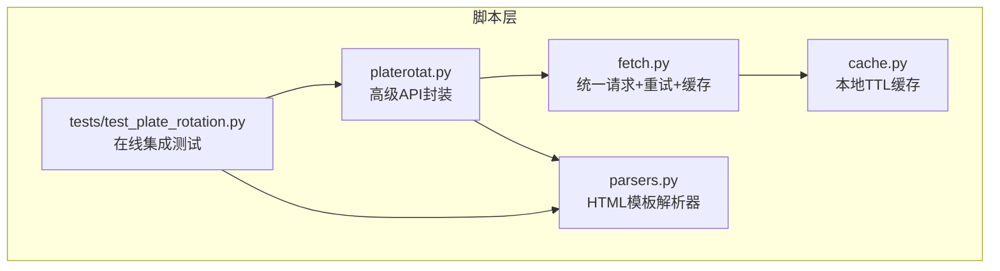
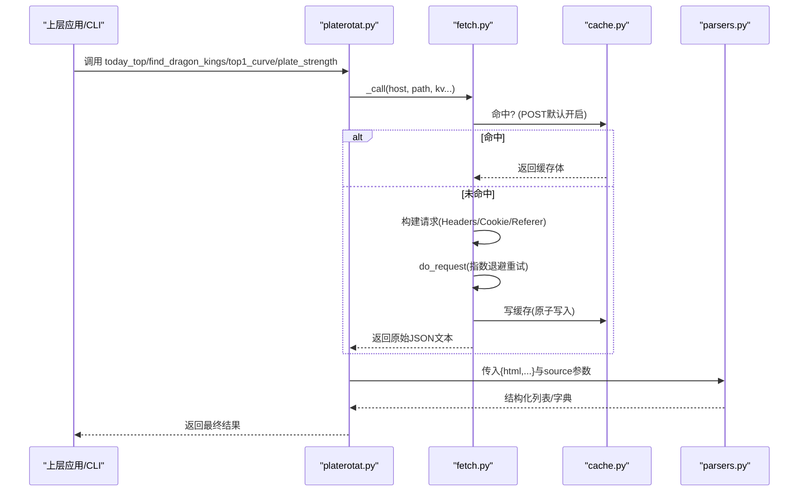
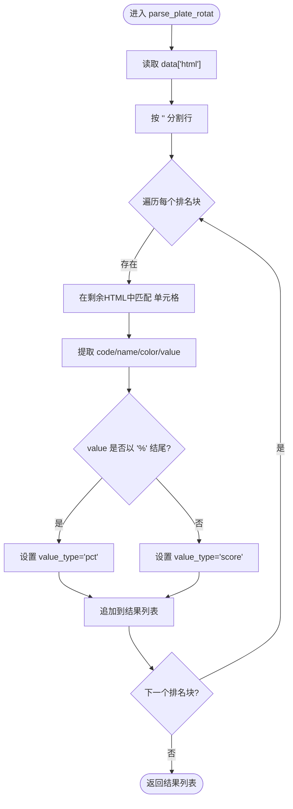
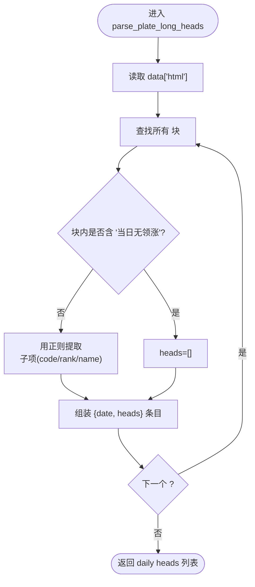
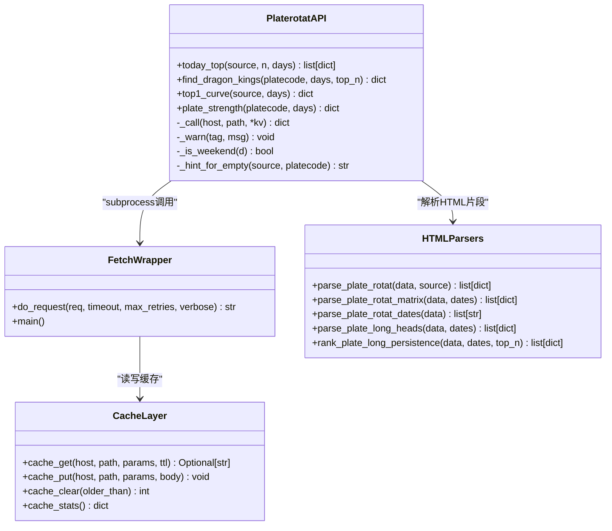
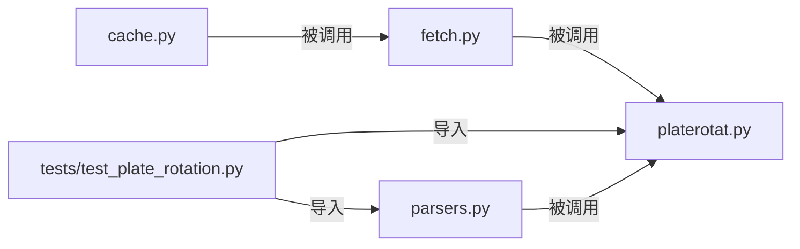

# HTML模板解析器

<cite>
**本文引用的文件**   
- [parsers.py](file://skills/plate-rotation-skill/scripts/parsers.py)
- [platerotat.py](file://skills/plate-rotation-skill/scripts/platerotat.py)
- [fetch.py](file://skills/plate-rotation-skill/scripts/fetch.py)
- [cache.py](file://skills/plate-rotation-skill/scripts/cache.py)
- [test_plate_rotation.py](file://skills/plate-rotation-skill/tests/test_plate_rotation.py)
</cite>

## 目录
1. [简介](#简介)
2. [项目结构](#项目结构)
3. [核心组件](#核心组件)
4. [架构总览](#架构总览)
5. [详细组件分析](#详细组件分析)
6. [依赖关系分析](#依赖关系分析)
7. [性能与正则优化建议](#性能与正则优化建议)
8. [故障排查指南](#故障排查指南)
9. [结论](#结论)
10. [附录：扩展自定义HTML模板解析器](#附录扩展自定义html模板解析器)

## 简介
本技术文档聚焦于板块轮动模块中的HTML模板解析器，重点解释 parsers.py 中基于正则表达式的HTML片段解析逻辑。该模块用于从“JSON包裹的HTML片段”中提取结构化数据，以支持前端通过 innerHTML 渲染的页面内容抽取。文档将深入说明：
- jQuery innerHTML 模板的处理方式、DOM结构识别与字段提取机制
- parse_plate_rotat 函数的板块数据解析流程（排名 rank、代码 code、名称 name、数值 value 等）
- 不同数据源（同花顺 vs 开盘啦）的数值格式差异处理（百分比值与强度分）
- 自定义HTML模板解析器的开发指南与扩展方法
- 正则表达式优化建议与性能调优技巧

## 项目结构
本仓库中与HTML模板解析相关的核心位于 skills/plate-rotation-skill/scripts 目录下，主要文件职责如下：
- fetch.py：统一网络请求封装，负责构造请求、重试、缓存、输出原始或格式化JSON
- cache.py：本地磁盘缓存层，提供TTL策略与原子写入
- platerotat.py：高级API封装，组合底层接口并对外暴露 today_top / find_dragon_kings / top1_curve / plate_strength
- parsers.py：HTML模板解析器，使用正则从HTML片段中抽取结构化数据
- tests/test_plate_rotation.py：在线集成测试，覆盖接口健康度、解析正确性、高级函数签名与CLI双模

图表来源
- [fetch.py:128-230](file://skills/plate-rotation-skill/scripts/fetch.py#L128-L230)
- [cache.py:59-95](file://skills/plate-rotation-skill/scripts/cache.py#L59-L95)
- [platerotat.py:55-71](file://skills/plate-rotation-skill/scripts/platerotat.py#L55-L71)
- [parsers.py:20-65](file://skills/plate-rotation-skill/scripts/parsers.py#L20-L65)
- [test_plate_rotation.py:75-118](file://skills/plate-rotation-skill/tests/test_plate_rotation.py#L75-L118)

章节来源
- [fetch.py:128-230](file://skills/plate-rotation-skill/scripts/fetch.py#L128-L230)
- [cache.py:59-95](file://skills/plate-rotation-skill/scripts/cache.py#L59-L95)
- [platerotat.py:55-71](file://skills/plate-rotation-skill/scripts/platerotat.py#L55-L71)
- [parsers.py:20-65](file://skills/plate-rotation-skill/scripts/parsers.py#L20-L65)
- [test_plate_rotation.py:75-118](file://skills/plate-rotation-skill/tests/test_plate_rotation.py#L75-L118)

## 核心组件
- HTML模板解析器（parsers.py）
  - 针对 getPlateRotatData 主表：parse_plate_rotat、parse_plate_rotat_matrix、parse_plate_rotat_dates
  - 针对板块龙头矩阵：parse_plate_long_heads、rank_plate_long_persistence
- 高级API封装（platerotat.py）
  - today_top、find_dragon_kings、top1_curve、plate_strength
- 网络请求与缓存（fetch.py + cache.py）
  - 指数退避重试、POST缓存、环境变量控制开关
- 在线集成测试（tests/test_plate_rotation.py）
  - 覆盖接口健康、解析正确性、高级函数返回结构、CLI双模

章节来源
- [parsers.py:20-175](file://skills/plate-rotation-skill/scripts/parsers.py#L20-L175)
- [platerotat.py:100-218](file://skills/plate-rotation-skill/scripts/platerotat.py#L100-L218)
- [fetch.py:128-230](file://skills/plate-rotation-skill/scripts/fetch.py#L128-L230)
- [cache.py:59-95](file://skills/plate-rotation-skill/scripts/cache.py#L59-L95)
- [test_plate_rotation.py:121-244](file://skills/plate-rotation-skill/tests/test_plate_rotation.py#L121-L244)

## 架构总览
整体调用链：上层应用或CLI → platerotat.py 高级API → fetch.py 发起HTTP请求（带重试与缓存）→ 返回JSON（其中包含html字段）→ parsers.py 对html进行正则抽取 → 得到结构化数据供上层消费。

图表来源
- [platerotat.py:55-71](file://skills/plate-rotation-skill/scripts/platerotat.py#L55-L71)
- [fetch.py:128-230](file://skills/plate-rotation-skill/scripts/fetch.py#L128-L230)
- [cache.py:59-95](file://skills/plate-rotation-skill/scripts/cache.py#L59-L95)
- [parsers.py:20-65](file://skills/plate-rotation-skill/scripts/parsers.py#L20-L65)

## 详细组件分析

### HTML模板解析器（parsers.py）
- 设计目标
  - 从“JSON包裹的HTML片段”中抽取结构化数据，适配前端innerHTML渲染的数据形态
  - 兼容多数据源（同花顺/开盘啦）的数值语义差异
- 关键函数与职责
  - parse_plate_rotat：解析主表Top N板块清单，返回包含rank/code/name/value/value_type/color的结构化列表
  - parse_plate_rotat_matrix：还原N×天矩阵，便于分析某板块上榜历史或某日整列Top
  - parse_plate_rotat_dates：从表头抽取日期序列（newest→oldest）
  - parse_plate_long_heads：解析板块龙头矩阵，按天列出龙一到龙五
  - rank_plate_long_persistence：跨天统计龙头出现次数，生成“妖王榜”

#### DOM结构与正则匹配要点
- 主表行定位：通过  分割行，再在每行内匹配 <td class='plate ...'> 单元格
- 单元格字段：
  - code/name：作为 <td> 的属性
  - color：内部  的颜色
  - value：内部  的文本，可能为百分比（如 '4.94%'）或纯数字（如 '15199'）
- 日期抽取：从表头样式文本中匹配 YYYY-MM-DD 格式的日期串

图表来源
- [parsers.py:20-65](file://skills/plate-rotation-skill/scripts/parsers.py#L20-L65)

章节来源
- [parsers.py:20-65](file://skills/plate-rotation-skill/scripts/parsers.py#L20-L65)
- [parsers.py:68-108](file://skills/plate-rotation-skill/scripts/parsers.py#L68-L108)
- [parsers.py:113-153](file://skills/plate-rotation-skill/scripts/parsers.py#L113-L153)
- [parsers.py:156-175](file://skills/plate-rotation-skill/scripts/parsers.py#L156-L175)

#### 数据源差异处理（同花顺 vs 开盘啦）
- 同花顺（ths）：value 为今日板块涨幅百分比，形如 '4.94%'，value_type='pct'
- 开盘啦（kaipan）：value 为板块强度分，纯数字，形如 '15199'，value_type='score'
- 解析逻辑通过检测 value 是否以 '%' 结尾来区分两种语义，从而保证下游可安全比较与排序

章节来源
- [parsers.py:20-65](file://skills/plate-rotation-skill/scripts/parsers.py#L20-L65)
- [test_plate_rotation.py:125-158](file://skills/plate-rotation-skill/tests/test_plate_rotation.py#L125-L158)

#### 板块龙头矩阵解析（getLongByPlate）
- 每日一个 <td>，两种style：
  - 有领涨：text-align:left;padding-bottom:5px;，内含多个 
 子项（龙一到龙五）
  - 无领涨：text-align:center;color:#bbb;...，文本“当日无领涨”
- 注意服务端HTML闭合错位（无领涨时 
 而非 </td>），解析时使用前瞻 (?=<td|$) 兜底
- 输出结构：[{date, heads:[{rank,code,name},...]}, ...]

图表来源
- [parsers.py:113-153](file://skills/plate-rotation-skill/scripts/parsers.py#L113-L153)

章节来源
- [parsers.py:113-153](file://skills/plate-rotation-skill/scripts/parsers.py#L113-L153)
- [test_plate_rotation.py:198-219](file://skills/plate-rotation-skill/tests/test_plate_rotation.py#L198-L219)

#### 妖王榜持久性统计
- 输入：daily heads 列表与 dates
- 过程：累计各股票上榜次数，记录位置信息（日期/名次）
- 输出：按 count 降序的前 top_n 名，包含 positions 列表

章节来源
- [parsers.py:156-175](file://skills/plate-rotation-skill/scripts/parsers.py#L156-L175)
- [test_plate_rotation.py:221-244](file://skills/plate-rotation-skill/tests/test_plate_rotation.py#L221-L244)

### 高级API封装（platerotat.py）
- today_top：调用 getPlateRotatData，解析后返回前 n 名板块；空数据时输出 PR-EMPTY 警告
- find_dragon_kings：自动根据板块代码前缀选择 source（88x→ths，80x/803x→kaipan），拉取日期与龙头矩阵，生成妖王榜
- top1_curve：调用 getPlateRotatChart，补充 top5_names 便利字段
- plate_strength：调用 getPlateDayChart，校验 date 与 legend 字段

图表来源
- [platerotat.py:55-71](file://skills/plate-rotation-skill/scripts/platerotat.py#L55-L71)
- [parsers.py:20-175](file://skills/plate-rotation-skill/scripts/parsers.py#L20-L175)
- [cache.py:59-95](file://skills/plate-rotation-skill/scripts/cache.py#L59-L95)

章节来源
- [platerotat.py:100-218](file://skills/plate-rotation-skill/scripts/platerotat.py#L100-L218)
- [platerotat.py:278-315](file://skills/plate-rotation-skill/scripts/platerotat.py#L278-L315)

### 网络请求与缓存（fetch.py + cache.py）
- 指数退避重试：对 429/5xx 及网络异常进行最多3次重试，间隔 1s/2s/4s
- 缓存策略：POST请求默认启用本地缓存，TTL默认3600秒，支持环境变量关闭或调整
- 输出模式：--raw 输出原始字符串，否则尝试JSON美化

章节来源
- [fetch.py:91-124](file://skills/plate-rotation-skill/scripts/fetch.py#L91-L124)
- [fetch.py:128-230](file://skills/plate-rotation-skill/scripts/fetch.py#L128-L230)
- [cache.py:59-95](file://skills/plate-rotation-skill/scripts/cache.py#L59-L95)

## 依赖关系分析
- 模块耦合
  - platerotat.py 依赖 fetch.py 和 parsers.py，形成“高层编排 + 低层实现”的清晰分层
  - fetch.py 依赖 cache.py，解耦网络IO与存储
  - tests/test_plate_rotation.py 同时依赖 platerotat.py 与 parsers.py，确保端到端正确性
- 外部依赖
  - 仅使用Python标准库（urllib、json、argparse、hashlib、pathlib等），零第三方依赖
- 潜在循环依赖
  - 当前结构无循环依赖，模块边界清晰

图表来源
- [platerotat.py:42-48](file://skills/plate-rotation-skill/scripts/platerotat.py#L42-L48)
- [parsers.py:1-16](file://skills/plate-rotation-skill/scripts/parsers.py#L1-L16)
- [fetch.py:31-36](file://skills/plate-rotation-skill/scripts/fetch.py#L31-L36)
- [test_plate_rotation.py:33-45](file://skills/plate-rotation-skill/tests/test_plate_rotation.py#L33-L45)

章节来源
- [platerotat.py:42-48](file://skills/plate-rotation-skill/scripts/platerotat.py#L42-L48)
- [parsers.py:1-16](file://skills/plate-rotation-skill/scripts/parsers.py#L1-L16)
- [fetch.py:31-36](file://skills/plate-rotation-skill/scripts/fetch.py#L31-L36)
- [test_plate_rotation.py:33-45](file://skills/plate-rotation-skill/tests/test_plate_rotation.py#L33-L45)

## 性能与正则优化建议
- 正则表达式优化
  - 预编译：对频繁使用的正则（如单元格匹配）使用 re.compile 提升性能
  - 非贪婪匹配：尽量使用非贪婪量词减少回溯开销
  - 锚点与前瞻：利用前瞻 (?=<td|$) 避免错误闭合导致的回溯
  - 字符类精简：明确字符集范围，避免 .*? 过度匹配
- 解析流程优化
  - 单次扫描：优先在一次遍历中完成多字段提取，减少多次正则搜索
  - 增量更新：对于矩阵解析，结合日期序列长度限制迭代次数
- 网络与缓存
  - 合理设置TTL：盘中数据1小时足够新鲜，可减少重复请求
  - 禁用缓存场景：调试或强刷新时通过 --no-cache 或 PR_CACHE_DISABLE=1 关闭
- 内存与I/O
  - 大HTML片段流式处理：必要时分块读取与解析，降低峰值内存占用
  - 原子写入：缓存写入采用临时文件+os.replace，避免半写损坏

章节来源
- [parsers.py:49-53](file://skills/plate-rotation-skill/scripts/parsers.py#L49-L53)
- [parsers.py:84-88](file://skills/plate-rotation-skill/scripts/parsers.py#L84-L88)
- [parsers.py:132-136](file://skills/plate-rotation-skill/scripts/parsers.py#L132-L136)
- [cache.py:79-95](file://skills/plate-rotation-skill/scripts/cache.py#L79-L95)
- [fetch.py:160-170](file://skills/plate-rotation-skill/scripts/fetch.py#L160-L170)

## 故障排查指南
- 常见错误与提示
  - PR-EMPTY：接口正常但当日无数据（节假日/参数超前/跨源错传）
  - PR-WARN：上游返回结构不完整（如legend=null表示板块未活跃）
- 诊断步骤
  - 检查返回JSON是否包含 html/date/name 等关键字段
  - 确认板块代码前缀与source匹配（88x→ths，80x/803x→kaipan）
  - 查看stderr中的PR-EMPTY/PR-WARN消息定位问题
- 网络与缓存
  - 若频繁失败，检查重试日志与超时配置
  - 清理过期缓存：python3 cache.py clear [--older SEC]
  - 禁用缓存验证：--no-cache 或 export PR_CACHE_DISABLE=1

章节来源
- [platerotat.py:75-98](file://skills/plate-rotation-skill/scripts/platerotat.py#L75-L98)
- [platerotat.py:115-120](file://skills/plate-rotation-skill/scripts/platerotat.py#L115-L120)
- [platerotat.py:155-164](file://skills/plate-rotation-skill/scripts/platerotat.py#L155-L164)
- [platerotat.py:212-218](file://skills/plate-rotation-skill/scripts/platerotat.py#L212-L218)
- [cache.py:98-116](file://skills/plate-rotation-skill/scripts/cache.py#L98-L116)

## 结论
HTML模板解析器通过精准的正则匹配与健壮的错误处理，成功从“JSON包裹的HTML片段”中抽取结构化数据，支持多数据源的数值语义差异与复杂DOM结构的容错解析。配合高级API封装与网络层重试/缓存机制，形成了高可用、易扩展的板块轮动数据管道。建议在后续迭代中持续优化正则性能、增强异常诊断能力，并完善单元测试覆盖率。

## 附录：扩展自定义HTML模板解析器
- 新增解析函数
  - 定义新函数，接收 data: dict 与可选 source 参数
  - 从 data.get("html", "") 获取HTML片段
  - 使用 re.split/re.findall/re.finditer 定位DOM节点并提取字段
  - 返回标准化结构（如列表/字典），并在必要时标注 value_type
- 兼容性策略
  - 对多数据源差异，通过 value 后缀或额外字段区分语义
  - 对服务端HTML错位，使用前瞻/断言兜底，避免严格闭合依赖
- 测试与验证
  - 在 tests/test_plate_rotation.py 中添加用例，覆盖真实在线接口
  - 验证返回结构、字段完整性、排序与约束条件
- 集成与发布
  - 在 platerotat.py 中封装高级API，统一错误提示与运行时校验
  - 更新README与CLI帮助，提供使用示例

章节来源
- [parsers.py:20-65](file://skills/plate-rotation-skill/scripts/parsers.py#L20-L65)
- [parsers.py:113-153](file://skills/plate-rotation-skill/scripts/parsers.py#L113-L153)
- [test_plate_rotation.py:121-244](file://skills/plate-rotation-skill/tests/test_plate_rotation.py#L121-L244)
- [platerotat.py:100-218](file://skills/plate-rotation-skill/scripts/platerotat.py#L100-L218)