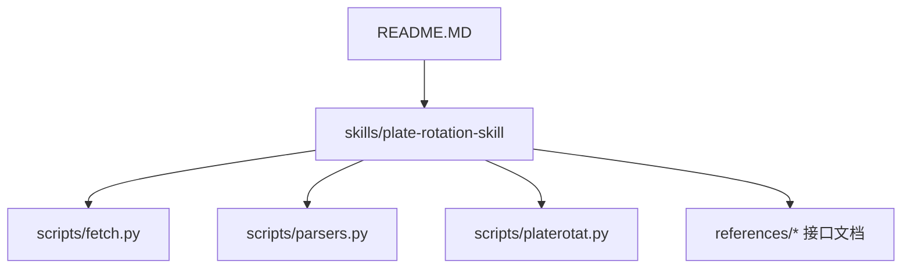
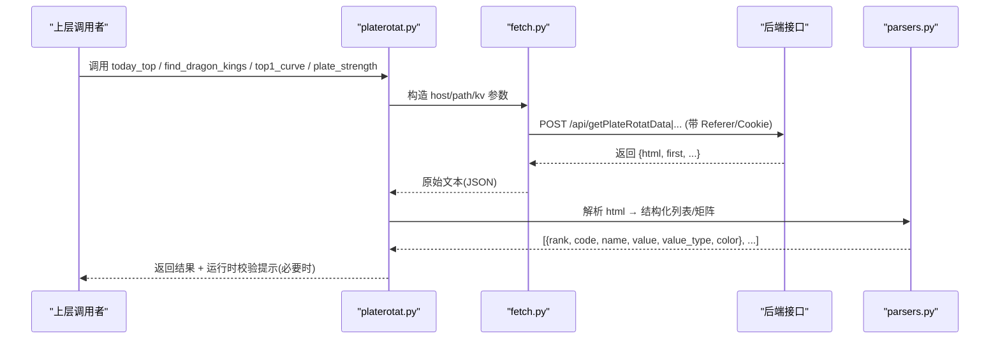
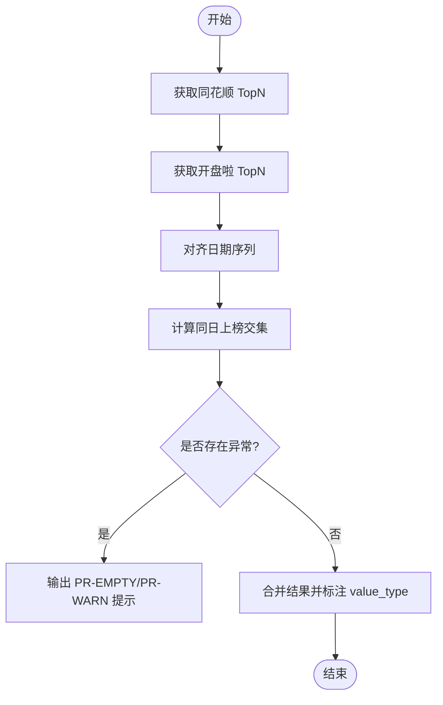
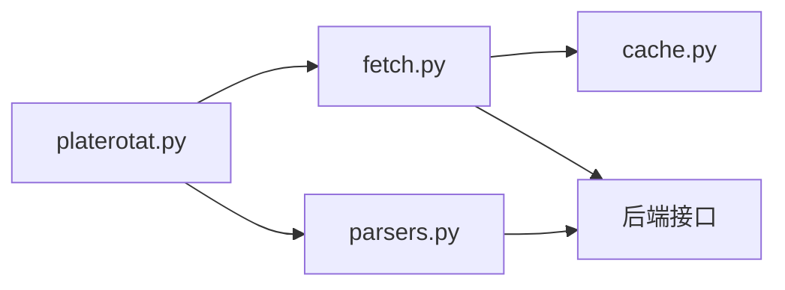

# 双源数据验证机制

<cite>
**本文引用的文件**
- [README.MD](file://README.MD)
- [_INDEX.md](file://skills/plate-rotation-skill/references/_INDEX.md)
- [stock-facts.md](file://skills/plate-rotation-skill/references/stock-facts.md)
- [api_getplaterotatdata.md](file://skills/plate-rotation-skill/references/api_getplaterotatdata.md)
- [api_getlongbyplate.md](file://skills/plate-rotation-skill/references/api_getlongbyplate.md)
- [api_getplaterotatchart.md](file://skills/plate-rotation-skill/references/api_getplaterotatchart.md)
- [api_getplatedaychart.md](file://skills/plate-rotation-skill/references/api_getplatedaychart.md)
- [fetch.py](file://skills/plate-rotation-skill/scripts/fetch.py)
- [parsers.py](file://skills/plate-rotation-skill/scripts/parsers.py)
- [platerotat.py](file://skills/plate-rotation-skill/scripts/platerotat.py)
</cite>

## 目录
1. [引言](#引言)
2. [项目结构](#项目结构)
3. [核心组件](#核心组件)
4. [架构总览](#架构总览)
5. [详细组件分析](#详细组件分析)
6. [依赖关系分析](#依赖关系分析)
7. [性能与可靠性](#性能与可靠性)
8. [故障排查指南](#故障排查指南)
9. [结论](#结论)
10. [附录](#附录)

## 引言
本技术文档围绕“同花顺”和“开盘啦”两个公开行情数据源，系统化阐述双源数据验证机制。内容覆盖：
- 数据源差异特征（格式、数值含义、更新频率）
- 数据融合算法（字段映射、冲突解决、置信度评估）
- 交叉验证流程（一致性检查、异常值检测、结果对齐）
- 质量评分系统（完整性、时效性、准确性）
- 健康监控与故障切换方案
- 自定义数据源接入的验证规则与适配方法

目标读者包括策略研发、数据工程与运维人员，力求在保持技术深度的同时提供可操作的实践指引。

## 项目结构
本项目采用模块化设计：
- manual：投资手册与体系总纲
- skills：数据能力封装，包含同花顺 iFinD 与板块轮动 Skill
- strategy：交易策略方法论与量化执行版
- README.MD：项目概览与使用说明

板块轮动 Skill 聚焦于“双源对照”，通过统一调用器 fetch.py、解析器 parsers.py 与高级 API platerotat.py 组合，完成从网络请求到结构化数据的端到端处理，并内置运行时校验与提示。

图表来源
- [README.MD:1-81](file://README.MD#L1-L81)
- [fetch.py:1-230](file://skills/plate-rotation-skill/scripts/fetch.py#L1-L230)
- [parsers.py:1-212](file://skills/plate-rotation-skill/scripts/parsers.py#L1-L212)
- [platerotat.py:1-315](file://skills/plate-rotation-skill/scripts/platerotat.py#L1-L315)

章节来源
- [README.MD:1-81](file://README.MD#L1-L81)

## 核心组件
- 统一调用器 fetch.py：负责 HTTP 请求、重试、缓存、Cookie/Referer 注入、参数组装与输出格式化。
- 解析器 parsers.py：将“HTML in JSON”响应解析为结构化列表/矩阵，兼容同花顺涨幅%与开盘啦强度分两种语义。
- 高级 API platerotat.py：封装 today_top/find_dragon_kings/top1_curve/plate_strength 四个意图函数，并提供 CLI；内置空数据/跨源错传等运行时校验与提示。
- 接口参考文档 references/*：定义接口路径、入参、出参与 HTML 模板说明，明确双源差异与板块前缀强语义。

章节来源
- [fetch.py:1-230](file://skills/plate-rotation-skill/scripts/fetch.py#L1-L230)
- [parsers.py:1-212](file://skills/plate-rotation-skill/scripts/parsers.py#L1-L212)
- [platerotat.py:1-315](file://skills/plate-rotation-skill/scripts/platerotat.py#L1-L315)
- [_INDEX.md:1-43](file://skills/plate-rotation-skill/references/_INDEX.md#L1-L43)

## 架构总览
整体数据流从上层意图函数出发，经 fetch.py 发起网络请求，返回“HTML in JSON”后由 parsers.py 抽取结构化数据，再由 platerotat.py 进行聚合与校验，最终输出供策略或可视化使用。

图表来源
- [platerotat.py:55-71](file://skills/plate-rotation-skill/scripts/platerotat.py#L55-L71)
- [fetch.py:128-213](file://skills/plate-rotation-skill/scripts/fetch.py#L128-L213)
- [parsers.py:20-65](file://skills/plate-rotation-skill/scripts/parsers.py#L20-L65)

## 详细组件分析

### 数据源差异特征
- 数值含义与单位
  - 同花顺（ths）：当日板块涨幅%，带“%”符号，如“4.94%”。
  - 开盘啦（kaipan）：板块强度分，纯整数，无“%”，如“15199”。
- 适用板块前缀
  - 同花顺：88x 板块（如 886084）。
  - 开盘啦：80x/803x 板块（如 801807、803023）。
- 不可直接比较
  - 两套数值各自排序，不能跨源说“A 比 B 强多少”。正则需兼容“%?”以捕获两类数值。
- 更新频率
  - 接口默认按 days 回溯，支持 10/20/30/50 档；日期序列 newest→oldest。交易日 T+1 更新常见，节假日可能为空。

章节来源
- [_INDEX.md:16-32](file://skills/plate-rotation-skill/references/_INDEX.md#L16-L32)
- [stock-facts.md:11-32](file://skills/plate-rotation-skill/references/stock-facts.md#L11-L32)
- [api_getplaterotatdata.md:45-54](file://skills/plate-rotation-skill/references/api_getplaterotatdata.md#L45-L54)

### 数据融合算法
- 字段映射规则
  - 统一输出字段：rank、code、name、value、value_type、color。
  - value_type 区分：pct（同花顺涨幅%）、score（开盘啦强度分）。
  - 日期对齐：通过 parse_plate_rotat_dates 提取表头日期，保证多日矩阵列对齐。
- 冲突解决策略
  - 跨源不可直接比较：仅在各自源内排序；对比时仅做“是否上榜”的一致性判断。
  - 板块代码前缀强约束：88x 仅用于 ths，80x/803x 仅用于 kaipan；find_dragon_kings 自动推断 source。
- 置信度评估模型
  - 基于“是否上榜”的二元信号：同一板块在同一天两源均上榜视为高置信主线；仅单源上榜视为弱信号。
  - 持续性加分：在多日窗口内频繁上榜提升置信度（妖王榜统计）。
  - 未活跃标记：ECharts 中 value=10.5 且 symbol=wu.png 表示当日未上榜，作为低置信度点。

章节来源
- [parsers.py:20-65](file://skills/plate-rotation-skill/scripts/parsers.py#L20-L65)
- [parsers.py:105-109](file://skills/plate-rotation-skill/scripts/parsers.py#L105-L109)
- [platerotat.py:125-172](file://skills/plate-rotation-skill/scripts/platerotat.py#L125-L172)
- [api_getplaterotatchart.md:46-52](file://skills/plate-rotation-skill/references/api_getplaterotatchart.md#L46-L52)

### 交叉验证流程
- 数据一致性检查
  - 同日 Top N 榜单：分别取 ths 与 kaipan 的 Top N，计算交集与差集，识别共振与孤立热点。
  - 龙头矩阵对齐：用 parse_plate_long_heads 与 parse_plate_rotat_dates 对齐日期，逐日比对龙头出现情况。
- 异常值检测
  - 空数据告警：PR-EMPTY 标签提示周末/节假日/跨源错传/上游异常等可能原因。
  - 未活跃检测：legend=null 或 date 列为空时触发 PR-WARN/PR-EMPTY。
- 结果对齐机制
  - 日期序列 newest→oldest，确保主表与龙头矩阵时序一致。
  - Top5 排名变化曲线中，未上榜点以固定占位符表示，便于时间轴对齐。

图表来源
- [platerotat.py:102-120](file://skills/plate-rotation-skill/scripts/platerotat.py#L102-L120)
- [platerotat.py:155-172](file://skills/plate-rotation-skill/scripts/platerotat.py#L155-L172)
- [parsers.py:105-109](file://skills/plate-rotation-skill/scripts/parsers.py#L105-L109)

### 质量评分系统
- 数据完整性评估
  - 必填字段存在性：rank/code/name/value/color/date 等。
  - 矩阵行列完整：parse_plate_rotat_matrix 要求 dates 长度与单元格数匹配。
- 时效性检查
  - 周末/节假日判定：_is_weekend 辅助判断，结合 PR-EMPTY 提示。
  - 最近日期有效性：date 列表非空且最新日期合理。
- 准确性验证
  - 数值类型校验：value_type=pct 时含“%”，score 时为纯数字。
  - 未活跃点识别：ECharts 中 wu.png 占位符。
  - 龙头频次统计：rank_plate_long_persistence 用于识别持续性强标的。

章节来源
- [platerotat.py:80-97](file://skills/plate-rotation-skill/scripts/platerotat.py#L80-L97)
- [parsers.py:68-102](file://skills/plate-rotation-skill/scripts/parsers.py#L68-L102)
- [parsers.py:156-174](file://skills/plate-rotation-skill/scripts/parsers.py#L156-L174)
- [api_getplaterotatchart.md:46-52](file://skills/plate-rotation-skill/references/api_getplaterotatchart.md#L46-L52)

### 健康监控与故障切换
- 健康指标
  - 成功率：HTTP 成功码占比（排除 4xx 非重试码）。
  - 延迟分布：请求耗时分位数（P50/P90/P99）。
  - 缓存命中率：POST 请求命中本地缓存比例。
  - 空数据率：PR-EMPTY/PR-WARN 触发频率。
- 监控实现建议
  - 在 fetch.py 的请求前后埋点，记录耗时与状态码。
  - 对 PR-EMPTY/PR-WARN 计数并上报。
  - 定期巡检缓存目录与 TTL 配置。
- 故障切换
  - 指数退避重试：针对 429/5xx 与网络异常，最多 3 次，间隔 1s/2s/4s。
  - 降级策略：当连续失败超过阈值，切换到只读缓存或返回空结果并告警。
  - 多 host 别名：main/data/x/ext，可按环境或可用性选择。

章节来源
- [fetch.py:47-50](file://skills/plate-rotation-skill/scripts/fetch.py#L47-L50)
- [fetch.py:91-124](file://skills/plate-rotation-skill/scripts/fetch.py#L91-L124)
- [fetch.py:159-168](file://skills/plate-rotation-skill/scripts/fetch.py#L159-L168)
- [platerotat.py:75-97](file://skills/plate-rotation-skill/scripts/platerotat.py#L75-L97)

### 自定义数据源接入的验证规则与适配方法
- 接入步骤
  - 新增 host alias 或在 ext 模式下传入完整 URL。
  - 在 fetch.py 中扩展 HOSTS 字典或复用 ext 模式。
  - 在 parsers.py 中新增解析函数，定义新的 value_type 与字段映射。
  - 在 platerotat.py 中增加高级 helper，并补充运行时校验逻辑。
- 验证规则
  - 输入参数校验：from/source 枚举、days 取值范围、dates 格式。
  - 输出结构校验：必需字段存在性与类型正确性。
  - 领域规则校验：板块前缀强语义、数值单位一致性。
- 适配方法
  - 若新源数值带“%”，沿用 pct 分支；若为内部分数，沿用 score 分支。
  - 若返回 HTML in JSON，复用 parsers 的正则抽取范式；否则直接解析 JSON。
  - 为新源添加 PR-EMPTY/PR-WARN 提示，确保下游可观测。

章节来源
- [fetch.py:38-42](file://skills/plate-rotation-skill/scripts/fetch.py#L38-L42)
- [parsers.py:20-65](file://skills/plate-rotation-skill/scripts/parsers.py#L20-L65)
- [platerotat.py:102-120](file://skills/plate-rotation-skill/scripts/platerotat.py#L102-L120)

## 依赖关系分析
- 模块耦合
  - platerotat.py 依赖 fetch.py（subprocess 调用）与 parsers.py（解析函数）。
  - fetch.py 依赖 cache.py（同目录）与标准库 urllib。
- 外部依赖
  - 后端接口：/api/getPlateRotatData、/api/getLongByPlate、/api/getPlateRotatChart、/api/getPlateDayChart。
  - Cookie/Referer：后端仅校验 Referer，fetch.py 自动注入。
- 潜在循环依赖
  - 当前脚本间单向依赖，无循环引用。

图表来源
- [platerotat.py:34-48](file://skills/plate-rotation-skill/scripts/platerotat.py#L34-L48)
- [fetch.py:31-36](file://skills/plate-rotation-skill/scripts/fetch.py#L31-L36)

章节来源
- [platerotat.py:1-315](file://skills/plate-rotation-skill/scripts/platerotat.py#L1-L315)
- [fetch.py:1-230](file://skills/plate-rotation-skill/scripts/fetch.py#L1-L230)
- [parsers.py:1-212](file://skills/plate-rotation-skill/scripts/parsers.py#L1-L212)

## 性能与可靠性
- 性能优化
  - 缓存：POST 请求默认落盘缓存，TTL 可调，减少重复请求。
  - 重试：指数退避降低瞬时失败影响。
  - 输出优化：raw 模式避免二次 JSON 解析开销。
- 可靠性增强
  - 健壮的网络层异常捕获与错误信息输出。
  - 运行时校验与提示帮助快速定位问题。
  - 多 host 别名便于灰度与回滚。

[本节为通用指导，不直接分析具体文件]

## 故障排查指南
- 常见问题
  - 空数据：周末/节假日/跨源错传/上游异常。
  - 跨源错传：88x 传到 kaipan 或反之，导致空结果。
  - 未活跃：legend=null 或 date 为空。
- 定位方法
  - 查看 stderr 中的 PR-EMPTY/PR-WARN 提示。
  - 使用 --verbose 打印 URL/body/cookie 自检。
  - 使用 --no-cache 禁用缓存以排除缓存污染。
- 恢复措施
  - 修正 from/source 与 platecode 前缀。
  - 调整 days/dates 参数。
  - 等待后端恢复或切换 host 别名。

章节来源
- [platerotat.py:85-97](file://skills/plate-rotation-skill/scripts/platerotat.py#L85-L97)
- [platerotat.py:155-172](file://skills/plate-rotation-skill/scripts/platerotat.py#L155-L172)
- [fetch.py:193-207](file://skills/plate-rotation-skill/scripts/fetch.py#L193-L207)

## 结论
双源数据验证机制通过“统一调用 + 解析 + 高级 API + 运行时校验”的分层设计，有效化解了同花顺与开盘啦在数值语义、板块前缀与时序上的差异。借助一致性检查、异常值检测与质量评分，系统能够在复杂市场环境下稳定输出高质量洞察。未来可在健康监控与自动化切换方面进一步增强，以提升整体可用性与可观测性。

[本节为总结，不直接分析具体文件]

## 附录
- 接口清单与用途
  - getPlateRotatData：板块 N 日轮动主表（HTML in JSON），from/ths/kaipan，days 可选 10/20/30/50。
  - getLongByPlate：单板块 N 日龙头股矩阵，platecode 必填。
  - getPlateRotatChart：Top5 板块 N 日排名变化 ECharts。
  - getPlateDayChart：单板块 N 日强度+量能 ECharts。
- 关键约定
  - 全部 host=main，全部 POST，后端仅校验 Referer。
  - 日期序列 newest→oldest，未上榜以固定占位符表示。
  - 板块前缀强语义：88x=ths，80x/803x=kaipan。

章节来源
- [_INDEX.md:1-43](file://skills/plate-rotation-skill/references/_INDEX.md#L1-L43)
- [api_getplaterotatdata.md:1-74](file://skills/plate-rotation-skill/references/api_getplaterotatdata.md#L1-L74)
- [api_getlongbyplate.md:1-65](file://skills/plate-rotation-skill/references/api_getlongbyplate.md#L1-L65)
- [api_getplaterotatchart.md:1-53](file://skills/plate-rotation-skill/references/api_getplaterotatchart.md#L1-L53)
- [api_getplatedaychart.md:1-48](file://skills/plate-rotation-skill/references/api_getplatedaychart.md#L1-L48)