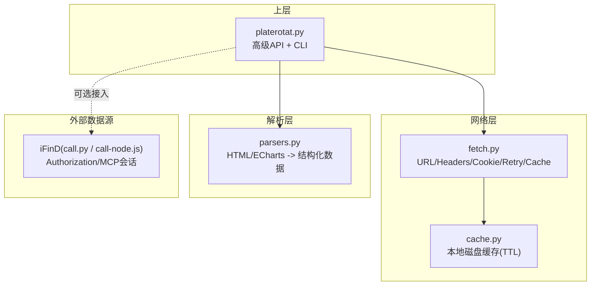
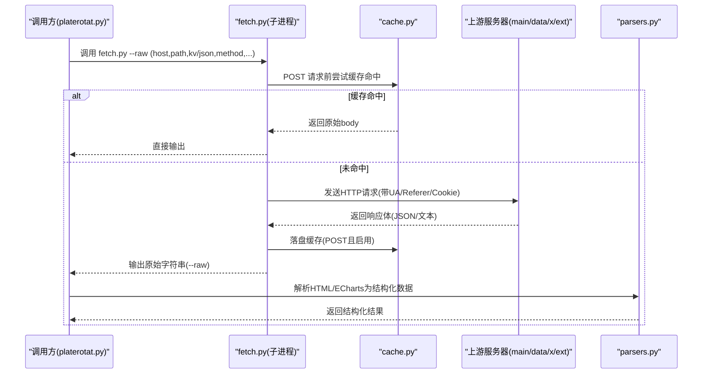
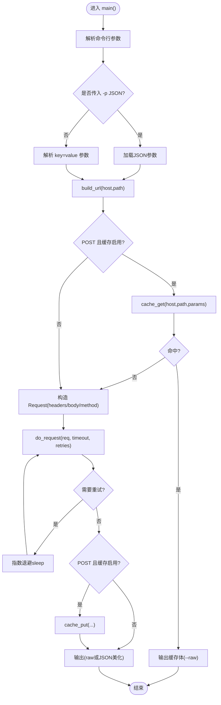
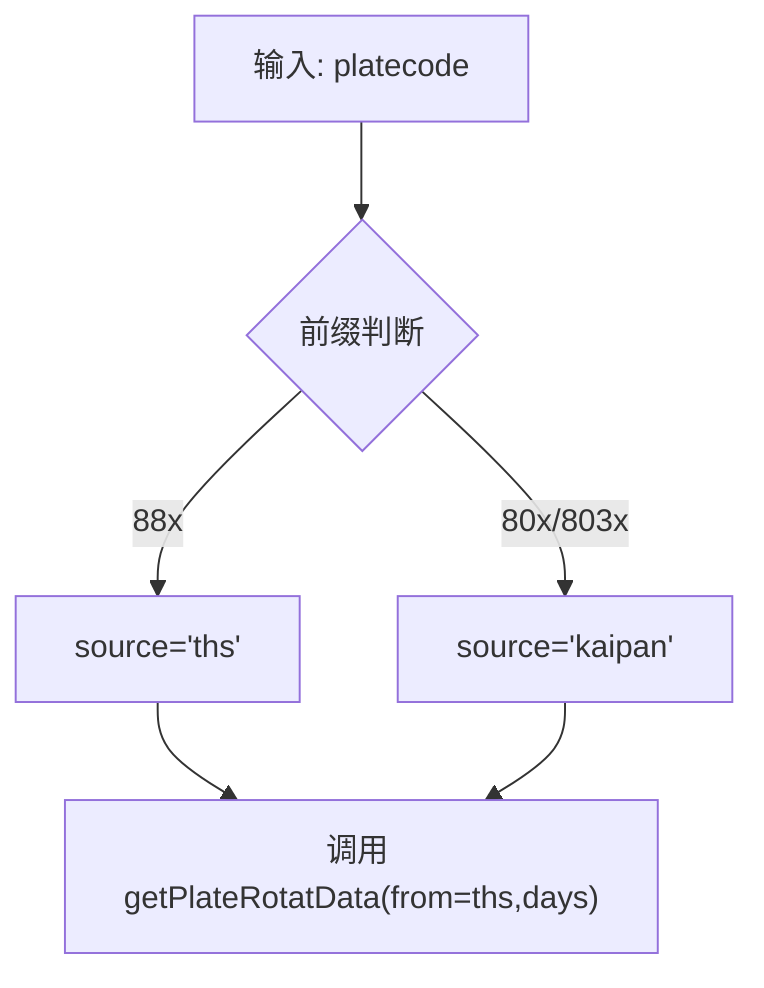
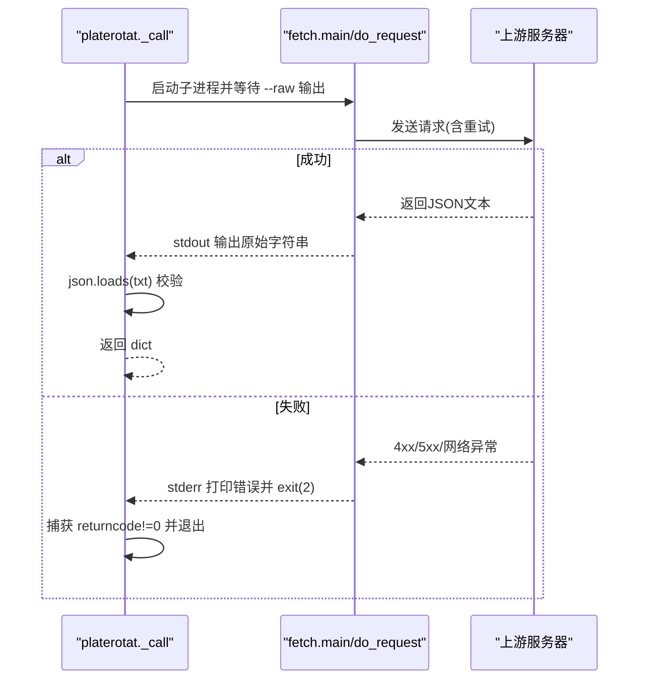
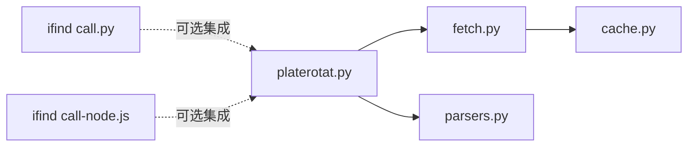

# 数据获取引擎

<cite>
**本文引用的文件**   
- [fetch.py](file://skills/plate-rotation-skill/scripts/fetch.py)
- [parsers.py](file://skills/plate-rotation-skill/scripts/parsers.py)
- [cache.py](file://skills/plate-rotation-skill/scripts/cache.py)
- [platerotat.py](file://skills/plate-rotation-skill/scripts/platerotat.py)
- [_INDEX.md](file://skills/plate-rotation-skill/references/_INDEX.md)
- [api_getplaterotatdata.md](file://skills/plate-rotation-skill/references/api_getplaterotatdata.md)
- [api_getlongbyplate.md](file://skills/plate-rotation-skill/references/api_getlongbyplate.md)
- [api_getplaterotatchart.md](file://skills/plate-rotation-skill/references/api_getplaterotatchart.md)
- [api_getplatedaychart.md](file://skills/plate-rotation-skill/references/api_getplatedaychart.md)
- [call.py](file://skills/ifind-finance-data-1.3.0/call.py)
- [call-node.js](file://skills/ifind-finance-data-1.3.0/call-node.js)
</cite>

## 目录
1. [简介](#简介)
2. [项目结构](#项目结构)
3. [核心组件](#核心组件)
4. [架构总览](#架构总览)
5. [详细组件分析](#详细组件分析)
6. [依赖关系分析](#依赖关系分析)
7. [性能与并发特性](#性能与并发特性)
8. [故障排查指南](#故障排查指南)
9. [结论](#结论)
10. [附录：自定义数据源集成指南](#附录自定义数据源集成指南)

## 简介
本技术文档围绕“数据获取引擎”展开，聚焦于 scripts/fetch.py 的 HTTP 请求构建机制、多数据源路由策略（同花顺 iFinD 与开盘啦）、响应处理流程（JSON 校验、错误码处理、超时重试）、并发与资源管理，以及扩展新数据源的适配模式。同时结合 platerotat.py 的高级封装与 parsers.py 的解析器，给出端到端的数据流说明与可操作的最佳实践。

## 项目结构
该技能包采用分层组织：
- 网络层：scripts/fetch.py 统一负责 URL 组装、请求头注入、认证 Cookie、缓存命中、指数退避重试与输出格式化。
- 业务封装层：scripts/platerotat.py 提供面向意图的 API（今日 Top、妖王榜、Top5 曲线、单板块强度），内部通过 subprocess 调用 fetch.py，并做 JSON 校验与空结果提示。
- 解析层：scripts/parsers.py 将后端返回的 HTML-in-JSON 或 ECharts 结构解析为结构化列表/矩阵。
- 缓存层：scripts/cache.py 提供本地磁盘缓存（TTL、原子写、全局开关）。
- 参考文档：references/*.md 定义接口契约、参数与字段语义。
- 外部数据源：skills/ifind-finance-data-1.3.0 提供 iFinD MCP 服务调用示例（Python/Node），用于理解认证令牌与多服务端点路由。

图表来源
- [platerotat.py:55-71](file://skills/plate-rotation-skill/scripts/platerotat.py#L55-L71)
- [fetch.py:128-213](file://skills/plate-rotation-skill/scripts/fetch.py#L128-L213)
- [cache.py:59-94](file://skills/plate-rotation-skill/scripts/cache.py#L59-L94)
- [parsers.py:20-65](file://skills/plate-rotation-skill/scripts/parsers.py#L20-L65)
- [call.py:31-56](file://skills/ifind-finance-data-1.3.0/call.py#L31-L56)
- [call-node.js:30-78](file://skills/ifind-finance-data-1.3.0/call-node.js#L30-L78)

章节来源
- [platerotat.py:1-315](file://skills/plate-rotation-skill/scripts/platerotat.py#L1-L315)
- [fetch.py:1-230](file://skills/plate-rotation-skill/scripts/fetch.py#L1-L230)
- [parsers.py:1-212](file://skills/plate-rotation-skill/scripts/parsers.py#L1-L212)
- [cache.py:1-145](file://skills/plate-rotation-skill/scripts/cache.py#L1-L145)
- [_INDEX.md:1-32](file://skills/plate-rotation-skill/references/_INDEX.md#L1-L32)

## 核心组件
- fetch.py：HTTP 客户端原子层。负责 host alias 到 base URL 映射、GET/POST 参数组装、标准请求头注入、Cookie 读取、缓存命中分支、指数退避重试、异常分类与退出码控制、JSON 美化输出。
- cache.py：本地缓存。基于 SHA1 稳定键生成、按 TTL 过期、原子写入、环境变量开关与清理统计。
- platerotat.py：高级 API 封装。组合底层接口，自动推断 source（根据板块代码前缀），对空结果进行运行时诊断提示。
- parsers.py：响应解析器。从 HTML-in-JSON 中抽取板块排名、日期列、龙头矩阵等；支持矩阵化与持久性统计。
- references/*.md：接口契约与字段语义说明，作为上层调用的权威依据。

章节来源
- [fetch.py:67-124](file://skills/plate-rotation-skill/scripts/fetch.py#L67-L124)
- [cache.py:47-94](file://skills/plate-rotation-skill/scripts/cache.py#L47-L94)
- [platerotat.py:102-172](file://skills/plate-rotation-skill/scripts/platerotat.py#L102-L172)
- [parsers.py:20-102](file://skills/plate-rotation-skill/scripts/parsers.py#L20-L102)
- [api_getplaterotatdata.md:1-74](file://skills/plate-rotation-skill/references/api_getplaterotatdata.md#L1-L74)

## 架构总览
数据获取引擎以“高层意图 → 子进程调用 → 网络层 → 缓存层 → 解析层”的流水线组织。上层通过 platerotat.py 暴露 today_top/find_dragon_kings/top1_curve/plate_strength 四个函数；它们通过 subprocess 调用 fetch.py 完成一次幂等的网络访问，并在必要时使用 parsers.py 将 HTML/ECharts 转为结构化数据。

图表来源
- [platerotat.py:55-71](file://skills/plate-rotation-skill/scripts/platerotat.py#L55-L71)
- [fetch.py:159-213](file://skills/plate-rotation-skill/scripts/fetch.py#L159-L213)
- [cache.py:59-94](file://skills/plate-rotation-skill/scripts/cache.py#L59-L94)
- [parsers.py:20-102](file://skills/plate-rotation-skill/scripts/parsers.py#L20-L102)

## 详细组件分析

### fetch.py：HTTP 请求构建与执行
- URL 组装
  - host alias 映射：main/data/x 对应不同 base URL；ext 允许传入完整 URL。
  - path 规范化：若不以 "/" 开头则自动补全。
- 参数组装
  - GET：将 kv 字典序列化为查询串拼接至 URL。
  - POST：默认 application/x-www-form-urlencoded；也支持 -p 传入 JSON 参数（但当前实现仍按 form 编码）。
- 请求头设置
  - UA/Accept/Language/Referer/Origin/X-Requested-With 固定注入。
  - Cookie 优先读环境变量 PR_COOKIE，其次 ~/.plate_rotation_cookie 文件中首行 domain=cookie_string。
- 认证令牌管理
  - 本模块仅支持 Cookie 认证；iFinD 的 Authorization 令牌由独立模块 call.py/call-node.js 管理，不在 fetch.py 内。
- 重试与超时
  - 指数退避：针对 429/5xx 及网络异常，最多重试 3 次，间隔 1s/2s/4s。
  - 非重试状态码（其他 4xx）直接抛出异常并退出。
  - 超时由 --timeout 控制，默认 15 秒。
- 缓存策略
  - 仅 POST 请求默认启用缓存；可通过 --no-cache 或 PR_CACHE_DISABLE=1 关闭。
  - 缓存键 = sha1(host + "\n" + path + "\n" + sorted_form_kv)，避免参数顺序影响。
  - TTL 默认 3600 秒，可通过 --cache-ttl 调整。
- 输出格式
  - --raw 输出原始字符串；否则尝试 JSON 美化，失败回退 raw。

图表来源
- [fetch.py:128-213](file://skills/plate-rotation-skill/scripts/fetch.py#L128-L213)
- [cache.py:59-94](file://skills/plate-rotation-skill/scripts/cache.py#L59-L94)

章节来源
- [fetch.py:67-124](file://skills/plate-rotation-skill/scripts/fetch.py#L67-L124)
- [fetch.py:128-213](file://skills/plate-rotation-skill/scripts/fetch.py#L128-L213)
- [cache.py:47-94](file://skills/plate-rotation-skill/scripts/cache.py#L47-L94)

### 多数据源路由逻辑（同花顺 iFinD 与开盘啦）
- 同花顺 vs 开盘啦选择
  - 通过 from=ths 或 from=kaipan 切换数据源。
  - 数值含义不同：ths 为涨幅百分比（带 %），kaipan 为强度分（纯整数）。
  - 板块代码前缀强语义：88x 属于同花顺，80x/803x 属于开盘啦。
- 自动路由
  - find_dragon_kings 根据 platecode 前缀自动选择 source：88x→ths，80x/803x→kaipan。
- 参考契约
  - references/_INDEX.md 明确双源差异与适用板块前缀。
  - api_getplaterotatdata.md 定义了 from/days 入参与 html 字段结构。

图表来源
- [platerotat.py:145-150](file://skills/plate-rotation-skill/scripts/platerotat.py#L145-L150)
- [_INDEX.md:16-32](file://skills/plate-rotation-skill/references/_INDEX.md#L16-L32)
- [api_getplaterotatdata.md:22-28](file://skills/plate-rotation-skill/references/api_getplaterotatdata.md#L22-L28)

章节来源
- [platerotat.py:145-150](file://skills/plate-rotation-skill/scripts/platerotat.py#L145-L150)
- [_INDEX.md:16-32](file://skills/plate-rotation-skill/references/_INDEX.md#L16-L32)
- [api_getplaterotatdata.md:22-28](file://skills/plate-rotation-skill/references/api_getplaterotatdata.md#L22-L28)

### 响应处理流程（JSON 验证、错误状态码、超时重试）
- JSON 验证
  - platerotat._call 强制要求 --raw 输出为合法 JSON，否则终止并打印错误上下文。
- 错误状态码
  - fetch.do_request 对 429/5xx 进行指数退避重试；其他 4xx 直接抛出异常并退出。
- 超时重试
  - 网络层异常（URLError/TimeoutError/ConnectionError）纳入重试队列；最终失败抛出 RuntimeError 并退出码 2。
- 输出格式化
  - fetch._output 尝试 JSON 美化，失败回退 raw；上层 --raw 透传原始字符串。

图表来源
- [platerotat.py:55-71](file://skills/plate-rotation-skill/scripts/platerotat.py#L55-L71)
- [fetch.py:91-124](file://skills/plate-rotation-skill/scripts/fetch.py#L91-L124)
- [fetch.py:216-226](file://skills/plate-rotation-skill/scripts/fetch.py#L216-L226)

章节来源
- [platerotat.py:55-71](file://skills/plate-rotation-skill/scripts/platerotat.py#L55-L71)
- [fetch.py:91-124](file://skills/plate-rotation-skill/scripts/fetch.py#L91-L124)
- [fetch.py:216-226](file://skills/plate-rotation-skill/scripts/fetch.py#L216-L226)

### 并发请求控制与资源管理
- 并发模型
  - 当前实现为串行：每个高级 helper 通过 subprocess 串行调用 fetch.py，无内置线程池或协程调度。
- 资源管理
  - 子进程隔离：网络 I/O 在子进程中完成，父进程只负责参数拼装与结果解析。
  - 缓存落盘：POST 请求成功后原子写入本地磁盘，减少重复网络开销。
  - Cookie 文件：按需读取，避免频繁 IO。
- 可扩展方向
  - 可在 platerotat 层引入 asyncio + aiohttp 或 concurrent.futures 实现并发；或在 fetch.py 中增加连接复用与连接池（需替换 urllib.request）。

章节来源
- [platerotat.py:55-71](file://skills/plate-rotation-skill/scripts/platerotat.py#L55-L71)
- [cache.py:79-94](file://skills/plate-rotation-skill/scripts/cache.py#L79-L94)

### 解析器（parsers.py）：HTML-in-JSON 与 ECharts 结构化
- parse_plate_rotat：从 html 字段抽取 Top N 板块清单，区分 ths（%）与 kaipan（分数）。
- parse_plate_rotat_matrix：将主表还原为 N×天矩阵，便于时序分析。
- parse_plate_long_heads：从龙头矩阵中提取每日龙头股（兼容“当日无领涨”场景）。
- rank_plate_long_persistence：跨天统计龙头出现频次，识别“妖王”。

章节来源
- [parsers.py:20-102](file://skills/plate-rotation-skill/scripts/parsers.py#L20-L102)
- [parsers.py:113-175](file://skills/plate-rotation-skill/scripts/parsers.py#L113-L175)

## 依赖关系分析
- 模块耦合
  - platerotat.py 依赖 fetch.py（subprocess）与 parsers.py（import）。
  - fetch.py 依赖 cache.py（import）。
  - 所有网络调用均通过 fetch.py 统一出口，降低上层耦合度。
- 外部依赖
  - iFinD 模块（call.py/call-node.js）独立于 fetch.py，使用 Authorization 令牌与 MCP 会话 ID，适合扩展为新的数据源适配器。

图表来源
- [platerotat.py:34-48](file://skills/plate-rotation-skill/scripts/platerotat.py#L34-L48)
- [fetch.py:31-36](file://skills/plate-rotation-skill/scripts/fetch.py#L31-L36)
- [call.py:1-56](file://skills/ifind-finance-data-1.3.0/call.py#L1-L56)
- [call-node.js:1-40](file://skills/ifind-finance-data-1.3.0/call-node.js#L1-L40)

章节来源
- [platerotat.py:34-48](file://skills/plate-rotation-skill/scripts/platerotat.py#L34-L48)
- [fetch.py:31-36](file://skills/plate-rotation-skill/scripts/fetch.py#L31-L36)
- [call.py:1-56](file://skills/ifind-finance-data-1.3.0/call.py#L1-L56)
- [call-node.js:1-40](file://skills/ifind-finance-data-1.3.0/call-node.js#L1-L40)

## 性能与并发特性
- 缓存命中率
  - 同一 host/path/params 组合在 TTL 内命中本地缓存，显著降低网络开销。
- 重试与退避
  - 指数退避有效缓解瞬时拥塞（429/5xx），提升整体成功率。
- 序列化与解析
  - 上层强制 JSON 校验，避免下游解析异常；HTML 正则抽取在内存中进行，复杂度与行数线性相关。
- 建议优化
  - 在高并发场景下，考虑在 platerotat 层引入异步并发与连接池；或将 fetch.py 改造为共享库而非子进程。

[本节为通用指导，不直接分析具体文件]

## 故障排查指南
- 常见错误定位
  - 非 JSON 响应：检查 platerotat._call 的 JSONDecodeError 日志与 --raw 输出。
  - 4xx 非重试状态码：确认请求参数与 Referer/Cookie 是否正确。
  - 网络异常/超时：增大 --timeout 或检查网络连通性与代理配置。
  - 缓存问题：PR_CACHE_DISABLE=1 临时禁用缓存；cache.py stats/clear 辅助诊断。
- 空数据提示
  - 当结果为空时，platerotat 会输出 PR-EMPTY 警告，包含可能原因（周末、跨源错传、节假日/上游异常）。

章节来源
- [platerotat.py:75-98](file://skills/plate-rotation-skill/scripts/platerotat.py#L75-L98)
- [platerotat.py:55-71](file://skills/plate-rotation-skill/scripts/platerotat.py#L55-L71)
- [cache.py:119-128](file://skills/plate-rotation-skill/scripts/cache.py#L119-L128)

## 结论
数据获取引擎以 fetch.py 为核心，配合 platerotat.py 的高级封装与 parsers.py 的解析能力，形成高内聚、低耦合的网络数据管线。其优势在于：
- 统一的请求构建与重试策略，增强鲁棒性。
- 本地缓存与原子写，提高吞吐与稳定性。
- 清晰的双源路由与板块前缀约束，避免误用。
- 明确的错误与空数据提示，便于自动化系统容错。

[本节为总结，不直接分析具体文件]

## 附录：自定义数据源集成指南

### 新增 API 端点
- 在 references 目录下新增接口文档（如 api_xxx.md），明确 host、path、method、入参与出参。
- 在 _INDEX.md 中补充路由表条目，确保上层能正确发现与调用。

章节来源
- [_INDEX.md:1-32](file://skills/plate-rotation-skill/references/_INDEX.md#L1-L32)

### 数据源适配器开发模式
- 方案一：沿用 fetch.py 子进程模式
  - 在上层 platerotat 中新增 helper，通过 subprocess 调用 fetch.py，传入新的 host/path/kv。
  - 在 parsers.py 中新增解析函数，将新接口的 HTML/ECharts 转为结构化数据。
- 方案二：扩展 fetch.py 的请求头与认证
  - 如需 Token 认证（如 iFinD），可在 headers 中注入 Authorization 字段，并从环境变量或配置文件读取令牌。
  - 注意保持与现有 Cookie 机制的兼容性，避免冲突。
- 方案三：并行接入 iFinD 独立模块
  - 直接使用 ifind-finance-data 的 call.py/call-node.js 作为独立数据源，通过 platerotat 编排组合结果。
  - 该模块已实现 Authorization 与 MCP 会话管理，可直接复用。

章节来源
- [call.py:31-56](file://skills/ifind-finance-data-1.3.0/call.py#L31-L56)
- [call-node.js:30-78](file://skills/ifind-finance-data-1.3.0/call-node.js#L30-L78)
- [fetch.py:171-181](file://skills/plate-rotation-skill/scripts/fetch.py#L171-L181)

### 网络异常处理与降级策略
- 重试与退避
  - 利用 do_request 的指数退避，对 429/5xx 与网络异常进行自动恢复。
- 降级路径
  - 启用本地缓存：在 POST 请求后落盘，后续相同请求直接命中缓存。
  - 空数据告警：通过 PR-EMPTY 提示快速定位问题（周末/跨源错传/上游异常）。
  - 超时保护：合理设置 --timeout，避免长时间阻塞。

章节来源
- [fetch.py:91-124](file://skills/plate-rotation-skill/scripts/fetch.py#L91-L124)
- [cache.py:59-94](file://skills/plate-rotation-skill/scripts/cache.py#L59-L94)
- [platerotat.py:75-98](file://skills/plate-rotation-skill/scripts/platerotat.py#L75-L98)