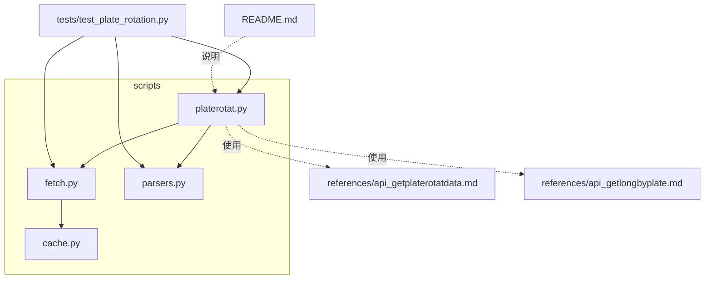
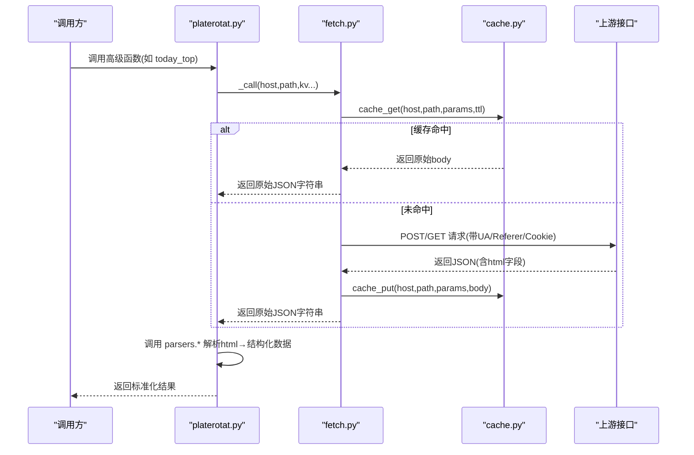
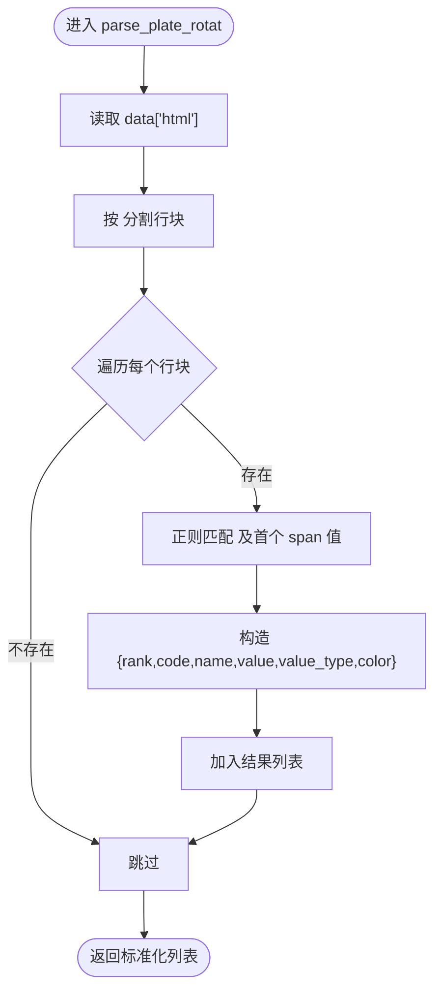
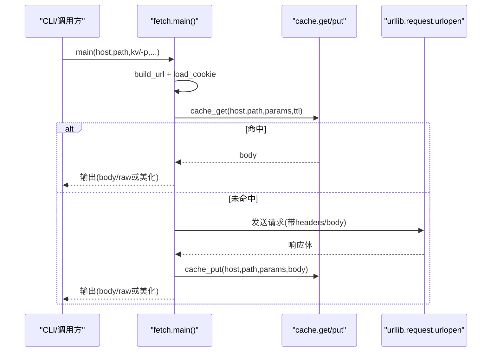
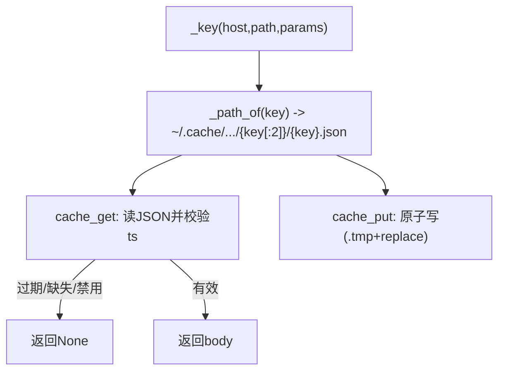
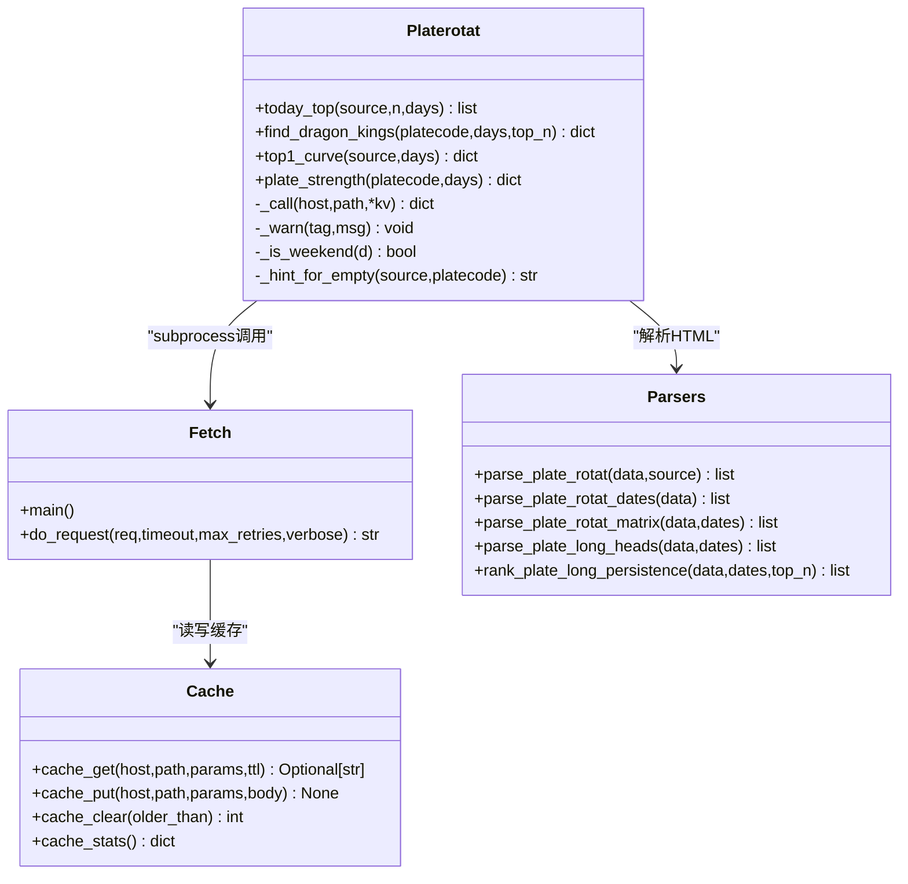
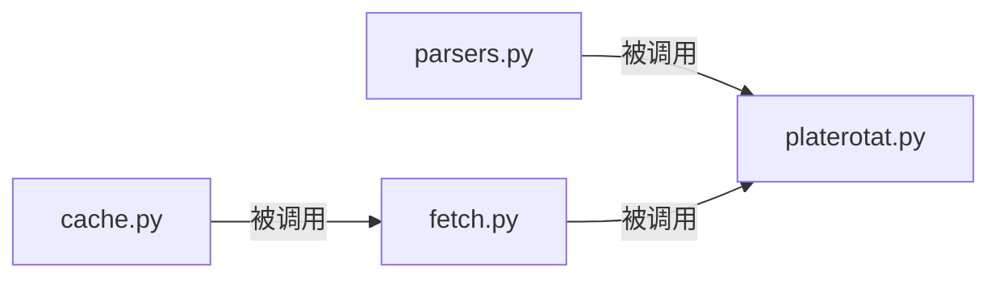

# 数据解析与处理机制

<cite>
**本文引用的文件**   
- [parsers.py](file://skills/plate-rotation-skill/scripts/parsers.py)
- [fetch.py](file://skills/plate-rotation-skill/scripts/fetch.py)
- [cache.py](file://skills/plate-rotation-skill/scripts/cache.py)
- [platerotat.py](file://skills/plate-rotation-skill/scripts/platerotat.py)
- [test_plate_rotation.py](file://skills/plate-rotation-skill/tests/test_plate_rotation.py)
- [README.md](file://skills/plate-rotation-skill/README.md)
- [api_getplaterotatdata.md](file://skills/plate-rotation-skill/references/api_getplaterotatdata.md)
- [api_getlongbyplate.md](file://skills/plate-rotation-skill/references/api_getlongbyplate.md)
</cite>

## 目录
1. [简介](#简介)
2. [项目结构](#项目结构)
3. [核心组件](#核心组件)
4. [架构总览](#架构总览)
5. [详细组件分析](#详细组件分析)
6. [依赖关系分析](#依赖关系分析)
7. [性能考量](#性能考量)
8. [故障排查指南](#故障排查指南)
9. [结论](#结论)
10. [附录：自定义解析器开发指南](#附录自定义解析器开发指南)

## 简介
本技术文档聚焦“板块轮动”数据解析与处理机制，围绕以下目标展开：
- 深入解析 parsers.py 中基于 HTML 模板的解析逻辑（含 jQuery innerHTML 渲染场景）与数据结构标准化过程。
- 梳理 fetch.py 的数据获取流程：HTTP 请求构建、响应处理、错误重试机制。
- 详解 cache.py 的缓存系统设计：目录结构、TTL 策略、清理机制。
- 说明双源数据对比验证的实现原理（同花顺 vs 开盘啦），包括差异处理与结果融合。
- 提供自定义解析器的扩展点与开发指南。
- 给出性能监控与调试工具的使用建议。

## 项目结构
该 Skill 采用脚本化分层设计：
- scripts/fetch.py：网络调用原子层，统一 Cookie/Referer/User-Agent、重试与缓存。
- scripts/cache.py：本地磁盘缓存原子层，提供 get/put/clear/stats 等能力。
- scripts/parsers.py：HTML-in-JSON 解析器集合，将前端 innerHTML 渲染的片段抽取为结构化数据。
- scripts/platerotat.py：高级 API 封装，组合 fetch+parsers，对外暴露“一个意图一个函数”的入口。
- tests/test_plate_rotation.py：在线集成测试，覆盖接口健康度、解析正确性、高级 helper 返回结构与 CLI 行为。
- references/*：API 参考文档，描述接口入参、出参与 HTML 模板约定。
- README.md：使用说明与方法论。

图表来源
- [platerotat.py:1-315](file://skills/plate-rotation-skill/scripts/platerotat.py#L1-L315)
- [fetch.py:1-230](file://skills/plate-rotation-skill/scripts/fetch.py#L1-L230)
- [cache.py:1-145](file://skills/plate-rotation-skill/scripts/cache.py#L1-L145)
- [parsers.py:1-212](file://skills/plate-rotation-skill/scripts/parsers.py#L1-L212)
- [test_plate_rotation.py:1-444](file://skills/plate-rotation-skill/tests/test_plate_rotation.py#L1-L444)
- [api_getplaterotatdata.md:1-74](file://skills/plate-rotation-skill/references/api_getplaterotatdata.md#L1-L74)
- [api_getlongbyplate.md:1-65](file://skills/plate-rotation-skill/references/api_getlongbyplate.md#L1-L65)
- [README.md:1-188](file://skills/plate-rotation-skill/README.md#L1-L188)

章节来源
- [README.md:1-188](file://skills/plate-rotation-skill/README.md#L1-L188)

## 核心组件
- 数据获取层（fetch.py）：负责参数组装、URL 构建、请求头注入、指数退避重试、可选缓存命中/落盘、输出格式化。
- 缓存层（cache.py）：以 SHA1(host+path+sorted_params) 作为 key，按 TTL 控制新鲜度；支持全局开关、统计与清理。
- 解析层（parsers.py）：针对“JSON 包裹 HTML 片段”的接口，用正则从 HTML 中提取板块排名、代码、名称、数值与颜色，并标准化为统一结构。
- 高级 API（platerotat.py）：组合底层接口与解析器，提供 today_top、find_dragon_kings、top1_curve、plate_strength 四个面向业务的高阶函数，并内置运行时校验与提示。

章节来源
- [fetch.py:1-230](file://skills/plate-rotation-skill/scripts/fetch.py#L1-L230)
- [cache.py:1-145](file://skills/plate-rotation-skill/scripts/cache.py#L1-L145)
- [parsers.py:1-212](file://skills/plate-rotation-skill/scripts/parsers.py#L1-L212)
- [platerotat.py:1-315](file://skills/plate-rotation-skill/scripts/platerotat.py#L1-L315)

## 架构总览
整体数据流：上层调用 platerotat.py 的高级函数 → 通过 fetch.py 发起 HTTP 请求（可命中缓存）→ 得到 JSON（其中 html 字段包含前端 innerHTML 渲染片段）→ 由 parsers.py 解析为结构化列表/矩阵 → 上层进行二次聚合或可视化。

图表来源
- [platerotat.py:55-71](file://skills/plate-rotation-skill/scripts/platerotat.py#L55-L71)
- [fetch.py:128-213](file://skills/plate-rotation-skill/scripts/fetch.py#L128-L213)
- [cache.py:59-94](file://skills/plate-rotation-skill/scripts/cache.py#L59-L94)
- [parsers.py:20-65](file://skills/plate-rotation-skill/scripts/parsers.py#L20-L65)

## 详细组件分析

### 解析器模块（parsers.py）
- 核心职责
  - 将“JSON 中的 html 字段”（前端 innerHTML 渲染片段）解析为标准化的 Python 列表/矩阵。
  - 兼容双源语义：ths 的 value 是涨幅百分比（带 %），kaipan 的 value 是强度分（纯数字）。
- 关键函数
  - parse_plate_rotat(data, source): 提取今日 Top N 板块清单，标准化为 {rank, code, name, value, value_type, color}。
  - parse_plate_rotat_dates(data): 从表头抽取日期序列（newest→oldest）。
  - parse_plate_rotat_matrix(data, dates): 还原 N×天矩阵，便于跨日分析。
  - parse_plate_long_heads(data, dates): 解析某板块每日龙头股（龙一到龙五），兼容“当日无领涨”的 td。
  - rank_plate_long_persistence(data, dates, top_n): 统计跨天上榜次数，生成“妖王榜”。
- HTML 模板要点
  - 主表行以 N 标记排名。
  - 每个板块单元格 <td class='plate plate{code}' ...> 内含 name 与当日值（第一个 td）。
  - 龙头表每列代表一天，有领涨时包含若干 
，无领涨时文本为“当日无领涨”。
- 数据结构标准化
  - 统一字段名与类型，value_type 区分 pct/score，color 统一为 red/green。
  - 矩阵与持久化统计均基于标准化后的单元结构。

图表来源
- [parsers.py:20-65](file://skills/plate-rotation-skill/scripts/parsers.py#L20-L65)
- [parsers.py:68-102](file://skills/plate-rotation-skill/scripts/parsers.py#L68-L102)
- [parsers.py:105-108](file://skills/plate-rotation-skill/scripts/parsers.py#L105-L108)
- [parsers.py:113-153](file://skills/plate-rotation-skill/scripts/parsers.py#L113-L153)
- [parsers.py:156-174](file://skills/plate-rotation-skill/scripts/parsers.py#L156-L174)

章节来源
- [parsers.py:1-212](file://skills/plate-rotation-skill/scripts/parsers.py#L1-L212)
- [api_getplaterotatdata.md:43-74](file://skills/plate-rotation-skill/references/api_getplaterotatdata.md#L43-L74)
- [api_getlongbyplate.md:44-65](file://skills/plate-rotation-skill/references/api_getlongbyplate.md#L44-L65)

### 数据获取层（fetch.py）
- 功能概览
  - 统一 host alias 解析（main/data/x/ext），自动拼接 base URL。
  - 支持两种参数姿势：key=value 与 -p JSON；POST 默认走缓存。
  - 自动注入 UA/Referer/Origin/X-Requested-With，可选 Cookie。
  - 指数退避重试：对 429/5xx 与网络异常进行最多 3 次重试（1s/2s/4s）。
  - 输出：--raw 输出原始字符串，否则尝试 JSON 美化。
- 请求构建与执行
  - GET：将 params 编码到 URL query。
  - POST：将 params 编码为 application/x-www-form-urlencoded body。
  - do_request：捕获 HTTPError/URLError/TimeoutError/ConnectionError 等，非重试码直接抛出 RuntimeError。
- 缓存集成
  - 仅对 POST 启用缓存；命中则直接返回；未命中则在成功后写入缓存。
  - 可通过 --no-cache / PR_CACHE_DISABLE=1 关闭缓存；--cache-ttl 调整 TTL。

图表来源
- [fetch.py:68-76](file://skills/plate-rotation-skill/scripts/fetch.py#L68-L76)
- [fetch.py:91-124](file://skills/plate-rotation-skill/scripts/fetch.py#L91-L124)
- [fetch.py:128-213](file://skills/plate-rotation-skill/scripts/fetch.py#L128-L213)
- [cache.py:59-94](file://skills/plate-rotation-skill/scripts/cache.py#L59-L94)

章节来源
- [fetch.py:1-230](file://skills/plate-rotation-skill/scripts/fetch.py#L1-L230)

### 缓存层（cache.py）
- 目录结构
  - 根路径：~/.cache/plate-rotation（可通过 PR_CACHE_DIR 覆盖）。
  - 二级目录：key[:2]（前两位哈希），文件名：key.json。
- Key 生成
  - sha1(host + "\n" + path + "\n" + sorted_form_kv)，保证参数顺序无关。
- TTL 策略
  - 默认 3600 秒（PR_CACHE_TTL 可覆盖）。
  - 盘中“今日”数据 1 小时足够新鲜且避免重复请求；历史 N 日数据一小时内不变，命中率高。
  - 强刷新：传 ttl=0 或设置 PR_CACHE_DISABLE=1。
- 清理与诊断
  - cache_clear(older_than=0)：清理超过 N 秒的缓存，返回删除数量。
  - cache_stats()：返回 count、total_bytes、root。
  - 损坏文件自动删除并 miss。

图表来源
- [cache.py:47-55](file://skills/plate-rotation-skill/scripts/cache.py#L47-L55)
- [cache.py:59-94](file://skills/plate-rotation-skill/scripts/cache.py#L59-L94)
- [cache.py:98-128](file://skills/plate-rotation-skill/scripts/cache.py#L98-L128)

章节来源
- [cache.py:1-145](file://skills/plate-rotation-skill/scripts/cache.py#L1-L145)

### 高级 API（platerotat.py）
- 四大高阶函数
  - today_top(source,n,days)：今日 Top N 板块，source 决定 value 语义（ths=涨幅%，kaipan=强度分）。
  - find_dragon_kings(platecode,days,top_n)：根据板块代码自动选择 source（88x→ths，80x/803x→kaipan），结合主表日期与龙头表统计“妖王榜”。
  - top1_curve(source,days)：Top5 板块 N 日排名变化曲线，补全 top5_names 便利字段。
  - plate_strength(platecode,days)：单板块 N 日强度+量能时序，legend=null 表示未活跃。
- 运行时校验
  - 空数据或缺关键字段时，stderr 输出 PR-EMPTY/PR-WARN 提示，帮助下游 Agent 区分节假日/参数超前/跨源错传等情况。
- 内部路由
  - 根据 platecode 前缀推断 source，确保 getPlateRotatData 与 getLongByPlate 的参数一致性。

图表来源
- [platerotat.py:102-218](file://skills/plate-rotation-skill/scripts/platerotat.py#L102-L218)
- [platerotat.py:55-71](file://skills/plate-rotation-skill/scripts/platerotat.py#L55-L71)
- [parsers.py:20-174](file://skills/plate-rotation-skill/scripts/parsers.py#L20-L174)
- [fetch.py:91-124](file://skills/plate-rotation-skill/scripts/fetch.py#L91-L124)
- [cache.py:59-94](file://skills/plate-rotation-skill/scripts/cache.py#L59-L94)

章节来源
- [platerotat.py:1-315](file://skills/plate-rotation-skill/scripts/platerotat.py#L1-L315)

### 双源数据对比验证
- 数据源差异
  - 同花顺（ths）：value 为“当日板块涨幅%”，单位带 %，排序越大越强。
  - 开盘啦（kaipan）：value 为“板块强度分”，纯整数，综合多因子，数字越大越强。
- 自动路由
  - find_dragon_kings 依据 platecode 前缀自动选择 source：88x→ths，80x/803x→kaipan。
- 结果融合
  - 今日 Top 榜单分别按各自语义排序，不跨源比较绝对大小。
  - 通过“双源都上榜 = 真主线；只在 ths = 偶发热点；只在 kaipan = 老热点退潮”的策略进行形态判断（方法论见 README）。
- 运行时校验
  - 当返回空或字段缺失时，输出 PR-EMPTY/PR-WARN 提示，辅助定位跨源错传、节假日或上游异常。

章节来源
- [api_getplaterotatdata.md:43-74](file://skills/plate-rotation-skill/references/api_getplaterotatdata.md#L43-L74)
- [README.md:81-97](file://skills/plate-rotation-skill/README.md#L81-L97)
- [platerotat.py:125-172](file://skills/plate-rotation-skill/scripts/platerotat.py#L125-L172)

## 依赖关系分析
- 模块耦合
  - platerotat.py 依赖 fetch.py（子进程调用）与 parsers.py（解析）。
  - fetch.py 依赖 cache.py（get/put）。
  - parsers.py 无外部依赖，仅依赖 stdlib。
- 外部依赖
  - 全部使用 Python 标准库，零第三方依赖。
- 潜在循环依赖
  - 当前无循环依赖；各层职责清晰。

图表来源
- [platerotat.py:42-48](file://skills/plate-rotation-skill/scripts/platerotat.py#L42-L48)
- [fetch.py:36](file://skills/plate-rotation-skill/scripts/fetch.py#L36)

章节来源
- [platerotat.py:1-315](file://skills/plate-rotation-skill/scripts/platerotat.py#L1-L315)
- [fetch.py:1-230](file://skills/plate-rotation-skill/scripts/fetch.py#L1-L230)
- [cache.py:1-145](file://skills/plate-rotation-skill/scripts/cache.py#L1-L145)
- [parsers.py:1-212](file://skills/plate-rotation-skill/scripts/parsers.py#L1-L212)

## 性能考量
- 缓存命中率
  - 合理设置 TTL（默认 1 小时）可显著降低重复请求；历史 N 日数据在短期内稳定，命中率高。
- 重试与超时
  - 指数退避减少瞬时拥塞失败影响；建议根据网络环境调整 --max-retries 与 --timeout。
- I/O 原子写
  - 缓存写入采用 tmp 文件 + os.replace，避免半写文件导致解析失败。
- 解析复杂度
  - 正则扫描 HTML 片段，时间复杂度近似 O(n)（n 为 HTML 长度）；矩阵与持久化统计为线性聚合。

[本节为通用指导，无需特定文件引用]

## 故障排查指南
- 常见问题定位
  - 空数据：检查是否为周末/节假日、days 是否超前、platecode 是否与 source 匹配。
  - 跨源错传：88x 传入 kaipan 或 80x/803x 传入 ths 会导致空结果。
  - 上游异常：非 JSON 响应或缺少顶层字段会触发 PR-EMPTY/PR-WARN 警告。
- 调试手段
  - 使用 fetch.py 的 -v 打印 URL、body、cookie 摘要与重试信息。
  - 使用 --raw 输出原始字符串，便于观察真实响应。
  - 使用 cache.py stats/clear 查看缓存状态与清理旧缓存。
- 日志与断言
  - 高级函数 stderr 输出 PR-EMPTY/PR-WARN，下游可据此快速识别问题。
  - 单元测试覆盖接口健康度、解析正确性与 CLI 行为，可作为回归基线。

章节来源
- [platerotat.py:75-98](file://skills/plate-rotation-skill/scripts/platerotat.py#L75-L98)
- [fetch.py:128-213](file://skills/plate-rotation-skill/scripts/fetch.py#L128-L213)
- [cache.py:119-128](file://skills/plate-rotation-skill/scripts/cache.py#L119-L128)
- [test_plate_rotation.py:74-118](file://skills/plate-rotation-skill/tests/test_plate_rotation.py#L74-L118)

## 结论
本机制通过“网络层 + 缓存层 + 解析层 + 高级 API”的分层设计，实现了高内聚、低耦合的板块轮动数据处理管线。其亮点在于：
- 对“HTML-in-JSON”的前端渲染片段进行稳健的正则抽取与标准化。
- 双源差异化语义的统一抽象与自动路由，避免跨源误用。
- 轻量级本地缓存与指数退避重试，提升鲁棒性与性能。
- 完善的运行时校验与测试覆盖，保障稳定性与可维护性。

[本节为总结，无需特定文件引用]

## 附录：自定义解析器开发指南
- 扩展点
  - 新增接口：在 references/ 下补充 API 参考文档（入参、出参、HTML 模板约定）。
  - 新增解析函数：在 parsers.py 中添加对应解析函数，遵循现有标准化结构（统一字段名与类型）。
  - 新增高级函数：在 platerotat.py 中封装调用链，并在 stderr 输出 PR-EMPTY/PR-WARN 提示。
- 最佳实践
  - 保持正则健壮性：考虑服务端 HTML 错位与样式差异，使用前瞻/后顾或宽松匹配兜底。
  - 明确 value_type：对多源数据务必标注语义（如 pct/score），禁止跨源直接比较。
  - 增加单元测试：在 tests/ 中补充在线集成测试，覆盖健康度、解析正确性与 CLI 行为。
- 示例路径
  - 参考 parse_plate_rotat、parse_plate_long_heads 的实现风格与返回值结构。
  - 参考 find_dragon_kings 的自动路由与运行时校验模式。

章节来源
- [parsers.py:20-174](file://skills/plate-rotation-skill/scripts/parsers.py#L20-L174)
- [platerotat.py:102-218](file://skills/plate-rotation-skill/scripts/platerotat.py#L102-L218)
- [api_getplaterotatdata.md:43-74](file://skills/plate-rotation-skill/references/api_getplaterotatdata.md#L43-L74)
- [api_getlongbyplate.md:44-65](file://skills/plate-rotation-skill/references/api_getlongbyplate.md#L44-L65)
- [test_plate_rotation.py:120-244](file://skills/plate-rotation-skill/tests/test_plate_rotation.py#L120-L244)