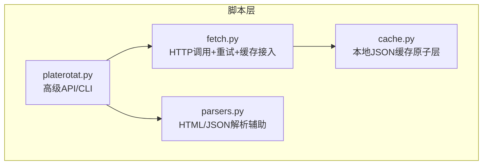
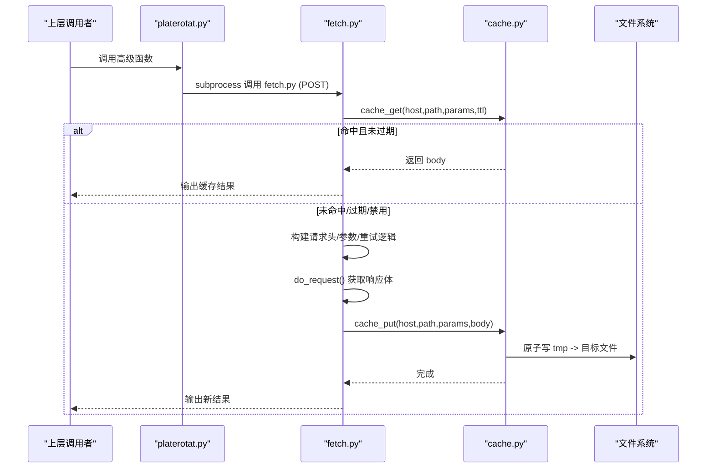
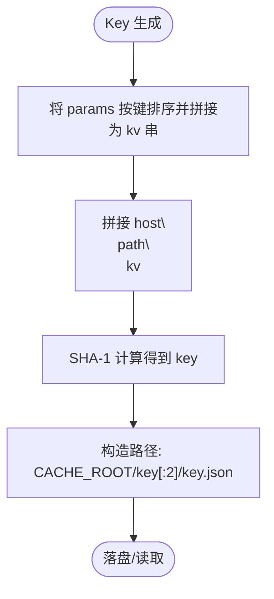
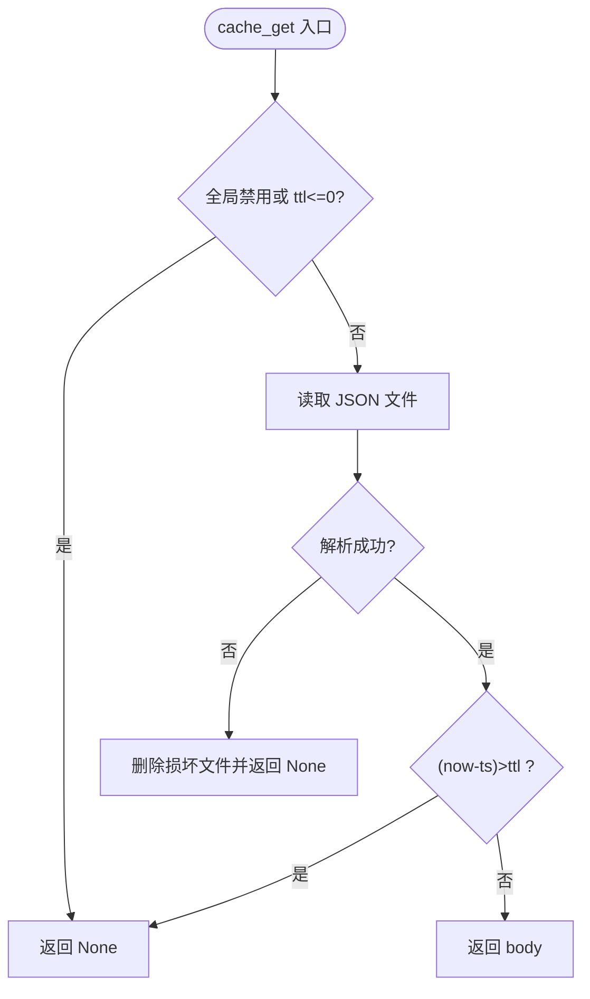
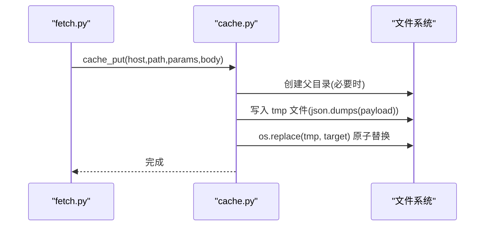
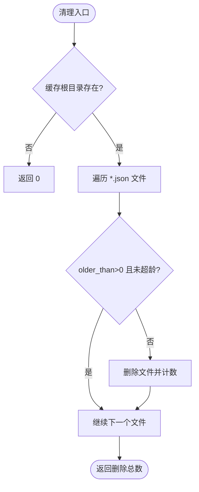
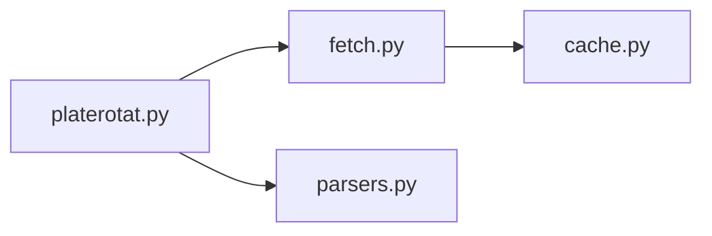

# 缓存管理系统

<cite>
**本文引用的文件**
- [cache.py](file://skills/plate-rotation-skill/scripts/cache.py)
- [fetch.py](file://skills/plate-rotation-skill/scripts/fetch.py)
- [parsers.py](file://skills/plate-rotation-skill/scripts/parsers.py)
- [platerotat.py](file://skills/plate-rotation-skill/scripts/platerotat.py)
</cite>

## 目录
1. [简介](#简介)
2. [项目结构](#项目结构)
3. [核心组件](#核心组件)
4. [架构总览](#架构总览)
5. [详细组件分析](#详细组件分析)
6. [依赖关系分析](#依赖关系分析)
7. [性能与容量控制](#性能与容量控制)
8. [故障排查指南](#故障排查指南)
9. [结论](#结论)
10. [附录：配置与扩展](#附录配置与扩展)

## 简介
本技术文档聚焦于“板块轮动”子系统中的本地缓存层，围绕 cache.py 的缓存目录结构设计、TTL 策略、读写流程、失效策略、监控指标与调试工具进行系统化说明。该缓存层为网络请求提供节流能力，在 TTL 内对相同参数组合的请求直接返回落盘结果，避免重复网络访问；同时提供清理与统计接口，便于运维与调试。

## 项目结构
缓存相关代码位于 scripts 目录下，关键文件职责如下：
- cache.py：纯标准库实现的本地 JSON 缓存原子层，提供 get/put/clear/stats/disabled 等接口
- fetch.py：统一 HTTP 调用器，集成重试、Cookie、Referer 等，并在 POST 请求路径中接入缓存
- parsers.py：响应解析辅助函数（与缓存无直接耦合）
- platerotat.py：高级 API 封装，通过 subprocess 调用 fetch.py，间接使用缓存

图表来源
- [platerotat.py:55-71](file://skills/plate-rotation-skill/scripts/platerotat.py#L55-L71)
- [fetch.py:128-212](file://skills/plate-rotation-skill/scripts/fetch.py#L128-L212)
- [cache.py:59-94](file://skills/plate-rotation-skill/scripts/cache.py#L59-L94)

章节来源
- [platerotat.py:1-315](file://skills/plate-rotation-skill/scripts/platerotat.py#L1-L315)
- [fetch.py:1-230](file://skills/plate-rotation-skill/scripts/fetch.py#L1-L230)
- [cache.py:1-145](file://skills/plate-rotation-skill/scripts/cache.py#L1-L145)
- [parsers.py:1-212](file://skills/plate-rotation-skill/scripts/parsers.py#L1-L212)

## 核心组件
- 缓存原子层（cache.py）
  - 对外暴露：cache_get / cache_put / cache_clear / cache_stats / cache_disabled
  - 存储格式：JSON 文件，包含时间戳、host、path、params、body 等元数据
  - Key 生成：基于 host + path + 排序后的 params 拼接后做 SHA-1 哈希
  - 路径组织：~/.cache/plate-rotation/{key[:2]}/{key}.json
  - TTL 默认值：环境变量 PR_CACHE_TTL 或默认 3600 秒
  - 全局开关：PR_CACHE_DISABLE=1 时禁用所有缓存读写
- 网络调用器（fetch.py）
  - 在 POST 请求路径中优先尝试缓存命中；命中则直接输出并返回
  - 未命中则发起带指数退避的重试请求，成功后写入缓存
  - 支持 --no-cache 与 --cache-ttl 覆盖本次行为
- 高级封装（platerotat.py）
  - 通过 subprocess 调用 fetch.py，间接受益于缓存机制
- 解析器（parsers.py）
  - 与缓存解耦，专注 HTML/JSON 解析

章节来源
- [cache.py:10-27](file://skills/plate-rotation-skill/scripts/cache.py#L10-L27)
- [cache.py:35-55](file://skills/plate-rotation-skill/scripts/cache.py#L35-L55)
- [cache.py:59-94](file://skills/plate-rotation-skill/scripts/cache.py#L59-L94)
- [fetch.py:159-212](file://skills/plate-rotation-skill/scripts/fetch.py#L159-L212)
- [platerotat.py:55-71](file://skills/plate-rotation-skill/scripts/platerotat.py#L55-L71)

## 架构总览
缓存系统在调用链中的位置如下：
- 上层业务通过 platerotat.py 的高级函数发起意图型调用
- 内部通过 subprocess 调用 fetch.py 执行具体 HTTP 请求
- fetch.py 在 POST 路径上先查缓存，命中则直接返回；未命中则请求网络并将响应体写入缓存
- cache.py 负责落盘、过期判断、清理与统计

图表来源
- [platerotat.py:55-71](file://skills/plate-rotation-skill/scripts/platerotat.py#L55-L71)
- [fetch.py:159-212](file://skills/plate-rotation-skill/scripts/fetch.py#L159-L212)
- [cache.py:59-94](file://skills/plate-rotation-skill/scripts/cache.py#L59-L94)

## 详细组件分析

### 缓存目录结构与命名规范
- 根目录
  - 默认路径：~/.cache/plate-rotation
  - 可通过环境变量 PR_CACHE_DIR 自定义
- 二级目录
  - 以 key 的前两位作为子目录名，用于分散单目录文件数量
- 文件名
  - {key}.json，其中 key 是稳定哈希值
- Key 构成
  - 由 host + "\n" + path + "\n" + 按 key 排序后的 params 拼接字符串经 SHA-1 计算得到
  - 保证不同顺序的同参集合映射到同一 key
- 元数据字段
  - ts：写入时的 Unix 时间戳（秒）
  - host/path/params：请求上下文快照
  - body：原始响应文本（字符串）

图表来源
- [cache.py:47-55](file://skills/plate-rotation-skill/scripts/cache.py#L47-L55)

章节来源
- [cache.py:35-55](file://skills/plate-rotation-skill/scripts/cache.py#L35-L55)

### TTL 策略与过期检测
- 默认 TTL
  - 默认 3600 秒，可通过环境变量 PR_CACHE_TTL 调整
- 过期判定
  - 读取时比较当前时间与文件中 ts 字段差值，超过 ttl 视为过期
  - 过期不删除文件，下次 put 会覆盖
- 主动关闭
  - 设置 PR_CACHE_DISABLE=1 或传入 ttl<=0 时，直接跳过缓存
- 自动清理
  - cache_clear(older_than=N) 可仅清理超过 N 秒的条目，返回删除数量
  - 扫描范围：CACHE_ROOT 下所有 *.json 文件

图表来源
- [cache.py:59-76](file://skills/plate-rotation-skill/scripts/cache.py#L59-L76)
- [cache.py:98-116](file://skills/plate-rotation-skill/scripts/cache.py#L98-L116)

章节来源
- [cache.py:35-37](file://skills/plate-rotation-skill/scripts/cache.py#L35-L37)
- [cache.py:59-76](file://skills/plate-rotation-skill/scripts/cache.py#L59-L76)
- [cache.py:98-116](file://skills/plate-rotation-skill/scripts/cache.py#L98-L116)

### 缓存读取与写入流程
- 读取流程
  - 若全局禁用或 ttl<=0，直接 miss
  - 根据 host/path/params 生成 key，定位文件
  - 不存在或解析失败则 miss；解析成功但过期也 miss
  - 命中则返回 body 字符串
- 写入流程
  - 若全局禁用则 no-op
  - 构造 payload（含 ts/host/path/params/body），写入临时文件
  - 使用 os.replace 原子替换为目标文件，避免半写
- 并发访问控制
  - 采用“原子替换”降低并发写冲突风险
  - 读操作无锁，存在极小概率读到旧版本内容（取决于文件系统语义）
  - 建议在高并发场景下结合外部锁或进程隔离

图表来源
- [cache.py:79-94](file://skills/plate-rotation-skill/scripts/cache.py#L79-L94)

章节来源
- [cache.py:59-94](file://skills/plate-rotation-skill/scripts/cache.py#L59-L94)
- [fetch.py:209-212](file://skills/plate-rotation-skill/scripts/fetch.py#L209-L212)

### 缓存失效策略
- 主动失效
  - cache_clear(older_than=0)：清空全部缓存
  - cache_clear(older_than=N)：仅清理超过 N 秒的条目
- 被动过期
  - 读取时按 ttl 判定，过期即 miss，但不立即删除文件
- 批量清理
  - 通过 CLI 子命令 stats | clear [--older SEC] 快速执行
  - 也可在程序中以 cache_clear 调用实现定时任务

图表来源
- [cache.py:98-116](file://skills/plate-rotation-skill/scripts/cache.py#L98-L116)

章节来源
- [cache.py:98-116](file://skills/plate-rotation-skill/scripts/cache.py#L98-L116)

### 监控指标与调试工具
- 统计指标
  - cache_stats() 返回 count、total_bytes、root
  - CLI 支持 python3 cache.py stats 输出 JSON 统计
- 清理工具
  - python3 cache.py clear [--older SEC] 执行清理并打印删除数量
- 运行期诊断
  - fetch.py 支持 --verbose 打印 URL、body 摘要、cookie 长度与重试信息
  - 当缓存命中时，--verbose 会在 stderr 提示 cache HIT

章节来源
- [cache.py:119-128](file://skills/plate-rotation-skill/scripts/cache.py#L119-L128)
- [cache.py:132-145](file://skills/plate-rotation-skill/scripts/cache.py#L132-L145)
- [fetch.py:128-143](file://skills/plate-rotation-skill/scripts/fetch.py#L128-L143)
- [fetch.py:159-168](file://skills/plate-rotation-skill/scripts/fetch.py#L159-L168)

## 依赖关系分析
- 模块耦合
  - fetch.py 依赖 cache.py 的缓存接口
  - platerotat.py 通过 subprocess 调用 fetch.py，间接使用缓存
  - parsers.py 与缓存无直接依赖
- 外部依赖
  - 仅依赖 Python 标准库（hashlib/json/os/time/pathlib/urllib）
- 潜在循环依赖
  - 无循环依赖；分层清晰

图表来源
- [platerotat.py:55-71](file://skills/plate-rotation-skill/scripts/platerotat.py#L55-L71)
- [fetch.py:31-36](file://skills/plate-rotation-skill/scripts/fetch.py#L31-L36)
- [cache.py:1-33](file://skills/plate-rotation-skill/scripts/cache.py#L1-L33)

章节来源
- [platerotat.py:1-315](file://skills/plate-rotation-skill/scripts/platerotat.py#L1-L315)
- [fetch.py:1-230](file://skills/plate-rotation-skill/scripts/fetch.py#L1-L230)
- [cache.py:1-145](file://skills/plate-rotation-skill/scripts/cache.py#L1-L145)
- [parsers.py:1-212](file://skills/plate-rotation-skill/scripts/parsers.py#L1-L212)

## 性能与容量控制
- 性能特性
  - 读路径：一次文件 I/O + JSON 反序列化 + 时间比较
  - 写路径：一次 JSON 序列化 + 两次文件 I/O（tmp 写入 + 原子替换）
  - 无内存缓存，完全落盘；适合单机多进程共享
- 容量控制
  - 二级目录散列：按 key[:2] 分片，缓解单目录文件过多问题
  - 定期清理：使用 cache_clear(older_than=N) 控制磁盘占用
  - 统计监控：cache_stats 提供 count 与 total_bytes 指标
- 并发安全
  - 写端使用原子替换，降低并发写导致的半写风险
  - 读端无锁，极端情况下可能读到旧版本内容；高并发建议配合外部锁或进程隔离
- 优化建议
  - 合理设置 PR_CACHE_TTL，平衡新鲜度与命中率
  - 针对大响应体，考虑压缩后再落盘（需改造 cache_put）
  - 引入 LRU/容量上限策略（需改造 cache_put 与清理策略）

[本节为通用性能讨论，无需特定文件引用]

## 故障排查指南
- 常见问题
  - 缓存未命中：检查 PR_CACHE_DISABLE、--no-cache、ttl<=0 等开关
  - 过期未生效：确认 PR_CACHE_TTL 与请求侧 --cache-ttl 是否一致
  - 文件损坏：cache_get 会自动删除损坏文件并 miss
  - 磁盘空间不足：使用 cache_clear 清理历史数据
- 诊断步骤
  - 使用 cache.py stats 查看缓存规模与大小
  - 使用 cache.py clear [--older SEC] 清理指定时长前的缓存
  - 在 fetch.py 中使用 --verbose 观察缓存命中与重试情况
  - 检查 ~/.cache/plate-rotation 目录结构与文件权限

章节来源
- [cache.py:59-76](file://skills/plate-rotation-skill/scripts/cache.py#L59-L76)
- [cache.py:98-116](file://skills/plate-rotation-skill/scripts/cache.py#L98-L116)
- [cache.py:119-145](file://skills/plate-rotation-skill/scripts/cache.py#L119-L145)
- [fetch.py:159-168](file://skills/plate-rotation-skill/scripts/fetch.py#L159-L168)

## 结论
该缓存系统以极简设计实现了稳定的本地缓存能力：通过稳定 Key 生成与二级目录散列保障可扩展性；通过 TTL 与清理接口满足时效性与容量控制；通过原子写提升并发安全性；通过 CLI 与统计接口提供良好可观测性。整体与上层业务解耦，易于维护与扩展。

[本节为总结性内容，无需特定文件引用]

## 附录：配置与扩展

### 配置选项与环境变量
- PR_CACHE_DIR：缓存根目录（默认 ~/.cache/plate-rotation）
- PR_CACHE_TTL：默认 TTL（秒，默认 3600）
- PR_CACHE_DISABLE：全局开关（值为 1/true/yes 时禁用缓存）
- fetch.py 命令行
  - --no-cache：本次请求禁用缓存
  - --cache-ttl SEC：本次请求 TTL 覆盖
  - --verbose：打印调试信息
  - --max-retries/--timeout：网络层重试与超时控制

章节来源
- [cache.py:35-43](file://skills/plate-rotation-skill/scripts/cache.py#L35-L43)
- [fetch.py:128-143](file://skills/plate-rotation-skill/scripts/fetch.py#L128-L143)

### 扩展接口与自定义后端
- 现有接口
  - cache_get(host, path, params, ttl)
  - cache_put(host, path, params, body)
  - cache_clear(older_than)
  - cache_stats()
  - cache_disabled()
- 扩展思路
  - 替换存储后端：保持上述接口不变，将 JSON 文件替换为 Redis/Memcached/SQLite 等
  - 增加内存层：在 cache_get 前加入内存字典缓存，提高热点命中率
  - 增加压缩：在 cache_put 中对 body 进行 gzip 压缩，减少磁盘占用
  - 增加容量上限：在 cache_put 中触发 LRU 淘汰或按目录配额清理

章节来源
- [cache.py:41-128](file://skills/plate-rotation-skill/scripts/cache.py#L41-L128)