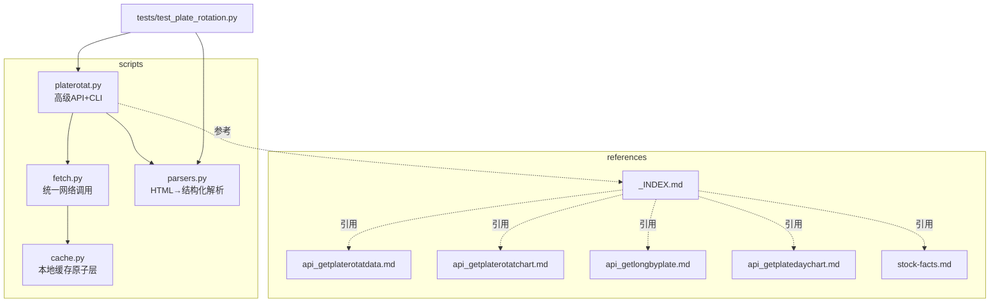
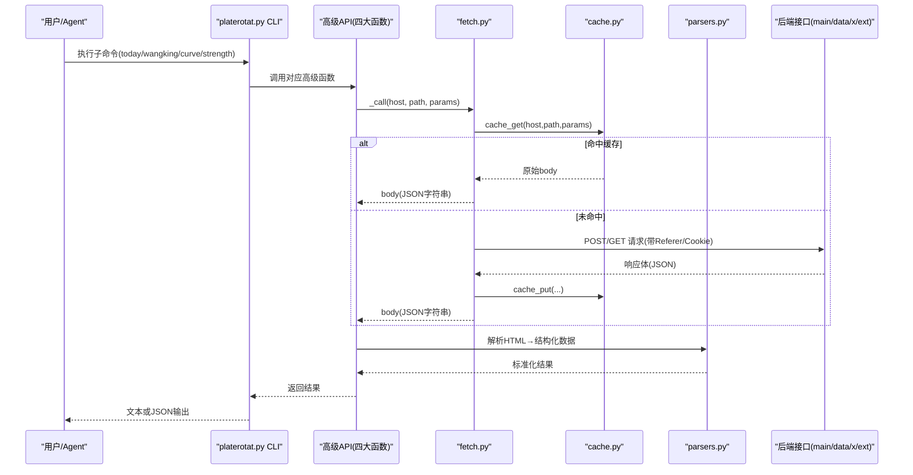
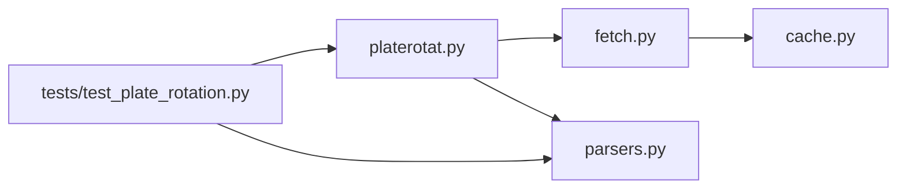

# 板块轮动分析技能

<cite>
**本文引用的文件**   
- [README.md](file://skills/plate-rotation-skill/README.md)
- [platerotat.py](file://skills/plate-rotation-skill/scripts/platerotat.py)
- [parsers.py](file://skills/plate-rotation-skill/scripts/parsers.py)
- [cache.py](file://skills/plate-rotation-skill/scripts/cache.py)
- [fetch.py](file://skills/plate-rotation-skill/scripts/fetch.py)
- [api_getplaterotatdata.md](file://skills/plate-rotation-skill/references/api_getplaterotatdata.md)
- [api_getlongbyplate.md](file://skills/plate-rotation-skill/references/api_getlongbyplate.md)
- [api_getplaterotatchart.md](file://skills/plate-rotation-skill/references/api_getplaterotatchart.md)
- [api_getplatedaychart.md](file://skills/plate-rotation-skill/references/api_getplatedaychart.md)
- [_INDEX.md](file://skills/plate-rotation-skill/references/_INDEX.md)
- [stock-facts.md](file://skills/plate-rotation-skill/references/stock-facts.md)
- [test_plate_rotation.py](file://skills/plate-rotation-skill/tests/test_plate_rotation.py)
</cite>

## 目录
1. [引言](#引言)
2. [项目结构](#项目结构)
3. [核心组件](#核心组件)
4. [架构总览](#架构总览)
5. [详细组件分析](#详细组件分析)
6. [依赖关系分析](#依赖关系分析)
7. [性能与缓存优化](#性能与缓存优化)
8. [实战案例与使用场景](#实战案例与使用场景)
9. [故障排查指南](#故障排查指南)
10. [结论](#结论)

## 引言
本技能聚焦 A 股“板块轮动”的识别与分析，围绕三大核心概念展开：热点板块识别、龙头股追踪、强度趋势分析。通过双源数据交叉验证（同花顺 iFinD 与开盘啦），在“当日爆发 + 持续性”两个维度上给出更稳健的判断；同时提供命令行工具与 Python API，覆盖“今日最强 N 板块、妖王榜、Top5 排名曲线、单板块强度时序”四类高频需求。

方法论要点
- 双源互补：同花顺侧重“当日涨幅”，开盘啦侧重“综合强度分”。两者各自排序，不可跨源直接比较数值大小。
- 自动路由：根据板块代码前缀自动选择数据源（88x→同花顺；80x/803x→开盘啦）。
- HTML in JSON：接口返回 HTML 片段嵌入 JSON，需经解析器标准化为结构化数据后再分析。
- 运行时校验：对空数据、跨源错传、节假日等情形输出明确警告，避免“幻觉式”结论。

章节来源
- [README.md:1-188](file://skills/plate-rotation-skill/README.md#L1-L188)
- [_INDEX.md:1-43](file://skills/plate-rotation-skill/references/_INDEX.md#L1-L43)
- [stock-facts.md:1-118](file://skills/plate-rotation-skill/references/stock-facts.md#L1-L118)

## 项目结构
该技能位于 skills/plate-rotation-skill 下，采用“脚本层 + 参考文档 + 测试”的组织方式：
- scripts：核心实现（网络调用、缓存、解析、高级 API 与 CLI）
- references：API 参考与领域知识
- tests：在线集成测试，覆盖端到端流程

图表来源
- [platerotat.py:1-315](file://skills/plate-rotation-skill/scripts/platerotat.py#L1-L315)
- [fetch.py:1-230](file://skills/plate-rotation-skill/scripts/fetch.py#L1-L230)
- [parsers.py:1-212](file://skills/plate-rotation-skill/scripts/parsers.py#L1-L212)
- [cache.py:1-145](file://skills/plate-rotation-skill/scripts/cache.py#L1-L145)
- [_INDEX.md:1-43](file://skills/plate-rotation-skill/references/_INDEX.md#L1-L43)

章节来源
- [README.md:1-188](file://skills/plate-rotation-skill/README.md#L1-L188)

## 核心组件
- platerotat.py：对外暴露四大高级函数与 CLI 子命令，组合 fetch+parsers，屏蔽底层细节。
- parsers.py：将“HTML in JSON”的响应解析为标准化的列表/矩阵/日期序列等数据结构。
- fetch.py：统一 HTTP 请求封装，含重试、缓存、Cookie/Referer 注入、参数拼装。
- cache.py：基于文件的 TTL 缓存，支持开关、清理与统计。

章节来源
- [platerotat.py:1-315](file://skills/plate-rotation-skill/scripts/platerotat.py#L1-L315)
- [parsers.py:1-212](file://skills/plate-rotation-skill/scripts/parsers.py#L1-L212)
- [fetch.py:1-230](file://skills/plate-rotation-skill/scripts/fetch.py#L1-L230)
- [cache.py:1-145](file://skills/plate-rotation-skill/scripts/cache.py#L1-L145)

## 架构总览
整体由“上层意图 → 高级 API → 网络调用 → 缓存/重试 → 解析 → 结果”构成。

图表来源
- [platerotat.py:53-219](file://skills/plate-rotation-skill/scripts/platerotat.py#L53-L219)
- [fetch.py:128-213](file://skills/plate-rotation-skill/scripts/fetch.py#L128-L213)
- [cache.py:59-94](file://skills/plate-rotation-skill/scripts/cache.py#L59-L94)
- [parsers.py:20-175](file://skills/plate-rotation-skill/scripts/parsers.py#L20-L175)

## 详细组件分析

### 高级 API 与 CLI（platerotat.py）
- 今日 Top N 板块：today_top(source, n, days)
  - 数据来源：/api/getPlateRotatData
  - source=ths 时 value_type=pct（带%），source=kaipan 时 value_type=score（纯数字）
  - 返回：[{rank, code, name, value, value_type, color}, ...]
- 板块妖王榜：find_dragon_kings(platecode, days, top_n)
  - 自动路由：88x→ths；80x/803x→kaipan
  - 返回：{platecode, source, days, dates, kings, daily_heads}
- Top5 排名曲线：top1_curve(source, days)
  - 返回 ECharts 数据，并补充 top5_names 字段
- 单板块强度时序：plate_strength(platecode, days)
  - legend=null 表示近 N 天均未活跃；date 为空表示异常

CLI 子命令
- today [--source ths|kaipan] [--n N] [--days D] [--json]
- wangking <platecode> [--days D] [--n N] [--json]
- curve [--source ths|kaipan] [--days D] [--json]
- strength <platecode> [--days D] [--json]

运行时校验
- 空数据/缺关键字段/跨源错传/周末等情形，stderr 输出 PR-EMPTY/PR-WARN 提示，便于下游 Agent 识别。

章节来源
- [platerotat.py:100-219](file://skills/plate-rotation-skill/scripts/platerotat.py#L100-L219)
- [platerotat.py:227-311](file://skills/plate-rotation-skill/scripts/platerotat.py#L227-L311)

### 数据解析器（parsers.py）
- parse_plate_rotat(data, source)
  - 从 getPlateRotatData 的 html 中抽取每日 Top 板块清单
  - 兼容 ths 的“带%”和 kaipan 的“纯数字”两种数值格式
- parse_plate_rotat_matrix(data, dates)
  - 还原 N×天矩阵，便于“某日整列 TopN / 某板块何时上榜”分析
- parse_plate_rotat_dates(data)
  - 抽取表头日期序列（newest first）
- parse_plate_long_heads(data, dates)
  - 解析 getLongByPlate 的龙头矩阵，兼容“当日无领涨”的 td
- rank_plate_long_persistence(data, dates, top_n)
  - 统计过去 N 天各股票当龙头的次数，生成“妖王榜”

HTML 模板与正则策略
- 主表行以  分割，td.plate 内包含 code/name/value/color
- 龙头矩阵按 td 顺序对齐 dates，无领涨 td 用 lookahead 兜底

章节来源
- [parsers.py:20-175](file://skills/plate-rotation-skill/scripts/parsers.py#L20-L175)
- [api_getplaterotatdata.md:34-74](file://skills/plate-rotation-skill/references/api_getplaterotatdata.md#L34-L74)
- [api_getlongbyplate.md:44-65](file://skills/plate-rotation-skill/references/api_getlongbyplate.md#L44-L65)

### 网络调用与缓存（fetch.py + cache.py）
- fetch.py
  - host alias：main | data | x | ext
  - 自动注入 Referer/UA/Oriigin/X-Requested-With，可选 Cookie
  - 指数退避重试：429/5xx/网络异常最多 3 次
  - 支持 --no-cache 与 --cache-ttl 控制缓存
- cache.py
  - 落盘路径：~/.cache/plate-rotation/{key[:2]}/{key}.json
  - Key = sha1(host + "\n" + path + "\n" + sorted_form_kv)
  - 默认 TTL=3600s，支持 PR_CACHE_DISABLE=1 全局关闭、PR_CACHE_DIR 自定义目录
  - 提供 stats/clear 自检 CLI

章节来源
- [fetch.py:38-124](file://skills/plate-rotation-skill/scripts/fetch.py#L38-L124)
- [fetch.py:128-213](file://skills/plate-rotation-skill/scripts/fetch.py#L128-L213)
- [cache.py:35-94](file://skills/plate-rotation-skill/scripts/cache.py#L35-L94)
- [cache.py:98-145](file://skills/plate-rotation-skill/scripts/cache.py#L98-L145)

### API 参考（references）
- api_getplaterotatdata：板块 N 日轮动主表（HTML in JSON），from=ths|kaipan，days=10|20|30|50
- api_getplaterotatchart：Top5 板块 N 日排名变化（ECharts）
- api_getlongbyplate：单板块 N 日龙头矩阵（HTML in JSON）
- api_getplatedaychart：单板块 N 日强度+量能（ECharts）

章节来源
- [_INDEX.md:1-43](file://skills/plate-rotation-skill/references/_INDEX.md#L1-L43)
- [api_getplaterotatdata.md:1-74](file://skills/plate-rotation-skill/references/api_getplaterotatdata.md#L1-L74)
- [api_getplaterotatchart.md:1-53](file://skills/plate-rotation-skill/references/api_getplaterotatchart.md#L1-L53)
- [api_getlongbyplate.md:1-65](file://skills/plate-rotation-skill/references/api_getlongbyplate.md#L1-L65)
- [api_getplatedaychart.md:1-48](file://skills/plate-rotation-skill/references/api_getplatedaychart.md#L1-L48)

## 依赖关系分析
- 模块耦合
  - platerotat.py 依赖 fetch.py 与 parsers.py
  - fetch.py 依赖 cache.py
  - tests 依赖 platerotat.py 与 parsers.py
- 外部依赖
  - 仅 stdlib；HTTP 目标主机通过 HOSTS 映射管理
- 潜在风险
  - 上游 HTML 结构变更会影响 parsers 的正则匹配
  - 跨源 platecode 误传会导致空数据（已内置自动路由与运行时校验）

图表来源
- [platerotat.py:1-315](file://skills/plate-rotation-skill/scripts/platerotat.py#L1-L315)
- [fetch.py:1-230](file://skills/plate-rotation-skill/scripts/fetch.py#L1-L230)
- [parsers.py:1-212](file://skills/plate-rotation-skill/scripts/parsers.py#L1-L212)
- [cache.py:1-145](file://skills/plate-rotation-skill/scripts/cache.py#L1-L145)
- [test_plate_rotation.py:1-444](file://skills/plate-rotation-skill/tests/test_plate_rotation.py#L1-L444)

章节来源
- [platerotat.py:1-315](file://skills/plate-rotation-skill/scripts/platerotat.py#L1-L315)
- [fetch.py:1-230](file://skills/plate-rotation-skill/scripts/fetch.py#L1-L230)
- [parsers.py:1-212](file://skills/plate-rotation-skill/scripts/parsers.py#L1-L212)
- [cache.py:1-145](file://skills/plate-rotation-skill/scripts/cache.py#L1-L145)
- [test_plate_rotation.py:1-444](file://skills/plate-rotation-skill/tests/test_plate_rotation.py#L1-L444)

## 性能与缓存优化
- 缓存策略
  - 默认 TTL=3600s，适合盘中“今日”与历史 N 日聚合数据的节流
  - 需要强刷新：--no-cache 或 export PR_CACHE_DISABLE=1
  - 调整新鲜度：--cache-ttl SEC
- 重试机制
  - 429/5xx/网络异常指数退避（1s/2s/4s），最大 3 次
- 磁盘 I/O
  - 原子写（先 .tmp 再 replace），避免半写文件
- 建议
  - 批量拉取时复用同一 days 窗口，提高命中率
  - 高并发场景可考虑增大 PR_CACHE_TTL 或独立缓存服务

章节来源
- [cache.py:35-94](file://skills/plate-rotation-skill/scripts/cache.py#L35-L94)
- [fetch.py:47-124](file://skills/plate-rotation-skill/scripts/fetch.py#L47-L124)
- [fetch.py:159-213](file://skills/plate-rotation-skill/scripts/fetch.py#L159-L213)

## 实战案例与使用场景

### 场景一：快速定位今日最强板块
- 目标：获取今日涨幅最强的 N 个板块（同花顺）
- 步骤：
  - CLI：python3 scripts/platerotat.py today --source ths --n 10 --days 20
  - API：from platerotat import today_top; rows = today_top(source="ths", n=10, days=20)
- 关注点：value_type=pct，带%符号；color 指示涨跌

章节来源
- [platerotat.py:102-121](file://skills/plate-rotation-skill/scripts/platerotat.py#L102-L121)
- [api_getplaterotatdata.md:44-74](file://skills/plate-rotation-skill/references/api_getplaterotatdata.md#L44-L74)

### 场景二：追踪某板块的“真龙”与持续性
- 目标：找出某板块过去 N 天最常当龙头的股票（妖王榜）
- 步骤：
  - CLI：python3 scripts/platerotat.py wangking 886084 --days 20 --n 10
  - API：res = find_dragon_kings("886084", days=20, top_n=10)
- 注意：88x 自动走 ths；80x/803x 自动走 kaipan

章节来源
- [platerotat.py:125-173](file://skills/plate-rotation-skill/scripts/platerotat.py#L125-L173)
- [api_getlongbyplate.md:44-65](file://skills/plate-rotation-skill/references/api_getlongbyplate.md#L44-L65)

### 场景三：观察 Top5 板块的轮动轨迹
- 目标：Top5 板块 N 日排名变化曲线（ECharts 数据）
- 步骤：
  - CLI：python3 scripts/platerotat.py curve --source kaipan --days 20 --json
  - API：data = top1_curve(source="kaipan", days=20)
- 解读：value=10.5 + symbol=wu.png 表示当日未上榜，不要参与平均

章节来源
- [platerotat.py:177-196](file://skills/plate-rotation-skill/scripts/platerotat.py#L177-L196)
- [api_getplaterotatchart.md:46-53](file://skills/plate-rotation-skill/references/api_getplaterotatchart.md#L46-L53)

### 场景四：单板块强度与量能时序
- 目标：查看某板块 N 日强度+量能（ECharts 数据）
- 步骤：
  - CLI：python3 scripts/platerotat.py strength 886084 --days 20 --json
  - API：data = plate_strength("886084", days=20)
- 注意：legend=null 表示近 N 天均未活跃

章节来源
- [platerotat.py:201-218](file://skills/plate-rotation-skill/scripts/platerotat.py#L201-L218)
- [api_getplatedaychart.md:43-48](file://skills/plate-rotation-skill/references/api_getplatedaychart.md#L43-L48)

### 场景五：双源交叉验证
- 思路：
  - 同花顺看“当日爆发”（涨幅%），开盘啦看“持续性”（强度分）
  - 两边都上榜 → 真主线；只在同花顺 → 偶发热点（妖板候选）；只在开盘啦 → 老热点退潮
- 操作：
  - 分别调用 today_top(source="ths") 与 today_top(source="kaipan")，对比交集与差异
  - 结合 top1_curve 与 plate_strength 做趋势确认

章节来源
- [README.md:81-98](file://skills/plate-rotation-skill/README.md#L81-L98)
- [_INDEX.md:16-32](file://skills/plate-rotation-skill/references/_INDEX.md#L16-L32)
- [stock-facts.md:11-33](file://skills/plate-rotation-skill/references/stock-facts.md#L11-L33)

## 故障排查指南
常见问题与定位
- 返回空数据
  - 可能原因：周末/节假日、days 超前、跨源错传、上游异常
  - 处理：检查 _hint_for_empty 提示；必要时 --no-cache 强刷
- 跨源错传
  - 现象：PR-EMPTY 警告；前端无法渲染
  - 处理：确保 platecode 前缀与 source 一致（88x→ths；80x/803x→kaipan）
- 解析失败
  - 现象：正则不匹配导致缺失字段
  - 处理：核对 HTML 模板是否变更；优先使用 parsers 提供的函数
- 网络异常
  - 现象：429/5xx/超时
  - 处理：重试已内置；必要时调大 --max-retries 或延长 --timeout

章节来源
- [platerotat.py:75-98](file://skills/plate-rotation-skill/scripts/platerotat.py#L75-L98)
- [stock-facts.md:34-56](file://skills/plate-rotation-skill/references/stock-facts.md#L34-L56)
- [fetch.py:91-124](file://skills/plate-rotation-skill/scripts/fetch.py#L91-L124)

## 结论
本技能以“双源交叉验证 + 自动化路由 + 标准化解析 + 健壮重试/缓存”为核心，提供从“热点识别 → 龙头追踪 → 强度趋势”的完整闭环。通过 CLI 与 Python API 双重入口，既满足即时复盘，也便于集成到 Agent 工作流。建议在实战中严格遵循“先事实后逻辑”的分析纪律，并结合 Top5 曲线与强度时序进行二次确认，以降低误判概率。