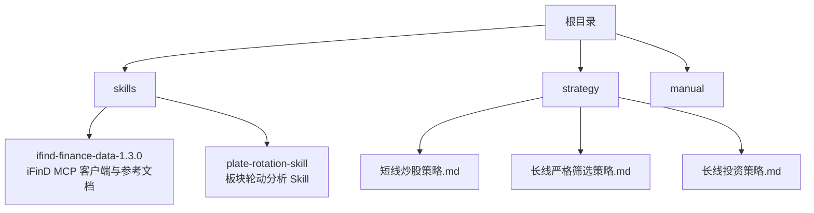
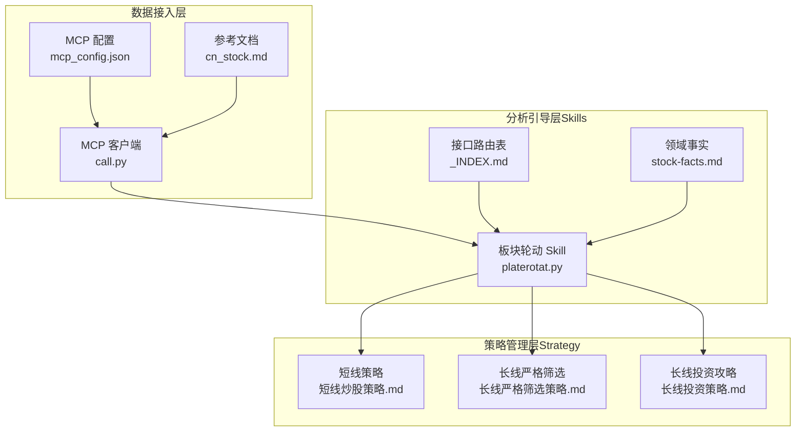
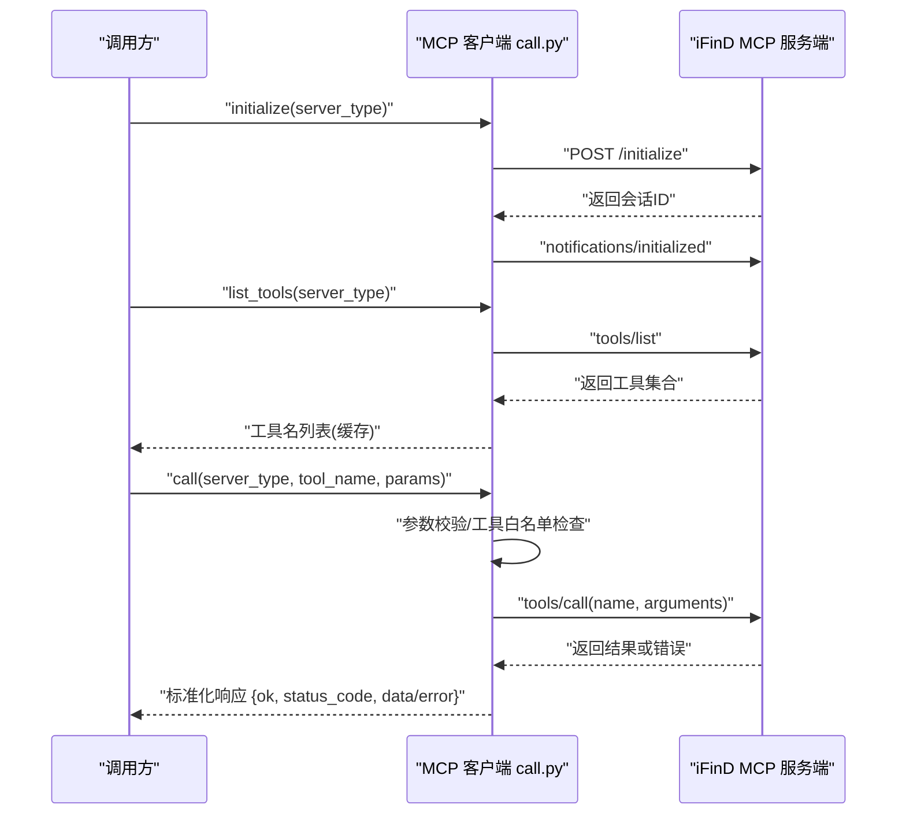
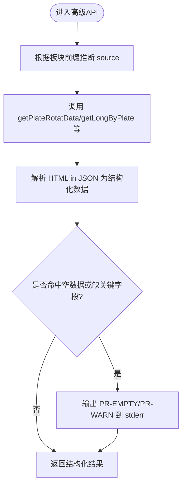
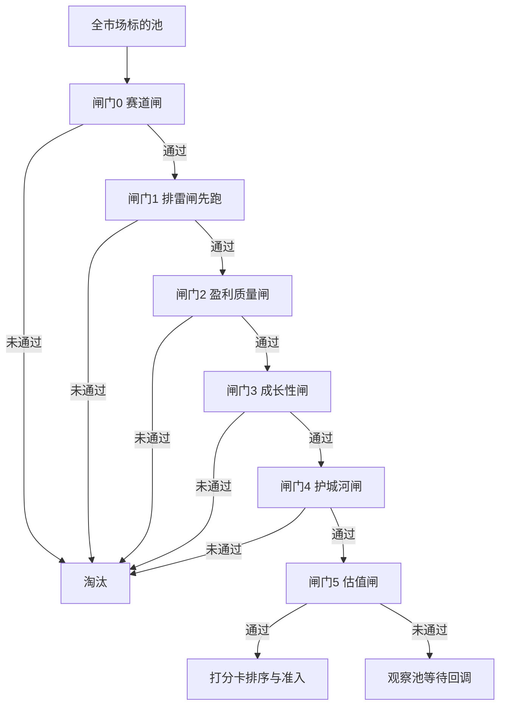
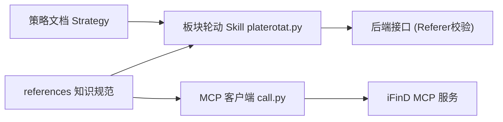

# 项目概述

<cite>
**本文引用的文件列表**
- [README.MD](file://README.MD)
- [mcp_config.json](file://skills/ifind-finance-data-1.3.0/mcp_config.json)
- [call.py](file://skills/ifind-finance-data-1.3.0/call.py)
- [cn_stock.md](file://skills/ifind-finance-data-1.3.0/references/cn_stock.md)
- [plate-rotation-skill README.md](file://skills/plate-rotation-skill/README.md)
- [platerotat.py](file://skills/plate-rotation-skill/scripts/platerotat.py)
- [_INDEX.md](file://skills/plate-rotation-skill/references/_INDEX.md)
- [stock-facts.md](file://skills/plate-rotation-skill/references/stock-facts.md)
- [短线炒股策略.md](file://strategy/短线炒股策略.md)
- [长线严格筛选策略.md](file://strategy/长线严格筛选策略.md)
- [长线投资策略.md](file://strategy/长线投资策略.md)
</cite>

## 目录
1. [引言](#引言)
2. [项目结构](#项目结构)
3. [核心组件](#核心组件)
4. [架构总览](#架构总览)
5. [详细组件分析](#详细组件分析)
6. [依赖关系分析](#依赖关系分析)
7. [性能与可靠性考量](#性能与可靠性考量)
8. [故障排查指南](#故障排查指南)
9. [结论](#结论)
10. [附录：使用场景示例](#附录使用场景示例)

## 引言
本项目是一个基于 AI Agent 驱动的个人股票分析与交易策略管理系统。系统通过模块化的 Skills（分析引导）组织不同维度的分析方法，结合结构化的 Strategy（交易策略）管理决策规则，形成“数据—分析—决策”的闭环。设计理念强调职责分离、模块独立、可迭代和数据驱动，既适合初学者快速上手，也为有经验的开发者提供足够的技术深度与扩展空间。

## 项目结构
仓库采用按能力域划分的目录组织方式：
- skills：封装各类分析技能与工具调用，包括同花顺 iFinD MCP 数据接入与板块轮动 Skill
- strategy：沉淀可执行的交易策略方法论与量化清单
- manual：文档与手册（当前为空）

图表来源
- [README.MD:1-20](file://README.MD#L1-L20)
- [mcp_config.json:1-3](file://skills/ifind-finance-data-1.3.0/mcp_config.json#L1-L3)

章节来源
- [README.MD:1-20](file://README.MD#L1-L20)

## 核心组件
- 数据接入层：通过 MCP 协议对接同花顺 iFinD，统一封装 stock/fund/edb/news/bond/global_stock/index 等服务器类型，提供工具发现与调用入口
- 分析引导层（Skills）：以“单一维度、职责明确”的方式组织分析流程，例如板块轮动 Skill 将多接口组合为“一个意图一个函数”的高级 API
- 策略管理层（Strategy）：以结构化清单和规则定义选股、择时与风控逻辑，支持自上而下的漏斗式筛选与打分卡排序
- 知识与规范层：在 references 中沉淀领域事实、接口路由表与用法范式，确保跨源数据不可混比、代码前缀强语义等纪律被强制执行

章节来源
- [README.MD:22-69](file://README.MD#L22-L69)
- [call.py:1-208](file://skills/ifind-finance-data-1.3.0/call.py#L1-L208)
- [platerotat.py:1-315](file://skills/plate-rotation-skill/scripts/platerotat.py#L1-L315)
- [短线炒股策略.md:1-152](file://strategy/短线炒股策略.md#L1-L152)
- [长线严格筛选策略.md:1-246](file://strategy/长线严格筛选策略.md#L1-L246)
- [长线投资策略.md:1-139](file://strategy/长线投资策略.md#L1-L139)

## 架构总览
系统整体由“数据接入—分析引导—策略执行—知识规范”四层构成。MCP 客户端负责会话建立、鉴权与工具发现；Skill 层对底层接口进行组合与校验，输出面向 Agent 的结构化结果；Strategy 层将分析结论转化为可执行的交易规则；references 提供领域事实与接口契约，保障一致性。

图表来源
- [mcp_config.json:1-3](file://skills/ifind-finance-data-1.3.0/mcp_config.json#L1-L3)
- [call.py:1-208](file://skills/ifind-finance-data-1.3.0/call.py#L1-L208)
- [cn_stock.md:1-67](file://skills/ifind-finance-data-1.3.0/references/cn_stock.md#L1-L67)
- [platerotat.py:1-315](file://skills/plate-rotation-skill/scripts/platerotat.py#L1-L315)
- [_INDEX.md:1-43](file://skills/plate-rotation-skill/references/_INDEX.md#L1-L43)
- [stock-facts.md:1-118](file://skills/plate-rotation-skill/references/stock-facts.md#L1-L118)
- [短线炒股策略.md:1-152](file://strategy/短线炒股策略.md#L1-L152)
- [长线严格筛选策略.md:1-246](file://strategy/长线严格筛选策略.md#L1-L246)
- [长线投资策略.md:1-139](file://strategy/长线投资策略.md#L1-L139)

## 详细组件分析

### 数据接入层：iFinD MCP 客户端
- 功能要点
  - 读取认证令牌并维护各服务类型的会话 ID
  - 实现 initialize/tools/list/tools/call 的标准流程
  - 参数白名单与非法值校验，防止注入与异常类型
  - 统一的错误包装与状态码返回，便于上层处理
- 关键设计
  - 会话复用：同一 server_type 复用 Mcp-Session-Id，减少握手开销
  - 工具集缓存：首次 list_tools 后缓存允许的工具名集合，避免重复请求
  - 安全校验：拦截危险键与非法数值，保证输入合法性
- 典型调用路径
  - 初始化 → 列出可用工具 → 调用具体工具（如 search_stocks、get_stock_financials 等）

图表来源
- [call.py:85-116](file://skills/ifind-finance-data-1.3.0/call.py#L85-L116)
- [call.py:119-134](file://skills/ifind-finance-data-1.3.0/call.py#L119-L134)
- [call.py:137-171](file://skills/ifind-finance-data-1.3.0/call.py#L137-L171)
- [cn_stock.md:1-67](file://skills/ifind-finance-data-1.3.0/references/cn_stock.md#L1-L67)

章节来源
- [call.py:1-208](file://skills/ifind-finance-data-1.3.0/call.py#L1-L208)
- [cn_stock.md:1-67](file://skills/ifind-finance-data-1.3.0/references/cn_stock.md#L1-L67)

### 分析引导层：板块轮动 Skill
- 目标与价值
  - 将多个底层接口组合为“一个意图一个函数”的高级 API，屏蔽解析细节与双源差异
  - 内置运行时校验，区分节假日/跨源错传/上游异常等空数据原因，降低幻觉风险
- 高级 API
  - today_top(source, n, days)：今日 Top N 板块（支持 ths/kaipan 切换）
  - find_dragon_kings(platecode, days, top_n)：板块龙头上榜频次排行
  - top1_curve(source, days)：Top5 板块 N 日排名变化曲线（ECharts 数据）
  - plate_strength(platecode, days)：单板块 N 日强度+量能时序
- 双源与代码前缀
  - ths 对应 88x 板块，值为涨幅%；kaipan 对应 80x/803x 板块，值为强度分
  - 两套数值不可直接比较，必须各自排序与解读
- 运行时校验
  - 周末提示、跨源前缀不匹配警告、日期列为空或 legend=null 的告警

图表来源
- [platerotat.py:100-218](file://skills/plate-rotation-skill/scripts/platerotat.py#L100-L218)
- [_INDEX.md:1-43](file://skills/plate-rotation-skill/references/_INDEX.md#L1-L43)
- [stock-facts.md:1-118](file://skills/plate-rotation-skill/references/stock-facts.md#L1-L118)

章节来源
- [platerotat.py:1-315](file://skills/plate-rotation-skill/scripts/platerotat.py#L1-L315)
- [plate-rotation-skill README.md:1-188](file://skills/plate-rotation-skill/README.md#L1-L188)
- [_INDEX.md:1-43](file://skills/plate-rotation-skill/references/_INDEX.md#L1-L43)
- [stock-facts.md:1-118](file://skills/plate-rotation-skill/references/stock-facts.md#L1-L118)

### 策略管理层：短线与长线策略
- 短线策略（自上而下·五步法）
  - 环境判断：关注大盘缩量/恐慌与板块资金主线
  - 选板块：只做资金流入的主线，警惕情绪虚火
  - 挑个股：形态触发 + 资金确认 + 位置安全三共振
  - 排雷清单：治理/财务/公告等多维度一票否决
  - 买卖纪律：止损止盈机械执行，账户级熔断控制回撤
- 长线严格筛选（六道闸门·一票否决·量化打分）
  - 赛道闸：高景气、格局集中、非夕阳/非周期顶
  - 排雷闸：减持/处罚/质押/商誉/现金流背离等先跑
  - 盈利质量闸：ROE/毛利率/现金流含金量优先
  - 成长性闸：营收利润双高增且同步，剔除假成长
  - 护城河闸：至少一条壁垒且在变宽
  - 估值闸：PEG/历史分位合理，非价值陷阱
  - 打分卡：总分≥85核心仓，70-84卫星仓，<70放弃
- 长线投资攻略（基本面·价值成长·五维框架）
  - 收益来源：企业成长 + 估值修复（戴维斯双击）
  - 买入持有：分批建仓、定投思维、适度分散、持续跟踪
  - 卖出条件：基本面恶化/严重高估/治理雷/机会成本替换

图表来源
- [长线严格筛选策略.md:11-41](file://strategy/长线严格筛选策略.md#L11-L41)
- [长线严格筛选策略.md:44-144](file://strategy/长线严格筛选策略.md#L44-L144)
- [长线严格筛选策略.md:147-163](file://strategy/长线严格筛选策略.md#L147-L163)

章节来源
- [短线炒股策略.md:1-152](file://strategy/短线炒股策略.md#L1-152)
- [长线严格筛选策略.md:1-246](file://strategy/长线严格筛选策略.md#L1-246)
- [长线投资策略.md:1-139](file://strategy/长线投资策略.md#L1-L139)

## 依赖关系分析
- 外部依赖
  - 同花顺 iFinD MCP 服务：通过 HTTP JSON-RPC 交互，需有效 auth_token
  - 板块轮动后端：仅校验 Referer，无需 cookie（fetch 自动注入）
- 内部耦合
  - MCP 客户端与 Skill 解耦：Skill 通过 platerotat.py 的高级 API 消费数据，不直接关心 MCP 细节
  - Strategy 与 Skill 解耦：策略文档作为规则库，可由上层编排器按需调用 Skill 输出
- 潜在风险
  - 跨源数据混用：必须在 Skill 层强制校验前缀与单位
  - 节假日/休市导致的数据延迟：需在运行时给出明确提示

图表来源
- [call.py:1-208](file://skills/ifind-finance-data-1.3.0/call.py#L1-L208)
- [platerotat.py:1-315](file://skills/plate-rotation-skill/scripts/platerotat.py#L1-L315)
- [stock-facts.md:51-56](file://skills/plate-rotation-skill/references/stock-facts.md#L51-L56)

章节来源
- [mcp_config.json:1-3](file://skills/ifind-finance-data-1.3.0/mcp_config.json#L1-L3)
- [call.py:1-208](file://skills/ifind-finance-data-1.3.0/call.py#L1-L208)
- [platerotat.py:1-315](file://skills/plate-rotation-skill/scripts/platerotat.py#L1-L315)
- [stock-facts.md:1-118](file://skills/plate-rotation-skill/references/stock-facts.md#L1-L118)

## 性能与可靠性考量
- 会话与会话复用：MCP 客户端维护 session_id，减少握手次数
- 工具集缓存：首次 list_tools 后缓存，避免频繁探测
- 参数校验前置：在调用前完成类型与白名单检查，降低无效请求
- 运行时校验与降级：Skill 层对空数据/缺字段进行告警，帮助上层做容错与重试
- 数据时效性：板块轮动接口属于日级/多日级聚合，盘中刷新粒度约 5 分钟；必要时禁用缓存获取最新快照

[本节为通用指导，不直接分析具体文件]

## 故障排查指南
- MCP 相关
  - 认证失败：检查 mcp_config.json 中的 auth_token 是否正确
  - 会话缺失：确认 initialize 成功并收到 Mcp-Session-Id
  - 工具不可用：核对 tools/list 返回的工具名是否在白名单内
- 板块轮动相关
  - 周末/节假日：若返回空数据，注意 PR-EMPTY 提示与交易日差异
  - 跨源错传：88x 传入 kaipan 或反之会返回空，需按前缀选择 source
  - 当日无领涨：getLongByPlate 可能返回“当日无领涨”，属合法返回值
  - 未上榜标记：top1_curve 中 value=10.5 + symbol=wu.png 表示空白，不参与平均
- 建议
  - 捕获 stderr 中的 PR-EMPTY/PR-WARN 日志，用于自动化诊断
  - 对上游异常进行重试与回退策略，避免单次失败影响整体流程

章节来源
- [mcp_config.json:1-3](file://skills/ifind-finance-data-1.3.0/mcp_config.json#L1-L3)
- [call.py:103-106](file://skills/ifind-finance-data-1.3.0/call.py#L103-L106)
- [platerotat.py:75-98](file://skills/plate-rotation-skill/scripts/platerotat.py#L75-L98)
- [stock-facts.md:39-56](file://skills/plate-rotation-skill/references/stock-facts.md#L39-L56)

## 结论
本项目以“模块化 Skills + 结构化 Strategy”为核心，围绕数据驱动的决策闭环构建。MCP 客户端提供稳定可靠的数据接入，板块轮动 Skill 将复杂接口组合为易用的高级 API，策略文档则将经验方法固化为可执行的规则体系。通过严格的领域事实与接口契约，系统在可扩展性与稳健性之间取得平衡，既适合初学者理解与分析流程，也满足资深开发者的工程化需求。

[本节为总结性内容，不直接分析具体文件]

## 附录：使用场景示例
- 个股分析
  - 调用 MCP stock 服务的 search_stocks 或 get_stock_financials，获取行业筛选与财务指标，再结合 Skill 输出进行多维度研判
- 策略执行
  - 依据短线策略的环境与板块主线判断，结合板块轮动 Skill 的 today_top/top1_curve 识别真主线与接力信号，按排雷清单与买卖纪律执行
- 异动归因
  - 当某板块出现异动，使用 find_dragon_kings 与 plate_strength 查看龙头与强度时序，结合 stock-facts 的 T+1 与涨跌停板规则进行归因

章节来源
- [cn_stock.md:1-67](file://skills/ifind-finance-data-1.3.0/references/cn_stock.md#L1-L67)
- [platerotat.py:100-218](file://skills/plate-rotation-skill/scripts/platerotat.py#L100-L218)
- [stock-facts.md:68-99](file://skills/plate-rotation-skill/references/stock-facts.md#L68-L99)
- [短线炒股策略.md:18-83](file://strategy/短线炒股策略.md#L18-L83)